# Ansible_EDA_Test — ServiceNow to Event-Driven Ansible

A complete, working reference for triggering Ansible Automation Platform automation from a
ServiceNow incident, using **Event-Driven Ansible (EDA)**.

This README is written for someone who has never set up EDA before. Every step says what to
click, what to type, and how to prove it worked.

> **Verified on:** AAP 2.7 (Operator install on OpenShift) + a ServiceNow Personal Developer
> Instance (PDI), September 2026. Where AAP 2.6 differs, it is called out.

---

## Table of contents

1. [What this does](#1-what-this-does)
2. [Two architectures — pick one](#2-two-architectures--pick-one)
3. [Repo contents](#3-repo-contents)
4. [Prerequisites](#4-prerequisites)
5. [Part 1 — Automation Execution (controller) setup](#part-1--automation-execution-controller-setup)
6. [Part 2 — Automation Decisions (EDA) setup](#part-2--automation-decisions-eda-setup)
7. [Part 3 — ServiceNow setup](#part-3--servicenow-setup)
8. [Part 4 — The payload contract (read this)](#part-4--the-payload-contract-read-this)
9. [Part 5 — Testing end to end](#part-5--testing-end-to-end)
10. [Part 6 — Troubleshooting](#part-6--troubleshooting)
11. [Part 7 — Token rotation and maintenance](#part-7--token-rotation-and-maintenance)
12. [Appendix A — OAuth 2.0 direct job launch (alternative)](#appendix-a--oauth-20-direct-job-launch-alternative)
13. [Appendix B — Legacy Business Rule (do not use)](#appendix-b--legacy-business-rule-do-not-use)

---

## Build order — do these in this exact sequence

Each step needs something the step above it created. Working out of order is the most common
way to get stuck, so tick these off as you go.

| # | Step | Section | Why it must come after the previous step |
|---|---|---|---|
| 1 | Create the custom ServiceNow credential type | [1.1](#11-create-a-custom-servicenow-credential-type) | Credentials in step 2 are *of* this type |
| 2 | Create the controller credentials | [1.2](#12-create-controller-credentials) | The project and job template attach them |
| 3 | Create the controller project and sync it | [1.3](#13-create-the-project) | The job template picks a playbook from it |
| 4 | Create the job template (**Prompt on launch ON**) | [1.4](#14-create-the-job-template) | The rulebook calls it **by name** |
| 5 | Create the EDA credentials | [2.1](#21-create-eda-credentials) | The DE, project and activation reference them |
| 6 | Create the Decision Environment | [2.2](#22-create-the-decision-environment) | The activation runs inside it |
| 7 | Create the EDA project and sync it | [2.3](#23-create-the-eda-project) | The activation needs an **imported rulebook**, and you cannot pick one until the sync completes |
| 8 | Generate the shared token | [2.4](#24-generate-the-event-stream-token) | Used by both step 9 and step 11 |
| 9 | Create the Event Stream credential | [2.5](#25-create-the-event-stream-credential) | The event stream attaches it |
| 10 | Create the Event Stream (**forwarding ON**) | [2.6](#26-create-the-event-stream) | Gives you the URL for ServiceNow, and must exist before you can map it |
| 11 | Create the Rulebook Activation and map the stream | [2.7](#27-create-the-rulebook-activation) | Needs the rulebook (7), the DE (6) and the stream (10) |
| 12 | Create the ServiceNow Connection & Credential Alias | [3.1](#31-create-the-connection--credential-alias-how-the-token-is-sent) | Holds the token from step 8 |
| 13 | Read the payload contract | [Part 4](#part-4--the-payload-contract-read-this) | **Read before writing the script in step 14** |
| 14 | Create the ServiceNow Action | [3.2](#32-create-the-action) | The REST step uses the alias (12) and the URL (10) |
| 15 | Create the ServiceNow Flow | [3.3](#33-create-the-flow) | Calls the published Action (14) |
| 16 | Test each hop in order | [Part 5](#part-5--testing-end-to-end) | |

> **The two easiest mistakes to make, both of which fail silently:**
>
> 1. Forgetting **Prompt on launch** on the job template (step 4). The job runs with no
>    variables and nothing tells you why.
> 2. Writing the payload in the wrong shape (step 13/14). ServiceNow reports `200`, the event
>    arrives, and the rule simply never matches.

---

## 1. What this does

A ServiceNow incident is created. A Flow Designer flow posts the incident's details to an
AAP **event stream**. An EDA **rulebook activation** is listening, matches a rule, and
launches a controller **job template**. The playbook does remediation work and writes back
to the incident.

```
ServiceNow incident created
        │
        ▼
Flow Designer flow  ──►  custom Action
                            │  Script step: build JSON payload
                            │  REST step:   POST to the AAP event stream
                            ▼
AAP Event Stream  (authenticates the request)
        │
        ▼
Rulebook Activation  (ansible-rulebook running in a Decision Environment pod)
        │  rule condition matches: event.payload.event_type == "incident_created"
        ▼
run_job_template  ──►  Automation Execution job template
                            │
                            ▼
                       servicenow_incident_handler.yml
                            └─► updates / closes the incident in ServiceNow
```

---

## 2. Two architectures — pick one

There are two ways to make ServiceNow trigger AAP. **They are not interchangeable, and the
payload shape is different.** Mixing them up is the single most common cause of "it posts
successfully but nothing happens."

### Pattern A — Event-Driven Ansible (this repo's main path) ✅

ServiceNow posts to an **EDA event stream**. A rulebook decides what to do.

- Auth: a static bearer token on the event stream
- Payload: **flat JSON**, and it must contain whatever key your rule condition tests
- Pros: rules, conditions, throttling, correlation, and multiple actions live in the rulebook
  and are version-controlled in Git. ServiceNow doesn't need to know any job template IDs.

### Pattern B — Direct job template launch via OAuth 2.0

ServiceNow calls the controller's launch API directly:
`POST /api/controller/v2/job_templates/<id>/launch/`

- Auth: OAuth 2.0 authorization-code grant
- Payload: **must be wrapped** — `{"extra_vars": { ... }}`
- Pros: fewer moving parts, no EDA needed
- Cons: ServiceNow has to know job template IDs; no rule engine

See [Appendix A](#appendix-a--oauth-20-direct-job-launch-alternative) for the full Pattern B
setup.

### The `extra_vars` trap

> In **Pattern B** the body is `{"extra_vars": {...}}` because that is what the controller's
> launch API expects.
>
> In **Pattern A** the body must be **flat**, because an event stream is a generic event
> intake — your JSON becomes `event.payload` verbatim. The rulebook builds `extra_vars`
> itself, on the way out to the controller.
>
> If you carry a Pattern B payload into Pattern A, every field ends up one level too deep at
> `event.payload.extra_vars.<field>`, your condition never matches, and the event is silently
> discarded.

---

## 3. Repo contents

```
.
├── rulebooks/
│   └── my_eda_rulebook.yml          # the EDA rulebook (source + rules + action)
├── collections/
│   └── requirements.yml             # servicenow.itsm — installed at project sync
├── servicenow_incident_handler.yml  # the playbook the job template runs
├── my_action_playbook.yml           # minimal debug playbook, useful for smoke tests
├── aap-eda-project-sync-fix.md      # troubleshooting: EDA project stuck "Pending"
└── README.md
```

### Where rulebooks must live — this is a hard requirement

EDA looks in **exactly two** locations, in this order:

1. `extensions/eda/rulebooks/` (collection-style layout, checked first)
2. `rulebooks/` at the repo root (what this repo uses)

**It is not a recursive search.** A rulebook anywhere else is invisible. If neither directory
exists, the project sync still reports `completed`, but with
`import_error: "This project contains no rulebooks."` — a success with a warning, not a
failure.

### The rulebook explained

```yaml
- name: ServiceNow Incident Automation - Simple Test
  hosts: all
  sources:
    - ansible.eda.webhook:          # replaced at runtime by the event stream (see Part 2.6)
        host: 0.0.0.0
        port: 5000

  rules:
    - name: Run incident handler on new incidents
      condition: event.payload.event_type == "incident_created"   # ← must exist in your JSON
      action:
        run_job_template:
          name: "ServiceNow Incident Handler"   # ← must match the job template name EXACTLY
          organization: "Default"
          job_args:
            extra_vars:                          # ← the rulebook builds extra_vars here
              incident_number: "{{ event.payload.incident_number }}"
              short_description: "{{ event.payload.short_description }}"
              priority: "{{ event.payload.priority }}"
              cmdb_ci: "{{ event.payload.cmdb_ci }}"
              state: "{{ event.payload.state }}"
              assigned_to: "{{ event.payload.assigned_to }}"
              category: "{{ event.payload.category }}"
              sys_id: "{{ event.payload.sys_id }}"
```

Three things to notice:

- **Left side of each `extra_vars` line** = the variable name your playbook sees.
  **Right side** = where the rulebook reads it from in the incoming event.
- The `ansible.eda.webhook` source is a placeholder. An activation pod's port 5000 is **not
  reachable from the internet**, so you map an event stream over it. The rules are untouched.
- `name:` under `run_job_template` is matched by string. A typo produces a runtime failure,
  not a validation error.

#### Recommended hardening

If ServiceNow ever omits a mapped field, the whole action dies with
`Object of type StrictUndefined is not JSON serializable` and **no job is launched**. Add
defaults so a sparse event degrades instead:

```yaml
              incident_number: "{{ event.payload.incident_number | default('') }}"
              short_description: "{{ event.payload.short_description | default('') }}"
```

---

## 4. Prerequisites

### AAP

- AAP 2.6 or 2.7 with **Automation Execution** and **Automation Decisions** both enabled
- An organization (examples use `Default`)
- Admin access to the AAP UI

### ServiceNow PDI

Enable these plugins (All → System Applications → All Available Applications):

| Plugin | Demo data |
|---|---|
| Event Management | **with** demo data |
| Flow Designer support for the Service Catalog | without |
| ServiceNow IntegrationHub Installer | without |
| ServiceNow IntegrationHub Professional Pack Installer | without |

<details>
<summary>Optional: Service Operations Workspace / Site Reliability (for some PDI regions)</summary>

Some PDIs don't expose these on the public developer portal. Install from inside the
instance instead:

1. Log in as admin.
2. All → System Applications → All Available Applications → All.
3. Search for `sn_sow_itsm_cont` (Service Operations Workspace ITSM Applications). Install
   or update it.
4. Then look for Service Reliability Management (`sn_srm`) / Site Reliability Metrics in the
   same menu.

</details>

### Placeholders used in this guide

| Placeholder | Meaning | Example |
|---|---|---|
| `<your-aap-host>` | AAP gateway hostname | `aap.example.com` |
| `<your-pdi>` | PDI subdomain | `dev123456` |
| `<your-org>` | AAP organization | `Default` |
| `<your-scope>` | ServiceNow scope prefix | `x_12345_myapp` |

---

## Part 1 — Automation Execution (controller) setup

### 1.1 Create a custom ServiceNow credential type

The playbook uses `{{ SN_USERNAME }}`, `{{ SN_PASSWORD }}`, and `SN_HOST` as **Ansible
variables**. That means the credential must inject them as **extra vars**, not environment
variables.

> ⚠️ The built-in "ServiceNow" credential type injects *environment* variables only. With it,
> `{{ SN_USERNAME }}` is undefined and the playbook fails. You need this custom type.

**Automation Execution → Infrastructure → Credential Types → Create credential type**

- **Name:** `ServiceNow`

**Input configuration:**

```yaml
fields:
  - type: string
    id: username
    label: Username
  - type: string
    id: password
    label: Password
    secret: true
  - type: string
    id: host
    label: ServiceNow Host URL
required:
  - username
  - password
  - host
```

**Injector configuration:**

```yaml
extra_vars:
  SN_USERNAME: "{{ username }}"
  SN_PASSWORD: "{{ password }}"
  SN_HOST: "{{ host }}"
```


_Custom ServiceNow credential type — input and injector configuration_


### 1.2 Create controller credentials

**Automation Execution → Infrastructure → Credentials**

| Credential | Type | Contents |
|---|---|---|
| Source control | Source Control | Git username + Personal Access Token (**omit entirely for a public repo**) |
| ServiceNow PDI | `ServiceNow` (the custom type from 1.1) | `https://<your-pdi>.service-now.com/`, admin user, password |

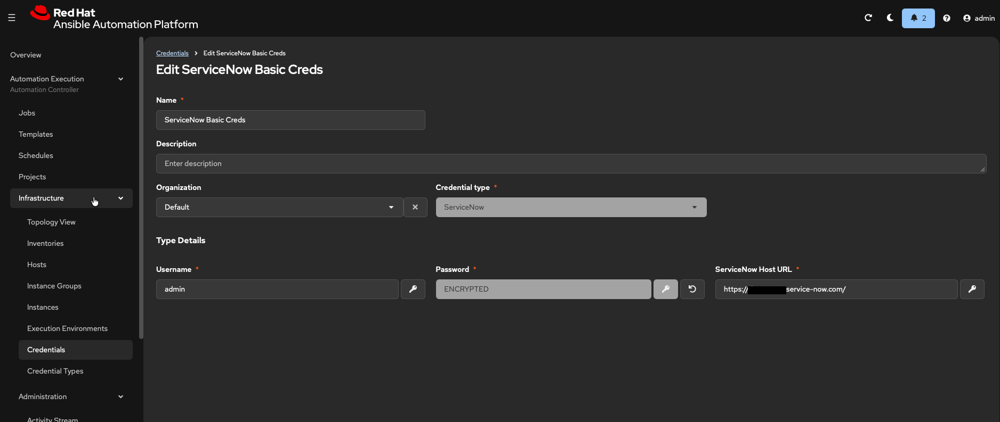

_Automation Execution credential list_


### 1.3 Create the project

**Automation Execution → Projects → Create project**

- **Name:** `EDA ServiceNow`
- **Organization:** `<your-org>`
- **Source control type:** Git
- **Source control URL:** `https://github.com/<you>/Ansible_EDA_Test.git`
- **Source control branch:** `main`
- **Source control credential:** leave empty for a public repo

Sync it. `collections/requirements.yml` is installed automatically during the sync, which is
how `servicenow.itsm` becomes available to the playbook.

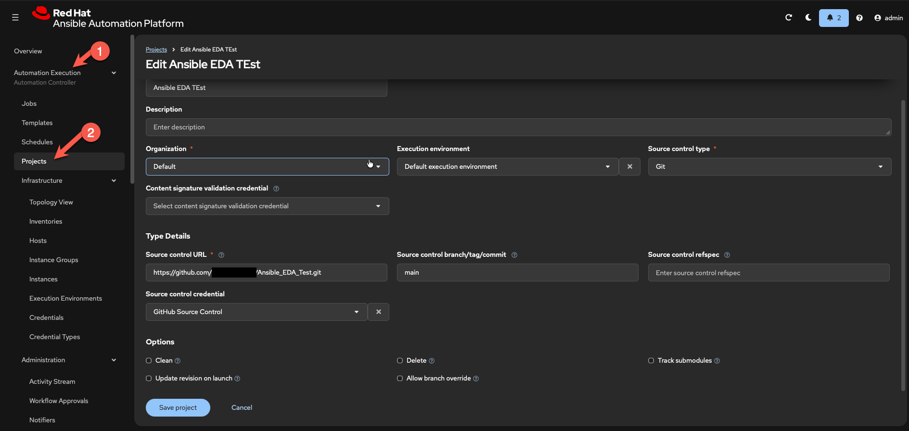

_Automation Execution project pointing at this repo_


### 1.4 Create the job template

**Automation Execution → Templates → Create template → Create job template**

| Field | Value |
|---|---|
| Name | `ServiceNow Incident Handler` — **must match the rulebook exactly** |
| Job type | Run |
| Inventory | `Demo Inventory` (must contain `localhost`) |
| Project | `EDA ServiceNow` |
| Playbook | `servicenow_incident_handler.yml` |
| Execution environment | Default execution environment |
| Credentials | your ServiceNow PDI credential |
| **Variables → Prompt on launch** | ✅ **REQUIRED** |

> ⚠️ **Prompt on launch (`ask_variables_on_launch`) is mandatory.** Without it the controller
> silently discards the `extra_vars` the rulebook sends. The job runs with no variables and
> fails on undefined variables, with nothing explaining why.

The playbook runs `hosts: localhost` with `connection: local`, so the inventory only needs
`localhost` with `ansible_connection: local`.

> **Note on `servicenow_incident_handler.yml`:** it currently hardcodes `sn_instance`. Since
> your credential already injects `SN_HOST`, consider changing it to
> `sn_instance: "{{ SN_HOST }}"` so the playbook follows the credential instead of an edit.

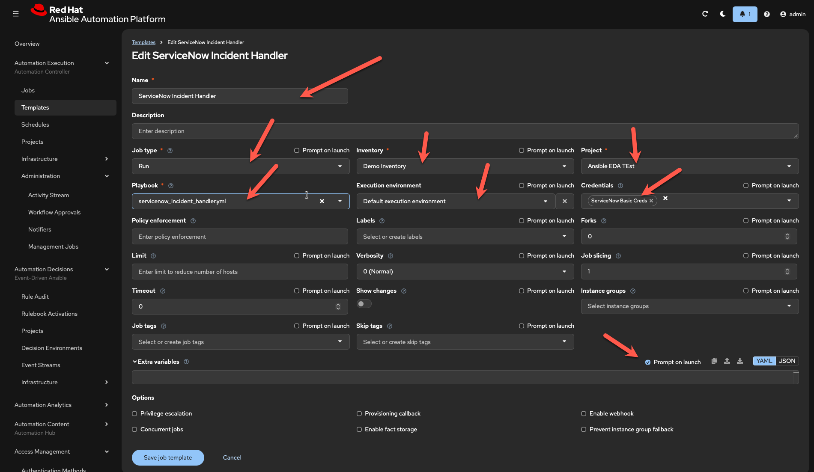

_Job template settings_


_Variables → Prompt on launch enabled (required)_


---

## Part 2 — Automation Decisions (EDA) setup

Do these in order. Later steps depend on earlier ones.

### 2.1 Create EDA credentials

EDA keeps its **own** credential store, separate from Automation Execution. Yes, you will
re-enter the same Git PAT here. That is expected.

**Automation Decisions → Infrastructure → Credentials**

| Credential | Type | Contents |
|---|---|---|
| Source control | Source Control | Git username + PAT (**skip for a public repo**) |
| AAP Controller | Red Hat Ansible Automation Platform | see below |
| Red Hat Registry | Container Registry | `registry.redhat.io` + your Red Hat service account |
| Event Stream Token | ServiceNow Event Stream | see 2.5 |

**AAP Controller credential** — this is what lets `run_job_template` call the controller:

- **Host:** `https://<your-aap-host>/api/controller/`
- **Username / Password:** an account that can launch job templates
- **Verify SSL:** off for a sandbox with self-signed certs

> ⚠️ The host must end at `/api/controller/`. Adding `/v2/` doubles the version segment in
> generated API paths and every job template lookup returns 404.

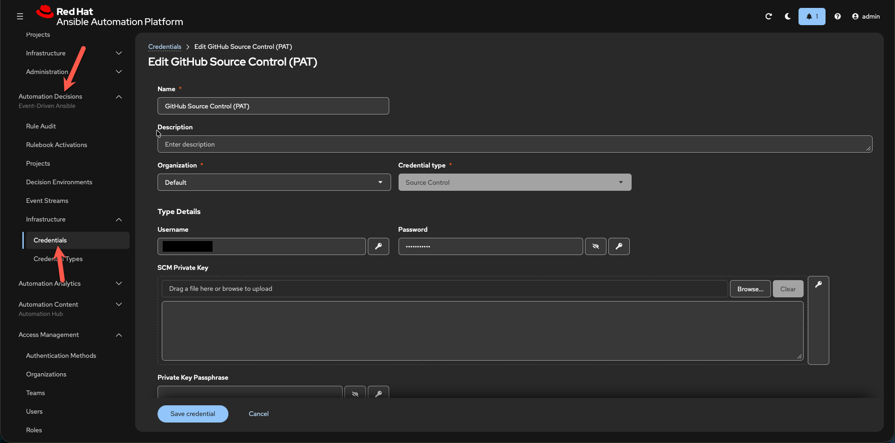

_Automation Decisions credential list_

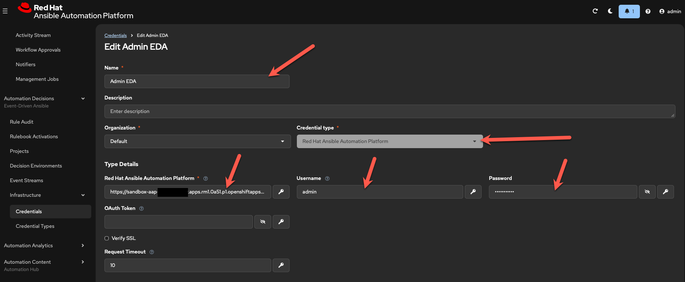

_Red Hat Ansible Automation Platform credential — host ends at /api/controller/_

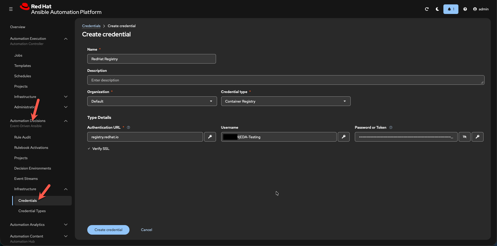

_Container Registry credential for registry.redhat.io_


### 2.2 Create the Decision Environment

**Automation Decisions → Infrastructure → Decision Environments → Create**

- **Name:** `DE Supported RHEL9`
- **Image:** `registry.redhat.io/ansible-automation-platform-27/de-supported-rhel9:latest`
  - AAP 2.6: use `ansible-automation-platform-26/...`
- **Credential:** your Red Hat Registry credential (not needed if the cluster already has a
  global pull secret covering `registry.redhat.io`)

A Decision Environment is **not** needed for a project to sync — only to run an activation.

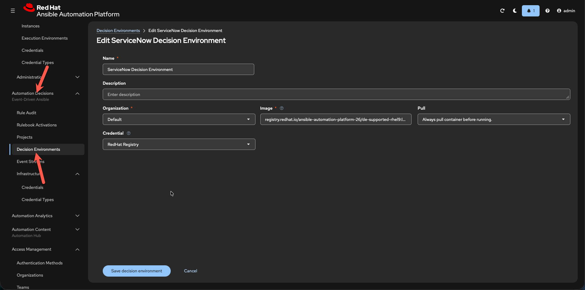

_Decision Environment using the de-supported-rhel9 image_


### 2.3 Create the EDA project

**Automation Decisions → Projects → Create project**

- **Name:** `Ansible EDA Test`
- **Source control type:** Git
- **Source control URL:** `https://github.com/<you>/Ansible_EDA_Test.git`
- **Branch:** `main`
- **Credential:** empty for a public repo

Wait for **Completed**. Then check **Automation Decisions → Rulebooks** — you should see
`my_eda_rulebook.yml`. If the project is stuck at **Pending** or fails with *"Task was stuck
in pending state"*, see [`aap-eda-project-sync-fix.md`](aap-eda-project-sync-fix.md). That is
almost always an out-of-memory worker pod, not a problem with your project settings.

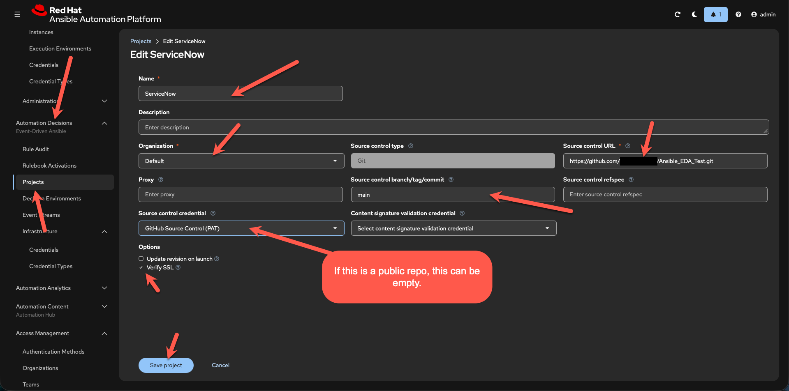

_EDA project synced, state Completed_

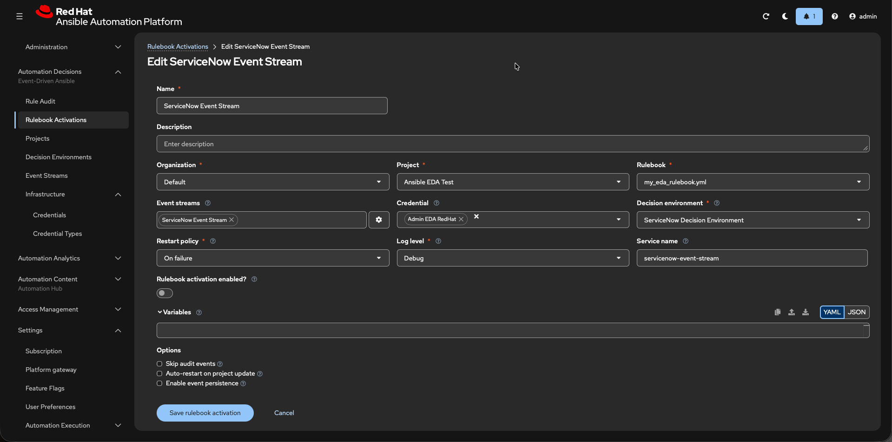

_Rulebooks discovered after a successful sync_


### 2.4 Generate the event stream token

On your machine:

```bash
openssl rand -hex 32
```

Save it in a password manager. You will paste the same value into two places: the AAP
credential (2.5) and ServiceNow (3.2).

### 2.5 Create the Event Stream credential

**Automation Decisions → Infrastructure → Credentials → Create**

- **Name:** `Event Stream Token`
- **Type:** `ServiceNow Event Stream`
- **Auth type:** `token`
- **HTTP header key:** `Authorization`
- **Token:** the value from 2.4

> Use the token type, **not OAuth 2.0**. ServiceNow's OAuth provider has no RFC 7662
> introspection endpoint, so EDA cannot validate tokens against it.

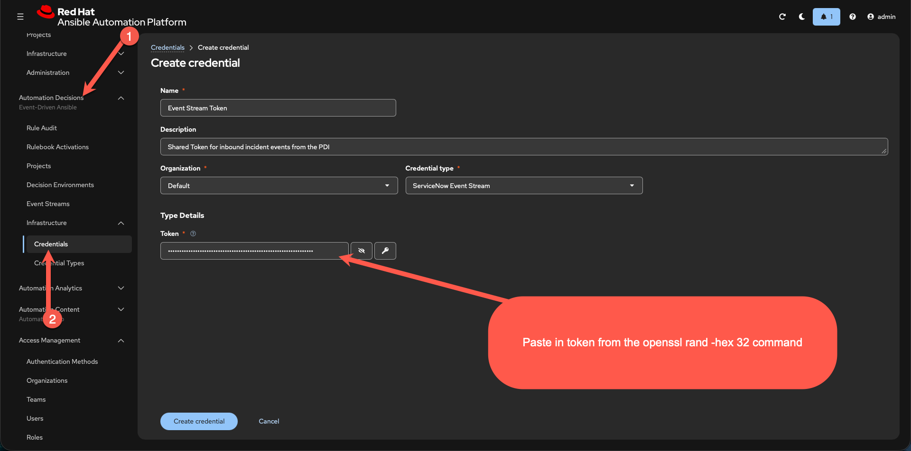

_ServiceNow Event Stream credential — auth type token, header key Authorization_


### 2.6 Create the Event Stream

**Automation Decisions → Event Streams → Create event stream**

- **Name:** `ServiceNow Event Stream`
- **Event stream type:** ServiceNow
- **Credential:** `Event Stream Token`
- **Forward events to rulebook activation:** ✅ **tick this.** The event stream only shows up
  on the activation's mapping page (step 2.7) when forwarding is enabled.

> **Two testing modes, and they are mutually exclusive:**
>
> - Forwarding **on** (what you want): events go straight to the rulebook activation. They are
>   **not** stored on the stream's Events tab — you read the activation log instead.
> - Forwarding **off**: events are stored on the Events tab so you can inspect the exact JSON,
>   but no rulebook runs and no job launches.
>
> Start with forwarding **on**. Only turn it off if you need to see a raw payload that you
> cannot explain from the activation log.

Copy the generated URL. It looks like:

```
https://<your-aap-host>/eda-event-streams/api/eda/v1/external_event_stream/<uuid>/post/
```

> The `<uuid>` is regenerated if you ever rebuild the event stream or the AAP instance. Any
> ServiceNow connection pointing at it must be updated.

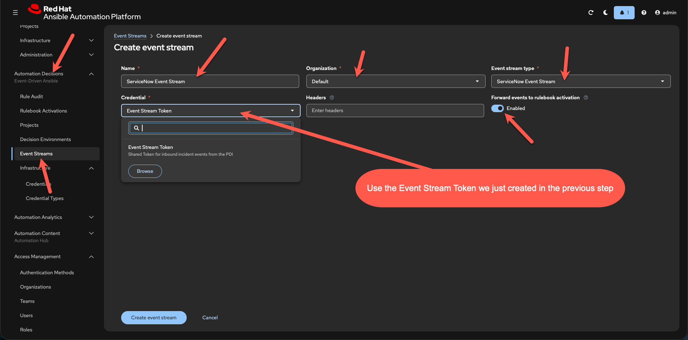

_Event stream definition_

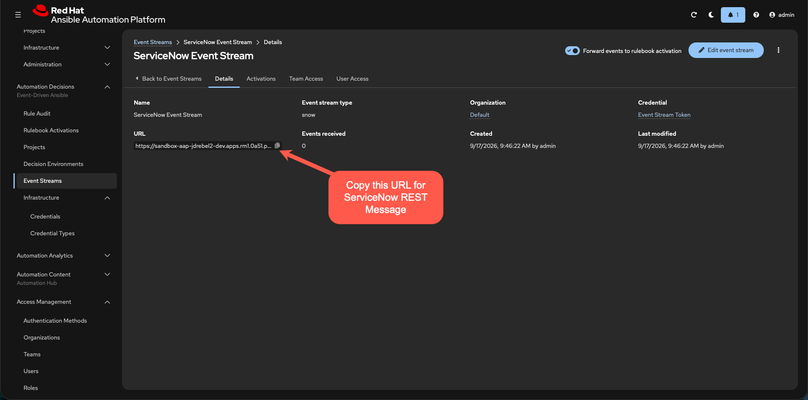

_The generated event stream URL — copy this into ServiceNow_


### 2.7 Create the Rulebook Activation

**Automation Decisions → Rulebook Activations → Create rulebook activation**

**Page 1 — details:**

| Field | Value |
|---|---|
| Name | `ServiceNow Incidents` |
| Organization | `<your-org>` |
| Project | `Ansible EDA Test` |
| Rulebook | `my_eda_rulebook.yml` |
| Credential | `AAP Controller` |
| Decision environment | `DE Supported RHEL9` |
| Restart policy | On failure |
| Log level | **Debug** while setting up; drop to Info later |
| Skip audit events | leave unchecked so you can see matches |

**Page 2 — event streams.** This is the important page. Click the gear icon, then map:

- **Left (rulebook source):** `ansible.eda.webhook`
- **Right (event stream):** `ServiceNow Event Stream`

Save the mapping. This **replaces** the webhook listener with the server-side stream. Your
rules and conditions are unchanged.

You can confirm it worked in the activation log — it will load
`eda.builtin.pg_listener` instead of `ansible.eda.webhook`:

```
ansible_rulebook.engine - INFO - load source eda.builtin.pg_listener
```

**Page 3 — review.** Ensure *Enable rulebook activation* is ticked, then Create.

The activation should reach **Running**, and its log should end with:

```
ansible_rulebook.rule_set_runner - INFO - Waiting for events, ruleset: ServiceNow Incident Automation - Simple Test
```


_Activation page 1 — details_


_Activation page 2 — mapping ansible.eda.webhook onto the event stream_

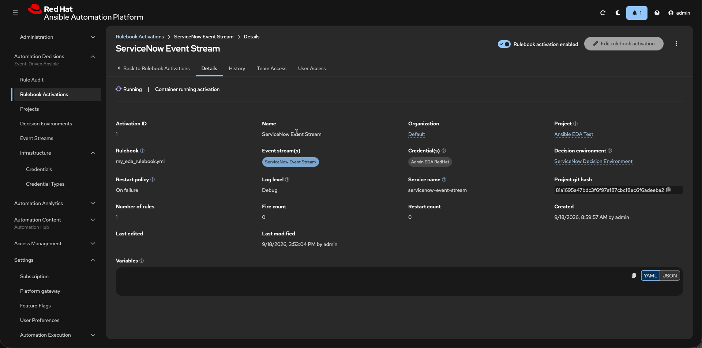

_Activation in Running state_


---

## Part 3 — ServiceNow setup

> 📌 **Before you write the Script step in 3.2, read
> [Part 4 — The payload contract](#part-4--the-payload-contract-read-this).** It defines the
> exact JSON shape EDA needs. Getting it wrong is the failure mode that produces a successful
> `200` and no automation.

### 3.1 Create the Connection & Credential Alias (how the token is sent)

This is the supported way to send `Authorization: Bearer <token>` and it requires **no
script**.

> ⚠️ **Do not use a `password2` system property with `GlideEncrypter`.** On current
> ServiceNow releases `GlideEncrypter` is deprecated and **returns null** (TripleDES removal,
> KB1320986), so a `password2` value cannot be read back in script at all — and anything
> already stored in one is unrecoverable ciphertext. Use the alias below.

**Step 1 — Connection & Credential Alias**

All → Connections & Credentials → Connection & Credential Aliases → New

- **Name:** `EDA Event Stream`
- **Type:** Connection and Credential

**Step 2 — HTTP(s) Connection**

From the alias, create a new HTTP(s) Connection:

- **Name:** `EDA Event Stream Connection`
- **Connection URL:** `https://<your-aap-host>`
- **Credential:** the credential from Step 3

**Step 3 — Credential**

Create a credential of type **API Key**:

| Field | Value |
|---|---|
| API Key Header | `Authorization` |
| API Key | `Bearer <token>` — the token from 2.4, with the literal prefix |

> ⚠️ **The `Bearer ` prefix goes inside the API Key value.** There is no separate prefix or
> scheme field. If you store only the bare token you get `Authorization: <token>` and EDA
> rejects it with a token mismatch. It must be a capital **B** and exactly **one space**.

**Step 4** — in your Action's REST step, select this alias. Done. The token never appears in
a script, a step output, or a flow execution log.

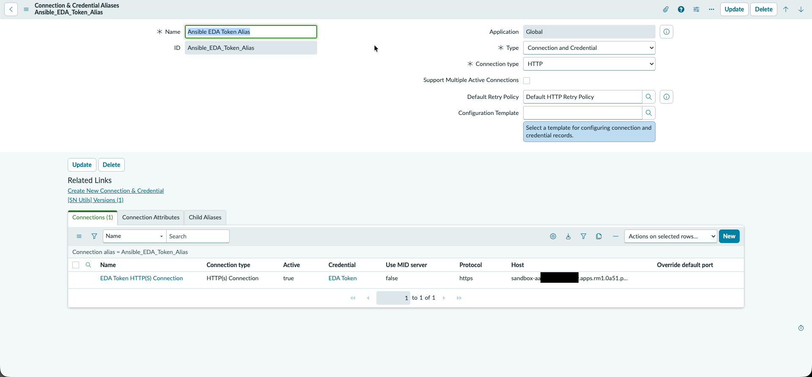

_Connection & Credential Alias_

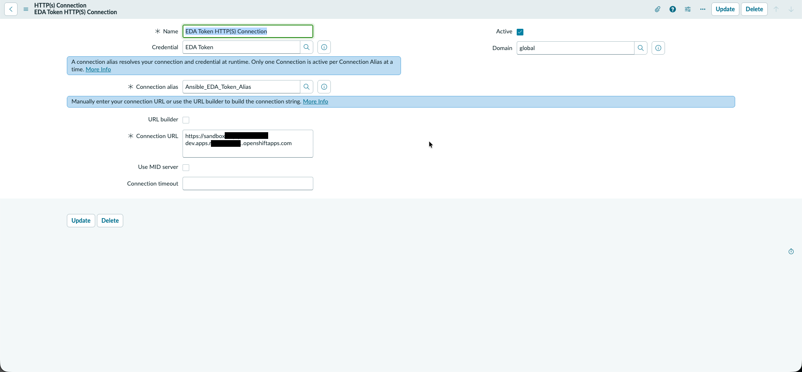

_HTTP(s) Connection pointing at the AAP host_

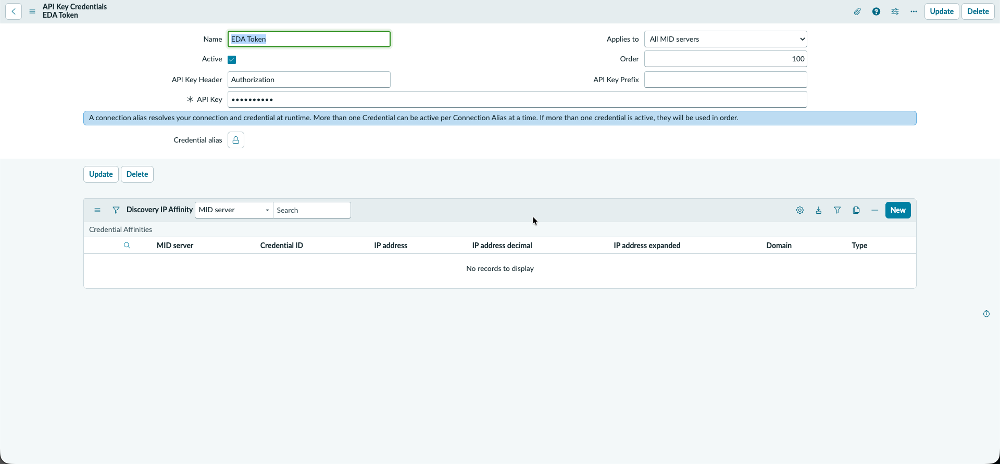

_API Key credential — header Authorization, value 'Bearer <token>'_


### 3.2 Create the Action

All → Process Automation → Flow Designer (or Workflow Studio) → New → Action

**Action inputs:**

| Label | Name | Type | Mandatory |
|---|---|---|---|
| Incident Record | `incident_record` | Reference → Incident | false |

> ⚠️ **Input names are case-sensitive in scripts.** If the input is created as
> `Incident_record`, then `inputs.incident_record` is `undefined` and the script throws
> "Invalid or missing incident record". The script below tolerates either spelling.

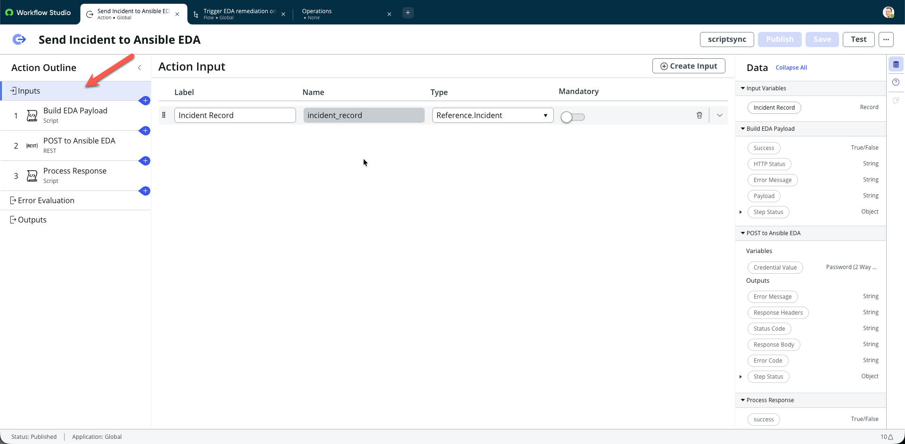

_Action inputs — Incident Record_

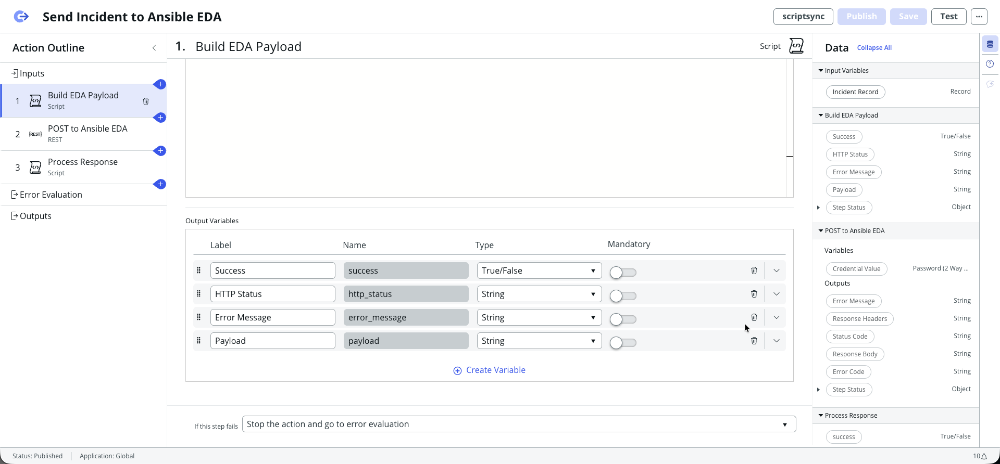

_Script step output variables (must be declared)_

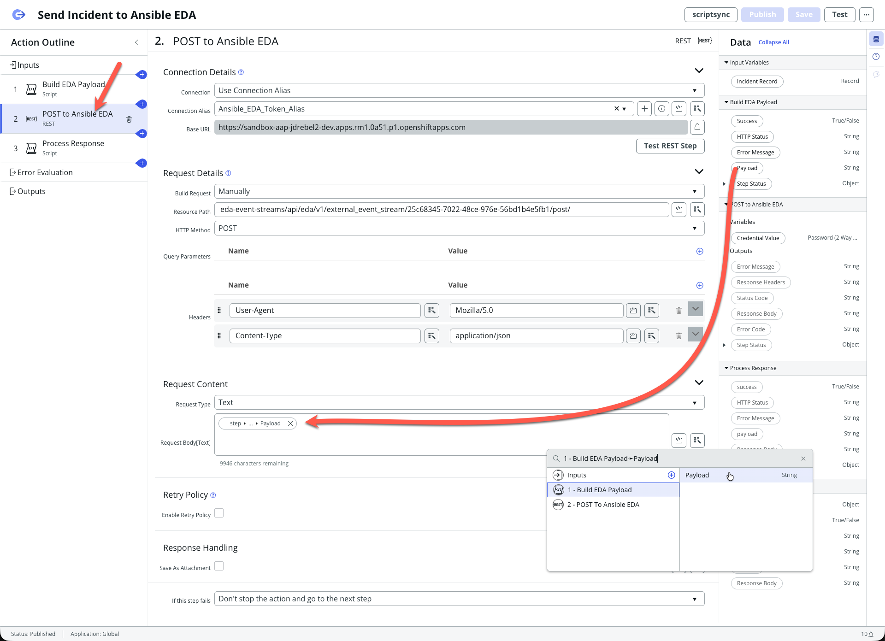

_REST step using the connection alias_

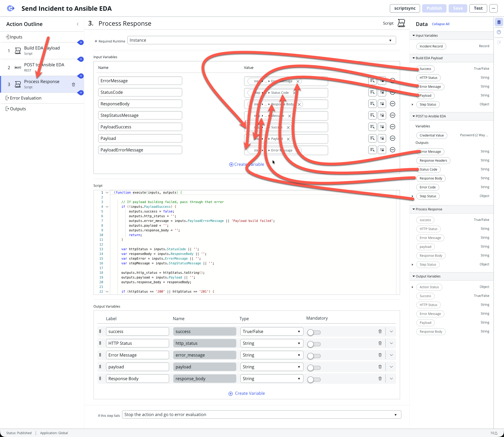

_Result script step output variables_

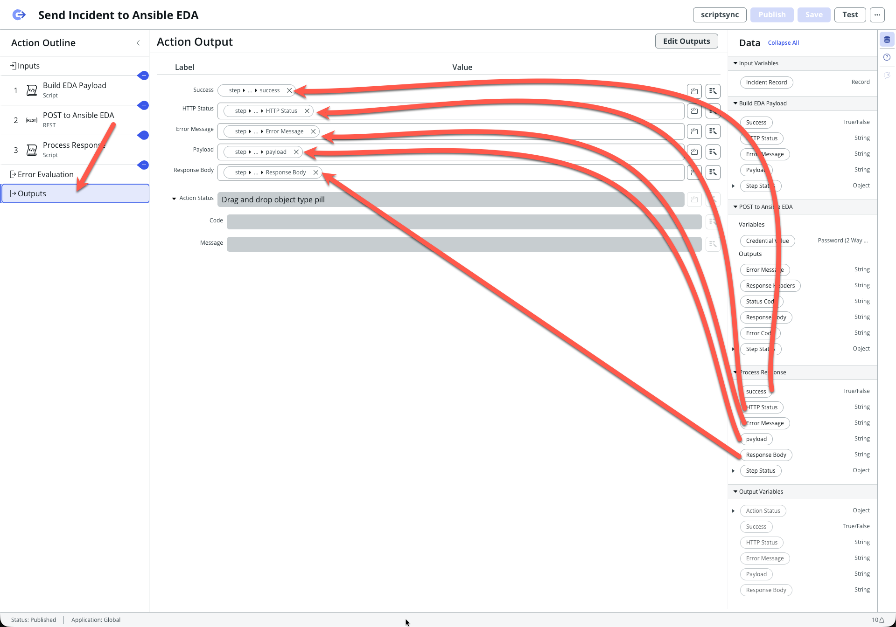

_Action outputs mapped from step pills_


#### Step 1 — Script step: build the payload

**Output variables** (these must be **declared**, or `outputs.x` silently evaporates):

| Label | Name | Type |
|---|---|---|
| Payload | `payload` | String |
| Is Valid | `is_valid` | True/False |
| Success | `success` | True/False |
| Incident Number | `incident_number` | String |
| Error Message | `error_message` | String |

**Script:**

```javascript
(function execute(inputs, outputs) {

    var _rec = inputs.incident_record || inputs.Incident_record;
    var incidentSysId = (_rec && typeof _rec === 'object' && _rec.getUniqueValue)
        ? _rec.getUniqueValue()
        : String(_rec || '');

    outputs.is_valid = false;
    outputs.payload = '';
    outputs.error_message = '';
    outputs.incident_number = '';

    if (!incidentSysId) {
        outputs.error_message = 'Invalid or missing incident record';
        gs.error('EDA Action: Invalid incident record provided');
        throw new Error('Invalid or missing incident record');
    }

    var incident = new GlideRecord('incident');
    if (!incident.get(incidentSysId)) {
        outputs.error_message = 'Could not find incident with sys_id: ' + incidentSysId;
        gs.error('EDA Action: Incident not found: ' + incidentSysId);
        throw new Error('Could not find incident with sys_id: ' + incidentSysId);
    }

    outputs.incident_number = incident.number.toString();

    function cleanFieldValue(fieldValue) {
        if (!fieldValue) return '';
        var cleaned = String(fieldValue);
        cleaned = cleaned
            .replace(/\r\n/g, ' ')
            .replace(/[\n\r\t]/g, ' ')
            .replace(/\\/g, '/')
            .replace(/\s+/g, ' ')
            .trim();
        return cleaned;
    }

    function getFieldValue(field) {
        return cleanFieldValue(field ? field.getDisplayValue() : '');
    }

    // Enrich from Event Management alert, when the incident originated from one
    var emAlert = null;
    var originTable = incident.origin_table ? incident.origin_table.getValue() : '';
    var originId = incident.origin_id ? incident.origin_id.getValue() : '';

    if (originTable == 'em_alert' && originId) {
        var alertGr = new GlideRecord('em_alert');
        if (alertGr.get(originId)) {
            emAlert = alertGr;
        } else {
            gs.warn('EDA Action: Origin is em_alert but alert not found: ' + originId);
        }
    }

    // FLAT payload with event_type at the top level — see Part 4
    var payload = {
        event_type: 'incident_created',
        incident_number: getFieldValue(incident.number),
        caller: getFieldValue(incident.caller_id),
        requester: getFieldValue(incident.u_requester),
        contact_type: getFieldValue(incident.contact_type),
        short_description: getFieldValue(incident.short_description),
        description: getFieldValue(incident.description),
        priority: getFieldValue(incident.priority),
        cmdb_ci: getFieldValue(incident.cmdb_ci),
        sys_id: cleanFieldValue(incident.sys_id ? incident.sys_id.getValue() : ''),
        origin_table: cleanFieldValue(originTable),
        origin_id: cleanFieldValue(originId),
        business_service: getFieldValue(incident.business_service),
        service_offering: getFieldValue(incident.service_offering),
        application_service: getFieldValue(incident.u_application_service),
        state: getFieldValue(incident.state),
        assigned_to: getFieldValue(incident.assigned_to),
        assignment_group: getFieldValue(incident.assignment_group),
        category: getFieldValue(incident.category),
        urgency: getFieldValue(incident.urgency),
        impact: getFieldValue(incident.impact),
        root_cause: getFieldValue(incident.u_root_cause),
        event_issue: getFieldValue(incident.u_event_issue),
        event_id: getFieldValue(incident.u_event_id),
        em_alert_node: emAlert ? getFieldValue(emAlert.node) : '',
        em_metric_name: emAlert ? getFieldValue(emAlert.metric_name) : '',
        em_resource: emAlert ? getFieldValue(emAlert.resource) : '',
        em_type: emAlert ? getFieldValue(emAlert.type) : ''
    };

    outputs.payload = JSON.stringify(payload);
    outputs.is_valid = true;
    outputs.success = true;

})(inputs, outputs);
```

#### Step 2 — REST step: post to the event stream

| Field | Value |
|---|---|
| Connection | **Use Connection Alias** → `EDA Event Stream` |
| Resource path | `/eda-event-streams/api/eda/v1/external_event_stream/<uuid>/post/` |
| HTTP method | POST |
| Header | `Content-Type: application/json` |
| Request body | the `payload` pill from Step 1 |

The `Authorization` header comes from the alias — do not add it by hand.

#### Step 3 — Script step: interpret the result

```javascript
(function execute(inputs, outputs) {
    // If payload building failed, pass that error through
    if (!inputs.PayloadSuccess) {
        outputs.success = false;
        outputs.http_status = '';
        outputs.error_message = inputs.PayloadErrorMessage || 'Payload build failed';
        outputs.payload = '';
        outputs.response_body = '';
        return;
    }

    var httpStatus   = inputs.StatusCode  || '';
    var responseBody = inputs.ResponseBody || '';
    var stepError    = inputs.ErrorMessage || '';
    var stepMessage  = inputs.StepStatusMessage || '';

    outputs.http_status   = httpStatus.toString();
    outputs.payload       = inputs.Payload || '';
    outputs.response_body = responseBody;

    if (httpStatus == '200' || httpStatus == '201') {
        outputs.success = true;
        outputs.error_message = '';
    } else if (stepError) {
        outputs.success = false;
        outputs.error_message = stepError + (stepMessage ? ' - ' + stepMessage : '');
    } else {
        outputs.success = false;
        outputs.error_message = 'HTTP ' + httpStatus + ': ' + responseBody.substring(0, 200);
    }
})(inputs, outputs);
```

> ⚠️ If this step reports a failure while the REST step returned 200, the culprit is almost
> always a flag it reads that was never **declared** as an output variable. Undeclared
> outputs vanish without error.

**Action outputs** — map these from the step pills: `success`, `http_status`,
`error_message`, `incident_number`.

**Save → Publish.** A flow uses the **last published** version. If you only Save, your
change has no effect and you will re-test the old behaviour.

### 3.3 Create the Flow

All → Process Automation → Flow Designer → New → Flow

**Trigger:** Created → Incident

Add a condition so you don't fire on every incident. Either works:

- `Caller` is `Event Management` (useful with Event Management demo data)
- `Priority` is one of `1 - Critical`, `2 - High`

**Actions:**

1. **Action:** your published `Send Event to Ansible AAP` action
   - **Input:** drag `Trigger → Incident Record` into `Incident Record`
2. **Flow Logic → If:** drag the action's `Success` pill, condition `is true`
3. **Then → Update Record**
   - Record: `Trigger → Incident Record`, Table: Incident
   - Work notes: `Ansible automation triggered successfully. HTTP status: <HTTP Status pill>`
   - State: `In Progress`
4. **Log** (Level: Info): `AAP automation triggered for incident <Incident Record pill>`
5. **Flow Logic → End Flow** directly under the Then branch
6. **Else branch → Update Record**
   - Work notes: `Failed to trigger Ansible automation. Error: <Error Message pill>. HTTP status: <HTTP Status pill>`
7. **Log** (Level: Error): `AAP automation failed for incident <Incident Record pill>. Error: <Error Message pill>`
8. Add an **Error Handler** on the flow

**Save → Activate.**

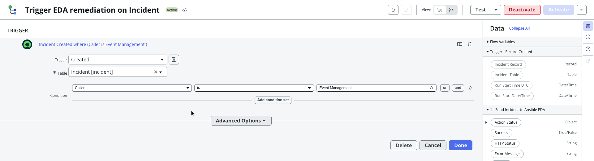

_Flow trigger — Created on Incident with a condition_

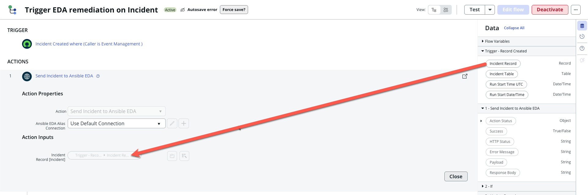

_Action step with the Incident Record dragged in_

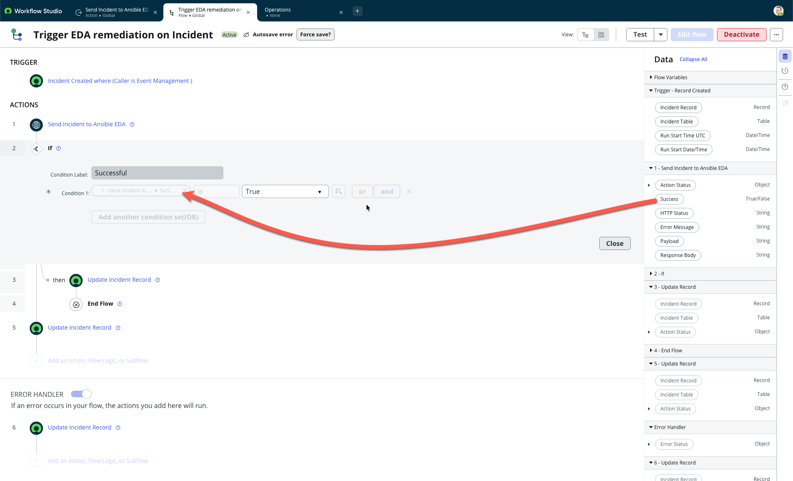

_If condition on the action's Success output_

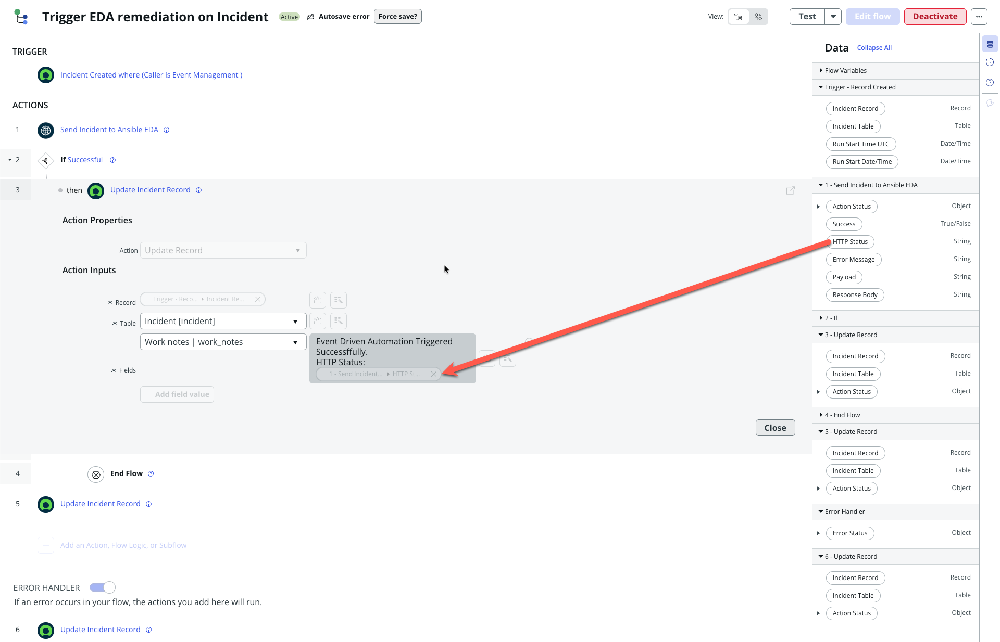

_Then → Update Record with work notes_

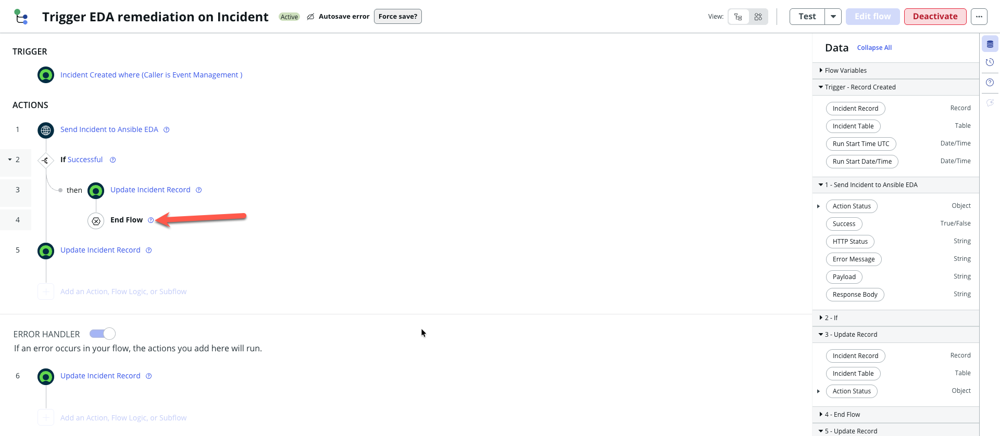

_Log step, Info level_

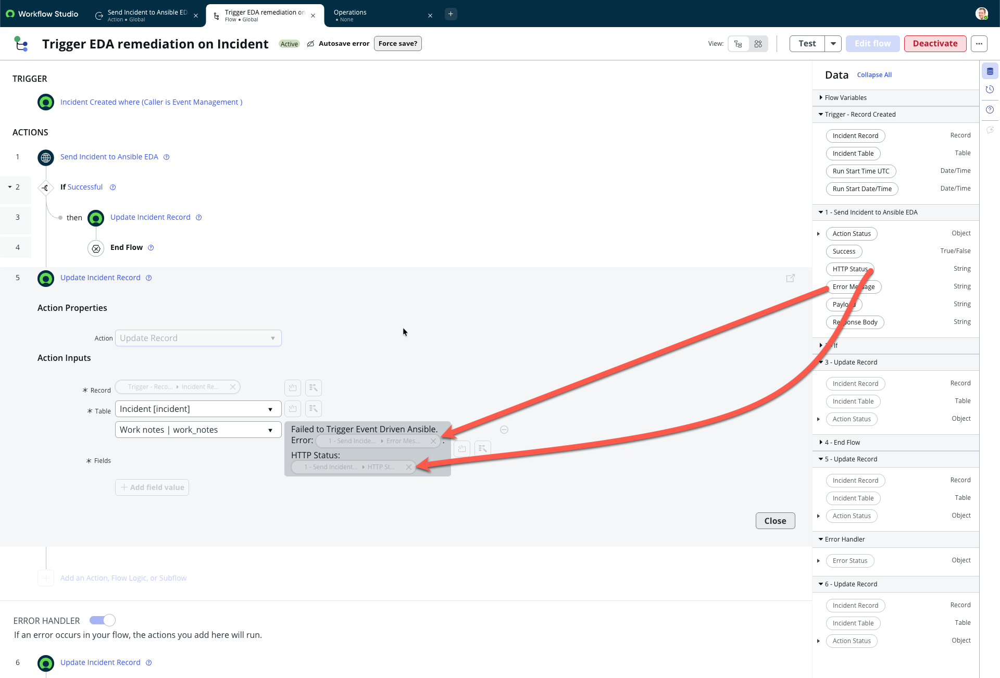

_Else branch — update record and log the error_

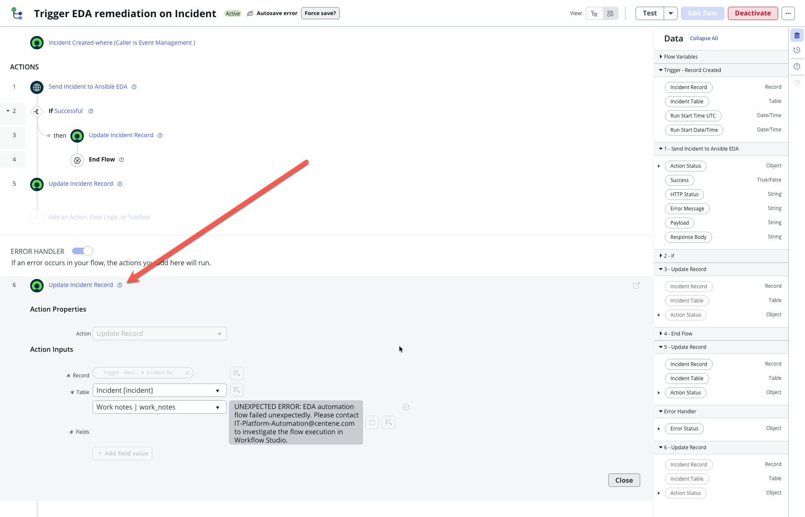

_Flow error handler_


_Full flow overview_


---

## Part 4 — The payload contract (read this)

Three layers each want a different shape. Getting one wrong produces silence, not an error.

| Layer | What it consumes | Who builds it |
|---|---|---|
| ServiceNow → event stream | **flat** JSON, any keys you like | your Script step |
| rulebook → controller | `extra_vars` inside `job_args` | **the rulebook** |
| playbook tasks | bare vars: `{{ incident_number }}` | the job's extra vars |

### Correct — flat, with `event_type`

```json
{
  "event_type": "incident_created",
  "incident_number": "INC0010004",
  "short_description": "Interface down",
  "priority": "2 - High",
  "cmdb_ci": "unix201",
  "state": "New",
  "assigned_to": "ITIL User",
  "category": "Hardware",
  "sys_id": "3214aa5bc353cf10b08b9b377d01314b"
}
```

### Wrong for EDA — nested, no `event_type`

```json
{ "extra_vars": { "incident_number": "INC0010004", "...": "..." } }
```

With the nested version, `event.payload.event_type` does not exist, the condition is never
true, and the activation log shows:

```
Event { ... } didn't match any rule and has been immediately discarded
```

**Minimum required keys** for this repo's rulebook: `event_type` plus `incident_number`,
`short_description`, `priority`, `cmdb_ci`, `state`, `assigned_to`, `category`, `sys_id`.
Omitting any mapped key causes the `StrictUndefined` failure described in Part 6.

---

## Part 5 — Testing end to end

Test each hop separately. When something breaks you will know exactly which one.

### 5.1 Test the event stream and token (no ServiceNow involved)

```bash
curl -sk -X POST -w '\nHTTP:%{http_code}\n' \
  -H 'Content-Type: application/json' \
  -H 'Authorization: Bearer YOUR_TOKEN' \
  'https://<your-aap-host>/eda-event-streams/api/eda/v1/external_event_stream/<uuid>/post/' \
  -d '{"event_type":"incident_created","incident_number":"CURLTEST","short_description":"test","priority":"3","cmdb_ci":"host01","state":"New","assigned_to":"admin","category":"Inquiry","sys_id":"0000test"}'
```

| Result | Meaning |
|---|---|
| `200` | token and URL are correct |
| `400 Authorization header is missing` | no header sent |
| `403` | token mismatch — wrong value, or missing/malformed `Bearer ` prefix |
| `404` | wrong URL |

Send **all** the fields the rulebook maps. A minimal two-field payload matches the rule and
then fails at launch with `StrictUndefined`.

### 5.2 Test the job template on its own

**Automation Execution → Templates → ServiceNow Incident Handler → Launch**, and supply
extra vars manually:

```yaml
incident_number: SMOKETEST0001
short_description: disk space check
priority: "3"
cmdb_ci: none
state: New
assigned_to: admin
category: Inquiry
sys_id: 0000000000000000000000000000test
```

Expect the debug tasks to print your values. The ServiceNow write-back will fail with a fake
`sys_id` — that is fine and proves nothing is written to your PDI.

### 5.3 Test the full chain

Create an incident in ServiceNow matching your trigger, then check in order:

1. **ServiceNow:** Flow Designer → Executions → your run. The REST step should be `200`.
2. **AAP activation log:** Automation Decisions → Rulebook Activations → your activation →
   History → the running instance. With Log level Debug you will see the exact JSON received,
   logged as `received event {...}`. (If forwarding is off instead, look at the stream's
   Events tab — but then no job will launch.)
3. **Activation log:** should show `run_job_template` and `Job Launched, url: /api/controller/v2/jobs/<n>/`
4. **Controller:** the job appears, with `extra_vars` populated and an `ansible_eda` block
   recording the ruleset, rule, and event uuid.


_Event stream Events tab showing the received JSON_


_Controller job launched by the rulebook, with extra vars_


### Reading the activation counters

The activation's log emits periodic `SessionStats`:

| Counter | Meaning |
|---|---|
| `eventsProcessed` | events the rule engine received |
| `eventsMatched` | events that satisfied a condition |
| `eventsSuppressed` | events discarded with no matching rule |
| `rulesTriggered` | actions actually fired |

`eventsProcessed: 0` after a successful post means the event never reached the rulebook —
check the event stream mapping on the activation. `eventsProcessed` rising while
`rulesTriggered` stays 0 means your payload doesn't match the condition — a payload shape
problem.

---

## Part 6 — Troubleshooting

### EDA project stuck at "Pending", then "Task was stuck in pending state"

Your project config is not the problem. The worker pod that performs the git clone is being
killed for exceeding its memory limit. Full diagnosis and fix:
[`aap-eda-project-sync-fix.md`](aap-eda-project-sync-fix.md).

Quick tells: the controller project syncs the same repo fine; `git_hash` is empty; the worker
pod shows `lastState.terminated.reason: OOMKilled`.

### `HTTP 503 "Project workers unavailable"` when syncing

Not a failure. AAP 2.7 checks worker health before queuing work, and you asked before the
worker finished starting. Wait for this line in the worker log, then retry:

```
dispatcherd.brokers.pg_notify  Set up pg_notify listening on channel 'default'
```

### Project syncs but no rulebooks appear

`import_error` will say *"This project contains no rulebooks."* Your rulebook is not in
`rulebooks/` or `extensions/eda/rulebooks/` at the repo root. It is not a recursive search.

### `403` / token mismatch from the event stream

- The `Bearer ` prefix is missing from the API Key value, has a lowercase `b`, or has two
  spaces
- The token in ServiceNow and the token in the AAP credential differ

> ⚠️ The event stream's `events_received` counter increments even for **rejected** requests.
> A rising counter is not proof of success — check the HTTP status.

### Event accepted but the rule never fires

Payload shape. See [Part 4](#part-4--the-payload-contract-read-this). Confirm with the
activation log:

```
Event { ... } didn't match any rule and has been immediately discarded
```

### `Object of type StrictUndefined is not JSON serializable`

The rule matched, but the payload is missing a field the rulebook's `job_args.extra_vars`
references, so the launch request can't be serialized. **No job is launched.** Either send
every mapped field, or add `| default('')` to each mapping in the rulebook.

### Job runs but variables are empty / undefined

**Prompt on launch** is not enabled on the job template. The controller discards extra vars
without it.

### Playbook fails with `401 "User is not authenticated"` from ServiceNow

The username/password in the controller's ServiceNow credential is wrong or stale. The
request reached the PDI, so URL and connectivity are fine.

### Playbook fails on undefined `SN_USERNAME` / `SN_PASSWORD`

You attached the **built-in** ServiceNow credential type, which injects environment
variables. This playbook needs the **custom** type from Part 1.1, which injects extra vars.

### `Invalid or missing incident record` in the ServiceNow Action

The action input's name case doesn't match what the script reads. `inputs.incident_record` vs
`inputs.Incident_record`. The script in 3.2 handles both.

### A step reports failure but the REST step returned 200

An output variable the downstream logic reads was never declared on the step. Undeclared
outputs silently vanish.

### `GlideEncrypter is deprecated and now returns null`

Expected on current releases. `password2` system properties cannot be decrypted in script
anymore, and existing values are unrecoverable. Use the Connection & Credential Alias in
Part 3.1.

### The AAP UI shows a "provisioning" screen and the API returns 503

The gateway pod is crash-looping, usually out of memory on a small install. Same class of
problem as the sync failure; see the CR patch in
[`aap-eda-project-sync-fix.md`](aap-eda-project-sync-fix.md).

---

## Part 7 — Token rotation and maintenance

### Rotating the event stream token

1. Generate a new value: `openssl rand -hex 32`
2. Update the **AAP** `Event Stream Token` credential first
3. Update the **ServiceNow** API Key credential to `Bearer <new-token>`

Posts between the two saves will fail with 403. Do it during a quiet window and verify
afterwards.

### After rebuilding the AAP instance

Nothing in AAP survives a rebuild. You must:

- Re-apply any resource-limit patches **before** creating the EDA project
- Re-create credentials, DE, project, event stream, and activation
- **Update the event stream URL in ServiceNow** — the `<uuid>` is new
- Re-create the event stream token on both sides
- Re-mint any Personal Access Token. On AAP 2.7 the endpoint is
  `/api/gateway/v1/tokens/`; `/api/controller/v2/tokens/` returns 404.

The ServiceNow side (action, flow, alias, credential) survives — only the URL and token
change.

---

## Appendix A — OAuth 2.0 direct job launch (alternative)

Use this if you want ServiceNow to call a job template **directly**, with no EDA. Payloads
here **must** be wrapped in `extra_vars`.

### A.1 Create the OAuth application in AAP

**Access Management → OAuth Applications → Create**

| Field | Value |
|---|---|
| Name | `ServiceNow` |
| Organization | `<your-org>` |
| Authorization grant type | Authorization code |
| Client type | Confidential |
| Redirect URIs | `https://<your-pdi>.service-now.com/oauth_redirect.do` |

Save the **Client ID** and **Client Secret** immediately — the secret is shown only once.

Then enable **Settings → Platform Gateway → Allow External Users to Create OAuth2 Tokens**.

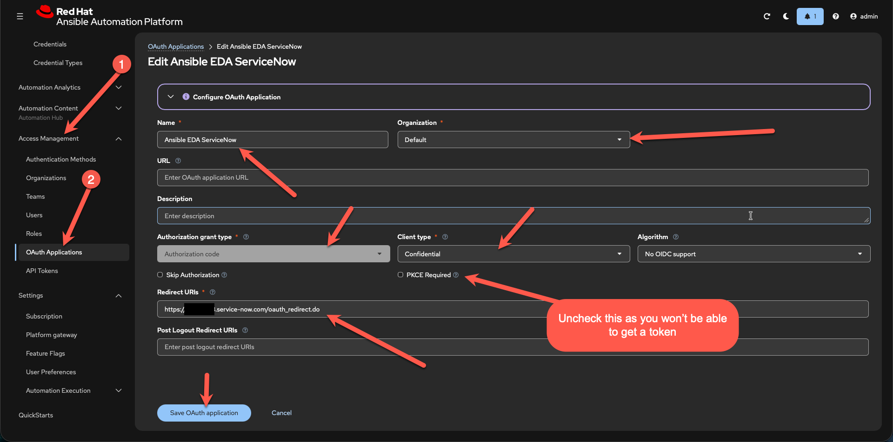

_OAuth application — authorization code, confidential_

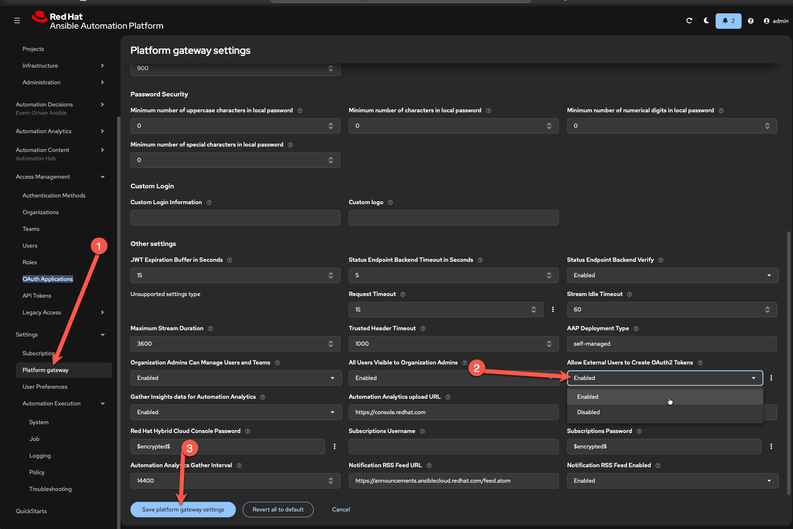

_Settings → Platform Gateway → Allow External Users to Create OAuth2 Tokens_


### A.2 Create the ServiceNow Configuration Template

All → Integration Hub → Configuration Templates → New → *HTTP Connection with OAuth
Authorization Code grant type*

- **Name:** `Ansible`

**Default Data Template:**

```json
{
  "credential": {
    "oauth_entity": {
      "oauth_entity_profile": [
        {
          "grant_type": "authorization_code",
          "name": "<provider-name> Profile",
          "default": true,
          "oauth_entity_profile_scope": ["write"]
        }
      ],
      "code_challenge_method": "S256",
      "type": "consumer",
      "oauth_entity_scope": [
        { "oauth_entity_scope": "write", "name": "Ansible write" }
      ],
      "client_id": "",
      "use_mutual_auth": false,
      "revoke_token_url": "",
      "default_grant_type": "authorization_code",
      "public_client": false,
      "oauth_api_script": "3e3a3a11c333210016194ffe5bba8f70",
      "name": "<provider-name> Spoke OAuth",
      "client_secret": "",
      "auth_url": "https://<provider-domain-name>/o/authorize/",
      "token_url": "https://<provider-domain-name>/o/token/",
      "redirect_url": "https://<instance-name>.service-now.com/oauth_redirect",
      "send_client_credentials_as": "basic_authorization_header"
    },
    "name": "<provider-name> Spoke Credential",
    "table": "oauth_2_0_credentials"
  },
  "connection": {
    "use_mid": false,
    "connection_url": "https://<provider-domain-name>",
    "name": "",
    "table": "http_connection"
  }
}
```

**Dynamic Data Schema:**

```json
{
  "connection_fields": [
    {
      "name": "connection.name",
      "label": "Connection Name",
      "type": "text",
      "defaultValue": "<provider-name> Ansible Connection",
      "hint": "Display name for the Connection",
      "mandatory": true
    },
    {
      "name": "connection.connection_url",
      "label": "Connection URL",
      "type": "text",
      "defaultValue": "https://<provider-domain-name>",
      "hint": "Connection URL for provider",
      "mandatory": true
    }
  ],
  "credential_fields": [
    {
      "name": "credential.name",
      "label": "Credential Name",
      "type": "text",
      "defaultValue": "<provider-name> Ansible Credentials",
      "hint": "Display name for the Credential",
      "mandatory": true
    },
    {
      "name": "credential.oauth_entity.name",
      "label": "Application Registry Name",
      "type": "text",
      "defaultValue": "<provider-name>",
      "hint": "Name of the application registry",
      "mandatory": true
    },
    {
      "name": "credential.oauth_entity.client_id",
      "label": "OAuth Client ID",
      "type": "text",
      "hint": "Client ID for provider",
      "mandatory": true
    },
    {
      "name": "credential.oauth_entity.client_secret",
      "label": "OAuth Client Secret",
      "type": "password",
      "hint": "Client Secret for provider",
      "mandatory": true
    },
    {
      "name": "credential.oauth_entity.oauth_entity_profile[0].name",
      "label": "Oauth Entity Profile Name",
      "defaultValue": "Ansible Entity Profile",
      "type": "text",
      "hint": "Name of the Oauth Entity Profile",
      "mandatory": true
    },
    {
      "name": "credential.oauth_entity.auth_url",
      "label": "Authorization URL",
      "type": "text",
      "defaultValue": "https://<provider-domain-name>/o/authorize/",
      "hint": "Authorization URL",
      "mandatory": true
    },
    {
      "name": "credential.oauth_entity.token_url",
      "label": "Token URL",
      "type": "text",
      "defaultValue": "https://<provider-domain-name>/o/token/",
      "hint": "Token URL",
      "mandatory": true
    },
    {
      "name": "credential.oauth_entity.redirect_url",
      "label": "OAuth Redirect URL",
      "type": "text",
      "defaultValue": "https://<instance-name>.service-now.com/oauth_redirect",
      "hint": "Callback URL for provider",
      "mandatory": true
    }
  ]
}
```

Then create a Connection & Credential Alias, choose **Create New Connection & Credential**
from it, fill in the prompts, and click **Create and Get OAuth Token**.


_Integration Hub configuration template_

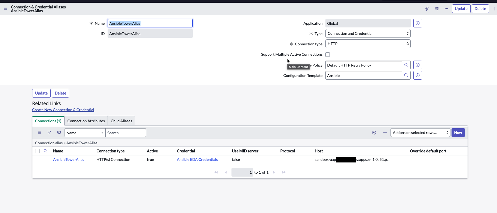

_Connection & Credential Alias for Ansible_

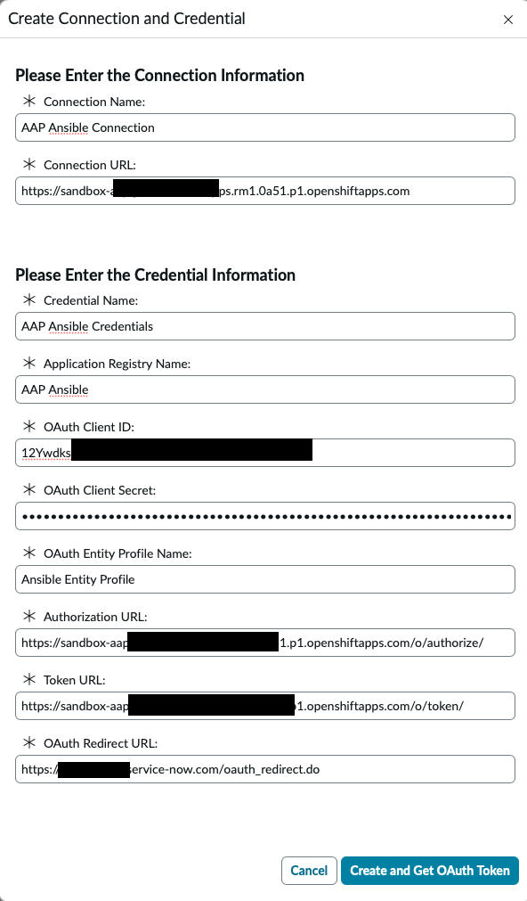

_Create New Connection & Credential → Create and Get OAuth Token_


### A.3 Create the REST Message

All → System Web Services → Outbound → REST Message → New

| Field | Value |
|---|---|
| Name | `Ansible AAP Job Template Webhook` |
| Endpoint | `https://<your-aap-host>/api/controller/v2/job_templates/${job_template_id}/launch/` |
| Authentication type | OAuth 2.0 |
| OAuth profile | the profile created in A.2 |

HTTP method **POST**, endpoint copied from parent, header
`Content-Type: application/json`.


_REST Message with OAuth 2.0 authentication_


### A.4 Action script (Pattern B)

<details>
<summary>Single job template</summary>

```javascript
(function execute(inputs, outputs) {

    var incidentSysId = inputs.incident_record;

    outputs.success = false;
    outputs.job_id = '';
    outputs.http_status = '';
    outputs.error_message = '';

    if (!incidentSysId) {
        outputs.error_message = 'Invalid or missing incident record';
        gs.error('AAP Action: Invalid incident record provided');
        return;
    }

    var incident = new GlideRecord('incident');
    if (!incident.get(incidentSysId)) {
        outputs.error_message = 'Could not find incident with sys_id: ' + incidentSysId;
        gs.error('AAP Action: Incident not found: ' + incidentSysId);
        return;
    }

    try {
        var request = new sn_ws.RESTMessageV2('Ansible AAP Job Template Webhook', 'Default POST');

        // NOTE: Pattern B REQUIRES the extra_vars wrapper
        var payload = {
            extra_vars: {
                incident_number:   incident.number.toString(),
                short_description: incident.short_description.toString(),
                priority:          incident.priority.getDisplayValue(),
                cmdb_ci:           incident.cmdb_ci.getDisplayValue(),
                sys_id:            incident.sys_id.toString(),
                state:             incident.state.getDisplayValue(),
                assigned_to:       incident.assigned_to.getDisplayValue(),
                category:          incident.category.toString(),
                urgency:           incident.urgency.getDisplayValue(),
                impact:            incident.impact.getDisplayValue()
            }
        };

        request.setRequestBody(JSON.stringify(payload));

        var response     = request.execute();
        var httpStatus   = response.getStatusCode();
        var responseBody = response.getBody();

        outputs.http_status = httpStatus.toString();

        if (httpStatus == 201 || httpStatus == 200) {
            try {
                var jobData = JSON.parse(responseBody);
                outputs.success = true;
                outputs.job_id = jobData.id ? jobData.id.toString() : 'N/A';
            } catch (parseEx) {
                outputs.success = true;
                outputs.job_id = 'N/A';
            }
        } else {
            outputs.error_message = 'HTTP ' + httpStatus + ': ' + responseBody.substring(0, 200);
            gs.error('FAILED: AAP job launch failed for ' + incident.number + ', status ' + httpStatus);
        }

    } catch (ex) {
        outputs.error_message = ex.getMessage();
        outputs.http_status = 'Error';
        gs.error('ERROR: AAP Action exception for ' + incident.number + ': ' + ex.getMessage());
    }

})(inputs, outputs);
```

</details>

<details>
<summary>Multiple job templates, chosen by assignment group (preferred at scale)</summary>

Requires a custom mapping table with columns for assignment group, AAP job template ID, and
an active flag. Replace `<your-scope>` with your real scope prefix.

```javascript
(function execute(inputs, outputs) {

    var incidentSysId = inputs.incident_record;

    outputs.success = false;
    outputs.job_id = '';
    outputs.http_status = '';
    outputs.error_message = '';

    if (!incidentSysId) {
        outputs.error_message = 'Invalid or missing incident record';
        return;
    }

    var incident = new GlideRecord('incident');
    if (!incident.get(incidentSysId)) {
        outputs.error_message = 'Could not find incident with sys_id: ' + incidentSysId;
        return;
    }

    var assignmentGroup = incident.assignment_group.toString();
    if (!assignmentGroup) {
        outputs.error_message = 'No assignment group set for incident ' + incident.number;
        return;
    }

    var mappingGR = new GlideRecord('<your-scope>_u_aap_assignment_group_mapping');
    mappingGR.addQuery('<your-scope>_u_assignment_group', assignmentGroup);
    mappingGR.addQuery('<your-scope>_u_active', true);
    mappingGR.query();

    if (!mappingGR.next()) {
        outputs.error_message = 'No active AAP job template mapping for assignment group "' +
                                incident.assignment_group.getDisplayValue() + '"';
        return;
    }

    var jobTemplateId = mappingGR.getValue('<your-scope>_u_aap_job_template_id');
    if (!jobTemplateId) {
        outputs.error_message = 'Job template ID is empty in the mapping record';
        return;
    }

    try {
        var request = new sn_ws.RESTMessageV2('Ansible AAP Job Template Webhook', 'Default POST');
        request.setStringParameterNoEscape('job_template_id', jobTemplateId);

        var payload = {
            extra_vars: {
                incident_number:   incident.number.toString(),
                short_description: incident.short_description.toString(),
                priority:          incident.priority.getDisplayValue(),
                cmdb_ci:           incident.cmdb_ci.getDisplayValue(),
                sys_id:            incident.sys_id.toString(),
                state:             incident.state.getDisplayValue(),
                assigned_to:       incident.assigned_to.getDisplayValue(),
                assignment_group:  incident.assignment_group.getDisplayValue(),
                category:          incident.category.toString(),
                urgency:           incident.urgency.getDisplayValue(),
                impact:            incident.impact.getDisplayValue(),
                job_template_id:   jobTemplateId
            }
        };

        request.setRequestBody(JSON.stringify(payload));

        var response     = request.execute();
        var httpStatus   = response.getStatusCode();
        var responseBody = response.getBody();

        outputs.http_status = httpStatus.toString();

        if (httpStatus == 201 || httpStatus == 200) {
            try {
                var jobData = JSON.parse(responseBody);
                outputs.success = true;
                outputs.job_id = jobData.id ? jobData.id.toString() : 'N/A';
            } catch (parseEx) {
                outputs.success = true;
                outputs.job_id = 'N/A';
            }
        } else {
            outputs.error_message = 'HTTP ' + httpStatus + ': ' + responseBody.substring(0, 200);
        }

    } catch (ex) {
        outputs.error_message = ex.getMessage();
        outputs.http_status = 'Error';
    }

})(inputs, outputs);
```

</details>

**Action output variables:** `success` (True/False), `job_id` (String),
`http_status` (String), `error_message` (String). Save and **Publish**.

---

## Appendix B — Legacy Business Rule (do not use)

Kept for reference only. Use Flow Designer / Workflow Studio instead — it is supported,
debuggable through Flow Executions, and doesn't put integration logic in a table trigger.

<details>
<summary>Business Rule approach (superseded)</summary>

**Table:** Incident · **Active:** true · **Advanced:** true
**When:** After (async if in a scoped application) · **Insert:** true · no filter conditions

```javascript
(function executeRule(current, previous /*null when async*/) {

    try {
        var request = new sn_ws.RESTMessageV2('Ansible AAP Job Template Webhook', 'Default POST');

        var payload = {
            extra_vars: {
                incident_number:   current.number.toString(),
                short_description: current.short_description.toString(),
                priority:          current.priority.getDisplayValue(),
                cmdb_ci:           current.cmdb_ci.getDisplayValue(),
                sys_id:            current.sys_id.toString(),
                state:             current.state.getDisplayValue(),
                assigned_to:       current.assigned_to.getDisplayValue(),
                category:          current.category.toString(),
                urgency:           current.urgency.getDisplayValue(),
                impact:            current.impact.getDisplayValue()
            }
        };

        request.setRequestBody(JSON.stringify(payload));

        var response     = request.execute();
        var httpStatus   = response.getStatusCode();
        var responseBody = response.getBody();

        if (httpStatus == 201) {
            var jobData = JSON.parse(responseBody);
            gs.info('SUCCESS: AAP job launched for ' + current.number + ', job ' + jobData.id);
            current.work_notes = 'Ansible automation triggered. Job ID: ' + jobData.id;
            current.update();
        } else if (httpStatus == 200) {
            gs.info('SUCCESS: AAP job launched for ' + current.number);
        } else {
            gs.error('FAILED: status ' + httpStatus + ', response: ' + responseBody);
        }

    } catch (ex) {
        gs.error('ERROR: AAP Business Rule exception for ' + current.number + ': ' + ex.getMessage());
    }

})(current, previous);
```

</details>

---

## Corrections against older internal notes

If you are working from an earlier version of these notes, two things have changed:

1. **Do not use a `password2` system property plus `GlideEncrypter` to hold the event stream
   token.** `GlideEncrypter` is deprecated and returns null on current releases. Use the
   Connection & Credential Alias in [Part 3.1](#31-create-the-connection--credential-alias-how-the-token-is-sent).
2. **The custom ServiceNow credential type injects `extra_vars`, not environment variables.**
   The playbook reads `{{ SN_USERNAME }}` as an Ansible variable, which only works with
   `extra_vars` injectors. Older notes describing environment variables are incorrect for
   this playbook.
