# Ansible_EDA_Test — ServiceNow to Event-Driven Ansible

A complete, working reference for triggering Ansible Automation Platform automation from a
ServiceNow incident, using **Event-Driven Ansible (EDA)**.

This README is written for someone who has never set up EDA before. Every step says what to
click, what to type, and how to prove it worked.

> **Verified on:** AAP 2.7 (Operator install on OpenShift) + a ServiceNow Personal Developer
> Instance (PDI), September 2026. Where AAP 2.6 differs, it is called out.

---

## Table of contents

1. [What this does](#1-what-this-does)
2. [Two architectures — pick one](#2-two-architectures--pick-one)
3. [Repo contents](#3-repo-contents)
4. [Prerequisites](#4-prerequisites)
5. [Part 1 — One-time global setup](#part-1--one-time-global-setup)
6. [Part 2 — Per-team setup](#part-2--per-team-setup)
7. [Part 3 — ServiceNow setup](#part-3--servicenow-setup)
8. [Part 4 — The payload contract (read this)](#part-4--the-payload-contract-read-this)
9. [Part 5 — Testing end to end](#part-5--testing-end-to-end)
10. [Part 6 — Troubleshooting](#part-6--troubleshooting)
11. [Part 7 — Token rotation and maintenance](#part-7--token-rotation-and-maintenance)
12. [Part 8 — Multi-organization event stream topology](#part-8--multi-organization-event-stream-topology)
13. [Appendix A — OAuth 2.0 direct job launch (alternative)](#appendix-a--oauth-20-direct-job-launch-alternative)

### Companion guides in `docs/`

This README covers the AAP and ServiceNow object setup. These go further:

| Guide | Covers |
|---|---|
| [Dynamic team routing](docs/servicenow-dynamic-team-routing.md) | Routing one incident to the right team's event stream at run time via an `EDA Team Route` config table, instead of one flow per team. Includes the Flow Designer build, both action scripts, cross-scope privileges, and three later upgrade paths. |
| [Phase 2b two-org runbook](docs/phase2b-two-org-runbook.md) | Standing up two AAP organizations with their own streams, credentials, and activations, in dependency order. Records what AAP does and does not isolate per org. |
| [AAP EDA project sync fix](aap-eda-project-sync-fix.md) | Diagnosing an EDA project sync stuck in `Pending` — the default worker is OOMKilled mid-clone at 400Mi. |

Scripts pasted into ServiceNow live in [`docs/scripts/`](docs/scripts/) and are the canonical
copies. Paste from those files rather than from a rendered page.

---

## Build order — do these in this exact sequence

Each step needs something the step above it created. Working out of order is the most common
way to get stuck.

**Part 1 is one-time and global. Part 2 repeats in full for every team. Part 3 is one shared
ServiceNow action and flow, plus one route-table row per team.**

| # | Step | Section | Why it must come after the previous step |
|---|---|---|---|
| 1 | Create the custom ServiceNow credential type | [1.1](#11-create-the-custom-servicenow-credential-type) | Every team's credential is *of* this type |
| | **↓ repeat 2–13 per team ↓** | | |
| 2 | Create the organization | [2.1](#21-create-the-organization) | Everything below is scoped to it, and objects cannot be moved between orgs |
| 3 | Create the inventory | [2.2](#22-create-the-inventory) | The job template needs one containing `localhost` |
| 4 | Create the controller credentials | [2.3](#23-create-the-controller-credentials) | The job template attaches them |
| 5 | Create the controller project and sync it | [2.4](#24-create-the-controller-project) | The job template picks a playbook from it |
| 6 | Create the job template (**Prompt on launch ON**) | [2.5](#25-create-the-job-template) | The rulebook calls it **by name** |
| 7 | Create the EDA credentials | [2.6](#26-create-the-eda-credentials) | The DE and activation reference them |
| 8 | Create the Decision Environment | [2.7](#27-create-the-decision-environment) | The activation runs inside it |
| 9 | Create the EDA project and sync it | [2.8](#28-create-the-eda-project) | You cannot pick a rulebook until the sync completes |
| 10 | Generate this team's token | [2.9](#29-generate-the-event-stream-token) | Used by step 11 and by Part 3 |
| 11 | Create the Event Stream credential | [2.10](#210-create-the-event-stream-credential) | The event stream attaches it |
| 12 | Create the Event Stream (**forwarding ON**) | [2.11](#211-create-the-event-stream) | Gives you the UUID for the route table, and must exist before you can map it |
| 13 | Create the Rulebook Activation and map the stream | [2.12](#212-create-the-rulebook-activation) | Needs the rulebook (9), the DE (8) and the stream (12) |
| | **↑ repeat per team ↑** | | |
| 14 | **Create the scoped application** and set the app picker to it | [3.0](#30-create-the-scoped-application--do-this-first) | Everything in steps 15–18 must be created **inside** it; records cannot be moved between scopes |
| 15 | Create each team's Connection & Credential Alias | [3.1](#31-create-the-connection--credential-alias-how-the-token-is-sent) | Holds that team's token from step 10 |
| 16 | Read the payload contract | [Part 4](#part-4--the-payload-contract-read-this) | **Read before writing the script in step 17** |
| 17 | Create the ServiceNow Action | [3.2](#32-create-the-action) | The REST step takes the alias (15) and UUID (12) as inputs |
| 18 | Build the route table and the Flow | [Dynamic team routing](docs/servicenow-dynamic-team-routing.md) | One row per team; the Flow looks the row up and calls the Action (17) |
| 19 | Test each hop in order | [Part 5](#part-5--testing-end-to-end) | |

> **The two easiest mistakes to make, both of which fail silently:**
>
> 1. Forgetting **Prompt on launch** on the job template (step 6). The job runs with no
>    variables and nothing tells you why.
> 2. Writing the payload in the wrong shape (step 16/17). ServiceNow reports `200`, the event
>    arrives, and the rule simply never matches.

---

## 1. What this does

A ServiceNow incident is created. A Flow Designer flow posts the incident's details to an
AAP **event stream**. An EDA **rulebook activation** is listening, matches a rule, and
launches a controller **job template**. The playbook does remediation work and writes back
to the incident.

```
ServiceNow incident created
        │
        ▼
Flow Designer flow  ──►  custom Action
                            │  Script step: build JSON payload
                            │  REST step:   POST to the AAP event stream
                            ▼
AAP Event Stream  (authenticates the request)
        │
        ▼
Rulebook Activation  (ansible-rulebook running in a Decision Environment pod)
        │  rule condition matches: event.payload.event_type == "incident_created"
        ▼
run_job_template  ──►  Automation Execution job template
                            │
                            ▼
                       servicenow_incident_handler.yml
                            └─► updates / closes the incident in ServiceNow
```

---

## 2. Two architectures — pick one

There are two ways to make ServiceNow trigger AAP. **They are not interchangeable, and the
payload shape is different.** Mixing them up is the single most common cause of "it posts
successfully but nothing happens."

### Pattern A — Event-Driven Ansible (this repo's main path) ✅

ServiceNow posts to an **EDA event stream**. A rulebook decides what to do.

- Auth: a static bearer token on the event stream
- Payload: **flat JSON**, and it must contain whatever key your rule condition tests
- Pros: rules, conditions, throttling, correlation, and multiple actions live in the rulebook
  and are version-controlled in Git. ServiceNow doesn't need to know any job template IDs.

### Pattern B — Direct job template launch via OAuth 2.0

ServiceNow calls the controller's launch API directly:
`POST /api/controller/v2/job_templates/<id>/launch/`

- Auth: OAuth 2.0 authorization-code grant
- Payload: **must be wrapped** — `{"extra_vars": { ... }}`
- Pros: fewer moving parts, no EDA needed
- Cons: ServiceNow has to know job template IDs; no rule engine

See [Appendix A](#appendix-a--oauth-20-direct-job-launch-alternative) for the full Pattern B
setup.

### The `extra_vars` trap

> In **Pattern B** the body is `{"extra_vars": {...}}` because that is what the controller's
> launch API expects.
>
> In **Pattern A** the body must be **flat**, because an event stream is a generic event
> intake — your JSON becomes `event.payload` verbatim. The rulebook builds `extra_vars`
> itself, on the way out to the controller.
>
> If you carry a Pattern B payload into Pattern A, every field ends up one level too deep at
> `event.payload.extra_vars.<field>`, your condition never matches, and the event is silently
> discarded.

---

## 3. Repo contents

```
.
├── rulebooks/
│   └── my_eda_rulebook.yml          # the EDA rulebook (source + rules + action)
├── collections/
│   └── requirements.yml             # servicenow.itsm — installed at project sync
├── servicenow_incident_handler.yml  # the playbook the job template runs
├── my_action_playbook.yml           # minimal debug playbook, useful for smoke tests
├── aap-eda-project-sync-fix.md      # troubleshooting: EDA project stuck "Pending"
└── README.md
```

### Where rulebooks must live — this is a hard requirement

EDA looks in **exactly two** locations, in this order:

1. `extensions/eda/rulebooks/` (collection-style layout, checked first)
2. `rulebooks/` at the repo root (what this repo uses)

**It is not a recursive search.** A rulebook anywhere else is invisible. If neither directory
exists, the project sync still reports `completed`, but with
`import_error: "This project contains no rulebooks."` — a success with a warning, not a
failure.

### The rulebook explained

```yaml
- name: ServiceNow Incident Automation - Simple Test
  hosts: all
  sources:
    - ansible.eda.webhook:          # replaced at runtime by the event stream (see Part 2.6)
        host: 0.0.0.0
        port: 5000

  rules:
    - name: Run incident handler on new incidents
      condition: event.payload.event_type == "incident_created"   # ← must exist in your JSON
      action:
        run_job_template:
          name: "ServiceNow Incident Handler"   # ← must match the job template name EXACTLY
          organization: "Default"
          job_args:
            extra_vars:                          # ← the rulebook builds extra_vars here
              incident_number: "{{ event.payload.incident_number }}"
              short_description: "{{ event.payload.short_description }}"
              priority: "{{ event.payload.priority }}"
              cmdb_ci: "{{ event.payload.cmdb_ci }}"
              state: "{{ event.payload.state }}"
              assigned_to: "{{ event.payload.assigned_to }}"
              category: "{{ event.payload.category }}"
              sys_id: "{{ event.payload.sys_id }}"
```

Three things to notice:

- **Left side of each `extra_vars` line** = the variable name your playbook sees.
  **Right side** = where the rulebook reads it from in the incoming event.
- The `ansible.eda.webhook` source is a placeholder. An activation pod's port 5000 is **not
  reachable from the internet**, so you map an event stream over it. The rules are untouched.
- `name:` under `run_job_template` is matched by string. A typo produces a runtime failure,
  not a validation error.

#### Recommended hardening

If ServiceNow ever omits a mapped field, the whole action dies with
`Object of type StrictUndefined is not JSON serializable` and **no job is launched**. Add
defaults so a sparse event degrades instead:

```yaml
              incident_number: "{{ event.payload.incident_number | default('') }}"
              short_description: "{{ event.payload.short_description | default('') }}"
```

---

## 4. Prerequisites

### AAP

- AAP 2.6 or 2.7 with **Automation Execution** and **Automation Decisions** both enabled
- An organization (examples use `Default`)
- Admin access to the AAP UI

### ServiceNow PDI

Enable these plugins (All → System Applications → All Available Applications):

| Plugin | Demo data |
|---|---|
| Event Management | **with** demo data |
| Flow Designer support for the Service Catalog | without |
| ServiceNow IntegrationHub Installer | without |
| ServiceNow IntegrationHub Professional Pack Installer | without |

<details>
<summary>Optional: Service Operations Workspace / Site Reliability (for some PDI regions)</summary>

Some PDIs don't expose these on the public developer portal. Install from inside the
instance instead:

1. Log in as admin.
2. All → System Applications → All Available Applications → All.
3. Search for `sn_sow_itsm_cont` (Service Operations Workspace ITSM Applications). Install
   or update it.
4. Then look for Service Reliability Management (`sn_srm`) / Site Reliability Metrics in the
   same menu.

</details>

### Placeholders used in this guide

| Placeholder | Meaning | Example |
|---|---|---|
| `<your-aap-host>` | AAP gateway hostname | `aap.example.com` |
| `<your-pdi>` | PDI subdomain | `dev123456` |
| `<your-org>` | AAP organization | `Default` |
| `<your-scope>` | ServiceNow scope prefix | `x_12345_myapp` |

---

## Part 1 — One-time global setup

Exactly one thing is global. Everything else is per-team and lives in Part 2.

### 1.1 Create the custom `ServiceNow` credential type

Define this **once**, for the whole instance. Every team's ServiceNow credential is an *instance*
of this one type — you do not redefine it per team.

The playbook uses `{{ SN_USERNAME }}`, `{{ SN_PASSWORD }}`, and `{{ SN_HOST }}` as **Ansible
variables**. That means the credential must inject them as **extra vars**, not environment
variables.

> ⚠️ The built-in "ServiceNow" credential type injects *environment* variables only. With it,
> `{{ SN_USERNAME }}` is undefined and the playbook fails. You need this custom type.

**Automation Execution → Infrastructure → Credential Types → Create credential type**

- **Name:** `ServiceNow`

**Input configuration:**

```yaml
fields:
  - type: string
    id: username
    label: Username
  - type: string
    id: password
    label: Password
    secret: true
  - type: string
    id: host
    label: Host
required:
  - username
  - password
  - host
```

**Injector configuration:**

```yaml
extra_vars:
  SN_USERNAME: "{{ username }}"
  SN_PASSWORD: "{{ password }}"
  SN_HOST: "{{ host }}"
```

> **The `host` value must include the `https://` scheme** — e.g.
> `https://<your-pdi>.service-now.com`, not `<your-pdi>.service-now.com`. The playbook builds
> URLs by string concatenation (`{{ sn_instance }}/api/now/table/...`); without the scheme
> you get a malformed URL, not a clear error.

**If you already have a `ServiceNow` credential type from before this change** (username +
password only, no `host`), editing the type definition does **not** touch credentials that
were created under the old definition — their `host` field will be empty. You must open each
existing ServiceNow credential (Automation Execution → Infrastructure → Credentials), fill in
the new **Host** field with the full instance URL, and save it again. Skip this and the
credential silently has no host even though the type now supports one.

> ⚠️ **Blast radius of this change:** the playbook (`servicenow_incident_handler.yml`) now
> asserts that `SN_HOST` is set, before it does anything else:
> ```yaml
> - name: Assert the ServiceNow host was injected by the credential
>   ansible.builtin.assert:
>     that:
>       - SN_HOST is defined
>       - SN_HOST | length > 0
>     fail_msg: >-
>       SN_HOST is not set. Add a `host` input and an `SN_HOST` extra_vars
>       injector to the custom ServiceNow credential type, then re-save the
>       ServiceNow PDI credential with the instance URL (including https://).
> ```
> That's the point of this edit: a credential that's missing `host` now fails **fast**, on the
> first task, with the message above — instead of failing later, obscurely, inside a `uri`
> task with a raw undefined-variable error that reads like a network problem.


_Custom ServiceNow credential type — input and injector configuration_

---

## Part 2 — Per-team setup

**Repeat this entire part once per team.** Nothing in it is shared.

AAP scopes almost everything to an organization. Verified classification:

| Object | Scope | Consequence |
|---|---|---|
| Organization | per team | The container for everything below |
| Inventory | per team | Hygiene rather than a hard requirement — see the caveat below |
| Credentials (ServiceNow, AAP Controller, Event Stream Token, Registry) | **per team** | Each team needs its own copy even where the values are identical. AAP **rejects** attaching another org's credential outright |
| Controller project | per team | Each syncs independently from the same Git ref |
| Job template | per team | Matched **by name** from the rulebook's `run_job_template.name` |
| Decision Environment | per team | Each activation references its own, even for the same image |
| EDA project | per team | |
| Event stream + token | per team | One token per stream — see 2.9 |
| Rulebook activation | per team | One pod per team |
| Credential **type** (Part 1.1) | **global** | Defined once |

> **Organization isolation is asymmetric — do not present it as a blanket guarantee.** Verified
> empirically: attaching another org's **credential** to a job template is rejected
> (`HTTP 400 "Credential matching query does not exist."`), but attaching another org's
> **inventory** succeeds (`HTTP 200`). So an org is a hard boundary for secrets and a soft one for
> other objects. Per-team inventories here are a deliberate choice, not something AAP forced.

Worked example, the two teams in this repo:

| | Team A | Team B |
|---|---|---|
| Organization | `Team A` | `Team B` |
| Inventory | `Team A Inventory` | `Team B Inventory` |
| Controller project | `EDA ServiceNow - Team A` | `EDA ServiceNow - Team B` |
| Job template | `Team A Incident Handler` | `Team B Incident Handler` |
| Decision environment | `DE Supported RHEL9 - Team A` | `DE Supported RHEL9 - Team B` |
| EDA project | `Ansible EDA Test - Team A` | `Ansible EDA Test - Team B` |
| Event stream | `sn-team-a` | `sn-team-b` |
| Rulebook | `team_a_rulebook.yml` | `team_b_rulebook.yml` |
| Activation | `team-a-incidents` | `team-b-incidents` |

Substitute `<Team>` below with the team you are building.

<!-- SCREENSHOT: 90-aap-two-organizations.png - both organizations in Access Management -->
_Screenshot pending: both organizations._

### 2.1 Create the organization

**Access Management → Organizations → Create organization** — name it `<Team>`.

Create this first. Every object below asks for an organization, and you cannot move objects
between orgs afterward without recreating them.

### 2.2 Create the inventory

**Automation Execution → Infrastructure → Inventories → Create inventory** — name `<Team> Inventory`.

Add one host, `localhost`, with:

```yaml
ansible_connection: local
```

The playbook runs `hosts: localhost` with `connection: local`, so that single host is all it needs.

### 2.3 Create the controller credentials

**Automation Execution → Infrastructure → Credentials**, both owned by organization `<Team>`:

| Credential | Type | Contents |
|---|---|---|
| `<Team> Source control` | Source Control | Git username + PAT — **omit entirely for a public repo** |
| `<Team> ServiceNow PDI` | `ServiceNow` (the custom type from 1.1) | Host `https://<your-pdi>.service-now.com`, username, password |

> The ServiceNow credential is what makes one shared playbook safe across teams: the playbook reads
> `SN_HOST` from whichever credential the job template carries. Each team can point at a different
> instance without touching the playbook.

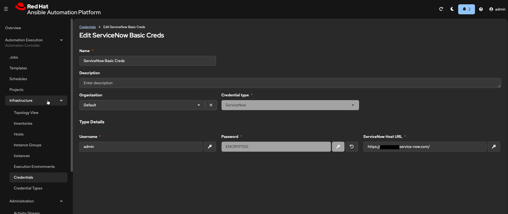

_Automation Execution credential list — single-team capture; yours will show per-team credentials_

### 2.4 Create the controller project

**Automation Execution → Projects → Create project**

- **Name:** `EDA ServiceNow - <Team>`
- **Organization:** `<Team>`
- **Source control type:** Git
- **Source control URL:** `https://github.com/<you>/Ansible_EDA_Test.git`
- **Source control branch:** `main`
- **Source control credential:** leave empty for a public repo

Sync it. `collections/requirements.yml` is installed automatically during the sync, which is
how `servicenow.itsm` becomes available to the playbook.

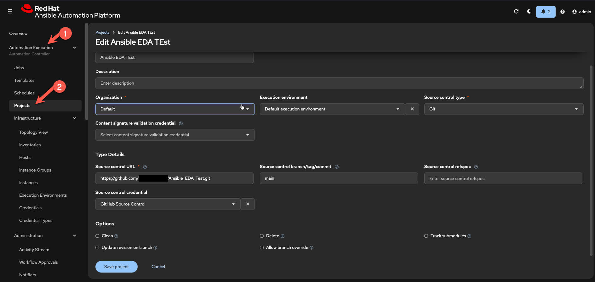

_Automation Execution project pointing at this repo_

### 2.5 Create the job template

**Automation Execution → Templates → Create template → Create job template**

| Field | Value |
|---|---|
| Name | `<Team> Incident Handler` — **must match the rulebook's `run_job_template.name` exactly** |
| Organization | `<Team>` |
| Job type | Run |
| Inventory | `<Team> Inventory` |
| Project | `EDA ServiceNow - <Team>` |
| Playbook | `servicenow_incident_handler.yml` |
| Execution environment | Default execution environment |
| Credentials | `<Team> ServiceNow PDI` |
| **Variables → Prompt on launch** | ✅ **REQUIRED** |

> ⚠️ **Prompt on launch (`ask_variables_on_launch`) is mandatory.** Without it the controller
> silently discards the `extra_vars` the rulebook sends. The job runs with no variables and
> fails on undefined variables, with nothing explaining why.

> ⚠️ **The name is the contract.** The rulebook finds this template by name, not by ID. A
> mismatch produces a job-template-not-found error at launch time, which reads like a permissions
> problem. Compare against the `name:` field in `rulebooks/team_<x>_rulebook.yml`.

**On closing the incident.** The playbook gates the close behind `sn_close_incident`, which
defaults to **`false`**. Both `team_a_rulebook.yml` and `team_b_rulebook.yml` pass `true`, so
EDA-triggered runs close the incident for either team — verified 2026-09-29 on INC0010017 (job 38)
and INC0010018 (job 41), where `Close Complete the incident` reported `changed` and
`close_code: "Solution provided"` matched the PDI's choice list.

Enable it **per team in the rulebook**, never by flipping the playbook default. The default is what
protects you if you ever reintroduce a shared stream, where two teams could race to close one
ticket.

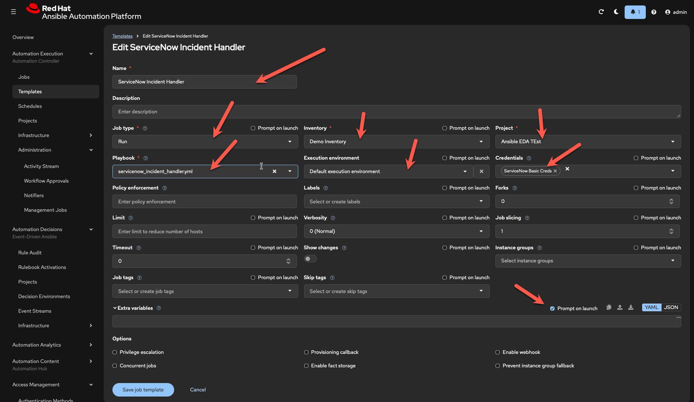

_Job template settings. Note the **Prompt on launch** checkbox beside Extra variables — that
is the one that must be ticked._

### 2.6 Create the EDA credentials

EDA keeps its **own** credential store, separate from Automation Execution. Yes, you will
re-enter the same Git PAT here. That is expected.

**Automation Decisions → Infrastructure → Credentials**, owned by `<Team>`:

| Credential | Type | Contents |
|---|---|---|
| `<Team> Source control` | Source Control | Git username + PAT — skip for a public repo |
| `<Team> AAP Controller` | Red Hat Ansible Automation Platform | see below |
| `<Team> Red Hat Registry` | Container Registry | `registry.redhat.io` + your Red Hat service account |

**AAP Controller credential** — this is what lets `run_job_template` call the controller:

- **Host:** `https://<your-aap-host>/api/controller/`
- **Username / Password:** an account that can launch job templates
- **Verify SSL:** off for a sandbox with self-signed certs

> ⚠️ The host must end at `/api/controller/`. Adding `/v2/` doubles the version segment in
> generated API paths and every job template lookup returns 404.

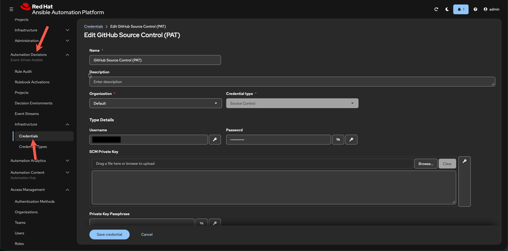

_Automation Decisions credential list_

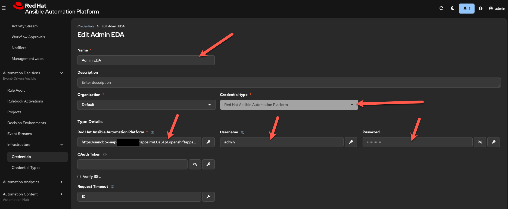

_Red Hat Ansible Automation Platform credential — host ends at /api/controller/_

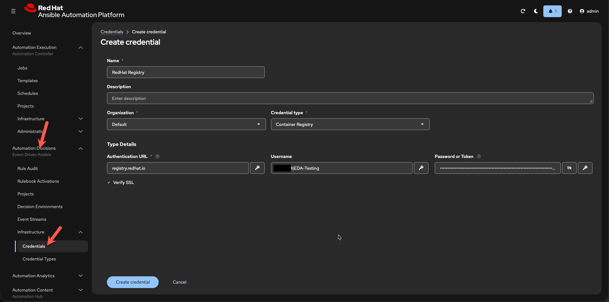

_Container Registry credential for registry.redhat.io_

### 2.7 Create the Decision Environment

**Automation Decisions → Infrastructure → Decision Environments → Create**

- **Name:** `DE Supported RHEL9 - <Team>`
- **Organization:** `<Team>`
- **Image:** `registry.redhat.io/ansible-automation-platform-27/de-supported-rhel9:latest`
  - AAP 2.6: use `ansible-automation-platform-26/...`
- **Credential:** `<Team> Red Hat Registry` (not needed if the cluster already has a global pull
  secret covering `registry.redhat.io`)

A Decision Environment is **not** needed for a project to sync — only to run an activation.

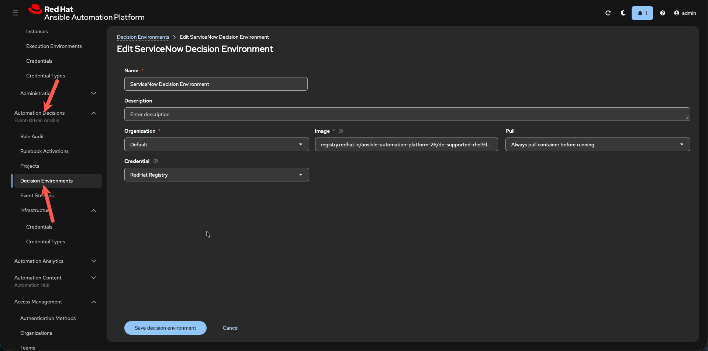

_Decision Environment using the de-supported-rhel9 image_

### 2.8 Create the EDA project

**Automation Decisions → Projects → Create project**

- **Name:** `Ansible EDA Test - <Team>`
- **Organization:** `<Team>`
- **Source control type:** Git
- **Source control URL:** `https://github.com/<you>/Ansible_EDA_Test.git`
- **Branch:** `main`
- **Credential:** empty for a public repo

Wait for **Completed**. Then check **Automation Decisions → Rulebooks** — each team's project
discovers **every** rulebook in the repo, so you will see all of them and must pick the right file
by hand in 2.12. Nothing filters the list for you.

> If the project is stuck at **Pending** or fails with *"Task was stuck in pending state"*, see
> [`aap-eda-project-sync-fix.md`](aap-eda-project-sync-fix.md). That is almost always an
> out-of-memory worker pod, not a problem with your project settings — patch
> `spec.eda.default_worker` to 1Gi.

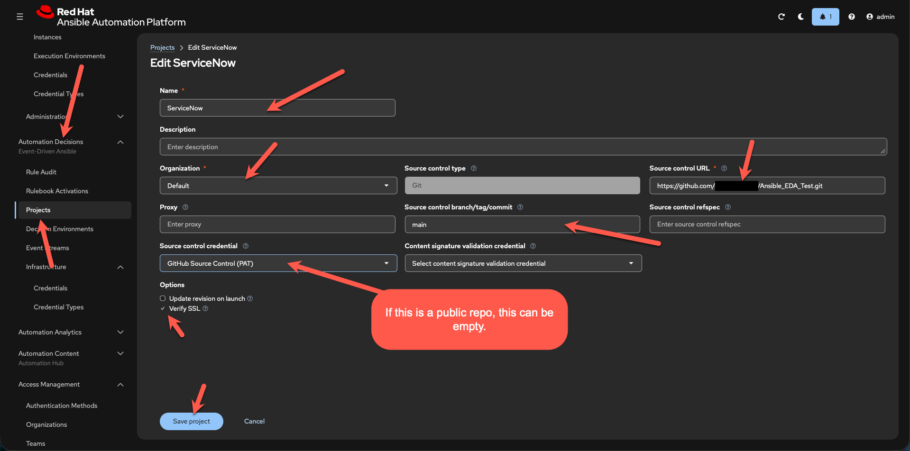

_EDA project settings. **Source control credential can be left empty for a public repo.**_

### 2.9 Generate the event stream token

**One token per team.** Run this once for each team — never share a token between streams:

```bash
openssl rand -hex 32   # this team's token
```

Each stream authenticates independently. A shared token means either team's compromise exposes
both streams, and rotating one forces rotating both.

**The same value goes in two places for this team:**

| Side | Object | Field |
|---|---|---|
| AAP | Event Stream credential (2.10) | Token |
| ServiceNow | API Key credential (Part 3) | API Key value |

> ⚠️ **A mismatch returns HTTP 401 from the stream**, which reads like a permissions or RBAC
> problem and sends you auditing AAP roles. It is almost always a paste artifact — trailing
> whitespace, or a truncated copy. `openssl rand -hex 32` is always **64 characters**; compare
> lengths before suspecting anything else.

**Store it in a password vault, not in a ticket or a chat message.** Free options:

| Tool | Best for |
|---|---|
| **macOS Keychain** | Anything a local script reads: `security add-generic-password -a "$USER" -s <name> -w -U` |
| **Bitwarden** (free tier) | Open source, cross-device, shareable if someone else needs the token |
| **KeePassXC** | Fully local, no account, when the token must not leave the machine |

Never commit one. `.gitignore` blocks `*.token`, `*.vault`, `.env*`, and `vars/secrets.yml`, but
that is a backstop, not a plan. For rotation, see Part 7.

### 2.10 Create the Event Stream credential

**Automation Decisions → Infrastructure → Credentials → Create**

- **Name:** `<Team> Event Stream Token`
- **Organization:** `<Team>`
- **Type:** `ServiceNow Event Stream`
- **Auth type:** `token`
- **HTTP header key:** `Authorization`
- **Token:** the value from 2.9

> Use the token type, **not OAuth 2.0**. ServiceNow's OAuth provider has no RFC 7662
> introspection endpoint, so EDA cannot validate tokens against it.

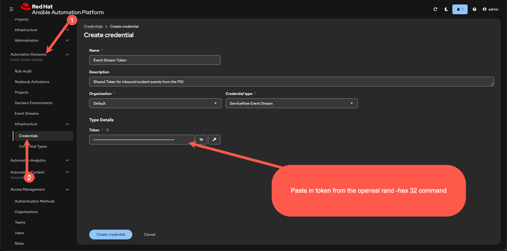

_ServiceNow Event Stream credential — auth type token, header key Authorization_

### 2.11 Create the Event Stream

**Automation Decisions → Event Streams → Create event stream**

- **Name:** `sn-<team>` — this exact string arrives as `event.meta.eda_event_stream_name` and is
  what the rulebook's condition tests. Getting it wrong means the rule never fires.
- **Organization:** `<Team>`
- **Event stream type:** ServiceNow
- **Credential:** `<Team> Event Stream Token`
- **Forward events to rulebook activation:** ✅ **tick this.** The event stream only shows up
  on the activation's mapping page (2.12) when forwarding is enabled.
- **Additional data headers:** leave **empty**

> ⚠️ **Never forward the `Authorization` header.** Adding it to `additional_data_headers` copies
> the stream token into `meta.headers`, the job's `extra_vars`, and the AAP database in cleartext.

> **Two testing modes, and they are mutually exclusive:**
>
> - Forwarding **on** (what you want): events go straight to the rulebook activation. They are
>   **not** stored on the stream's Events tab — you read the activation log instead.
> - Forwarding **off**: events are stored on the Events tab so you can inspect the exact JSON,
>   but no rulebook runs and no job launches.
>
> Start with forwarding **on**. Only turn it off if you need to see a raw payload that you
> cannot explain from the activation log.

Copy the generated URL. It looks like:

```
https://<your-aap-host>/eda-event-streams/api/eda/v1/external_event_stream/<uuid>/post/
```

That `<uuid>` goes into the team's route-table row. It is **regenerated** if you rebuild the event
stream or move it between organizations — **PATCH** the org rather than recreating the stream, or
every route row referencing it goes stale.

<!-- SCREENSHOT: 91-aap-two-event-streams.png - both streams with per-team orgs, UUID column cropped -->
_Screenshot pending: both event streams. **Crop the UUID column — this repo is public.**_

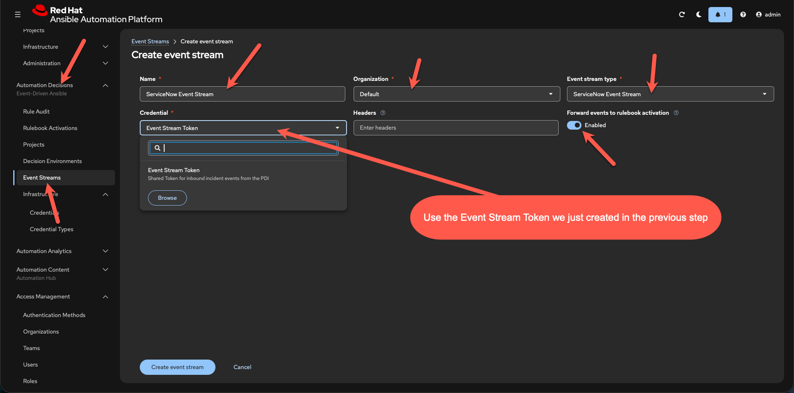

_Event stream definition — single-team capture_

### 2.12 Create the Rulebook Activation

**Automation Decisions → Rulebook Activations → Create rulebook activation**

**Page 1 — details:**

| Field | Value |
|---|---|
| Name | `<team>-incidents` |
| Organization | `<Team>` |
| Project | `Ansible EDA Test - <Team>` |
| Rulebook | `team_<x>_rulebook.yml` — **pick the right one; the list shows all four** |
| Credential | `<Team> AAP Controller` |
| Decision environment | `DE Supported RHEL9 - <Team>` |
| Restart policy | On failure |
| Log level | **Debug** while setting up; drop to Info later |
| Skip audit events | leave unchecked so you can see matches |

**Page 2 — event streams.** This is the important page. Click the gear icon, then map:

- **Left (rulebook source):** `ansible.eda.webhook`
- **Right (event stream):** `sn-<team>`

Save the mapping. This **replaces** the webhook listener with the server-side stream. Your
rules and conditions are unchanged. The `ansible.eda.webhook` source in the rulebook is a
placeholder that is never actually bound — see the header comment in either team rulebook.

You can confirm it worked in the activation log — it will load
`eda.builtin.pg_listener` instead of `ansible.eda.webhook`:

```
ansible_rulebook.engine - INFO - load source eda.builtin.pg_listener
```

**Page 3 — review.** Ensure *Enable rulebook activation* is ticked, then Create.

The activation should reach **Running**, and its log should end with `Waiting for events` naming
that team's ruleset.

<!-- SCREENSHOT: 92-aap-two-activations.png - both activations running, each mapped to its own stream -->
_Screenshot pending: both activations running._

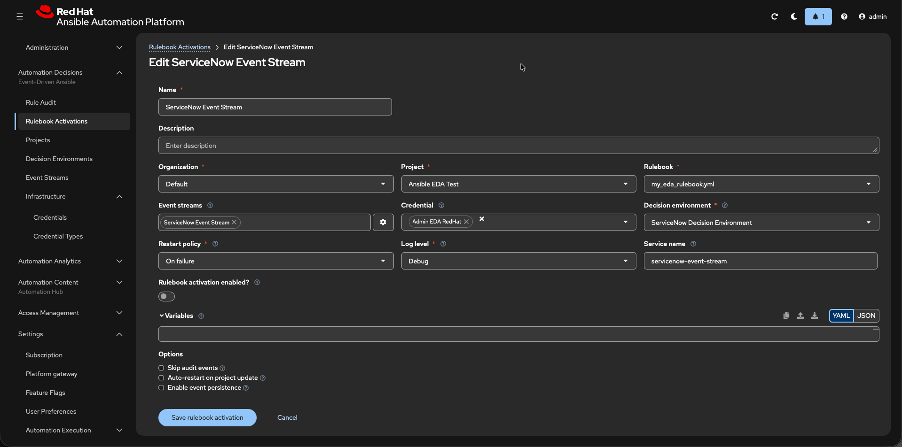

_The activation form. The gear icon beside **Event streams** is where you map the stream onto the
rulebook's `ansible.eda.webhook` source._

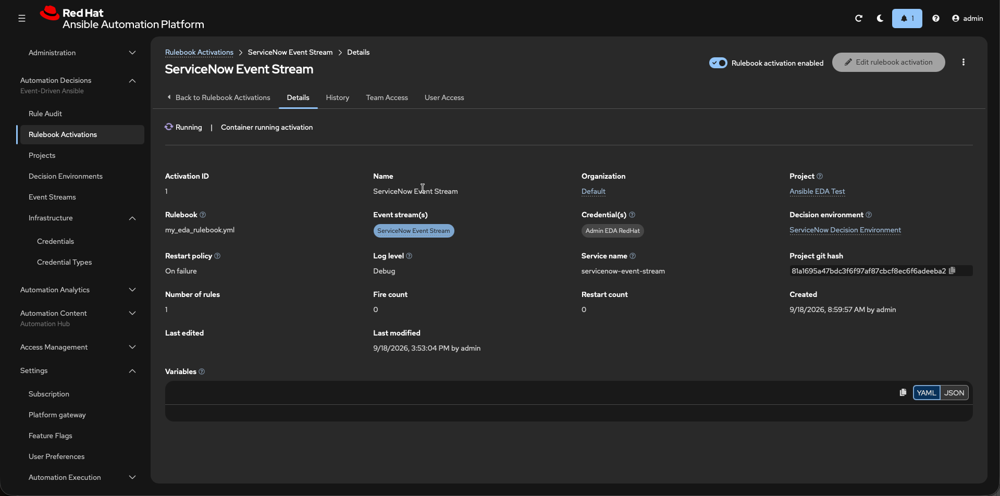

_Activation details once it is running: `Running | Container running activation`, with the
rulebook, event stream, credential, decision environment and project git hash all shown._

### 2.13 The change cycle for any rulebook edit

Editing a rulebook changes the Git SHA the source mapping is pinned to. Every edit needs all four
steps, in this order, or the activation keeps running the old commit and it looks like your change
did nothing:

1. **Push** the rulebook change.
2. **Sync** that team's EDA project.
3. **Re-attach** the event stream to the rulebook (Page 2 above).
4. **Restart** the activation.

---

## Part 3 — ServiceNow setup

> 📌 **Before you write the Script step in 3.2, read
> [Part 4 — The payload contract](#part-4--the-payload-contract-read-this).** It defines the
> exact JSON shape EDA needs. Getting it wrong is the failure mode that produces a successful
> `200` and no automation.
> Make sure to grant the Admin account the following roles `snc_basic_auth_api_access` and `snc_basic_auth_api_access`.
> Otherwise, you will get 401 errors.

### 3.0 Create the scoped application — do this first

**Build none of this in Global.** Everything in Part 3 — the alias, the connection, the
credential, the action, the flow, and the route table — belongs inside a scoped application.

**System Applications → Studio → Create application** (or App Engine Studio). Name it, and let
ServiceNow generate the scope prefix — this repo's is `James EDA Test` / `x_661661_james_tes`.

**Then set the application picker to it before you create anything else.** The picker decides which
scope each new record lands in. Records created in the wrong scope cannot be moved; they have to be
recreated.

**Why scoped rather than Global:**

- Everything you build is **one promotable unit** — an app version or a single update set — instead
  of records scattered across Global
- Its own roles and ACLs, so least privilege is actually achievable
- No collisions with out-of-box artifacts or another team's work
- Cleaner naming: the scope **auto-prepends** to properties, events, and roles, so you do not add a
  `(CNC)` or `cnc.` prefix. That convention is for Global only — adding both yields
  `x_661661_james_tes.cnc.eda.debug`, which matches no convention

**Four traps, all of which fail quietly:**

| Trap | What you see |
|---|---|
| Creating a table auto-creates a role that **nobody holds**, and its ACLs have `admin_overrides = true` | Works perfectly while you test as admin. For anyone else the lookup returns **zero rows with no error** — routing just stops. Fix: run the flow as **System user**, or grant the role to a group |
| Flow Designer's table picker filters by **current scope** | Your table is missing from the picker when the session is Global. Search by **label** (`EDA Team Route`), not internal name |
| A scoped script touching a global table needs a `sys_scope_privilege` record | Runtime failure that reads like a code bug. This build needs **read** on `incident`, `em_alert`, and `sys_user_group` — see [§7 of the routing guide](docs/servicenow-dynamic-team-routing.md) |
| Scoped flow and action components are **invisible to cross-scope Table API queries** | Verified 2026-09-29: `sys_hub_action_instance` returns 0 rows for this scope while returning rows for others. It is not a permission error and not a bad field name. Inspect step definitions in the UI or via execution details, not the API |

> **If you promote this pattern to a Centene instance**, additional governance applies that does
> not apply to a PDI: apps must be built in App Engine Studio / AEMC, the ACL set must include a
> dedicated **app admin** role (so platform admins alone cannot reach the data), a data-retention
> plan with **archive and destroy rules** is required at project start, attachments are not
> permitted, and notifications must use an app-specific email template rather than the BTS or
> Request Central default. Records with trackable states should extend **Task**. Source:
> KB0025878, *Scoped App Best Practices*.

### 3.1 Create the Connection & Credential Alias (how the token is sent)

> **Scope check:** the application picker must show your scoped app, not Global, before you create
> the alias. One alias, connection, and credential **per team** — see §2.9 for why each team needs
> its own token.

This is the supported way to send `Authorization: Bearer <token>` and it requires **no
script**.

> ⚠️ **Do not use a `password2` system property with `GlideEncrypter`.** On current
> ServiceNow releases `GlideEncrypter` is deprecated and **returns null** (TripleDES removal,
> KB1320986), so a `password2` value cannot be read back in script at all — and anything
> already stored in one is unrecoverable ciphertext. Use the alias below.

**Step 1 — Connection & Credential Alias**

All → Connections & Credentials → Connection & Credential Aliases → New

- **Name:** `EDA Event Stream`
- **Type:** Connection and Credential

**Step 2 — HTTP(s) Connection**

From the alias, create a new HTTP(s) Connection:

- **Name:** `EDA Event Stream Connection`
- **Connection URL:** `https://<your-aap-host>`
- **Credential:** the credential from Step 3

**Step 3 — Credential**

Create a credential of type **API Key**:

| Field | Value |
|---|---|
| API Key Header | `Authorization` |
| API Key | `Bearer <token>` — the token from 2.4, with the literal prefix |

> ⚠️ **The `Bearer ` prefix goes inside the API Key value.** There is no separate prefix or
> scheme field. If you store only the bare token you get `Authorization: <token>` and EDA
> rejects it with a token mismatch. It must be a capital **B** and exactly **one space**.

**Step 4** — in your Action's REST step, select this alias. Done. The token never appears in
a script, a step output, or a flow execution log.


_Connection & Credential Alias_


_HTTP(s) Connection pointing at the AAP host_


_API Key credential — header Authorization, value 'Bearer <token>'_


### 3.2 Create the Action

All → Process Automation → Flow Designer (or Workflow Studio) → New → Action

> **Scope check:** set the Workflow Studio application to your scoped app first. One action serves
> every team — the team-specific values arrive as the four inputs below.

**Action inputs:**

| Label | Name | Type | Mandatory |
|---|---|---|---|
| Incident Record | `incident_record` | Reference → Incident | false |
| Team Code | `team_code` | String | false |
| Event Stream UUID | `event_stream_uuid` | String | false |
| Connection Alias | `connection_alias` | Connection & Credential Aliases | false |

The last three exist so the flow can pick the team at run time instead of hardcoding one
endpoint per flow. See [Dynamic team routing](docs/servicenow-dynamic-team-routing.md).

> ⚠️ **Input names are case-sensitive in scripts.** If the input is created as
> `Incident_record`, then `inputs.incident_record` is `undefined` and the script throws
> "Invalid or missing incident record". The script below tolerates either spelling.
>
> **This applies to every script step's own input variables too, and they are a separate
> layer.** An action input is not visible to `inputs.*` inside a step — the step must declare
> its own variable *and* have the action's pill mapped into it. Two independent wiring actions;
> miss either and the value is silently `undefined`. Strict mode does not catch it, because
> reading a missing property is not an error.
>
> Two failures from this on 2026-09-29, both silent: step 3 declared `StatusCode`/`ResponseBody`
> while the script read `inputs.status_code`/`inputs.response_body`, producing `success = false`
> and the error string `HTTP :` on a genuine HTTP 200; and step 1 never declared `team_code` at
> all, so every payload shipped with `target_team` empty. **An error message with empty
> interpolation holes, or an output blank while its source input is visibly populated in
> execution details, means a name mismatch — not an endpoint problem.**

> ⚠️ **Feed the REST step's Connection Alias the bare reference pill.** Do not dot-walk it to
> `→ Sys ID`. The dot-walked form fails with `Unable to load connection with alias ID:` followed
> by the alias's *scoped name*, which reads like the connection record is missing and sends you
> auditing `sys_alias` records that are fine.

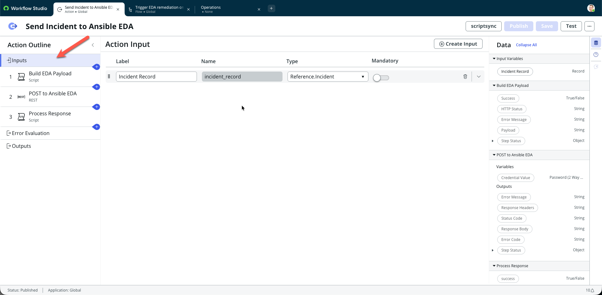

_Action inputs — Incident Record_

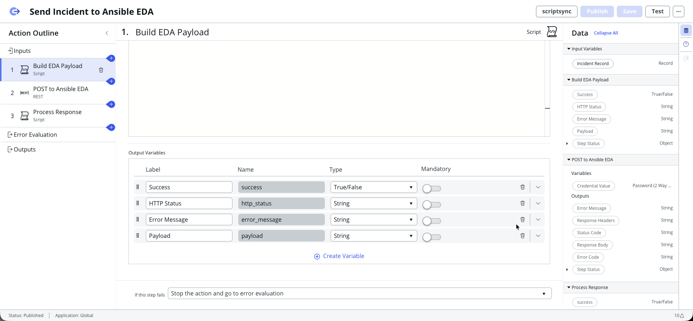

_Script step output variables (must be declared)_

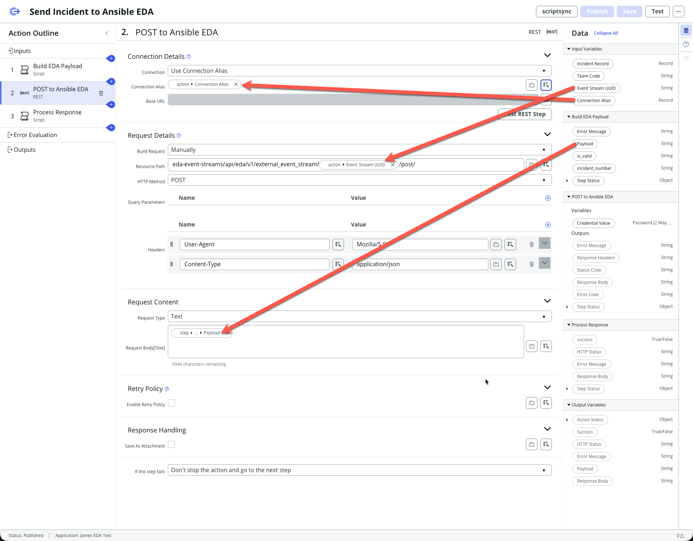

_REST step using the connection alias_

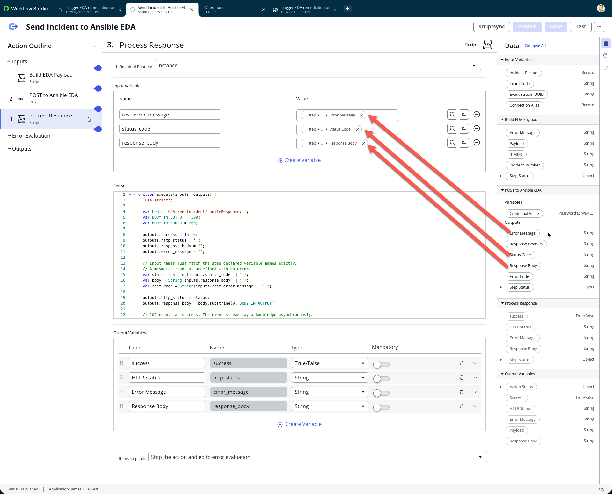

_Result script step output variables_

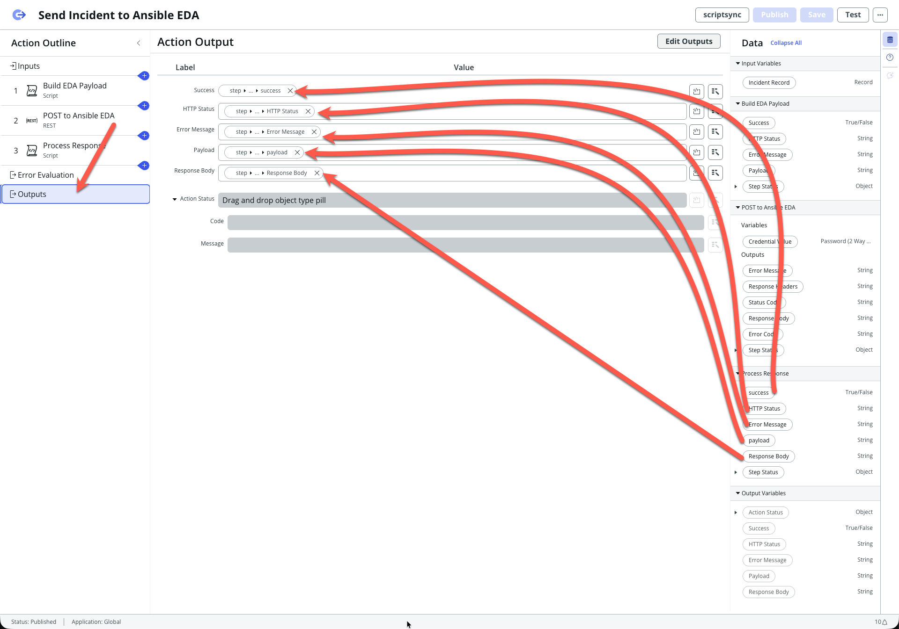

_Action outputs mapped from step pills_


The action has three steps plus error evaluation. Names used here match the working
implementation:

| # | Step | Type |
|---|---|---|
| 1 | Build EDA Payload | Script |
| 2 | POST to Ansible EDA | REST |
| 3 | Process Response | Script |

#### Step 1 — Script step: "Build EDA Payload"

**Input variables** — one row:

| Name | Value |
|---|---|
| `Incident_record` | drag `Action → Incident Record` from the Data panel on the right |

Set **If this step fails** to *Stop the action and go to error evaluation*.

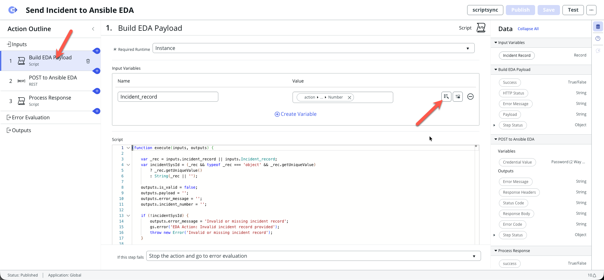

_Step 1 input variables. The name here is `Incident_record` with a capital I — which is why
the script reads both spellings._

**Output variables** (these must be **declared**, or `outputs.x` silently evaporates):

| Label | Name | Type |
|---|---|---|
| Payload | `payload` | String |
| Is Valid | `is_valid` | True/False |
| Success | `success` | True/False |
| Incident Number | `incident_number` | String |
| Error Message | `error_message` | String |

**Script:**

```javascript
(function execute(inputs, outputs) {

    var _rec = inputs.incident_record || inputs.Incident_record;
    var incidentSysId = (_rec && typeof _rec === 'object' && _rec.getUniqueValue)
        ? _rec.getUniqueValue()
        : String(_rec || '');

    outputs.is_valid = false;
    outputs.payload = '';
    outputs.error_message = '';
    outputs.incident_number = '';

    if (!incidentSysId) {
        outputs.error_message = 'Invalid or missing incident record';
        gs.error('EDA Action: Invalid incident record provided');
        throw new Error('Invalid or missing incident record');
    }

    var incident = new GlideRecord('incident');
    if (!incident.get(incidentSysId)) {
        outputs.error_message = 'Could not find incident with sys_id: ' + incidentSysId;
        gs.error('EDA Action: Incident not found: ' + incidentSysId);
        throw new Error('Could not find incident with sys_id: ' + incidentSysId);
    }

    outputs.incident_number = incident.number.toString();

    function cleanFieldValue(fieldValue) {
        if (!fieldValue) return '';
        var cleaned = String(fieldValue);
        cleaned = cleaned
            .replace(/\r\n/g, ' ')
            .replace(/[\n\r\t]/g, ' ')
            .replace(/\\/g, '/')
            .replace(/\s+/g, ' ')
            .trim();
        return cleaned;
    }

    function getFieldValue(field) {
        return cleanFieldValue(field ? field.getDisplayValue() : '');
    }

    // Enrich from Event Management alert, when the incident originated from one
    var emAlert = null;
    var originTable = incident.origin_table ? incident.origin_table.getValue() : '';
    var originId = incident.origin_id ? incident.origin_id.getValue() : '';

    if (originTable == 'em_alert' && originId) {
        var alertGr = new GlideRecord('em_alert');
        if (alertGr.get(originId)) {
            emAlert = alertGr;
        } else {
            gs.warn('EDA Action: Origin is em_alert but alert not found: ' + originId);
        }
    }

    // FLAT payload with event_type at the top level — see Part 4
    var payload = {
        event_type: 'incident_created',
        incident_number: getFieldValue(incident.number),
        caller: getFieldValue(incident.caller_id),
        requester: getFieldValue(incident.u_requester),
        contact_type: getFieldValue(incident.contact_type),
        short_description: getFieldValue(incident.short_description),
        description: getFieldValue(incident.description),
        priority: getFieldValue(incident.priority),
        cmdb_ci: getFieldValue(incident.cmdb_ci),
        sys_id: cleanFieldValue(incident.sys_id ? incident.sys_id.getValue() : ''),
        origin_table: cleanFieldValue(originTable),
        origin_id: cleanFieldValue(originId),
        business_service: getFieldValue(incident.business_service),
        service_offering: getFieldValue(incident.service_offering),
        application_service: getFieldValue(incident.u_application_service),
        state: getFieldValue(incident.state),
        assigned_to: getFieldValue(incident.assigned_to),
        assignment_group: getFieldValue(incident.assignment_group),
        category: getFieldValue(incident.category),
        urgency: getFieldValue(incident.urgency),
        impact: getFieldValue(incident.impact),
        root_cause: getFieldValue(incident.u_root_cause),
        event_issue: getFieldValue(incident.u_event_issue),
        event_id: getFieldValue(incident.u_event_id),
        em_alert_node: emAlert ? getFieldValue(emAlert.node) : '',
        em_metric_name: emAlert ? getFieldValue(emAlert.metric_name) : '',
        em_resource: emAlert ? getFieldValue(emAlert.resource) : '',
        em_type: emAlert ? getFieldValue(emAlert.type) : ''
    };

    outputs.payload = JSON.stringify(payload);
    outputs.is_valid = true;
    outputs.success = true;

})(inputs, outputs);
```

#### Step 2 — REST step: "POST to Ansible EDA"

| Field | Value |
|---|---|
| Connection | **Use Connection Alias** → `EDA Event Stream` |
| Resource path | `/eda-event-streams/api/eda/v1/external_event_stream/<uuid>/post/` |
| HTTP method | POST |
| Header | `Content-Type: application/json` |
| Request body | the `payload` pill from Step 1 |

The `Authorization` header comes from the alias — do not add it by hand.

#### Step 3 — Script step: "Process Response"

**Canonical script: [`docs/scripts/step3_process_response.js`](docs/scripts/step3_process_response.js).**
Paste from that file, not from a rendered page — copying out of Markdown can convert straight
quotes to curly ones, which leaves an unterminated string and reports as `')' expected`.

It declares **three** input variables, all lowercase:

| Variable name | Mapped from |
|---|---|
| `status_code` | Step 2 → Status Code |
| `response_body` | Step 2 → Response Body |
| `rest_error_message` | Step 2 → Error Message |

and **four** outputs: `success`, `http_status`, `response_body`, `error_message`. No `payload`
output on this step — the action's `payload` output must come from **Step 1**, which is the only
step that assigns it.

> ⚠️ **This replaced an earlier CamelCase version of this script** that read
> `inputs.StatusCode`, `inputs.ResponseBody`, `inputs.ErrorMessage`, `inputs.PayloadSuccess`,
> `inputs.PayloadErrorMessage`, and `inputs.Payload`. If your step still declares those
> CamelCase variables, the current script reads `undefined` from all of them and reports
> `success = false` with the error string `HTTP :` even on a genuine HTTP 200. Rename the
> variables; do not rename the script.
>
> The dropped `PayloadSuccess` passthrough is no longer needed: Step 1 **throws** on bad input,
> which errors the action, so Step 3 never runs with an invalid payload. If you change Step 1 to
> `return` instead of `throw`, restore that gate.

> ⚠️ If this step reports a failure while the REST step returned 200, the culprit is almost
> always a flag it reads that was never **declared** as an output variable. Undeclared
> outputs vanish without error.

**Action outputs** — map these from the step pills: `success`, `http_status`,
`error_message`, `incident_number`.

**Save → Publish.** A flow uses the **last published** version. If you only Save, your
change has no effect and you will re-test the old behaviour.

### 3.3 Create the Flow

All → Process Automation → Flow Designer → New → Flow

> **Scope check:** the flow must be in the same scoped app as the action and the route table, or the
> table will not appear in the Look Up Record step's picker. Also set **Flow properties → Run as:
> System user** — with `run_as: user` a non-admin caller silently reads zero rows from the scoped
> route table (§3.0).
>
> One flow serves every team. It looks up the team's row and passes the values to the action — see
> [Dynamic team routing](docs/servicenow-dynamic-team-routing.md).

**Trigger:** Created → Incident

Add a condition so you don't fire on every incident. Either works:

- `Caller` is `Event Management` (useful with Event Management demo data)
- `Priority` is one of `1 - Critical`, `2 - High`

**Actions** — the working flow has five steps plus an error handler:

| # | Step | Detail |
|---|---|---|
| 1 | **Action:** `Send Incident to Ansible EDA` | Input: drag `Trigger → Incident Record` into `Incident Record` |
| 2 | **Flow Logic → If** `Successful` | Drag the action's `Success` pill, condition `is true` |
| 3 | **then → Update Incident Record** | Record: `Trigger → Incident Record`, Table: Incident. Work notes: success message with the `HTTP Status` pill. State: `In Progress` |
| 4 | **Flow Logic → End Flow** | Sits inside the `then` branch, so a success run stops here |
| 5 | **Update Incident Record** | Reached only when the If was false. Work notes: failure message with the `Error Message` and `HTTP Status` pills |
| 6 | **Error Handler → Update Incident Record** | Runs on an unexpected flow error. Work notes: a generic "contact the automation team" message |

There is no explicit `Else`. Step 4's **End Flow** inside the `then` branch is what makes
step 5 behave as the failure path — a successful run never reaches it.

Optional: add **Log** steps (Info on success, Error on failure) if you want the outcome in
the system log as well as the work notes.

**Save → Activate.**

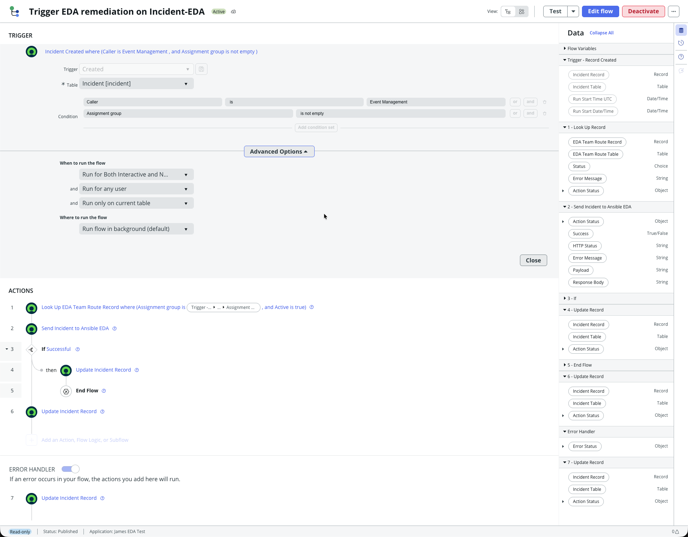

_Flow trigger — Created on Incident with a condition_

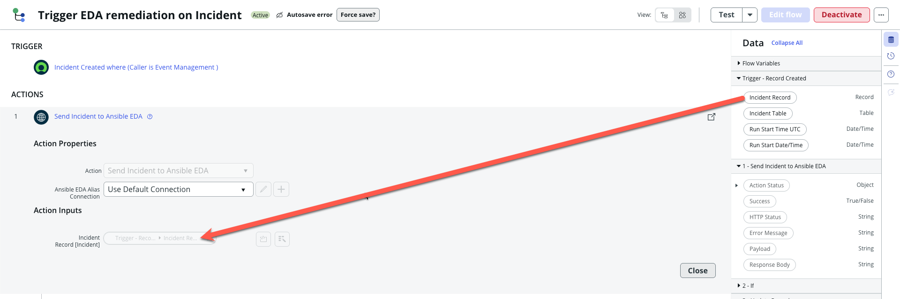

_Action step with the Incident Record dragged in_

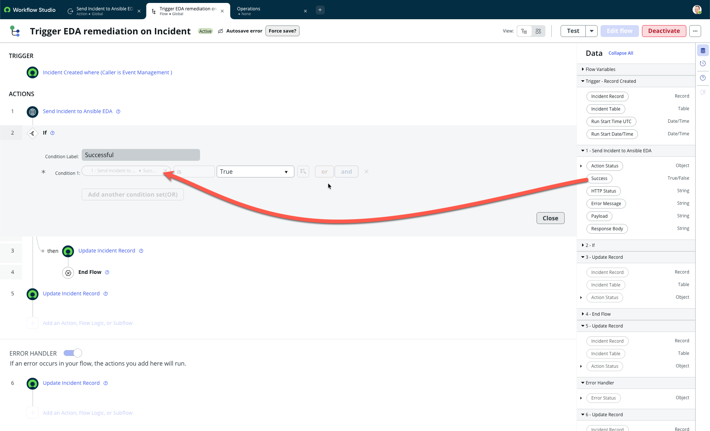

_If condition on the action's Success output_

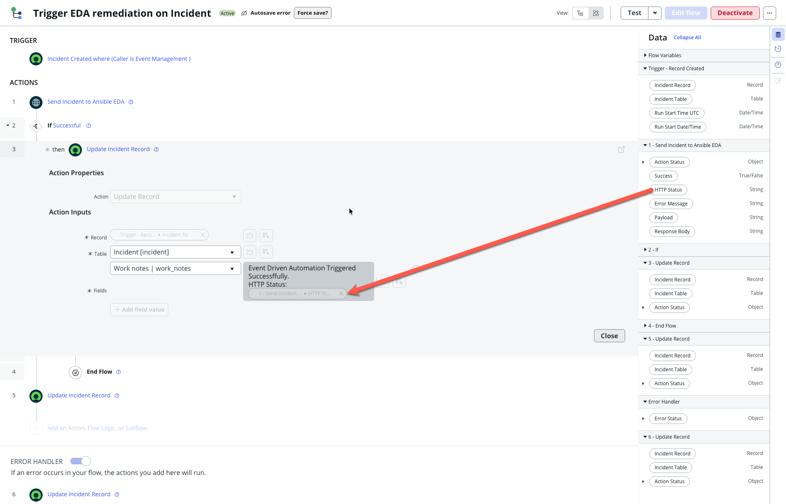

_Then → Update Record with work notes_


_Log step, Info level_

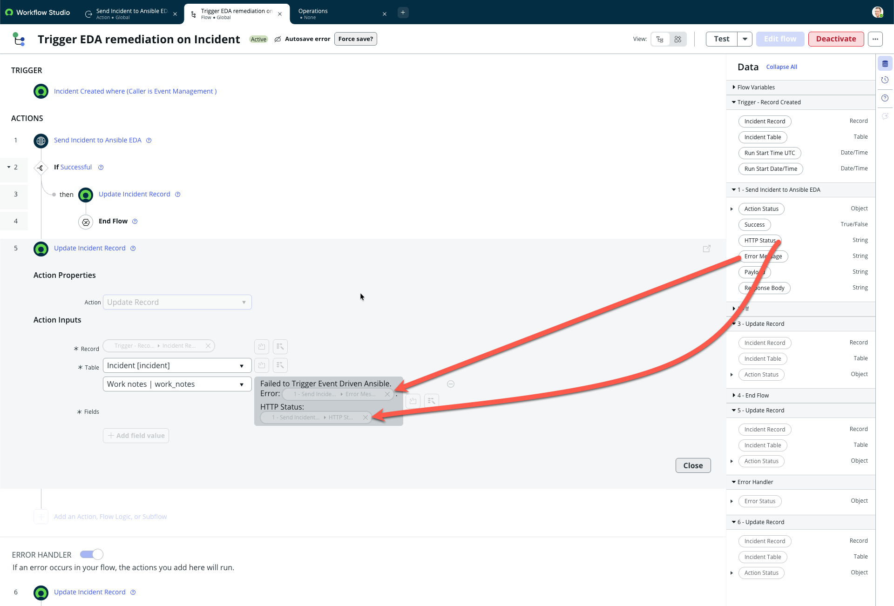

_Else branch — update record and log the error_

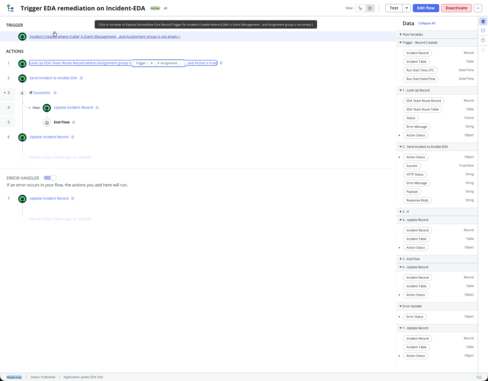

_The complete flow, with the Error Handler expanded at the bottom._


---

## Part 4 — The payload contract (read this)

Three layers each want a different shape. Getting one wrong produces silence, not an error.

| Layer | What it consumes | Who builds it |
|---|---|---|
| ServiceNow → event stream | **flat** JSON, any keys you like | your Script step |
| rulebook → controller | `extra_vars` inside `job_args` | **the rulebook** |
| playbook tasks | bare vars: `{{ incident_number }}` | the job's extra vars |

### Correct — flat, with `event_type`

```json
{
  "event_type": "incident_created",
  "incident_number": "INC0010004",
  "short_description": "Interface down",
  "priority": "2 - High",
  "cmdb_ci": "unix201",
  "state": "New",
  "assigned_to": "ITIL User",
  "category": "Hardware",
  "sys_id": "3214aa5bc353cf10b08b9b377d01314b"
}
```

### Wrong for EDA — nested, no `event_type`

```json
{ "extra_vars": { "incident_number": "INC0010004", "...": "..." } }
```

With the nested version, `event.payload.event_type` does not exist, the condition is never
true, and the activation log shows:

```
Event { ... } didn't match any rule and has been immediately discarded
```

**Minimum required keys** for `my_eda_rulebook.yml`: `event_type` plus `incident_number`,
`short_description`, `priority`, `cmdb_ci`, `state`, `assigned_to`, `category`, `sys_id`.
Omitting any mapped key causes the `StrictUndefined` failure described in Part 6.

`team_a_rulebook.yml` and `team_b_rulebook.yml` map the same eight incident fields into
`extra_vars`, plus three of the four reserved routing keys below — `event_version`, `source`,
and `target_team`. `event_type` is not re-mapped into `extra_vars`; it is already consumed in
the rule's `condition` (see Migration, below). Both rulebooks also pass through
`event.meta.eda_event_stream_name` as `source_stream`, for audit and debugging.

### The four reserved routing keys

These are not ServiceNow fields. They exist only to let a rulebook decide *whether to act*,
before the playbook ever sees the payload.

> **Which producers this applies to.** The four keys are the contract for the **multi-tenant**
> build — the Team A / Team B streams in [Part 8](#part-8--multi-organization-event-stream-topology).
> Set all four on every event sent to those streams.
>
> The single-team reference script in [3.2](#32-create-the-action) predates this contract and
> deliberately sends only `event_type` (the flat `incident_created` form that
> `my_eda_rulebook.yml` matches). That is **not** a defect: with exactly one stream and one
> consumer there is no tenant to discriminate, no second sender to distinguish, and no second
> payload version to pin. Leaving it alone also keeps the original single-org walkthrough
> working end to end.
>
> Adopt all four the moment *either* becomes true: a second activation is attached to a stream,
> or a second sender posts to one. Both are the point at which an unrouted event can launch
> someone else's automation.

| Key | Example | Why it exists |
|---|---|---|
| `event_type` | `"servicenow.incident.created"` | Hierarchical dotted string. This is what a rule's `condition` matches on to decide *which* automation family an event belongs to. |
| `event_version` | `1` | Integer, currently always `1`. Lets a rulebook pin its condition and its `extra_vars` mapping to a known payload shape, so a future reshape of the payload doesn't silently start matching (or silently stop matching) an old rule. |
| `source` | `"pdi"` | Distinguishes a dev-origin send from a prod-origin send. On a stream shared by more than one sender, this is the only thing standing between a PDI test event and a job template that touches production. |
| `target_team` | `"team_a"` | Tenant discriminator for a **shared** stream. `event.meta.eda_event_stream_name` (below) is the strong check — but on a stream two teams both point at, that value is identical for every event regardless of which team it's for, so it can't tell Team A's event from Team B's. `target_team` is the payload-level field that still can. |

### Migration: flat `incident_created` → hierarchical `servicenow.incident.created`

This repo used to standardize on a flat, undotted `event_type` string —
`my_eda_rulebook.yml` still does:

```yaml
condition: event.payload.event_type == "incident_created"
```

`team_a_rulebook.yml` and `team_b_rulebook.yml` use the hierarchical form instead:

```yaml
condition: >-
  event.meta.eda_event_stream_name == "sn-team-a" and
  event.payload.event_type == "servicenow.incident.created"
```

Nothing in EDA enforces one form or the other — `event_type` is just a string, and `==` is a
literal string comparison. What breaks is *mixing* them on one payload without updating every
rule that reads it: if your Script step starts emitting `servicenow.incident.created` but a
rule you haven't touched still checks for the old flat `incident_created`, the condition is
never true again. There is no warning. The activation log shows the exact same discard message
as a shape mismatch:

```
Event { ... } didn't match any rule and has been immediately discarded
```

When you change the `event_type` string a producer sends, grep every rulebook this repo ships
for the old string before you ship the change, not after.

### Ordering rule: set the reserved keys last

If you build a payload by looping over a variable set of fields — copying extra columns off a
GlideRecord, merging in caller-supplied `extra_data`, anything data-driven rather than a fixed
object literal — set the four reserved keys **after** that loop runs, not before:

```javascript
var payload = {};

// Loop that copies in a variable set of fields FIRST.
for (var key in extraFields) {
    payload[key] = extraFields[key];
}

// Reserved routing keys set LAST. Nothing above this line can overwrite them.
payload.event_type = 'servicenow.incident.created';
payload.event_version = 1;
payload.source = 'pdi';
payload.target_team = 'team_a';
```

If the loop ran second, a source system that happens to have its own column called `source` or
`target_team` would silently overwrite your routing key with whatever it put there, and the
rule would misroute or not fire — with nothing in the log to say why. The Script step in Part
3.2 currently builds `payload` as a single flat object literal with no such loop, so this
doesn't bite today. It will the first time anyone adds one.

### The stronger check: `event.meta.eda_event_stream_name`

`event.meta.eda_event_stream_name` and `event.meta.endpoint` are injected by the platform
itself, after the payload leaves your Script step. A sender cannot set or forge them — there is
no field in the outbound JSON that lands there. That makes `event.meta.eda_event_stream_name`
strictly stronger than any payload field for telling activations apart, and it should be the
**primary** condition, with `event_type` narrowing it further within that stream:

```yaml
condition: >-
  event.meta.eda_event_stream_name == "sn-team-a" and
  event.payload.event_type == "servicenow.incident.created"
```

This is exactly what `team_a_rulebook.yml` and `team_b_rulebook.yml` do today, one dedicated
stream per team (`sn-team-a`, `sn-team-b`). `target_team` isn't load-bearing in that condition —
it's just carried into `extra_vars` for audit and debugging. It only becomes load-bearing the
day two team activations get mapped to the *same* stream: at that point
`event.meta.eda_event_stream_name` is identical on every event regardless of which team it's
for, and `target_team` is the only field left that can tell them apart. That's what
`catchall_debug_rulebook.yml` and Experiment 4 exist to prove out before it's load-bearing
anywhere real.

### Headers: omitted unless listed, `Authorization` is always redacted

HTTP headers from the inbound POST are **not** part of `event.payload` and are not exposed to
the rulebook at all by default. A header only becomes visible if it is explicitly listed on the
event stream's own configuration — and even then, `Authorization` is always redacted, no
exception, no override. Never write a condition or an `extra_vars` mapping that reads
`Authorization` off the event; it will not contain the token, in test mode or forwarding mode,
regardless of what you configure.

### `default('')` on every mapped field, or `StrictUndefined`

Every `extra_vars` mapping in `team_a_rulebook.yml` and `team_b_rulebook.yml` carries a
`| default('')`:

```yaml
incident_number: "{{ event.payload.incident_number | default('') }}"
```

Drop the filter on any one line and the day ServiceNow sends an event missing that field, the
whole action — not just that one variable — fails to serialize, and **no job is launched**:

```
Object of type StrictUndefined is not JSON serializable
```

There's no partial launch and no fallback: one undefined Jinja value anywhere in
`job_args.extra_vars` poisons the entire launch request. Add `| default('')` to every mapped
field, including the four reserved keys, not just the ones you expect ServiceNow to omit.

---

## Part 5 — Testing end to end

Test each hop separately. When something breaks you will know exactly which one.

### 5.1 Test the event stream and token (no ServiceNow involved)

```bash
curl -sk -X POST -w '\nHTTP:%{http_code}\n' \
  -H 'Content-Type: application/json' \
  -H 'Authorization: Bearer YOUR_TOKEN' \
  'https://<your-aap-host>/eda-event-streams/api/eda/v1/external_event_stream/<uuid>/post/' \
  -d '{"event_type":"incident_created","incident_number":"CURLTEST","short_description":"test","priority":"3","cmdb_ci":"host01","state":"New","assigned_to":"admin","category":"Inquiry","sys_id":"0000test"}'
```

| Result | Meaning |
|---|---|
| `200` | token and URL are correct |
| `400 Authorization header is missing` | no header sent |
| `403` | token mismatch — wrong value, or missing/malformed `Bearer ` prefix |
| `404` | wrong URL |

Send **all** the fields the rulebook maps. A minimal two-field payload matches the rule and
then fails at launch with `StrictUndefined`.

### 5.2 Test the job template on its own

**Automation Execution → Templates → ServiceNow Incident Handler → Launch**, and supply
extra vars manually:

```yaml
incident_number: SMOKETEST0001
short_description: disk space check
priority: "3"
cmdb_ci: none
state: New
assigned_to: admin
category: Inquiry
sys_id: 0000000000000000000000000000test
```

Expect the debug tasks to print your values. The ServiceNow write-back will fail with a fake
`sys_id` — that is fine and proves nothing is written to your PDI.

### 5.3 Test the full chain

Create an incident in ServiceNow matching your trigger, then check in order:

1. **ServiceNow:** Flow Designer → Executions → your run. The REST step should be `200`.
2. **AAP activation log:** Automation Decisions → Rulebook Activations → your activation →
   History → the running instance. With Log level Debug you will see the exact JSON received,
   logged as `received event {...}`. (If forwarding is off instead, look at the stream's
   Events tab — but then no job will launch.)
3. **Activation log:** should show `run_job_template` and `Job Launched, url: /api/controller/v2/jobs/<n>/`
4. **Controller:** the job appears, with `extra_vars` populated and an `ansible_eda` block
   recording the ruleset, rule, and event uuid.


### Reading the activation counters

The activation's log emits periodic `SessionStats`:

| Counter | Meaning |
|---|---|
| `eventsProcessed` | events the rule engine received |
| `eventsMatched` | events that satisfied a condition |
| `eventsSuppressed` | events discarded with no matching rule |
| `rulesTriggered` | actions actually fired |

`eventsProcessed: 0` after a successful post means the event never reached the rulebook —
check the event stream mapping on the activation. `eventsProcessed` rising while
`rulesTriggered` stays 0 means your payload doesn't match the condition — a payload shape
problem.

---

## Part 6 — Troubleshooting

### EDA project stuck at "Pending", then "Task was stuck in pending state"

Your project config is not the problem. The worker pod that performs the git clone is being
killed for exceeding its memory limit. Full diagnosis and fix:
[`aap-eda-project-sync-fix.md`](aap-eda-project-sync-fix.md).

Quick tells: the controller project syncs the same repo fine; `git_hash` is empty; the worker
pod shows `lastState.terminated.reason: OOMKilled`.

### `HTTP 503 "Project workers unavailable"` when syncing

Not a failure. AAP 2.7 checks worker health before queuing work, and you asked before the
worker finished starting. Wait for this line in the worker log, then retry:

```
dispatcherd.brokers.pg_notify  Set up pg_notify listening on channel 'default'
```

### Project syncs but no rulebooks appear

`import_error` will say *"This project contains no rulebooks."* Your rulebook is not in
`rulebooks/` or `extensions/eda/rulebooks/` at the repo root. It is not a recursive search.

### `403` / token mismatch from the event stream

- The `Bearer ` prefix is missing from the API Key value, has a lowercase `b`, or has two
  spaces
- The token in ServiceNow and the token in the AAP credential differ

> ⚠️ The event stream's `events_received` counter increments even for **rejected** requests.
> A rising counter is not proof of success — check the HTTP status.

### Event accepted but the rule never fires

Payload shape. See [Part 4](#part-4--the-payload-contract-read-this). Confirm with the
activation log:

```
Event { ... } didn't match any rule and has been immediately discarded
```

### `Object of type StrictUndefined is not JSON serializable`

The rule matched, but the payload is missing a field the rulebook's `job_args.extra_vars`
references, so the launch request can't be serialized. **No job is launched.** Either send
every mapped field, or add `| default('')` to each mapping in the rulebook.

### Job runs but variables are empty / undefined

**Prompt on launch** is not enabled on the job template. The controller discards extra vars
without it.

### Playbook fails with `401 "User is not authenticated"` from ServiceNow

The username/password in the controller's ServiceNow credential is wrong or stale. The
request reached the PDI, so URL and connectivity are fine.

### Playbook fails on undefined `SN_USERNAME` / `SN_PASSWORD`

You attached the **built-in** ServiceNow credential type, which injects environment
variables. This playbook needs the **custom** type from Part 1.1, which injects extra vars.

### `Invalid or missing incident record` in the ServiceNow Action

The action input's name case doesn't match what the script reads. `inputs.incident_record` vs
`inputs.Incident_record`. The script in 3.2 handles both.

### A step reports failure but the REST step returned 200

An output variable the downstream logic reads was never declared on the step. Undeclared
outputs silently vanish.

### `GlideEncrypter is deprecated and now returns null`

Expected on current releases. `password2` system properties cannot be decrypted in script
anymore, and existing values are unrecoverable. Use the Connection & Credential Alias in
Part 3.1.

### The AAP UI shows a "provisioning" screen and the API returns 503

The gateway pod is crash-looping, usually out of memory on a small install. Same class of
problem as the sync failure; see the CR patch in
[`aap-eda-project-sync-fix.md`](aap-eda-project-sync-fix.md).

---

## Part 7 — Token rotation and maintenance

### Rotating the event stream token

1. Generate a new value: `openssl rand -hex 32`
2. Update the **AAP** `Event Stream Token` credential first
3. Update the **ServiceNow** API Key credential to `Bearer <new-token>`

Posts between the two saves will fail with 403. Do it during a quiet window and verify
afterwards.

### After rebuilding the AAP instance

Nothing in AAP survives a rebuild. You must:

- Re-apply any resource-limit patches **before** creating the EDA project
- Re-create credentials, DE, project, event stream, and activation
- **Update the event stream URL in ServiceNow** — the `<uuid>` is new
- Re-create the event stream token on both sides
- Re-mint any Personal Access Token. On AAP 2.7 the endpoint is
  `/api/gateway/v1/tokens/`; `/api/controller/v2/tokens/` returns 404.

The ServiceNow side (action, flow, alias, credential) survives — only the URL and token
change.

---
## Part 8 — Multi-organization event stream topology

> Part 7 was already "Token rotation and maintenance," so this is **Part 8**, not Part 7.
>
> Verified against a Red Hat Developer Sandbox on **AAP 2.7**. Nothing here has been checked
> against 2.6 or 2.5. Where a claim depends on how EDA's Postgres listener or the event-stream
> mapping validator is implemented, treat it as version-sensitive and re-verify before you rely
> on it against a different build.

### 8.1 The question this section answers

Once a second team wants ServiceNow to trigger its own automation, you hit a design choice:

- **One shared event stream** that every team's activation maps to, or
- **One event stream per organization**, each with its own token and its own activation.

The answer hinges entirely on one fact you cannot see from the AAP UI: **does an event stream
deliver each inbound POST to every mapped activation, or to exactly one of them?** Those are
two different delivery models with opposite consequences for a shared stream:

| Model | One event POSTed to a stream mapped to 2 activations |
|---|---|
| Fan-out (broadcast) | Both activations receive it. Both can match and launch. |
| Queue (competing consumers) | Exactly one activation receives it. The other never sees it. |

If it's fan-out, a shared stream is a live footgun — every team's activation sees every other
team's events, and only your rule conditions stand between "Team A's incident" and "Team B's
job template gets launched too." If it's a queue, a shared stream is merely inconvenient
(you'd need routing logic anyway, and delivery could round-robin unpredictably). The rest of
this section explains why the answer is fan-out, why that pushes the design toward one stream
per organization, and where the honest limits of that conclusion are.

### 8.2 The evidence: this is fan-out (inference from upstream source, not a documented guarantee)

Red Hat's docs do not state the delivery semantics of an event stream mapped to multiple
activations anywhere. The following is inferred from reading the `ansible/eda-server` source,
not quoted from a Red Hat page:

- `Activation.event_streams` is a genuine `ManyToManyField` — nothing in the schema limits an
  event stream to one activation.
- Each event stream gets a Postgres `LISTEN/NOTIFY` channel named `eda_event_stream_<uuid>`,
  derived **only** from the stream's own UUID. No activation identity is folded into the
  channel name.
- An inbound POST to the stream's endpoint issues a single `NOTIFY` on that one channel.
- Every activation mapped to that stream opens a `LISTEN` on that same channel.
- `LISTEN/NOTIFY` in Postgres is a broadcast primitive: no queue, no acknowledgment, no
  consumer group, no row-claiming. Every listener on a channel gets every notification.

Put together: **N activations mapped to one stream = N independent listeners on the same
broadcast channel = N copies of every event = potentially N job launches from one ServiceNow
POST.** That is a fan-out model, not a queue.

This is inference, not proof by observation. **Experiment 4** exists specifically to confirm
it empirically on the shipped 2.7 build: `rulebooks/catchall_debug_rulebook.yml` is the
instrument — map the *same* catch-all rulebook onto both Team A's and Team B's activations,
both pointed at one shared stream, POST one event, and count how many activation logs show it.
Two logs confirms fan-out; one log would falsify it. That rulebook is a temporary test artifact
and is deleted once Experiment 4 is recorded — don't build on it staying in the repo.

Separately, an **offline** test run today (no AAP involved, using
`ansible.eda.generic`) confirmed a supporting fact: the source preserves a user-supplied `meta`
block on each payload item and merges the platform's own keys (`received_at`, `source`,
`uuid`) into it, rather than replacing it. That means `event.meta.eda_event_stream_name` can be
simulated locally, and the routing logic that depends on it — Team A's rulebook matching only
`sn-team-a`, Team B's matching only `sn-team-b` — is testable with no AAP at all. That test is
about the *discriminator logic* being correct; it is not the fan-out cardinality test.
Experiment 4 is still the one that answers 8.1.

### 8.3 Correction: Red Hat does not recommend one stream per organization

An earlier assumption in this project's notes was that Red Hat recommends one event stream per
organization. That is wrong, and worth stating plainly so it doesn't get repeated:

- Searching the event-routing chapters for AAP 2.5, 2.6, and 2.7 (the section is titled
  *simplified event routing*, not "event stream routing") turns up no such guidance.
  "Organization" appears there only as the name of a form field when you create a stream — not
  as part of any routing recommendation.
- What Red Hat *does* document is the opposite axis: a single event stream endpoint is meant
  to receive events from one source and then be usable across **multiple rulebooks** — i.e.
  Red Hat's own framing leans toward fewer endpoints, reused broadly, not one endpoint per
  tenant.

**One event stream per organization is this project's own design decision**, made because of
the fan-out finding in 8.2, the token-isolation reasoning in 8.5, and the org-scoping table in
8.4 — not because any vendor documentation says to do it. Present it that way if you write this
up anywhere else: "our decision, for these reasons," never "Red Hat's recommended pattern."

### 8.4 What has to be duplicated per organization, and what doesn't

| Object | Scope | Consequence for a second team |
|---|---|---|
| Credentials (ServiceNow PDI, AAP Controller, Event Stream Token, Registry) | Per organization | Team A and Team B each need their own copy, even where the values would be identical |
| Projects (both the controller "EDA ServiceNow" project and the EDA "Ansible EDA Test" project) | Per organization | Each org syncs its own project, independently, from the same or a different Git ref |
| Job templates | Per organization | `Team A Incident Handler` and `Team B Incident Handler` are separate objects, matched by name from `job_args`/`run_job_template` — see the `name:` field in `rulebooks/team_a_rulebook.yml` and `rulebooks/team_b_rulebook.yml` |
| Decision Environments | Per organization | Each org's activation references its own DE, even if it's the same container image |
| Event streams | Per organization | The core of this section — see 8.1–8.3 |
| Rulebook activations | Per organization | One activation pod per org, running that org's rulebook |
| **Credential types** (the custom `ServiceNow` type from Part 1.1) | **Global** | Defined once. Every org's ServiceNow credential is an *instance* of this one type. The `host` input / `SN_HOST` injector is part of the type definition in [Part 1.1](#11-create-the-custom-servicenow-credential-type), so you add it **once**, globally — you do not redefine the type per org, you just re-save each org's own credential instance afterward. |

Today, only the `Default` organization exists in this sandbox. `Team A` and `Team B` do not
exist as AAP organizations yet — but `rulebooks/team_a_rulebook.yml` and
`rulebooks/team_b_rulebook.yml` already reference `organization: "Team A"` /
`organization: "Team B"` and job templates named `Team A Incident Handler` /
`Team B Incident Handler` that don't exist yet either. That's expected: those rulebooks are
written for the multi-org state this section describes, ahead of the orgs being created. Until
the orgs, credentials, projects, job templates, DEs, and streams in the table above all exist,
activations built from those two rulebooks will fail to launch with a job-template-not-found
error, not a routing error.

### 8.5 Why each stream needs its own token

The event stream's bearer token lives on an **Automation Decisions credential**
(`ServiceNow Event Stream` type), and that credential is what the stream's endpoint checks on
every POST. If two streams — say, Team A's and Team B's — were built against the **same**
credential, they'd accept the **same** token. Anyone holding that token, or anyone who can
guess or discover the second stream's URL (the UUID in the path is not a secret in the way the
token is), can post to both endpoints. A compromised or leaked Team A token would double as a
valid credential for Team B's stream too.

Giving every stream its own credential and its own token means a leak is contained to exactly
one team's endpoint. It also makes token rotation (Part 7) a per-team operation instead of an
all-teams-at-once outage window.

### 8.6 The rulebook change cycle — do these in this exact order

Source mappings are pinned to a **SHA256 of the rulebook file**, computed at the time you
attach the event stream to the activation. Red Hat states plainly what happens if that hash
goes stale: *"If the rulebook is modified after the source mapping has been created and a
Restart happens, the rulebook activation fails."* The API's own error text for this is
**"Rulebook has changed since the sources were mapped. Please reattach event streams."**

That means **every** rulebook edit — not just a first-time setup — requires this full cycle,
per organization whose rulebook you touched:

1. Edit the rulebook file (e.g. `rulebooks/team_a_rulebook.yml`).
2. Commit the change.
3. Push to the branch the EDA project tracks.
4. **Sync the EDA project** in Automation Decisions. The activation reads the rulebook from
   the project's synced copy, not from your working tree or from GitHub directly.
5. **Re-attach the event stream source mapping** — the gear icon on the activation, same place
   as the original mapping in Part 2.7. This recomputes the SHA256 against the new file.
6. Restart the activation.

Skipping step 5 is the trap: steps 1–4 and 6 all succeed, the activation starts, and it fails
immediately with the "Rulebook has changed" error above — which reads like a sync problem, not
a "you forgot to re-click the gear icon" problem.

> This repo's own state right now is a live example of why step 4 matters and why it's easy to
> forget: the controller project **"EDA ServiceNow"** last synced at `798a684`, and the EDA
> project **"Ansible EDA Test"** last synced at `81a1695` — two *different* revisions of the
> same repo, because Automation Execution and Automation Decisions sync independently even
> though they point at the same Git URL. Worse, `origin/main` is currently at `de64871`, **11
> commits ahead** of the `81a1695` the EDA project has. Until the EDA project is resynced, its
> rulebook list — and the SHA256 any existing mapping is pinned to — is 11 commits stale. Don't
> assume a synced project reflects `main`; check its `git_hash` against `git log` before you
> debug a mapping failure as anything else.

### 8.7 The cost model: streams are cheap, activations are pods

- An event stream is a database row plus a Postgres `LISTEN/NOTIFY` channel. Creating ten of
  them costs you ten rows.
- A **rulebook activation**, if enabled, is an always-on pod running `ansible-rulebook` inside
  its Decision Environment image, for as long as it's enabled — not on demand.

That asymmetry is an argument for the topology in 8.4 as stated: put the isolation boundary on
the **stream**, which is nearly free to multiply, rather than on the activation, which is not.
One activation per organization is already the minimum the fan-out finding in 8.2 requires; the
mistake to avoid is adding *extra* activations (e.g. one per rulebook version, or one per test
scenario) when another stream would do.

There's a second reason to keep the activation count down on a small cluster specifically: this
sandbox's own troubleshooting history showed that an activation's pod validates its connection
to the Controller **at startup**, before it serves a single event — `ansible-rulebook`'s
`job_template_runner` calls the Controller during activation start, and if the Controller pod is
itself cold-starting it returns `503` (retried 5 times via `aiohttp_retry`), the readiness check
times out at roughly 65 seconds, and the activation restarts. That was previously misdiagnosed
as memory/CPU pressure; it isn't. Every additional always-on activation is one more pod that
independently races the Controller's own startup time, and on Kubernetes, EDA sets only
`limits` on activation pods (never `requests` — both default to `None`), so what each pod
actually gets to run with is decided entirely by the cluster's `LimitRange`, not by EDA. More
activations means more simultaneous exposure to that startup race, on infrastructure that isn't
sizing them predictably in the first place.

### 8.8 The cross-org caveat — don't design on this either way

One more question the fan-out finding raises: **can an activation in one organization select an
event stream that belongs to a different organization?** This is genuinely undocumented and
untested upstream. From reading the source, the only gate on it is RBAC — whether your account
has permission to see and select the other org's stream in the mapping UI — and the mapping
validator itself performs **no organization-equality check**. That's a statement about the
current code path, not a guarantee about behavior, and it is exactly the kind of implementation
detail that changes without a changelog entry.

Whatever Experiment 4 or any other hands-on test in this sandbox shows about cross-org
selection working (or failing) — **do not build a design around it**. If you need an
organization boundary to hold, enforce it with separate streams and separate tokens (8.4, 8.5)
that make cross-org delivery structurally impossible, not with an assumption about validator
behavior that Red Hat has never committed to.

### 8.9 Known gotchas

- **"An event stream can only be used once in a rulebook source swap" is per-activation, not
  global.** Read literally, that line sounds like it forbids exactly the fan-out topology this
  section is about. It doesn't: it means you cannot map one stream to two different `sources:`
  entries **inside the same activation's own rulebook**. It says nothing about whether two
  *different* activations can each map the same stream to their own single source — which is
  the fan-out case Experiment 4 tests. Misreading this as a global uniqueness rule would wrongly
  rule out per-stream fan-out before you'd even run the experiment.
- **On a shared stream, `event.meta.eda_event_stream_name` is identical for every tenant and is
  therefore useless as a per-tenant discriminator.** It's only unforgeable-and-useful the way
  Team A/Team B's rulebooks use it (Part 8.2's fan-out logic aside) when each tenant has its
  *own* stream. On a genuinely shared stream you'd have to fall back to a payload field like
  `target_team`, which — unlike `event.meta.*` — a sender could forge.
- **HTTP headers are dropped from the event unless the stream explicitly lists them, and
  `Authorization` is always redacted regardless.** Never write a rule condition against
  `event.meta.headers.Authorization` (or any header) expecting to use it for routing — by
  design, the one header you'd most want to check is the one you can never see.
- **A stream must have forwarding on (`test_mode: false`) before it can even be selected on an
  activation's mapping page.** A stream left in test mode simply doesn't appear as an option —
  that's a configuration gap, not proof the routing logic is broken, if you're troubleshooting
  why a stream "isn't there." (Don't confuse this with `sn-team-c` from the offline
  discriminator test in 8.2 — that was never a real AAP stream in test mode, just an
  unrecognized stream-name value used to prove neither team's rulebook matches an unknown
  tenant on a simulated event.)
- **The two testing modes are mutually exclusive, per stream.** Forwarding on, and you read the
  activation log; forwarding off, and you read the stream's Events tab and nothing launches
  (this is also called out in Part 2.6, for the single-stream case — it applies per stream here
  too).

---

## Appendix A — OAuth 2.0 direct job launch (alternative)

> ⚠️ **Reference only — do not build from this.** This is **not** part of the EDA setup and is not
> a supported path in this repo. It is kept because the OAuth application and REST Message setup in
> A.1–A.2 is the same groundwork the **ServiceNow Ansible Spoke plugin** needs, which makes it a
> useful reference when configuring the Spoke.
>
> **The objects it describes no longer exist.** Job template `ServiceNow Incident Handler` and
> project `EDA ServiceNow` were deleted on 2026-09-29 once both teams were running on the
> event-stream architecture. Following these steps end to end would require rebuilding both.
>
> The working integration authenticates to AAP with a bearer token on the event stream (Part 3.1),
> and the rulebook launches the job template. Nothing in Parts 1–5 needs OAuth 2.0, a REST Message,
> or a job template ID. **If you are following this guide to build something, stop here.**

Use this if you want ServiceNow to call a job template **directly**, with no EDA. Payloads
here **must** be wrapped in `extra_vars`.

### A.1 Create the OAuth application in AAP

**Access Management → OAuth Applications → Create**

| Field | Value |
|---|---|
| Name | `ServiceNow` |
| Organization | `<your-org>` |
| Authorization grant type | Authorization code |
| Client type | Confidential |
| Redirect URIs | `https://<your-pdi>.service-now.com/oauth_redirect.do` |

Save the **Client ID** and **Client Secret** immediately — the secret is shown only once.

Then enable **Settings → Platform Gateway → Allow External Users to Create OAuth2 Tokens**.


_OAuth application — authorization code, confidential_


_Settings → Platform Gateway → Allow External Users to Create OAuth2 Tokens_


### A.2 Create the ServiceNow Configuration Template

All → Integration Hub → Configuration Templates → New → *HTTP Connection with OAuth
Authorization Code grant type*

- **Name:** `Ansible`

**Default Data Template:**

```json
{
  "credential": {
    "oauth_entity": {
      "oauth_entity_profile": [
        {
          "grant_type": "authorization_code",
          "name": "<provider-name> Profile",
          "default": true,
          "oauth_entity_profile_scope": ["write"]
        }
      ],
      "code_challenge_method": "S256",
      "type": "consumer",
      "oauth_entity_scope": [
        { "oauth_entity_scope": "write", "name": "Ansible write" }
      ],
      "client_id": "",
      "use_mutual_auth": false,
      "revoke_token_url": "",
      "default_grant_type": "authorization_code",
      "public_client": false,
      "oauth_api_script": "3e3a3a11c333210016194ffe5bba8f70",
      "name": "<provider-name> Spoke OAuth",
      "client_secret": "",
      "auth_url": "https://<provider-domain-name>/o/authorize/",
      "token_url": "https://<provider-domain-name>/o/token/",
      "redirect_url": "https://<instance-name>.service-now.com/oauth_redirect",
      "send_client_credentials_as": "basic_authorization_header"
    },
    "name": "<provider-name> Spoke Credential",
    "table": "oauth_2_0_credentials"
  },
  "connection": {
    "use_mid": false,
    "connection_url": "https://<provider-domain-name>",
    "name": "",
    "table": "http_connection"
  }
}
```

**Dynamic Data Schema:**

```json
{
  "connection_fields": [
    {
      "name": "connection.name",
      "label": "Connection Name",
      "type": "text",
      "defaultValue": "<provider-name> Ansible Connection",
      "hint": "Display name for the Connection",
      "mandatory": true
    },
    {
      "name": "connection.connection_url",
      "label": "Connection URL",
      "type": "text",
      "defaultValue": "https://<provider-domain-name>",
      "hint": "Connection URL for provider",
      "mandatory": true
    }
  ],
  "credential_fields": [
    {
      "name": "credential.name",
      "label": "Credential Name",
      "type": "text",
      "defaultValue": "<provider-name> Ansible Credentials",
      "hint": "Display name for the Credential",
      "mandatory": true
    },
    {
      "name": "credential.oauth_entity.name",
      "label": "Application Registry Name",
      "type": "text",
      "defaultValue": "<provider-name>",
      "hint": "Name of the application registry",
      "mandatory": true
    },
    {
      "name": "credential.oauth_entity.client_id",
      "label": "OAuth Client ID",
      "type": "text",
      "hint": "Client ID for provider",
      "mandatory": true
    },
    {
      "name": "credential.oauth_entity.client_secret",
      "label": "OAuth Client Secret",
      "type": "password",
      "hint": "Client Secret for provider",
      "mandatory": true
    },
    {
      "name": "credential.oauth_entity.oauth_entity_profile[0].name",
      "label": "Oauth Entity Profile Name",
      "defaultValue": "Ansible Entity Profile",
      "type": "text",
      "hint": "Name of the Oauth Entity Profile",
      "mandatory": true
    },
    {
      "name": "credential.oauth_entity.auth_url",
      "label": "Authorization URL",
      "type": "text",
      "defaultValue": "https://<provider-domain-name>/o/authorize/",
      "hint": "Authorization URL",
      "mandatory": true
    },
    {
      "name": "credential.oauth_entity.token_url",
      "label": "Token URL",
      "type": "text",
      "defaultValue": "https://<provider-domain-name>/o/token/",
      "hint": "Token URL",
      "mandatory": true
    },
    {
      "name": "credential.oauth_entity.redirect_url",
      "label": "OAuth Redirect URL",
      "type": "text",
      "defaultValue": "https://<instance-name>.service-now.com/oauth_redirect",
      "hint": "Callback URL for provider",
      "mandatory": true
    }
  ]
}
```

Then create a Connection & Credential Alias, choose **Create New Connection & Credential**
from it, fill in the prompts, and click **Create and Get OAuth Token**.


_Connection & Credential Alias for Ansible_


_Create New Connection & Credential → Create and Get OAuth Token_


### A.3 Create the REST Message

> **Superseded.** The EDA flow does not use a REST Message at all — the Action's REST *step*
> posts to the event stream using the Connection & Credential Alias from Part 3.1. This
> section applies only to the direct-launch pattern.

All → System Web Services → Outbound → REST Message → New

| Field | Value |
|---|---|
| Name | `Ansible AAP Job Template Webhook` |
| Endpoint | `https://<your-aap-host>/api/controller/v2/job_templates/${job_template_id}/launch/` |
| Authentication type | OAuth 2.0 |
| OAuth profile | the profile created in A.2 |

HTTP method **POST**, endpoint copied from parent, header
`Content-Type: application/json`.


### A.4 Action script (Pattern B)

<details>
<summary>Single job template</summary>

```javascript
(function execute(inputs, outputs) {

    var incidentSysId = inputs.incident_record;

    outputs.success = false;
    outputs.job_id = '';
    outputs.http_status = '';
    outputs.error_message = '';

    if (!incidentSysId) {
        outputs.error_message = 'Invalid or missing incident record';
        gs.error('AAP Action: Invalid incident record provided');
        return;
    }

    var incident = new GlideRecord('incident');
    if (!incident.get(incidentSysId)) {
        outputs.error_message = 'Could not find incident with sys_id: ' + incidentSysId;
        gs.error('AAP Action: Incident not found: ' + incidentSysId);
        return;
    }

    try {
        var request = new sn_ws.RESTMessageV2('Ansible AAP Job Template Webhook', 'Default POST');

        // NOTE: Pattern B REQUIRES the extra_vars wrapper
        var payload = {
            extra_vars: {
                incident_number:   incident.number.toString(),
                short_description: incident.short_description.toString(),
                priority:          incident.priority.getDisplayValue(),
                cmdb_ci:           incident.cmdb_ci.getDisplayValue(),
                sys_id:            incident.sys_id.toString(),
                state:             incident.state.getDisplayValue(),
                assigned_to:       incident.assigned_to.getDisplayValue(),
                category:          incident.category.toString(),
                urgency:           incident.urgency.getDisplayValue(),
                impact:            incident.impact.getDisplayValue()
            }
        };

        request.setRequestBody(JSON.stringify(payload));

        var response     = request.execute();
        var httpStatus   = response.getStatusCode();
        var responseBody = response.getBody();

        outputs.http_status = httpStatus.toString();

        if (httpStatus == 201 || httpStatus == 200) {
            try {
                var jobData = JSON.parse(responseBody);
                outputs.success = true;
                outputs.job_id = jobData.id ? jobData.id.toString() : 'N/A';
            } catch (parseEx) {
                outputs.success = true;
                outputs.job_id = 'N/A';
            }
        } else {
            outputs.error_message = 'HTTP ' + httpStatus + ': ' + responseBody.substring(0, 200);
            gs.error('FAILED: AAP job launch failed for ' + incident.number + ', status ' + httpStatus);
        }

    } catch (ex) {
        outputs.error_message = ex.getMessage();
        outputs.http_status = 'Error';
        gs.error('ERROR: AAP Action exception for ' + incident.number + ': ' + ex.getMessage());
    }

})(inputs, outputs);
```

</details>

<details>
<summary>Multiple job templates, chosen by assignment group (preferred at scale)</summary>

Requires a custom mapping table with columns for assignment group, AAP job template ID, and
an active flag. Replace `<your-scope>` with your real scope prefix.

```javascript
(function execute(inputs, outputs) {

    var incidentSysId = inputs.incident_record;

    outputs.success = false;
    outputs.job_id = '';
    outputs.http_status = '';
    outputs.error_message = '';

    if (!incidentSysId) {
        outputs.error_message = 'Invalid or missing incident record';
        return;
    }

    var incident = new GlideRecord('incident');
    if (!incident.get(incidentSysId)) {
        outputs.error_message = 'Could not find incident with sys_id: ' + incidentSysId;
        return;
    }

    var assignmentGroup = incident.assignment_group.toString();
    if (!assignmentGroup) {
        outputs.error_message = 'No assignment group set for incident ' + incident.number;
        return;
    }

    var mappingGR = new GlideRecord('<your-scope>_u_aap_assignment_group_mapping');
    mappingGR.addQuery('<your-scope>_u_assignment_group', assignmentGroup);
    mappingGR.addQuery('<your-scope>_u_active', true);
    mappingGR.query();

    if (!mappingGR.next()) {
        outputs.error_message = 'No active AAP job template mapping for assignment group "' +
                                incident.assignment_group.getDisplayValue() + '"';
        return;
    }

    var jobTemplateId = mappingGR.getValue('<your-scope>_u_aap_job_template_id');
    if (!jobTemplateId) {
        outputs.error_message = 'Job template ID is empty in the mapping record';
        return;
    }

    try {
        var request = new sn_ws.RESTMessageV2('Ansible AAP Job Template Webhook', 'Default POST');
        request.setStringParameterNoEscape('job_template_id', jobTemplateId);

        var payload = {
            extra_vars: {
                incident_number:   incident.number.toString(),
                short_description: incident.short_description.toString(),
                priority:          incident.priority.getDisplayValue(),
                cmdb_ci:           incident.cmdb_ci.getDisplayValue(),
                sys_id:            incident.sys_id.toString(),
                state:             incident.state.getDisplayValue(),
                assigned_to:       incident.assigned_to.getDisplayValue(),
                assignment_group:  incident.assignment_group.getDisplayValue(),
                category:          incident.category.toString(),
                urgency:           incident.urgency.getDisplayValue(),
                impact:            incident.impact.getDisplayValue(),
                job_template_id:   jobTemplateId
            }
        };

        request.setRequestBody(JSON.stringify(payload));

        var response     = request.execute();
        var httpStatus   = response.getStatusCode();
        var responseBody = response.getBody();

        outputs.http_status = httpStatus.toString();

        if (httpStatus == 201 || httpStatus == 200) {
            try {
                var jobData = JSON.parse(responseBody);
                outputs.success = true;
                outputs.job_id = jobData.id ? jobData.id.toString() : 'N/A';
            } catch (parseEx) {
                outputs.success = true;
                outputs.job_id = 'N/A';
            }
        } else {
            outputs.error_message = 'HTTP ' + httpStatus + ': ' + responseBody.substring(0, 200);
        }

    } catch (ex) {
        outputs.error_message = ex.getMessage();
        outputs.http_status = 'Error';
    }

})(inputs, outputs);
```

</details>

**Action output variables:** `success` (True/False), `job_id` (String),
`http_status` (String), `error_message` (String). Save and **Publish**.

---

## Corrections against older internal notes

If you are working from an earlier version of these notes, two things have changed:

1. **Do not use a `password2` system property plus `GlideEncrypter` to hold the event stream
   token.** `GlideEncrypter` is deprecated and returns null on current releases. Use the
   Connection & Credential Alias in [Part 3.1](#31-create-the-connection--credential-alias-how-the-token-is-sent).
2. **The custom ServiceNow credential type injects `extra_vars`, not environment variables.**
   The playbook reads `{{ SN_USERNAME }}` as an Ansible variable, which only works with
   `extra_vars` injectors. Older notes describing environment variables are incorrect for
   this playbook.
