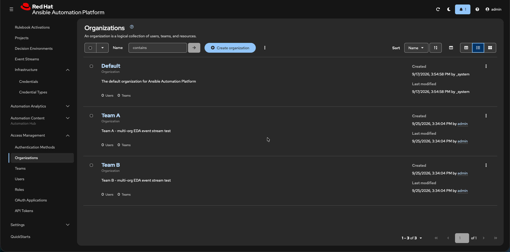
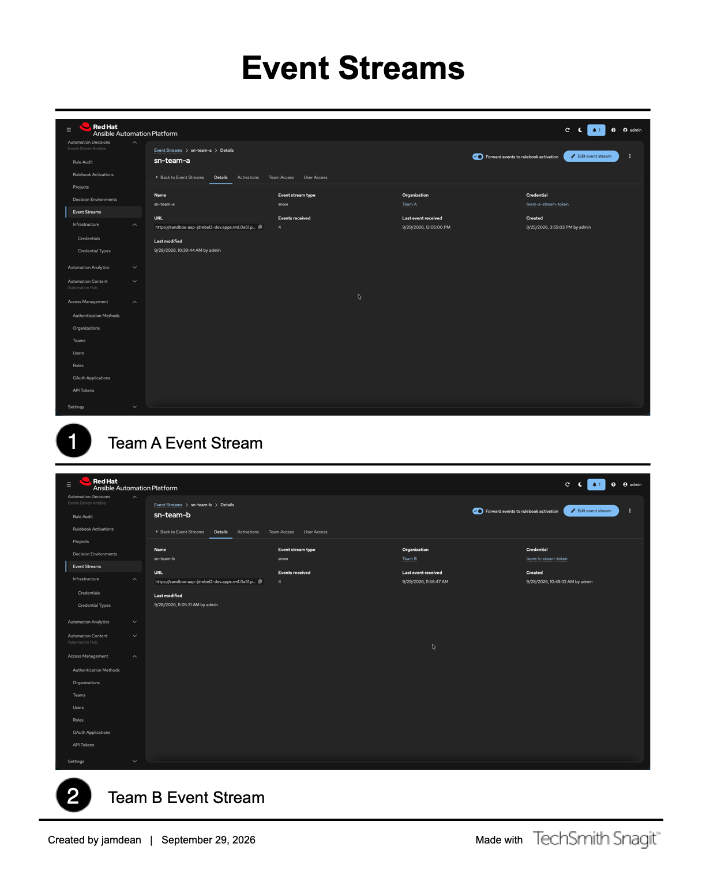
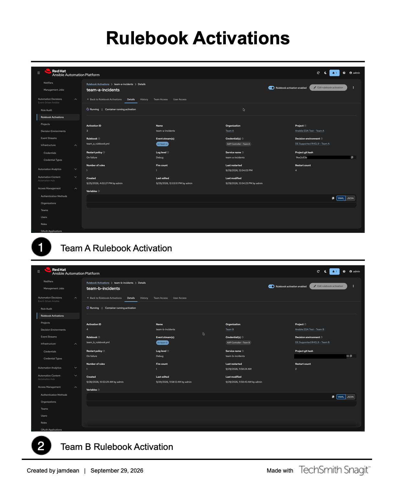

# 03 — AAP / EDA setup, one team at a time

> **What this stage gives you.** For each team: a job template that can run the playbook, a rulebook
> activation listening for events, and an event stream with its own token and URL.
>
> **Previous stages:** [01 — Provision AAP](01-provision-aap.md) and
> [02 — Provision the ServiceNow PDI](02-provision-pdi.md). **You need a working ServiceNow instance
> before §2.3 of this document**, because the credential you build there points at it — if you do not
> have one yet, do `02` first. Also do not start here until the sizing
> patch in 01 §4 has reconciled — creating an EDA project before that fails in a way that looks like
> a repository problem.
>
> **Next stage:** [04 — The ServiceNow app](04-servicenow-app.md) for a fresh build, or
> [09 — Reconnecting ServiceNow](09-reconnect-after-aap-rebuild.md) if ServiceNow already exists.
>
> **Time:** about 45 minutes for your first team; 20 for each one after that.

> **Any unfamiliar word?** Every term and acronym used in these guides is defined in the
> [Glossary](glossary.md) — including AAP, EDA, PDI, SCTASK, data pill, dot-walk, work note
> and `extra_vars`.

---

## 0. The shape of this stage, before you click anything

**Exactly one thing is global. Everything else repeats per team.**

That is not arbitrary — AAP scopes almost every object to an organization, and it *rejects* attaching
one organization's credential to another's job template. The reasoning is in §4; you don't need it
yet.

### Words you'll need

| Term | What it means here |
|---|---|
| **Automation Execution** | The half of AAP that runs playbooks. Formerly "Controller" or "Tower" |
| **Automation Decisions** | The half that runs EDA — rulebooks, event streams, activations |
| **Playbook** | What does the work. One shared file, same for every team |
| **Rulebook** | What decides *whether* to do the work. One per team. **Not a playbook** — see [Rulebook anatomy](rulebook-anatomy.md) |
| **Job template** | A saved, runnable configuration of a playbook |
| **Activation** | A long-running pod holding one rulebook, waiting for events |
| **Event stream** | A URL plus a token that ServiceNow POSTs events to |
| **Decision Environment** | The container image an activation runs inside |

### Get your own copy of the repository — do this first

AAP builds its projects by cloning a Git repository, so you need one you control before §2.4.

1. **Fork this repository** on GitHub, so you have a copy you can push to. Use the **Fork** button on
   the repository page. Your fork's URL will be
   `https://github.com/<you>/Ansible_EDA_Test.git`, where `<you>` is your GitHub username.
2. **Clone your fork** to your machine:

   ```bash
   git clone https://github.com/<you>/Ansible_EDA_Test.git
   cd Ansible_EDA_Test
   ```

   Expected output ends with something like:

   ```
   Resolving deltas: 100% (412/412), done.
   ```

> ⚠️ **Fork rather than using this repository's URL directly.** You will edit rulebooks in
> [08 §2.2](08-routine-ops.md) and push them, and AAP can only offer a rulebook the remote actually
> has. Without your own fork you cannot push.

> ℹ️ **If you keep your fork private**, you also need a GitHub **Personal Access Token** (PAT) — a
> password-substitute for Git over HTTPS — for the Source Control credentials in §2.3 and §2.6. If
> your fork is public, leave those credentials out entirely, which is simpler.

### Placeholders used in this document

| Placeholder | Meaning | Example |
|---|---|---|
| `<Team>` | A team's display name, as used for AAP object names | `Team A` |
| `<team>` | The same team, lowercase and hyphenated, for stream and activation names | `team-a` |
| `<x>` | Just the team letter, used in rulebook filenames | `a` |
| `<you>` | Your GitHub username | `octocat` |
| `<your-pdi>` | Your ServiceNow instance name, from [02](02-provision-pdi.md) | `dev123456` |
| `<your-aap-host>` | Your AAP gateway hostname, from [01](01-provision-aap.md) | `aap.example.com` |
| `<uuid>` | An event stream's unique identifier, generated by AAP in §2.11. **Treat it as credential-like** | `1a2b3c4d-5e6f-7890-abcd-ef1234567890` |

So for Team A: `<Team>` = `Team A`, `<team>` = `team-a`, `<x>` = `a`, and the rulebook is
`rulebooks/team_a_rulebook.yml`.

### The worked example in this repo

| | Team A | Team B | Team C |
|---|---|---|---|
| Organization | `Team A` | `Team B` | `Team C` |
| Inventory | `Team A Inventory` | `Team B Inventory` | `Team C Inventory` |
| Controller project | `EDA ServiceNow - Team A` | `EDA ServiceNow - Team B` | `EDA ServiceNow - Team C` |
| Job template | `Team A Incident Handler` | `Team B Incident Handler` | `Team C Incident Handler` |
| Decision environment | `DE Supported RHEL9 - Team A` | `DE Supported RHEL9 - Team B` | `DE Supported RHEL9 - Team C` |
| EDA project | `Ansible EDA Test - Team A` | `Ansible EDA Test - Team B` | `Ansible EDA Test - Team C` |
| Event stream | `sn-team-a` | `sn-team-b` | `sn-team-c` |
| Rulebook | `team_a_rulebook.yml` | `team_b_rulebook.yml` | `team_c_rulebook.yml` |
| Activation | `team-a-incidents` | `team-b-incidents` | `team-c-incidents` |

Substitute `<Team>` below with the team you are building.

> ℹ️ **Team C deliberately has no SCTASK handler.** That gap is intentional — it proves the
> verification script reports a missing handler as *skipped* rather than failing. Don't "fix" it.



---

## 1. One-time, global: the custom `ServiceNow` credential type

Define this **once for the whole instance**. Every team's ServiceNow credential is an *instance* of
this one type.

**Why a custom type at all:** the playbook reads `{{ SN_USERNAME }}`, `{{ SN_PASSWORD }}` and
`{{ SN_HOST }}` as **Ansible variables**, so the credential has to inject them as **extra vars**.

> ⚠️ **The built-in "ServiceNow" credential type injects *environment* variables only.** With it,
> `{{ SN_USERNAME }}` is undefined and the playbook fails. You need this custom type.

**Automation Execution → Infrastructure → Credential Types → Create credential type**

- **Name:** `ServiceNow`

**Input configuration:**

```yaml
fields:
  - type: string
    id: username
    label: Username
  - type: string
    id: password
    label: Password
    secret: true
  - type: string
    id: host
    label: Host
required:
  - username
  - password
  - host
```

**Injector configuration:**

```yaml
extra_vars:
  SN_USERNAME: "{{ username }}"
  SN_PASSWORD: "{{ password }}"
  SN_HOST: "{{ host }}"
```

> ⚠️ **The `host` value must include `https://`** — `https://<your-pdi>.service-now.com`, not
> `<your-pdi>.service-now.com`. The playbook builds URLs by string concatenation, so without the
> scheme you get a malformed URL rather than a clear error.

> ℹ️ **Upgrading an older `ServiceNow` type that had no `host` field?** Editing the *type* does not
> touch credentials created under the old definition — their `host` stays empty. Open each existing
> ServiceNow credential and fill in **Host**, then save. Skip this and the credential silently has no
> host even though the type now supports one.

The playbook asserts `SN_HOST` is set before doing anything else, so a credential missing it fails
**fast**, on the first task, with a message naming the cause — instead of failing obscurely later
inside a `uri` task in a way that reads like a network problem.


> ✅ **Verify:** the type appears under Credential Types, and its injector configuration shows all
> three `extra_vars` entries.

---

## 2. Per team — repeat all of §2 for each team

### 2.1 Create the organization

**Access Management → Organizations → Create organization** — name it `<Team>`.

Create this first. Every object below asks for an organization, and **you cannot move objects between
organizations afterwards** without recreating them.

> ✅ **Verify:** the organization appears in the list, and in the **Organization** dropdown on the
> next step. If it doesn't, nothing below can be created.

### 2.2 Create the inventory

**Automation Execution → Infrastructure → Inventories → Create inventory** — name
`<Team> Inventory`.

Add one host, `localhost`, with this variable:

```yaml
ansible_connection: local
```

The playbook runs `hosts: localhost` with `connection: local`, so one host is all it needs.

> ✅ **Verify:** the inventory shows **Hosts: 1**, and opening `localhost` shows
> `ansible_connection: local`.

### 2.3 Create the controller credentials

**Automation Execution → Infrastructure → Credentials** — both owned by organization `<Team>`:

| Credential | Type | Contents |
|---|---|---|
| `<Team> Source control` | Source Control | Git username + PAT — **omit entirely for a public repo** |
| `<Team> ServiceNow PDI` | `ServiceNow` (the custom type from §1) | Host `https://<your-pdi>.service-now.com`, username, password |

This is what makes one shared playbook safe across teams: the playbook reads `SN_HOST` from whichever
credential the job template carries, so each team can point at a different instance without the
playbook changing.


> ✅ **Verify:** both appear with **Organization** = `<Team>`. A credential created in the wrong
> organization **cannot** be attached to this team's job template — AAP rejects it outright.

### 2.4 Create the controller project

**Automation Execution → Projects → Create project**

| Field | Value |
|---|---|
| Name | `EDA ServiceNow - <Team>` |
| Organization | `<Team>` |
| Source control type | Git |
| Source control URL | `https://github.com/<you>/Ansible_EDA_Test.git` |
| Source control branch | `main` |
| Source control credential | leave empty for a public repo |

Sync it. `collections/requirements.yml` installs automatically during the sync, which is how
`servicenow.itsm` becomes available to the playbook.


> ✅ **Verify:** status reaches **Successful** and the **Revision** column shows a commit hash. A
> project stuck on *Pending* has not installed the collections yet.

### 2.5 Create the job template

**Automation Execution → Templates → Create template → Create job template**

| Field | Value |
|---|---|
| Name | `<Team> Incident Handler` — **must match the rulebook's `run_job_template.name` exactly** |
| Organization | `<Team>` |
| Job type | Run |
| Inventory | `<Team> Inventory` |
| Project | `EDA ServiceNow - <Team>` |
| Playbook | `servicenow_incident_handler.yml` |
| Execution environment | Default execution environment |
| Credentials | `<Team> ServiceNow PDI` |
| **Variables → Prompt on launch** | ✅ **REQUIRED** |

Three traps here, and all three cost real time.

> 🔴 **1. Prompt on launch is mandatory.** Without it the controller **silently discards** the
> `extra_vars` the rulebook sends. The job runs with no variables and fails on undefined variables,
> with nothing explaining why.

> 🔴 **2. The name is the contract.** The rulebook finds this template **by name, not by ID**. A
> mismatch gives a job-template-not-found error at launch, which reads like a permissions problem.
> Compare it character for character against **`run_job_template.name`** in
> `rulebooks/team_<x>_rulebook.yml`.
>
> ⚠️ **Not the `name:` at the top of the file.** That one is the ruleset's own name — something like
> `Team A - ServiceNow event automation` — and it is never matched against anything. Renaming your
> job template to *that* string breaks the build. The field you want is nested under the rule's
> `action:`, as `run_job_template: name:`.

> 🔴 **3. Pick the playbook, not a rulebook — the dropdown offers both.** This project is the same
> repository that holds the rulebooks, so `Playbook` lists `rulebooks/team_a_rulebook.yml` and
> friends right next to `servicenow_incident_handler.yml`. On a template you just named
> `<Team> Incident Handler`, the team-named file looks like the obvious choice. It is wrong every
> time.
>
> **Every team's job template runs the same playbook:** `servicenow_incident_handler.yml`. The
> per-team part is the rulebook, and that is chosen on the **activation** (§2.12), never here.
>
> The failure is loud, but only after an event arrives — so it shows up as a red job rather than a
> bad setting:
>
> ```
> ERROR! 'sources' is not a valid attribute for a Play
> The error appears to be in '/runner/project/rulebooks/team_c_rulebook.yml': line 13, column 3
> ```
>
> A rulebook is not a playbook: `sources:` and `rules:` are not play keywords. If you see that,
> nothing is wrong with your rulebook, your event or your token — change this one field.

**On closing the incident.** The playbook gates the close behind `sn_close_incident`, which defaults
to **`false`**. The team rulebooks pass `true`, so EDA-triggered runs do close the incident. Enable it
**per team in the rulebook**, never by flipping the playbook default — the default is what protects
you if a shared stream is ever reintroduced and two teams could race to close one ticket.


> ✅ **Verify:** reopen the template and confirm all three:
> 1. **Prompt on launch** is ticked beside *Variables*
> 2. The name matches the rulebook's `run_job_template.name` character for character
> 3. **Playbook** reads `servicenow_incident_handler.yml` — **not** anything under `rulebooks/`
>
> The first two produce no useful error at all. The third produces a misleading one.

> ℹ️ **More than one record type?** Incidents are the base case. SCTASK and Problem each get their own
> job template per team, named to match their own rulebook rules. Build those from
> [08 — Routine ops](08-routine-ops.md) once incidents work end to end.

### 2.6 Create the EDA credentials

EDA keeps its **own** credential store, separate from Automation Execution. Yes, you will re-enter
the same Git PAT here. That is expected, not a mistake.

**Automation Decisions → Infrastructure → Credentials** — owned by `<Team>`:

| Credential | Type | Contents |
|---|---|---|
| `<Team> Source control` | Source Control | Git username + PAT — skip for a public repo |
| `<Team> AAP Controller` | Red Hat Ansible Automation Platform | see below |
| `<Team> Red Hat Registry` | Container Registry | `registry.redhat.io` + your Red Hat service account |

The **AAP Controller** credential is what lets `run_job_template` call back into Automation Execution:

- **Host:** `https://<your-aap-host>/api/controller/`
- **Username / Password:** an account that can launch job templates
- **Verify SSL:** off for a sandbox with self-signed certificates

> 🔴 **The host must end at `/api/controller/`.** Adding `/v2/` doubles the version segment in
> generated API paths, and **every** job template lookup returns 404.


> ✅ **Verify:** all three show **Organization** = `<Team>`, and the AAP Controller host ends at
> `/api/controller/` with no `/v2/`.

### 2.7 Create the Decision Environment

**Automation Decisions → Infrastructure → Decision Environments → Create**

| Field | Value |
|---|---|
| Name | `DE Supported RHEL9 - <Team>` |
| Organization | `<Team>` |
| Image | `registry.redhat.io/ansible-automation-platform-27/de-supported-rhel9:latest` |
| Credential | `<Team> Red Hat Registry` |

On AAP 2.6 use `ansible-automation-platform-26/...` instead. The credential is unnecessary if the
cluster already has a global pull secret covering `registry.redhat.io`.

A Decision Environment is **not** needed for a project to sync — only to run an activation.


> ✅ **Verify:** the DE saves with no registry authentication error. A bad or missing pull secret
> fails **here**, which is far easier to diagnose than an activation failing to start later.

### 2.8 Create the EDA project

**Automation Decisions → Projects → Create project**

| Field | Value |
|---|---|
| Name | `Ansible EDA Test - <Team>` |
| Organization | `<Team>` |
| Source control type | Git |
| Source control URL | `https://github.com/<you>/Ansible_EDA_Test.git` |
| Branch | `main` |
| Credential | empty for a public repo |

Wait for **Completed**.

> 🔴 **Stuck on "Pending", or failing with "Task was stuck in pending state"?** That is almost never
> your project settings — it is the EDA worker pod being killed for running out of memory mid-clone.
> The fix is the sizing patch in [01 §4](01-provision-aap.md). If you applied it already and still
> see this, the diagnostic path is in [10 — Troubleshooting](10-troubleshooting.md).

> ⚠️ **Your rulebook must already be pushed to the remote.** The project can only offer rulebooks the
> remote actually has. On a from-zero build where you are authoring a rulebook, push first.

Then check **Automation Decisions → Rulebooks**. Every team's project discovers **every** rulebook in
the repo, so you will see all five — `team_a`, `team_b`, `team_c`, `my_eda` and `catchall_debug`. You
pick the right one by hand in §2.12; nothing filters the list for you.

> 🔴 **Two of those five must never be attached to an activation.**
> `catchall_debug_rulebook.yml` **matches every event on purpose** — attach it and it double-launches
> every job, while producing a symptom that looks like a completely different fault.
> `my_eda_rulebook.yml` is a teaching example that cannot fire. Details and the full list:
> [Rulebook anatomy §5](rulebook-anatomy.md#5--two-rulebooks-in-this-repo-are-dangerous--leave-them-alone).


> ✅ **Verify:** status reaches **Completed**, and Rulebooks lists the repo's rulebooks.

### 2.9 Generate the event stream token

```bash
openssl rand -hex 32   # a 64-character hex token
```

**Decide now whether every team gets its own token, or all teams share one.** It is easier to choose
here than to change later, and it affects how many objects you build in
[04 §5](04-servicenow-app.md).

| | **A — one token per team** *(the default these guides assume)* | **B — one shared token** |
|---|---|---|
| Run the command above | once **per team** | **once, total** |
| AAP Event Stream credentials (§2.10) | one per team | **one**, reused by every stream |
| ServiceNow credential + alias + connection ([04 §5](04-servicenow-app.md)) | one set **per team** | **one set, total** |
| A leaked token exposes | that one team's stream | **every** stream |
| Rotating a token ([08 §4](08-routine-ops.md)) | that team only | **all teams at once**, in lockstep |

> ℹ️ **Sharing a token cannot misroute anything, which is why B is a legitimate choice rather than a
> shortcut.** The **UUID** decides which stream a POST lands on, and that stays per team either way;
> the token only proves the caller is allowed to post. Each stream checks the incoming header against
> its own stored value, and those values are allowed to be identical. Full reasoning and an
> object-count comparison at 3 and 30 teams:
> [Design decisions §1.5](design-decisions.md#15-tokens-one-per-stream-by-default-or-one-shared--a-real-choice).

**A is recommended** — a leak stays contained and rotation never becomes an all-teams outage. **B is
defensible on a single-owner lab**, where containing a leak "to one team" protects you from yourself,
and at high team counts where the per-team object count is what stops you shipping.

> 🔴 **Whichever you pick, never share the UUID.** One UUID per stream is not optional: two teams
> pointed at one UUID means both teams' records land on one stream, and every activation mapped there
> receives all of them.

> ⚠️ **If you take B, write the decision down** — in the route table's description, or wherever your
> team keeps design notes. The failure mode is somebody later assuming isolation that is not there and
> rotating "just one team's token", which silently breaks every team.

Whichever you chose, each token value goes in **two** places — and under **A** that is two places
*per team*, while under **B** it is two places *in total*:

| Side | Object | Field |
|---|---|---|
| AAP | Event Stream credential (§2.10) | Token |
| ServiceNow | API Key credential ([04](04-servicenow-app.md)) | API Key value |

> ⚠️ **A mismatch returns HTTP 403 from the stream** (measured 2026-10-07), which reads like a permissions or RBAC problem
> and sends you auditing AAP roles. It is almost always a paste artifact — trailing whitespace, or a
> truncated copy. `openssl rand -hex 32` is **always 64 characters**; compare lengths before
> suspecting anything else.

**Store it in a password vault, not in a ticket or a chat message.** Never commit one — `.gitignore`
blocks `*.token`, `*.vault`, `.env*` and `vars/secrets.yml`, but that is a backstop, not a plan.

<details>
<summary><strong>Optional:</strong> keeping the token in the macOS Keychain</summary>

Skip this entirely unless you want to run the [stream test](07-end-to-end-test.md) without pasting a
live secret into your terminal. The AAP and ServiceNow steps work from any OS and none of them needs
a local copy.

```bash
security add-generic-password -a "$USER" -s sandbox-eda-team-c -w -U
```

> 🔑 **Leave `-w` with no value.** It then prompts twice, and the token never appears as a command
> argument — so it never lands in `~/.zsh_history`, nor in `~/.zsh_sessions/*.history`, which is a
> separate file that cleaning `.zsh_history` misses. Writing `-w "$TOKEN"` defeats the whole point.

`-U` updates an existing item instead of erroring, so this doubles as the rotation command. Use one
item per team, named for the stream: `sandbox-eda-team-a`, `-team-b`, `-team-c`. Read it back with:

```bash
security find-generic-password -a "$USER" -s sandbox-eda-team-c -w
```

To have it in every shell, export it from `~/.zshrc`:

```bash
export SANDBOX_EDA_TEAM_C_TOKEN="$(security find-generic-password -a "$USER" -s sandbox-eda-team-c -w 2>/dev/null)"
```

> ⚠️ `~/.zshrc` is only sourced for **interactive** shells, so a tool launched from the Dock inherits
> none of it — and that failure looks like a bad token rather than a missing one. A new export is also
> invisible to already-running processes: start a fresh login shell (`exec zsh -l`) and confirm with
> `echo ${#SANDBOX_EDA_TEAM_C_TOKEN}`, which must print **64**.

</details>

> ✅ **Verify:** the token is exactly **64** characters.

### 2.10 Create the Event Stream credential

**Automation Decisions → Infrastructure → Credentials → Create**

| Field | Value |
|---|---|
| Name | `<Team> Event Stream Token` |
| Organization | `<Team>` |
| Type | `ServiceNow Event Stream` |
| Auth type | `token` |
| HTTP header key | `Authorization` |
| Token | the value from §2.9 |

> ⚠️ **Use the token type, not OAuth 2.0.** ServiceNow's OAuth provider has no RFC 7662 introspection
> endpoint, so EDA cannot validate tokens against it.


> ✅ **Verify:** the credential lists with type **ServiceNow Event Stream**, **Organization** =
> `<Team>`, and header key `Authorization`.

### 2.11 Create the Event Stream

**Automation Decisions → Event Streams → Create event stream**

| Field | Value |
|---|---|
| Name | `sn-<team>` — see the warning below |
| Organization | `<Team>` |
| Event stream type | ServiceNow |
| Credential | `<Team> Event Stream Token` |
| **Forward events to rulebook activation** | ✅ **tick this** |
| Additional data headers | leave **empty** |

> 🔴 **The name is load-bearing.** This exact string arrives as `event.meta.eda_event_stream_name`,
> and the rulebook's condition tests it. Get it wrong and the rule simply never fires.

> 🔴 **Never forward the `Authorization` header.** Adding it to *Additional data headers* copies the
> stream token into `meta.headers`, into the job's `extra_vars`, and into the AAP database **in
> cleartext**.

Forwarding must be on or the stream never appears on the activation's mapping page in §2.12.

> ℹ️ **Two testing modes, mutually exclusive:**
> - Forwarding **on** (what you want): events go straight to the activation. They are **not** stored
>   on the stream's Events tab — read the activation log instead.
> - Forwarding **off**: events are stored on the Events tab so you can inspect the raw JSON, but no
>   rulebook runs and no job launches.
>
> Start with it **on**. Only turn it off if you need to see a payload you can't explain from the log.

Copy the generated URL:

```
https://<your-aap-host>/eda-event-streams/api/eda/v1/external_event_stream/<uuid>/post/
```

That `<uuid>` goes into this team's route-table row in ServiceNow.

> 🔴 **The UUID is regenerated if you rebuild the stream or move it between organizations.** To change
> a stream's organization, **PATCH the organization** — do not recreate the stream, or every route row
> referencing it goes stale.

> 🔴 **Treat the UUID like a credential.** It is the POST path, paired with the bearer token. Keep it
> out of commits and out of screenshots.




> ✅ **Verify:** the stream shows a generated URL and **Events received: 0**. Zero is correct — nothing
> has posted to it yet.

### 2.12 Create the Rulebook Activation

**Automation Decisions → Rulebook Activations → Create rulebook activation**

**Page 1 — details**

| Field | Value |
|---|---|
| Name | `<team>-incidents` |
| Organization | `<Team>` |
| Project | `Ansible EDA Test - <Team>` |
| Rulebook | `team_<x>_rulebook.yml` — **pick carefully; the list shows all five, and two are dangerous** ([why](rulebook-anatomy.md#5--two-rulebooks-in-this-repo-are-dangerous--leave-them-alone)) |
| Credential | `<Team> AAP Controller` |
| Decision environment | `DE Supported RHEL9 - <Team>` |
| Restart policy | On failure |
| Log level | **Debug** while setting up; drop to Info later |
| Skip audit events | leave unchecked, so you can see matches |

**Page 2 — event streams. This is the page that matters.** Click the **gear icon**, then map:

- **Left (rulebook source):** `ansible.eda.webhook`
- **Right (event stream):** `sn-<team>`

Save the mapping. This **replaces** the webhook listener with the server-side stream; your rules and
conditions are unchanged. The `ansible.eda.webhook` source in the rulebook is a placeholder that is
never actually bound.

You can confirm it took in the activation log, which will load `eda.builtin.pg_listener` instead:

```
ansible_rulebook.engine - INFO - load source eda.builtin.pg_listener
```

**Page 3 — review.** Tick *Enable rulebook activation*, then **Create**.




> ✅ **Verify:** the activation reaches **Running**, and its log shows
> `load source eda.builtin.pg_listener` — **not** `ansible.eda.webhook` — followed by
> `Waiting for events` naming this team's ruleset. Seeing `ansible.eda.webhook` means the Page 2
> mapping did not save.

---

## 3. The change cycle for any rulebook edit

Editing a rulebook changes the Git SHA the source mapping is pinned to. Every edit needs **all four**
steps, in this order, or the activation keeps running the old commit and your change appears to have
done nothing:

1. **Push** the rulebook change.
2. **Sync** that team's EDA project.
3. **Re-attach** the event stream to the rulebook (§2.12, Page 2).
4. **Restart** the activation.

> ✅ **Verify:** the activation detail page's **project git hash** matches your latest commit. If it
> still shows the old hash, step 3 or 4 did not take.

Because that cycle is slow, validate condition and Jinja changes locally first — see
[07 — End-to-end test](07-end-to-end-test.md).

---

## 4. Why all of §2 repeats — the scoping rules

Read this once, after your first team works. It is the reasoning behind §2's shape, not a step.

| Object | Scope | Consequence |
|---|---|---|
| Organization | per team | The container for everything below |
| Inventory | per team | Hygiene rather than a hard requirement — see below |
| Credentials (ServiceNow, AAP Controller, Event Stream Token, Registry) | **per team** | Each team needs its own copy even when the values are identical. AAP **rejects** another org's credential outright |
| Controller project | per team | Each syncs independently from the same Git ref |
| Job template | per team | Matched **by name** from the rulebook's `run_job_template.name` |
| Decision Environment | per team | Each activation references its own, even for the same image |
| EDA project | per team | |
| Event stream | **per team, always** | The UUID is what routing selects on |
| Event stream token | per team **by default**, or one shared | Your choice — §2.9. Sharing widens a leak and couples rotation; it cannot misroute |
| Rulebook activation | per team | One pod per team |
| Credential **type** (§1) | **global** | Defined once |

> ⚠️ **Organization isolation is asymmetric — don't rely on it as a blanket guarantee.** Verified
> empirically: attaching another org's **credential** to a job template is rejected
> (`HTTP 400 "Credential matching query does not exist."`), but attaching another org's **inventory**
> succeeds (`HTTP 200`). An organization is a hard boundary for secrets and a soft one for everything
> else. Per-team inventories here are a deliberate choice, not something AAP forced.

---

## Checkpoint

Per team, before moving on:

- [ ] Controller project syncs **Successful** with a revision hash
- [ ] Job template has **Prompt on launch** ticked, the right name, and the **playbook** selected
- [ ] AAP Controller credential host ends at `/api/controller/`
- [ ] EDA project reaches **Completed**
- [ ] Event stream exists, forwarding is **on**, URL and UUID recorded somewhere safe
- [ ] Activation is **Running** and its log shows `eda.builtin.pg_listener` + `Waiting for events`
- [ ] The token is 64 characters and stored in a vault

**Next:** [04 — The ServiceNow app](04-servicenow-app.md) for a fresh build, or
[09 — Reconnecting ServiceNow](09-reconnect-after-aap-rebuild.md) if ServiceNow survived.

---

## Self-check

**Did I skip any prerequisite steps?** Two were missing and are now present: getting your own fork
and clone of the repository, without which §2.4 cannot be completed, and a placeholder table
defining `<Team>`, `<team>`, `<x>` and `<you>` — three of which were previously used but never
defined.

**Is every command copy-paste ready with context?** The shell commands are the clone, `openssl rand
-hex 32`, and the optional Keychain block. Each states where to run it and what success looks like;
the token command states the 64-character check that the §2.9 failure list then depends on.

**Would a complete novice understand every single sentence?** §0 defines the eight platform terms
before any step uses them, and leads with rulebook-versus-playbook because the §2.5 trap punishes
exactly that confusion. The three job-template traps are numbered red callouts rather than prose,
since all three fail either silently or misleadingly.
