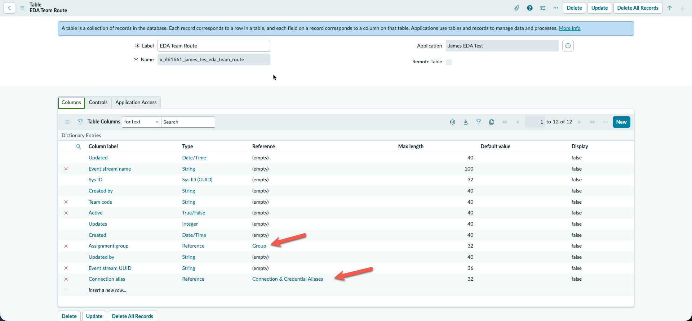
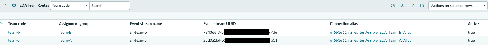
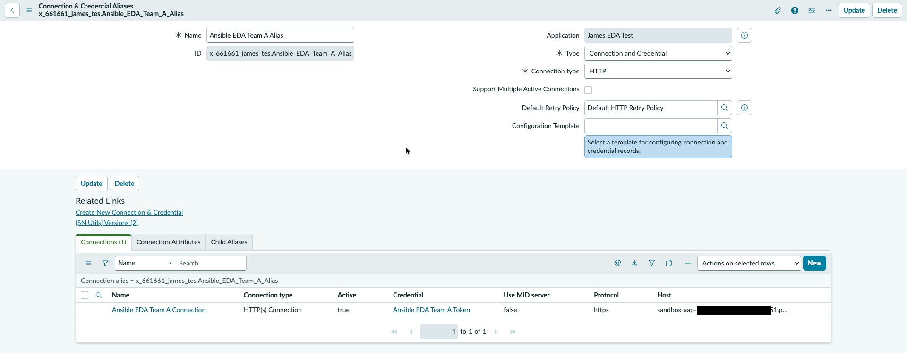
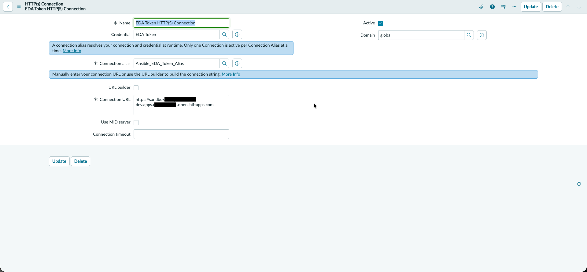
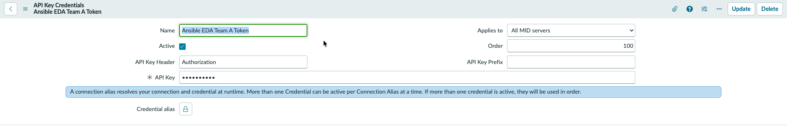

# 04 — The ServiceNow scoped application and its tables

**This document covers creating the ServiceNow application that holds the integration, the three
tables it uses, and one credential set per event stream.**

> **Previous stage:** [03 — AAP / EDA setup](03-aap-eda-setup.md) · **Next stage:**
> [05 — The Action](05-servicenow-action.md)
>
> **Time:** about 45 minutes for the shared parts, plus 10 minutes per team.

> **Any unfamiliar word?** Every term and acronym used in these guides is defined in the
> [Glossary](glossary.md) — including AAP, EDA, PDI, SCTASK, data pill, dot-walk, work note
> and `extra_vars`.

---

## 0. Before you click anything

### Words you'll need

| Term | What it means here |
|---|---|
| **Scope / scoped application** | A namespace that owns a set of ServiceNow records. Everything you build here lives inside one, so it can be moved as a single unit |
| **Global** | The default, un-namespaced scope. Most of the platform's own tables live here |
| **Reference field** | A column that points at a row in another table. It stores that row's **sys_id**, not its name |
| **sys_id** | A 32-character identifier ServiceNow gives every record. Stable — it does not change when you rename the record |
| **Display column** | The one column ServiceNow shows when something points at this table. Without one, you see raw sys_ids |
| **Data pill** | A reference to a value from an earlier step, dragged into a later step in Flow Designer. Shown as a small rounded token |
| **Connection & Credential Alias** | A ServiceNow object that bundles "where to send a request" with "what credential to send it with" |

### What is shared and what repeats

Unlike the AAP side, this stage is a **mix**. Getting this wrong means building three of something
that should be one.

| What | How many |
|---|---|
| Scoped application | **One**, shared. Do **not** create an app per team |
| Assignment groups | **One per team**, created in Global |
| Credential + alias + connection | **One set per team** — this is where each team's token lives |
| The three tables | **One** set, shared |
| Action ([05](05-servicenow-action.md)) | **One**, shared. Team values arrive as inputs |
| Flow ([06](06-servicenow-flow.md)) | **One**, shared. It looks the team up and passes the values in |
| Route table rows | **One row per team** |

That split is the whole point of the design: adding a team later means a group, a credential set, and
a table row — **no new action, no new flow, no script changes.**

---

## 1. Create the scoped application — do this first

> 🔴 **Build none of this in Global.** The tables, credential, alias, connection, action and flow all
> belong inside one scoped application.

1. Go to **All → System Applications → Studio → Create application**.
2. Give it a **Name**. This repo's is `James EDA Test`.
3. **Leave the Scope field alone.** ServiceNow generates it from your instance's vendor prefix and
   the name — here, `x_661661_james_tes`. **You cannot change it later.**
4. Click **Create**. ServiceNow puts you inside the new application's scope automatically.
5. **Confirm the application picker shows your app before creating anything else.** It is the
   selector at the top of Studio, and in the main UI under **gear icon → Developer → Application**.

> 🔴 **This is the most important check in this document.** The picker decides which scope every new
> record lands in, and **records created in the wrong scope cannot be moved.** They have to be
> deleted and recreated. Check the picker, not your memory of what you last selected.

**Why scoped rather than Global:**

- Everything is **one promotable unit** — an app version or a single update set — instead of records
  scattered across Global.
- It gets its own roles and ACLs, so least privilege is achievable.
- No collisions with out-of-box artifacts or another team's work.
- The scope **auto-prepends** to properties, events and roles, so you do not add your own prefix.
  Adding one anyway produces names like `x_661661_james_tes.cnc.eda.debug`, which matches no
  convention.

---

## 2. Grant the REST account its two roles

The playbook reaches back into ServiceNow over inbound REST using Basic authentication. That needs
**both** of these roles on the account in the AAP ServiceNow credential:

| Role | Why |
|---|---|
| `snc_platform_rest_api_access` | Access to the Platform REST APIs. Without it every call is refused regardless of the password |
| `snc_basic_auth_api_access` | Passes the Basic-auth gate. Only enforced when the `SNCRestrictBasicAuth` property is on — grant it anyway rather than depending on a property you did not set |

> 🔴 **Missing either one produces `401`, not `403`.** That reads as a wrong password and sends you
> resetting credentials that were fine. **Check the roles before the password.**

---

## 3. Create the assignment groups — one per team

These are the ServiceNow side of "a team", and the routing depends on them.

Go to **All → User Administration → Groups → New**, and create one group per team:

| Group name |
|---|
| `Team-A` |
| `Team-B` |
| `Team-C` |

Add at least one member to each, so you have someone to assign test records to.

> ℹ️ **Create these in Global, not in your scoped app.** `sys_user_group` is a platform table —
> groups are instance-wide. This is the one thing in this document that does *not* live in the scoped
> app. Your scoped app needs a `sys_scope_privilege` record granting **read** on `sys_user_group` to
> reference them.

> ✅ **Verify:** each group appears in the Groups list **and** is selectable in the **Assignment
> group** field on an incident form. If it is not selectable there, it will not route.

> ℹ️ **Renaming a group later is safe.** The route table stores the group's **sys_id**, not its name,
> so a rename does not break routing. What *does* break routing is **deleting and recreating** a
> group — the new one has a different sys_id, and the route row still points at the old one.

---

## 4. Create the three tables

All three live **inside the scoped app**. Create them at
**System Definition → Tables → New**, with your app selected in the picker.

### 4.1 `EDA Team Route` — which stream does this team's work go to?

Label **`EDA Team Route`**, which generates `x_661661_james_tes_eda_team_route`.

| Column label | Type | Length | What it is for |
|---|---|---|---|
| Assignment group | Reference → `sys_user_group` | | **The routing key.** Matched against the record's assignment group |
| Team code | String | 40 | The **display column** (see below). Also sent in the payload as `target_team` |
| Event stream name | String | 100 | Must equal the event stream's name in AAP exactly |
| Event stream UUID | String | 36 | Becomes the REST step's `resource_path` |
| Connection alias | Reference → `sys_alias` | | Becomes the REST step's `connection_alias` |
| Active | True/False | | Switch a team off without deleting the row |

> 🔴 **Mark `Team code` as the display column.** Open the table → **Columns** → `team_code` → tick
> **Display**. Without a display column, anything referencing this table shows a raw sys_id — you get
> `654ea626c3238bd0b08b9b377d0131dc` where you wanted `team-b`.
>
> Only one column per table can be the display column, and setting one clears the previous. Display
> values are computed when the page renders, so this takes effect immediately — nothing to migrate.

> ℹ️ **Why the key is the assignment group and not the team code.** The record arriving from the
> trigger has an assignment group on it; it has no idea what a "team code" is. So the group is what
> you can actually match on. `team_code` is a short human label that rides along in the payload.

One row per team:

| Assignment group | Team code | Event stream name | Event stream UUID | Connection alias | Active |
|---|---|---|---|---|---|
| Team-A | `team-a` | `sn-team-a` | *from AAP* | Ansible EDA Team A Alias | true |
| Team-B | `team-b` | `sn-team-b` | *from AAP* | Ansible EDA Team B Alias | true |
| Team-C | `team-c` | `sn-team-c` | *from AAP* | Ansible EDA Team C Alias | true |

> 🔴 **You cannot finish the `Connection alias` column yet, and that is expected — not a mistake you
> made.** That column is a **reference** to an alias record, and the aliases do not exist until
> [§5](#5-create-one-credential-set-per-team). The dropdown will be empty.
>
> **Do it in two passes:**
>
> 1. **Now:** create each row with assignment group, team code, event stream name, UUID and Active.
>    Save it with `Connection alias` **empty**.
> 2. **After §5:** reopen each row and set `Connection alias` to that team's new alias.
>
> Creating the table and its rows first is deliberate — §5's three objects are easier to get right
> once you can see what they plug into. If you would rather do it in one pass, jump to §5, build one
> team's credential set, then come back and create that team's row complete.
>
> **A row left with an empty alias fails at run time**, not at save time, with
> `Request not sent and the REST step reported no error.` ([10 §3.4](10-troubleshooting.md)). The
> checkpoint at the bottom of this document is what catches a forgotten second pass.

> 🔴 **The UUID column holds the UUID only** — not the whole URL, and no slashes. Get it from
> [03 §2.11](03-aap-eda-setup.md). Treat it as credential-like and keep it out of commits and
> screenshots.

> ⚠️ **Exactly one active row per assignment group.** Two active rows for one group means the lookup
> has to pick, and whichever it picks is effectively arbitrary.

### 4.2 `EDA Enabled Catalog Items` — is this record in scope for automation at all?

Label **`EDA Enabled Catalog Items`**, generating
`x_661661_james_tes_eda_enabled_catalog_items`.

| Column label | Type | Length | What it is for |
|---|---|---|---|
| Catalog Item | Reference → `sc_cat_item` | | Enrol one specific catalog item |
| Order Guide | Reference → `sc_cat_item_guide` | | Enrol everything ordered through a guide |
| Active | True/False | | Switch an item off without deleting the row |
| Description | String | 200 | Free text for humans. Nothing reads it |

A row enrols **either** a catalog item **or** an order guide, never both. The flow checks this table
first and stops quietly if nothing matches — see [06 §2.2](06-servicenow-flow.md#22-the-count-gate).

> ℹ️ **This table applies to Catalog Tasks (SCTASK) only.** Incidents and problems have no catalog
> item, so they have no enrollment gate at all and their route lookup is the only filter. See the
> callout at the top of [06](06-servicenow-flow.md).

> ⚠️ **Reference-qualify the Catalog Item column** with `sys_class_name!=sc_cat_item_guide`. Order
> guides *extend* the catalog item table, so without the qualifier a guide can be picked in the
> Catalog Item field — where it will never match anything. Do **not** qualify with
> `sys_class_name=sc_cat_item`, which would also hide Hardware, Software and Record Producer items.

> ℹ️ **Mark a display column here too**, for the same reason as §4.1.

### 4.3 `EDA Publish Log` — exists, deliberately not wired up

Label **`EDA Publish Log`**. Seven columns: `team_code`, `event_stream_name`, `payload`,
`http_status`, `success`, `error_message`, and `incident` (Reference → `incident`).

> ⚠️ **This table is real, has no rows, and nothing in the flow writes to it.** That is the current
> state, not an oversight waiting to be fixed, and it is recorded here so you do not go looking for
> the step that populates it.

If you ever do wire it up, fix this first: the `incident` column is a reference to **`incident`
only**, so it cannot record an SCTASK or a Problem failure. A central log that silently drops two
thirds of your failures is worse than no log. Replace it with a `document_id` plus a table-name
column, or add one reference column per record type.

---

## 5. Create one credential set per team

**Repeat all of §5 once per team — if you chose one token per team** in
[03 §2.9](03-aap-eda-setup.md). Each team's alias then carries that team's own token, and that is
what makes it impossible for one team to post to another's stream.

> ℹ️ **If you chose the single shared token (option B in [03 §2.9](03-aap-eda-setup.md)), build this
> section once, not once per team.** One credential, one alias, one connection — and then **every**
> route row's `connection_alias` points at that same alias. Three objects instead of three per team.
>
> **Routing still works, and this is the part worth understanding.** The alias only supplies the
> host and the `Authorization` header; the **UUID** on each route row is what selects the team's
> stream, and that stays per team either way ([§4.1](#41-eda-team-route--which-stream-does-this-teams-work-go-to)).
> So one alias serving every team does not blur routing — it only means a leaked token is valid
> everywhere and rotation becomes lockstep. Trade-off in full:
> [Design decisions §1.5](design-decisions.md#15-tokens-one-per-stream-by-default-or-one-shared--a-real-choice).
>
> Name it without a team in the name if you go this way — `Ansible EDA Shared Token`,
> `Ansible EDA Shared Alias` — so the next person does not read `Ansible EDA Team A Alias` on Team
> C's route row and assume it is a mistake.

| | Team A | Team B | Team C |
|---|---|---|---|
| Credential | `Ansible EDA Team A Token` | `Ansible EDA Team B Token` | `Ansible EDA Team C Token` |
| Alias | `Ansible EDA Team A Alias` | `Ansible EDA Team B Alias` | `Ansible EDA Team C Alias` |
| Connection | `Ansible EDA Team A Connection` | `Ansible EDA Team B Connection` | `Ansible EDA Team C Connection` |

> **Scope check:** the application picker must show your scoped app, not Global, before you start.

### Step 1 — the Credential (first; the connection needs it)

**All → Connections & Credentials → Credentials → New → API Key Credentials**

| Field | Value |
|---|---|
| Name | `Ansible EDA <Team> Token` |
| API Key Header | `Authorization` |
| API Key | this team's token from [03 §2.9](03-aap-eda-setup.md) — **bare** |

> 🔴 **Enter the token bare. Do not prefix it with `Bearer `.** AAP compares the incoming header
> value against the stored token **verbatim**, and ServiceNow sends this field exactly as entered:
>
> | What you enter | Header actually sent | Result |
> |---|---|---|
> | `<token>` | `Authorization: <token>` | ✅ matches |
> | `Bearer <token>` | `Authorization: Bearer <token>` | ❌ `403` |
>
> There **is** a separate **API Key Prefix** field on this form. **Leave it empty.** That field is
> where a scheme belongs when a target needs one — never type `Bearer ` into the API Key value.

> ⚠️ **Do not use a `password2` system property with `GlideEncrypter` instead.** On current releases
> `GlideEncrypter` is deprecated and **returns null**, so the value cannot be read back in script at
> all, and anything already stored in one is unrecoverable.

### Step 2 — the Connection & Credential Alias

**All → Connections & Credentials → Connection & Credential Aliases → New**

| Field | Value |
|---|---|
| Name | `Ansible EDA <Team> Alias` |
| Type | Connection and Credential |
| Connection type | HTTP |

### Step 3 — the HTTP(s) Connection — create it *from the alias*

Open the alias you just saved, find its **HTTP Connections** related list, and click **New** there.

| Field | Value |
|---|---|
| Name | `Ansible EDA <Team> Connection` |
| Connection alias | the alias above — pre-filled when created from the related list |
| Credential | `Ansible EDA <Team> Token` |
| Connection URL | `https://<your-aap-host>` — **base URL only** |

> 🔴 **Create the connection from the alias's related list, not from the Connections table.** Created
> standalone, **Connection alias** is left empty or points at the wrong alias. The run-time symptom
> is `Unable to load connection with alias ID: <alias name>`, which reads as though the alias is
> broken — when in fact the alias resolved fine and simply has no usable child connection.

> ℹ️ **Base URL only.** The rest of the path —
> `eda-event-streams/api/eda/v1/external_event_stream/<uuid>/post/` — is supplied by the REST step,
> built from the route row's UUID. That is exactly what lets one action serve every team.

You do not select the alias on the REST step. The flow passes the right team's alias per record, so
the token never appears in a script, a step output, or a flow execution log.

> ✅ **Verify:** open the alias and confirm its **HTTP Connections** related list contains a
> connection, and that the connection has a **Credential** attached.

---

## 6. The scoped-table trap that only breaks for other people

> 🔴 **Creating a table in a scoped app auto-creates a role that nobody holds.**
> `EDA Team Route` got `x_661661_james_tes.eda_team_route_user`, granted to zero users. Its ACLs have
> `admin_overrides = true`, so **an admin sees the rows and a non-admin sees nothing.**

This bites twice:

1. **Flow Designer's table picker only lists tables the current user can read.** If your table does
   not appear when adding a lookup step, check the Workflow Studio **application scope** first — a
   scoped table is filtered out when the session context is Global — then search by **label**
   (`EDA Team Route`), not internal name.
2. **At run time the flow must be able to read it.** With the flow running as the triggering user and
   nobody holding the role, the lookup returns **zero rows silently** — no error, just no routing.

**The fix:** run the flow as **System user** ([06](06-servicenow-flow.md)), or grant the role to a
group.

It is a trap specifically because it fails *differently for you than for everyone else*: it works
perfectly while you build and test as admin, then returns nothing in normal use.

---

## 7. Three more traps that fail quietly

Nothing to do now. Come back when a lookup returns nothing or a table will not appear in a picker.

| Trap | What you see |
|---|---|
| A scoped script touching a global table needs a `sys_scope_privilege` record | A run-time failure that reads like a code bug. This build needs **read** on `incident`, `em_alert` and `sys_user_group` |
| Scoped flow and action components are invisible to cross-scope Table API queries | `sys_hub_action_instance` returns 0 rows for your scope while returning rows for others. Not a permission error and not a bad field name — inspect in the UI or via execution details, never the API |
| A reference field shows a sys_id instead of a name | The target table has no display column — §4.1 |

> ℹ️ **If you promote this pattern to a managed enterprise instance**, expect governance that does not
> apply to a PDI: app-engine build standards, a stricter ACL set, data-retention rules agreed at
> project start, and constraints on notifications and attachments. Get your platform team's standards
> rather than carrying this document's assumptions across.

---

## Checkpoint

- [ ] The application picker shows your scoped app, not Global
- [ ] The REST account holds **both** `snc_platform_rest_api_access` and `snc_basic_auth_api_access`
- [ ] One assignment group per team, created in Global, selectable on an incident form
- [ ] `EDA Team Route` exists with all six columns, and `team_code` marked **Display**
- [ ] One active route row per team, each with a UUID **and** a connection alias — the alias is the
      second pass described in §4.1, and an empty one fails only at run time
- [ ] `EDA Enabled Catalog Items` exists, with the Catalog Item column reference-qualified
- [ ] One credential, alias and connection per team, token entered **bare** with the prefix empty
- [ ] Each alias has a child connection, and that connection has a credential

**Next:** [05 — The Action](05-servicenow-action.md).

---

## Self-check

**Did I skip any prerequisite steps?** Partly — and it is flagged rather than hidden. §2's two REST
roles and §7's `sys_scope_privilege` record both state *what* is required without giving a
navigation path, because neither has been verified step-by-step on a clean instance. Both are in the
checkpoint so they cannot be forgotten, but a reader will have to find the forms themselves.

**Is every command copy-paste ready with context?** There are no shell commands in this document —
it is entirely user-interface work. Every instruction gives its full `All → … → New` path, except
the three noted above.

**Would a complete novice understand every single sentence?** §0 defines the seven ServiceNow terms
the document depends on, and explains the shared-versus-per-team split before any object is created,
because building three of something that should be one is the expensive mistake here. §4.1 gives the
*reason* assignment group is the routing key rather than only asserting it.
