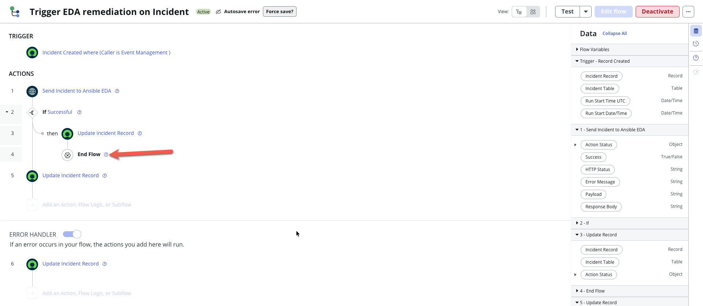

# 06 — The Flow: should this record go, and where to?

**This document covers building the flow that decides whether a record belongs to EDA, looks up which
team's stream to send it to, and calls the action.**

> **Previous stage:** [05 — The Action](05-servicenow-action.md) · **Next stage:**
> [07 — End-to-end test](07-end-to-end-test.md)
>
> **Time:** about an hour for your first record type.

> **Any unfamiliar word?** Every term and acronym used in these guides is defined in the
> [Glossary](glossary.md) — including AAP, EDA, PDI, SCTASK, data pill, dot-walk, work note
> and `extra_vars`.

---

## 0. Before you click anything

### Words you'll need

| Term | What it means here |
|---|---|
| **Flow** | An automation that starts by itself when a record changes. The action from [05](05-servicenow-action.md) does the work; the flow decides *when* and *for whom* |
| **Trigger** | The condition that starts the flow |
| **Flow logic** | Branching and looping blocks — `If`, `For Each`, `End Flow` |
| **Scalar field** | A single plain value such as a string or a number, as opposed to a whole record or a list |
| **Data pill** | A small rounded token representing a value from an earlier step, dragged into a later field |
| **Fail-closed** | If something unexpected happens, nothing is sent. The safe default |
| **Fail-open** | If something unexpected happens, everything is sent. What you are avoiding |

### The two questions this flow answers

Keep these separate in your head, because they need different mechanisms and have **opposite**
failure behaviour:

| Question | Mechanism | If nothing matches |
|---|---|---|
| **Is this record in scope for EDA at all?** | `EDA Enabled Catalog Items` lookup — **SCTASK only** | **Normal.** Exit quietly — most catalog tasks are not EDA tasks |
| **Which team's stream does it go to?** | `EDA Team Route` lookup — **every record type** | **A misconfiguration.** Say so loudly |

> 🔴 **Those two cases must not share an exit — *when reaching the route gate means the record was
> supposed to route*.** That condition is the whole rule, and it is not always true:
>
> | Record type | Does reaching the route gate imply it should route? | So an unroutable record is… |
> |---|---|---|
> | **SCTASK** | **Yes** — the enrollment gate already said this task is in scope | a **misconfiguration**. Be noisy |
> | **Incident / Problem** | **No** — the trigger is the only upstream filter, and it is deliberately coarse | often **normal**. Noise here lands on other teams' records |
>
> For SCTASK, "enrolled but unroutable" should never happen and silence hides it. For Incident and
> Problem on a shared instance, *most* records reaching the gate legitimately belong to teams that
> never asked for EDA — so a work note on each one is unsolicited noise on someone else's ticket.
> **This build therefore exits silently on all three** (decided 2026-10-07) and diagnoses from the
> flow's **Executions** list instead. See [§3.3](#33-the-else-branch--this-is-the-one-the-old-docs-omitted).

### 🔴 Only SCTASK has an enrollment gate — read this before building

**Enrollment exists only for Catalog Tasks (SCTASK).** The `EDA Enabled Catalog Items` table is keyed
on a catalog item or an order guide, and **incidents and problems have neither** — nobody orders an
incident from a catalog. So:

| Record type | Enrollment gate (§2) | Route gate (§3) |
|---|---|---|
| **SCTASK** | **Yes** — build §2 | Yes |
| **Incident** | **No — skip §2 entirely** | Yes, and it is the **only** filter |
| **Problem** | **No — skip §2 entirely** | Yes, and it is the **only** filter |

> 🔴 **For Incident and Problem, §3.3's Else branch is mandatory, not good practice.** With no
> enrollment gate ahead of it, the route lookup is the only thing standing between a record and the
> action. Skipping the Else branch is how the first Problem build failed.

### The finished shape

**SCTASK** — both gates:

```
Trigger  (catalog task created, assignment group not empty)
  |
  1  Look Up Records  -- EDA Enabled Catalog Items          (plural)
  2  If Count > 0
     |
     +-- 3  Look Up Record  -- EDA Team Route               (singular)
         4  If Sys ID is not empty
            |
            +-- 5  Send SCTASK to Ansible EDA   (the action)
                6  If Successful
                   +-- 7  Update record -- success work note
                       8  End Flow
                9  Update record -- failure work note
            |
            +-- Else: update record -- "enrolled but no route row" + alert
  |
  (no else -- not enrolled just ends, quietly and correctly)

Error Handler:  Update record + Send Email
```

**Incident and Problem** — route gate only. Every step number shifts down by two:

```
Trigger  (record created; Incident also requires Caller is Event Management)
  |
  1  Look Up Record  -- EDA Team Route                      (singular)
  2  If Sys ID is not empty
     |
     +-- 3  Send <record> to Ansible EDA   (the action)
         4  If Successful
            +-- 5  Update record -- success work note
                6  End Flow
         7  Update record -- failure work note
     |
     +-- Else: update record -- "no route row for this group" + alert
                                           <-- MANDATORY here

Error Handler:  Update record + Send Email
```

For SCTASK, steps 3 onward sit **inside** the `Count > 0` true branch. That nesting is what makes it
fail-closed.

> ⚠️ **Step numbers appear in every data pill**, as in `3 → EDA Team Route Record → Sys ID`. They are
> the Flow Designer step numbers, so they differ between the two shapes above. Throughout §3 and §4
> this document uses the **SCTASK** numbering; on an Incident or Problem flow, **subtract 2** from
> every step number in a pill path.

---

## 1. Create the flow and set the trigger

**All → Process Automation → Flow Designer → New → Flow**

> 🔴 **Scope check.** Set the application to your scoped app, not Global.

### 1.1 Flow properties — do this now, not later

| Property | Value |
|---|---|
| **Run as** | **System user** |
| Run flow in | Background |

> 🔴 **"Run as System user" is not optional, and getting it wrong fails only for other people.**
> Creating a table in a scoped app auto-creates a role that **nobody holds**, and the table's ACLs
> have `admin_overrides = true`. So while you build and test as an admin, the lookups work perfectly.
> For any normal user the lookup returns **zero rows with no error** — routing just stops.
>
> Running as System user sidesteps it. Granting the auto-created role to a group is the alternative.
> Verified on this PDI: all three live flows run as **System user**.

### 1.2 The trigger

**Trigger: Record Created**, on your record type's table.

The live triggers on this PDI, verified 2026-10-06:

| Flow | Table | Condition |
|---|---|---|
| `Trigger EDA remediation on SCTASK` | `sc_task` | `Assignment group` **is not empty** |
| `Trigger EDA remediation on Problem` | `problem` | `Assignment group` **is not empty** |
| `Trigger EDA remediation on Incident-EDA` | `incident` | `Caller` **is** `Event Management` **AND** `Assignment group` **is not empty** |

All three are **Created** only (not on update) and run in the **background**.


> ℹ️ **What to look for in that image:** the trigger row reads
> *Incident Created where (Caller is Event Management, and Assignment group is not empty)* — both
> halves, matching the table above. **Advanced Options** is expanded to show
> *Run flow in background (default)*, which is the §1.1 setting. The status bar confirms
> *Status: Published* and *Application: James EDA Test* — a **scoped** app, not Global.

> 🔴 **Do not copy the ACTIONS list in that screenshot. It is missing the route gate.** It goes
> straight from step 1 *Look Up EDA Team Route Record* to step 2 *Send Incident to Ansible EDA*, with
> no `If Sys ID is not empty` between them and no Else branch — the shape
> [§3.2](#32-the-sys-id-gate) and [§3.3](#33-the-else-branch--this-is-the-one-the-old-docs-omitted)
> exist to prevent.
>
> **This is the live flow, confirmed in Workflow Studio on 2026-10-07** — not a stale capture. It is
> a known gap in this build, pending the retrofit in [§3.4](#34-retrofitting-the-gate-into-a-flow-you-have-already-built).
> Build the gate; do not reproduce what the image shows.

> ℹ️ **Why the Incident trigger has an extra condition.** Filtering on the `Event Management` user
> keeps human-raised and demo tickets out of the flow. The incident flow needs that filter precisely
> **because it has no enrollment gate** — the trigger is its only chance to narrow the input before
> the route lookup. SCTASK does not need it, because enrollment narrows SCTASKs instead.
>
> Problem has neither an enrollment gate nor a caller filter, which is why its route gate and the
> Else branch in §3.3 carry the whole weight.

> ⚠️ **`Event Management` is an existing user record on the instance, not something you create.**
> Confirm it exists before relying on it: **All → User Administration → Users**, search for
> `Event Management`. If your instance has no such user, pick a different discriminator for the
> trigger rather than leaving the condition pointing at nothing — a trigger condition naming a
> non-existent user never matches, and the flow silently never runs.
>
> If you read the pre-2026-10 documentation and thought two sections contradicted each other on the
> trigger — they did not. One described the Incident flow, which **does** require
> `Caller is Event Management`; the other described SCTASK and Problem, which do not. Neither said
> which it meant.

> ⚠️ **Keep the trigger condition coarse.** It only has to be a *superset* of what you want. The
> enrollment gate in §2 is the authoritative filter. A narrow trigger that disagrees with the
> enrollment table gives you two sources of truth and no way to tell which one rejected a record.

> 🔴 **A trigger condition your test record does not meet is the single most common "nothing
> happened".** There is no execution to inspect and nothing reports an error, because nothing was
> supposed to happen. If the Incident flow seems dead, check the **Caller** on your test incident
> first.

---

## 2. Steps 1 and 2 — the enrollment gate (SCTASK only)

> 🔴 **Building an Incident or Problem flow? Skip this whole section** and go to
> [§3](#3-steps-3-and-4--the-route-lookup). Those record types have no catalog item, so there is
> nothing to enrol and the pills below do not exist on their triggers. Remember to subtract 2 from
> the step numbers in §3 and §4.

### 2.1 Look Up Records (plural)

**Add an Action → ServiceNow Core → Look Up Records.**

| Field | Value |
|---|---|
| Table | `EDA Enabled Catalog Items` |

**Conditions — two condition sets joined by `or`:**

Set A, for items enrolled directly:

```
Active        is            true
Catalog item  is not empty
Catalog item  is            Trigger -> Catalog Task Record -> Item
```

Set B, for anything ordered through an enrolled order guide:

```
Active        is            true
Order guide   is not empty
Order guide   is            Trigger -> Catalog Task Record -> Order guide
```

> 🔴 **Each set needs its own `is not empty` guard, and leaving it out fails *open*.** A task with no
> catalog item resolves that pill to empty, which generates the query `catalog_item=` — and that
> matches **every row whose catalog item is empty**, i.e. all the order-guide rows. The gate then
> passes everything. The guard makes the set self-contradictory when the pill is empty, so it matches
> nothing instead.
>
> This is the worst kind of bug: it looks like it is working.

> ℹ️ **Why two sets at all.** Enrolling by order guide means one row covers every item orderable
> through that guide, instead of maintaining a row per item. See
> [04 §4.2](04-servicenow-app.md).

### 2.2 The `Count` gate

**Add Flow Logic → If**, with this condition:

```
1 - Look Up Records -> Records -> Count    greater than    0
```

**Everything else in the flow goes inside this If's true branch.** That is what fail-closed means
here: if anything prevents the If from evaluating, nothing is sent.

> 🔴 **Branch on `Count`, never on `Records is empty`.** `Records` is a list object; comparing it to
> "empty" is a string comparison that is **always false**, so the gate silently never fires and every
> record reaches EDA. That exact bug shipped in a production build.

> ⚠️ **Do not use `For Each` on this lookup.** If an item is ever enrolled both directly and through
> a guide, it matches two rows — and a loop would launch two AAP jobs for one record. The `Count > 0`
> test is duplicate-proof; iteration is not.

> ⚠️ **Keep this lookup in the flow, not inside the action.** Inside the payload builder, "not
> enrolled" becomes indistinguishable from "failed", so the Error Handler and its email fire on every
> unenrolled record.

**There is no `Else` branch here.** A record that is not enrolled simply reaches the end of the flow
and stops. That is correct and deliberate.

---

## 3. Steps 3 and 4 — the route lookup

**On an SCTASK flow**, everything from here sits **inside** the `Count > 0` true branch from §2.2.

**On an Incident or Problem flow**, there is no enrollment branch — the route lookup below is step
**1** of the flow, at the outer level. Subtract 2 from every step number in the pill paths that
follow.

### 3.1 Look Up Record (singular)

**Add an Action → ServiceNow Core → Look Up Record** — the **singular** one.

| Field | Value |
|---|---|
| Table | `EDA Team Route` |
| Conditions | `Assignment group` **is** `Trigger → <Record> → Assignment group` **AND** `Active` **is** true |
| If multiple records are found | `Return only the first record` |
| **Don't fail on error** | ✅ **checked** |


> ℹ️ **What to look for:** every field from the table above, in one view — **Action** reads
> *Look Up Record* (singular), **Table** is `EDA Team Route`, the two conditions are
> `Assignment group is <trigger pill>` and `Active is true`, *If multiple records are found* is
> **Return only the first record**, and **Don't fail on error** is **ticked**. The arrow traces the
> condition's pill back to `Trigger ▸ Incident Record ▸ Assignment group` in the Data panel.
>
> ⚠️ Its ACTIONS list predates the route gate — step 1 goes straight to step 2 *Send*. Use the
> expanded panel, not the step list; see [§1.2](#12-the-trigger).

> ℹ️ **Singular here, plural in §2.1 — and the difference is deliberate.**
>
> | Action | Output pill | Type | Loop needed? |
> |---|---|---|---|
> | `Look Up Record` | `EDA Team Route Record` | **Record** | No — pill its fields directly |
> | `Look Up Records` | `Records` | **Array** | Yes — `For Each Item` |
>
> One assignment group maps to one active route row, so there is nothing to iterate. Enrollment can
> legitimately match more than one row, which is why that one is plural and gated on `Count`.

> ℹ️ **If the entire pill picker greys out when you add a `For Each Item` loop, that is the type
> system telling you something, not a bug.** `For Each`'s **Items** field is typed **Array**, and the
> picker disables every pill whose type is not an Array. The singular `Look Up Record` outputs
> Record / Table / Choice / String — no Array among them — so nothing is clickable.
>
> It is not a permissions problem and not a UI fault: it means the loop does not belong in this flow.
> A `For Each` over route rows only makes sense if you deliberately switch step 1 to the **plural**
> `Look Up Records` because one record must reach **several** streams — and that is a fan-out design
> this build does not use ([design decisions §3.5](design-decisions.md#35-if-you-ever-need-to-route-on-more-than-the-assignment-group)).

### 3.2 The `Sys ID` gate

**Add Flow Logic → If**: `3 → EDA Team Route Record → Sys ID` **is not empty**.

Because **Don't fail on error** is checked, a group with no route row does not fail the step — it
returns an empty record and the flow carries on. Without this gate you hand an empty connection alias
to the REST step and get:

```
Unable to load connection with alias ID:   <a href="/sys_alias.do?sys_id=">...
```

**The blank after `sys_id=` is the signature of an unresolved alias pill.** If you see a sys_id there
instead, the alias exists and the problem is elsewhere.

> 🔴 **Gate on a scalar field, never on the Record pill itself.** `EDA Team Route Record is empty`
> compiles to a string comparison that is always false, so the branch silently never fires. `Sys ID`
> is a String, so it compares correctly. Same trap as `Records is empty` in §2.2 — on the plural
> action you branch on `Count`, on the singular one you branch on `Sys ID`.

> 🔴 **The collapsed condition label tells you nothing about what the condition does. Expand it.**
> Flow Designer shows each `If` as one line when closed, and that line is a free-text
> **Condition Label** you can type anything into. It does not have to name the field the condition
> actually tests.
>
> **Verified on this build, 2026-10-07.** The three live flows label the same gate three ways:
>
> | Flow | Collapsed label | Condition actually on |
> |---|---|---|
> | SCTASK | `EDA Team Route Record sys_id is not empty` | `Sys ID` |
> | Problem | `EDA Team Route Record sys_id is empty` | `Sys ID` |
> | Incident | **`EDA Team Route Record is empty`** — no `sys_id` | **`Sys ID`** — correct despite the label |
>
> The Incident label reads exactly like the broken form this section warns about, and the gate is
> fine. So a worrying label is **not** evidence of a bug — and by the same token a reassuring label
> is not evidence of correctness.
>
> **Expand the `If` and read Condition 1.** It must name **`Sys ID`**. That is the only check that
> settles it, it takes one click, and nothing else substitutes for it.

### 3.3 The Else branch — this is the one the old docs omitted

Add an **Else** to the §3.2 If, and inside it:

1. **Update Record** on the triggering record, with a work note naming the actual problem, for
   example:

   ```
   EDA automation could not run: this record is enrolled for automation, but its
   assignment group has no active row in EDA Team Route. Add a route row for this
   group, or set the record's assignment group to a team that has one.
   ```

2. **Send Email** to whoever owns the integration.

> ℹ️ **If you only do one of those two, do the work note.** It puts the real reason on the record
> somebody is already looking at, which is the whole point — the email only adds *who finds out
> without looking*. On a single-owner lab that difference is small, which is why this build
> deliberately deferred the email (recorded 2026-10-07) while keeping the note. On a shared
> instance, or anywhere the record's assignee is not the integration's owner, you need both: a work
> note nobody reads is not an alert.

> 🔴 **For SCTASK, do not reuse the quiet exit from §2.2.** "Not enrolled" is normal and should be
> silent. "**Enrolled** but unroutable" should never happen and must be noisy. They produce the same
> symptom — nothing runs — and only one is an error, so sharing an exit means you cannot tell them
> apart without reading Executions by hand.
>
> ⚠️ **For Incident and Problem the calculus is different, and this build deliberately stays silent**
> (decided 2026-10-07). Those flows have no enrollment gate, so the route gate is the **first**
> filter, and on a shared instance most records reaching it belong to teams that never asked for EDA.
> A work note on each would be **noise on other teams' records** — a cost paid by people who get no
> benefit from it. Diagnose from the flow's **Executions** list instead: a run that exists and stops
> at the gate is the signal, and it costs other teams nothing.
>
> **If you do want an alert on Incident or Problem, narrow it rather than writing to every record** —
> for example notify only when the group is one you expected to be onboarded, or log to a table
> instead of the ticket. The thing to avoid is a per-record work note behind a coarse trigger.

> ⚠️ **An `If … is empty → End Flow` gate is not the same thing, and the live Problem flow uses it.**
> Gating on *empty* and exiting is **fail-closed** — the action never runs on an unrouted record, which
> is the important half. But `End Flow` is a *silent* exit, so it lands "enrolled but unroutable" in
> exactly the same place as "not enrolled", which is what the callout above forbids. If you inherit
> that shape, you do not have to invert the condition: add the Update Record and Send Email **inside**
> the `is empty` branch, before the `End Flow`. Same outcome, smaller edit.

### 3.4 Retrofitting the gate into a flow you have already built

If your flow already goes straight from the route lookup to the action, you are adding the gate to a
live flow rather than building it in order. **Invert the gate and exit early** — it is much less work
than wrapping the existing steps, and it is the shape the live Incident and Problem flows use.

1. **Add Flow Logic → If** directly after the route lookup. It lands at the end of the flow; drag it
   up so it sits immediately below the lookup.
2. **Set its condition** to `1 → EDA Team Route Record → Sys ID` **is empty** — note *is empty*, the
   inverse of §3.2, and the **`Sys ID`** scalar rather than the Record pill. Expand the `If`
   afterwards and confirm Condition 1 really names `Sys ID`; the collapsed label alone does not prove
   it ([§3.2](#32-the-sys-id-gate)).
3. **Put `End Flow` inside that true branch.** Whether you also put an Update Record work note in
   there, before the `End Flow`, depends on the record type —
   [§3.3](#33-the-else-branch--this-is-the-one-the-old-docs-omitted). **SCTASK: yes.** **Incident and
   Problem behind a coarse trigger: deliberately not**, because the note would land on records
   belonging to teams that never asked for EDA. A silent exit is still fail-closed; you diagnose from
   Executions.
4. **Leave every existing step exactly where it is.** Because `End Flow` terminates the run, anything
   below the `If` only executes when a route row *was* found — so the action does not need to move
   into a branch at all. **This is the whole reason to prefer this shape for a retrofit:** no
   dragging of existing steps, so no chance of breaking the nesting you already had.
5. **Re-open the action step and confirm all four input pills are still mapped.** Inserting steps
   renumbers everything after them, so a pill that read `1 → …` may now read `3 → …`. Flow Designer
   normally re-points these for you — **verify rather than assume**, because a silently unmapped
   `Connection Alias` fails at run time with
   `Request not sent and the REST step reported no error.` ([10 §3.4](10-troubleshooting.md)).
6. **Save → Activate**, then run the negative test below.

> ℹ️ **The alternative is to wrap.** Set the condition to `Sys ID` **is not empty** and drag the
> action and everything after it into the true branch, then add an Else. That matches §3.2 and §3.3
> literally, and it is the right shape when building fresh — but Flow Designer moves one step at a
> time, so on an existing flow it is several fiddly drags with a real chance of landing a step at the
> wrong indent level.

> ✅ **Verify the retrofit with a record that must not route.** Create a record matching the trigger
> but with an assignment group that has **no** route row — then confirm you get the specific
> "no route row for this group" work note, **not** the generic send-failure note and not silence. A
> gate you cannot see fire is a gate you have not tested.

---

## 4. Step 5 — call the action

Still inside the true branch, add your action from [05](05-servicenow-action.md) and map all four
inputs:

| Action input | Pill |
|---|---|
| `<Record>` Record | `Trigger → Record Created → <Record> Record` |
| Team Code | `3 → EDA Team Route Record → Team code` |
| Event Stream UUID | `3 → EDA Team Route Record → Event stream UUID` |
| Connection Alias | `3 → EDA Team Route Record → Connection alias` |

Three of the four come off the route record. That is the whole point of the design — the flow decides
the team, the action stays identical for everyone.

> 🔴 **Feed `Connection Alias` the bare reference pill.** Do not dot-walk it to `➛ Sys ID`. See
> [05 §4](05-servicenow-action.md) for what the dot-walked form does to the error message.

> 🔴 **Feed the record pill bare too** — not `➛ Number`. The action's input is typed String, so a
> dot-walk to Number is accepted, and then the script treats the ticket number as a sys_id and
> reports a record that plainly exists as "not found".


> ℹ️ **What to look for in that image:** Team Code, Event Stream UUID and Connection alias all come
> from the route lookup's record, Connection alias is a **bare** reference pill with no `➛ Sys ID`,
> and there is no `For Each` loop anywhere.

---

## 5. Steps 6 to 9 — report what happened

**Add Flow Logic → If** on the action's `Success` output.

**True branch:**

1. **Update Record** — work note confirming the send, e.g.
   `Event Driven Automation Triggered Successfully. HTTP Status: <http_status pill>`
2. **End Flow**

**After the If** (the implicit failure path):

3. **Update Record** — work note carrying the real reason, e.g.
   `Failed to Trigger Event Driven Ansible. Error: <error_message pill>. HTTP Status: <http_status pill>`

> ℹ️ **Why `End Flow` matters here.** There is no explicit `Else`. The `End Flow` inside the true
> branch is what stops a successful run from falling through into the failure step. Remove it and
> every success also writes a failure note.



> ℹ️ **What to look for:** the indentation. Step 3 *Update Incident Record* and step 4 *End Flow* are
> **inside** `then`; step 5 *Update Incident Record* sits back at the outer level. That outer step 5
> is the failure path, and step 4 is the only thing stopping a success from reaching it.

The work-note field is the fiddly part, because it mixes text you type with a pill you drag:


> ℹ️ **What to look for:** in **Fields**, `Work notes | work_notes` is set to literal text —
> *"Event Driven Automation Triggered Successfully. HTTP Status:"* — immediately followed by the
> **`1 - Send Incident… ▸ HTTP St…` pill**. Type the sentence, then drag the pill onto the end. The
> **Record** input above it is the bare `Trigger ▸ Incident Record` pill.

> ⚠️ **Both of those two captures are older single-team ones**, from before the route lookup existed.
> So the flow name reads `Trigger EDA remediation on Incident` rather than `…on Incident-EDA`, the
> trigger shows only the `Caller` half of its condition, step 1 is the action instead of the route
> lookup, and the header shows an *Autosave error*. **Only the opened panel in each is current** —
> the step indentation in the first, the Fields row in the second. The work note in the second also
> has a typo (`Successffully`) that the text above does not; use the text above.

---

## 6. The Error Handler

Turn on the **Error Handler** at the bottom of the flow and add:

1. **Update Record** — a generic work note, e.g.
   `UNEXPECTED ERROR: EDA automation flow failed unexpectedly. Please contact the automation team.`
2. **Send Email** to the integration owner.

This catches genuine faults — a broken pill, a platform error — as distinct from the two *expected*
non-send cases in §2.2 and §3.3.


> ℹ️ **What to look for:** the **ERROR HANDLER** toggle at the bottom is **on** (blue), and step 7
> *Update Incident Record* sits inside it, numbered after the main path's step 6. The toggle is the
> part people miss — steps added while it is off are not error-handler steps.

> ⚠️ **That capture is of the current flow but is not a model answer, in two ways.** Its error handler
> has only the Update Record and **no Send Email**, which this section asks for; and its main path
> goes step 1 *Look Up* → step 2 *Send* with **no route gate** — confirmed in Workflow Studio
> 2026-10-07, see [§1.2](#12-the-trigger) and [§3.4](#34-retrofitting-the-gate-into-a-flow-you-have-already-built).
> Use it for the toggle and the nesting, not as a target to match.

> ⚠️ **Error Handler steps are collapsed by default, and that makes them a trap when you edit the
> flow later.** A pill in here that points at a step you deleted survives every edit you made to the
> main path, and then publishing fails with `Invalid pharmacy compound uuid` — a message with nothing
> to do with pharmacies. **Check the Error Handler first** when publishing fails. See
> [10 §7.1](10-troubleshooting.md).

---

## 7. Save, then Activate

**Save → Activate.** A saved-but-inactive flow does not run.

> ✅ **Verify:** the flow's status reads **Published**/Active, the trigger table and condition are
> what you intended, and **Run as** reads **System user**.

---

## Checkpoint

- [ ] **Run as** is set to **System user**
- [ ] Trigger is **Created** only, on the right table, with a coarse condition
- [ ] **SCTASK only:** enrollment lookup is the **plural** `Look Up Records`
- [ ] **SCTASK only:** each enrollment condition set has its own `is not empty` guard
- [ ] The gate tests **`Count > 0`**, not `Records is empty`
- [ ] **SCTASK only:** steps 3 onward are **nested inside** the `Count > 0` true branch
- [ ] **Incident and Problem only:** the route gate has an **Else** branch — mandatory, because the
      route gate is the only filter
- [ ] Route lookup is the **singular** `Look Up Record`, with **Don't fail on error** checked
- [ ] The route gate tests **`Sys ID` is not empty**, not the Record pill
- [ ] The route gate has an **Else** branch that writes a work note and sends an email
- [ ] All four action inputs are mapped; the alias and record pills are **bare**
- [ ] `End Flow` sits inside the success branch
- [ ] Error Handler is enabled with an update and an email
- [ ] The flow is **Active**

**Next:** [07 — End-to-end test](07-end-to-end-test.md).

---

## Self-check

**Did I skip any prerequisite steps?** No. Two prerequisites the older documents left implicit are
explicit here: **Run as System user** is in §1.1 *before* any lookup is built, rather than appearing
later as a troubleshooting note; and the enrollment gate's second condition set is shown in full in
§2.1 rather than referenced from 250 lines away.

**Is every command copy-paste ready with context?** There are no shell commands in this document —
it is entirely user-interface work. The condition blocks are shown as the three lines you actually
type into the condition builder. The work-note text in §3.3 is pasteable verbatim; the two in §5
are **not** — they contain `<…pill>` markers where you must drag a data pill in, so paste the literal
prefix and then drag.

**Would a complete novice understand every single sentence?** The hardest ideas are singular-versus-
plural lookups and why the two "nothing matched" cases need opposite handling. Both are stated in §0
before any step depends on them, with a diagram of the finished shape so the nesting is visible
before it is built. §0 defines fail-open, fail-closed and scalar field; cross-cutting terms such as
**dot-walk** and **work note** are in the [Glossary](glossary.md), linked at the top.
