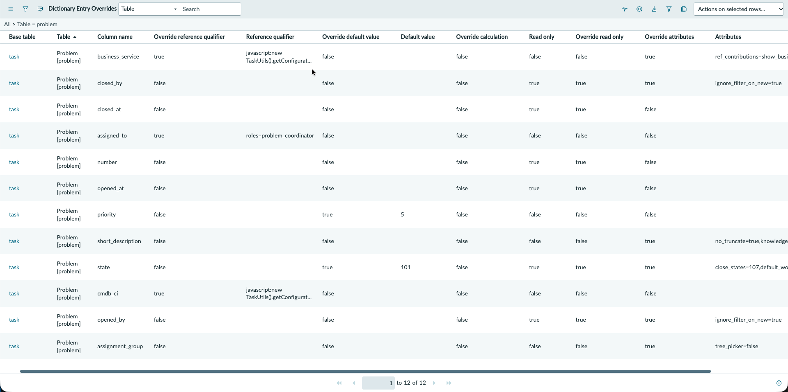
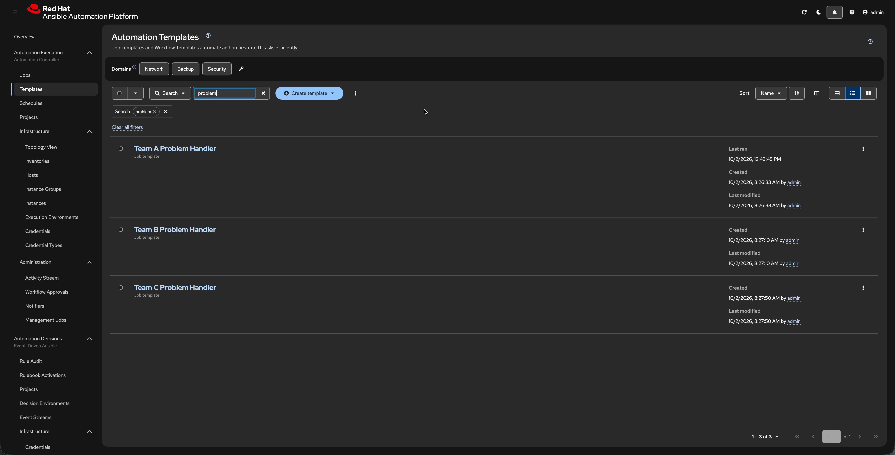
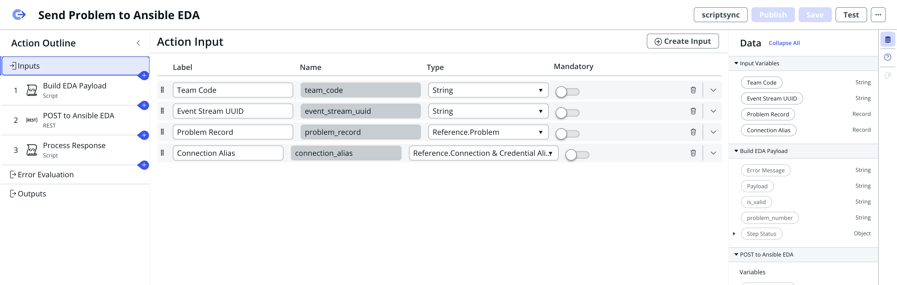
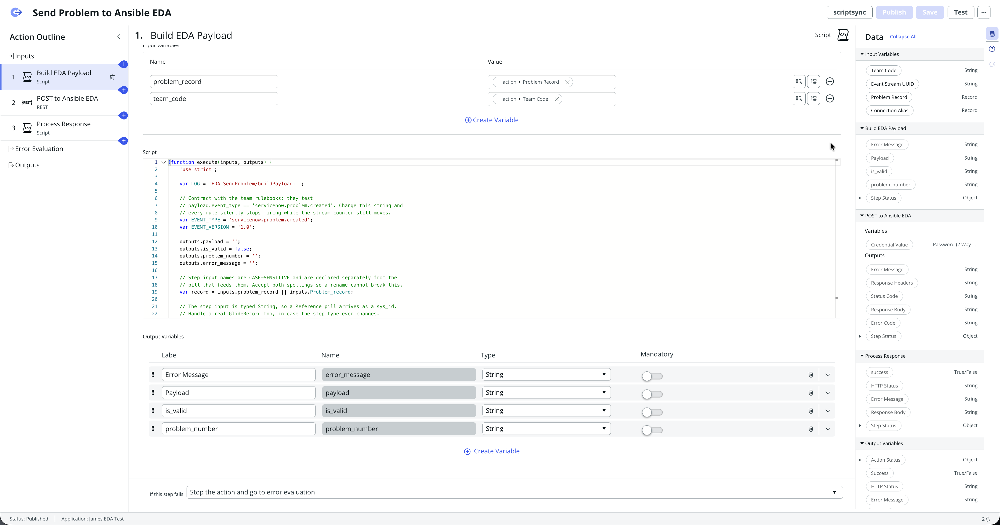
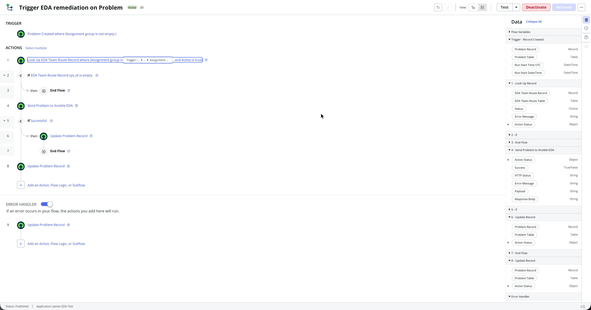
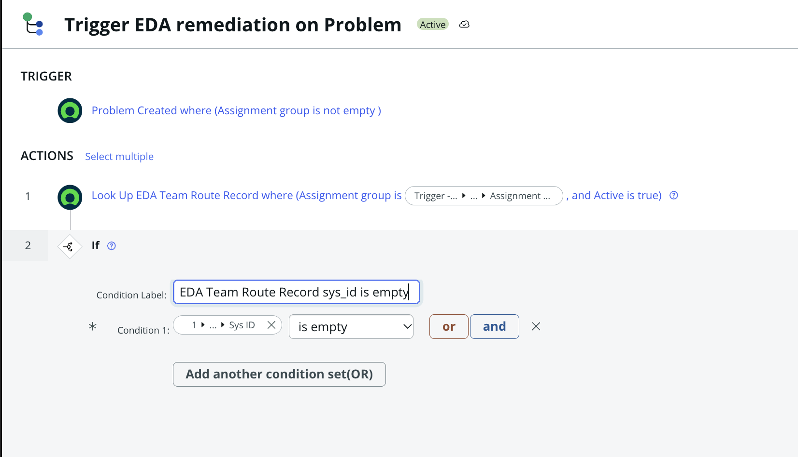
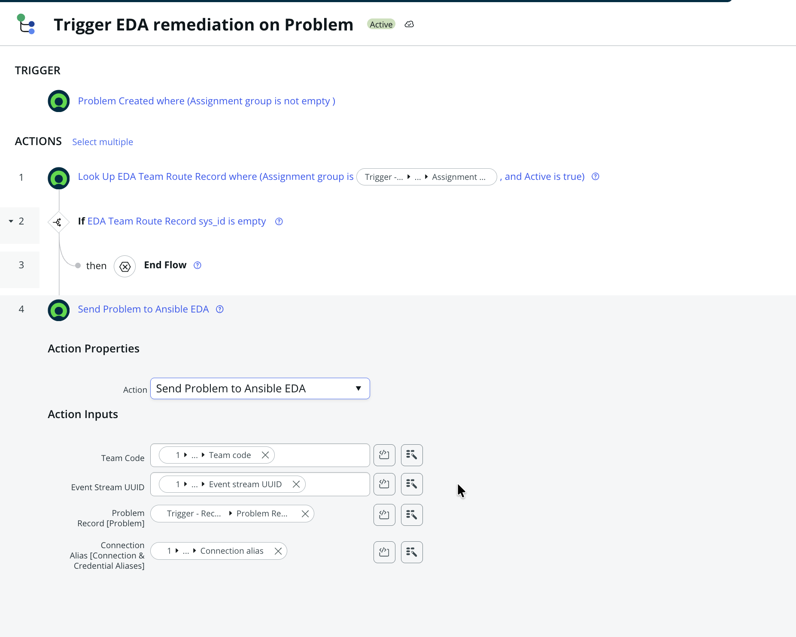
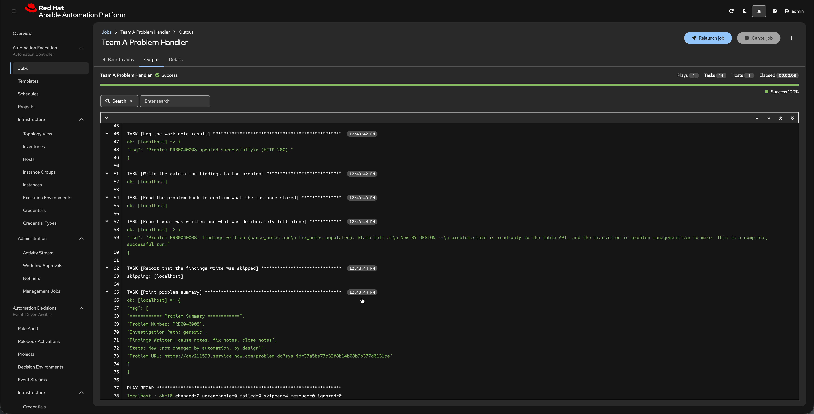
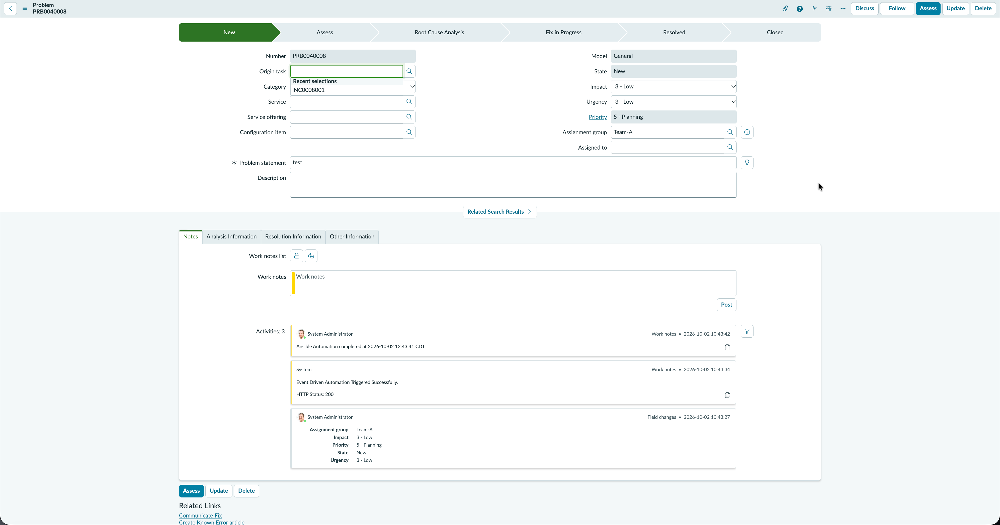

# Adding a record type — SCTASK and Problem

**Written for someone who has not done this before.** Every step names the exact menu path. Do the
phases in order: each needs something the previous one made.

This adds **catalog tasks (SCTASK)** and **problems** alongside incidents, for teams that already
exist. It does not add a team — for that, see [08 §2 — Add a team](08-routine-ops.md#2-add-a-team).

> **Previous reading:** [06 — The Flow](06-servicenow-flow.md) builds the incident flow this document
> copies from, and its §3.2–§3.4 are the canonical treatment of the route gate. **Related:**
> [Rulebook anatomy](rulebook-anatomy.md) for the rule you add in Phase 4.

---

## What you are building, and what you are not

**Nothing about routing changes.** An SCTASK assigned to `Team-A` resolves through the *same*
`EDA Team Route` row as a Team-A incident — same stream, same alias, same UUID. The route table is
keyed on **assignment group**, and the record's group has not changed. **No new route rows, no schema
change.**

> ⚠️ **Keyed on assignment group, not on team code.** `team_code` is the table's *display* column and
> the value that rides in the payload as `target_team`; the column the lookup actually filters on is
> `assignment_group`, a reference to `sys_user_group`
> ([04 §4.1](04-servicenow-app.md#41-eda-team-route--which-stream-does-this-teams-work-go-to)). This
> matters here because §7.0 is entirely about getting a catalog task onto the right **group** — if the
> key were the team code, that whole phase would be unnecessary.

| | Incidents (today) | SCTASK (new) | Problem (new) |
|---|---|---|---|
| ServiceNow flow | `Trigger EDA remediation on Incident-EDA` | **new** | **new** |
| ServiceNow action | `Send Incident to Ansible EDA` | **new** | **new** |
| Enrollment table | — | **new** (catalog-item filter) | not needed |
| Route gate in the flow | — | covered by the enrollment gate | **required, and easy to miss** — see [§8.6](#86-the-flow-servicenow) |
| AAP job template | `Team X Incident Handler` | **new** per team | **new** per team |
| Playbook | `servicenow_incident_handler.yml` | **new** | **new** |
| Rulebook | existing file | **+1 rule** | **+1 rule** |
| Event stream / activation | unchanged | unchanged | unchanged |
| Can automation close the record? | yes | yes | **no** — see [§8.1](#81-what-problem-automation-can-and-cannot-do) |

> 🔴 **Do not edit `Trigger EDA remediation on Incident-EDA` or `Send Incident to Ansible EDA`.**
> Incidents work. A copy that breaks costs you nothing; an edit that breaks takes production
> incident handling with it.

**Why SCTASK needs an enrollment table and Problem does not.** You do not want *every* SCTASK
assigned to a team — only ones for specific catalog items. That is a second filter, and it belongs in
a ServiceNow table rather than the rulebook: enrolling an item then costs one row instead of a
rulebook edit plus a project sync plus an activation restart. Problems have no catalog item, so
assignment group is the only filter and the route table already provides it.

**But that is also why Problem needs its own route gate.** SCTASK's enrollment gate incidentally
stops an unrouted record reaching the action. Problem has no enrollment gate, so nothing stops it —
and the flow will happily call the action with an empty connection alias. Build the gate in §8.6.

**And read [§8.1](#81-what-problem-automation-can-and-cannot-do) before you start Problem at all.**
`problem.state` is read-only to the Table API, so Problem automation writes its findings and a human
performs the state change. That is a design decision, not a bug, and knowing it up front changes what
you build.

---

## Before you start

### Decide two things

1. **Items only, or also order guides?** **This build does both**, and the `Order guide` column
   exists on the live table with an active row using it — verified 2026-10-07. Items-only is the
   simpler starting point and the single-condition gate in [6.2](#62-step-1--the-enrollment-gate) is
   written for it, but if you are following this build rather than a minimal one, read
   [1.3](#13-also-enrol-by-order-guide--built-here) **before** you build that gate, because it becomes
   two condition sets.
2. **One team first.** Build Team A end to end before creating Team B and C job templates. A broken pattern replicated three times is three times the unpicking.

### Take a baseline

```bash
python3 scripts/verify_team.py --team team-a
```

Note the **event stream counters** it reports. When something looks wrong in Phase 7 you will want to
know what "before" was — the counters are how you tell *"the event never arrived"* from *"it arrived
and did not match"*, and that distinction is most of the debugging.

### Values for this build, already confirmed on this instance

Everything below is verified, not assumed. Substitute your own if you are following this elsewhere.

| Thing | Value |
|---|---|
| Catalog item | **James Test** |
| — its sys_id | `81c1c517c32b8314b08b9b377d0131c3` |
| — its class | `sc_cat_item`, so it passes the reference qual in 1.2 |
| — its fulfilment | **Step based**, with a Task step assigning `Team-A` |
| Assignment group | **Team-A** — sys_id `77b8a622c3ef4bd0b08b9b377d0131fe` |
| Route row | `team-a` / `Team-A` / `sn-team-a` — **already exists, do not add one** |
| A task already on Team-A | **SCTASK0010002**, sys_id `39e50917c36b8314b08b9b377d0131e5` |
| A task on the wrong group | `SCTASK0010001`, sys_id `7d144d5fc32b8314b08b9b377d0131c1` — useful for the 5.3 action test, which does not care about the group |

> ⚠️ **`SCTASK0010002` cannot be used for the end-to-end test.** It was created *before* the flow
> existed, and the trigger is **Record Created** — it has already been and gone. Use it to confirm the
> group is right (done), then order the item again once the flow is built.

---

## Phase 1 — The enrollment table (ServiceNow)

Set the **application picker** to **James EDA Test** before you start. Everything in this phase must
be created inside the scoped app.

### 1.1 Create the table

**All → System Definition → Tables → New**

| Field | Value |
|---|---|
| Label | `EDA Enabled Catalog Items` |
| Name | *(auto-fills to* `x_661661_james_tes_eda_enabled_catalog_items` *— leave it)* |
| Extends table | **leave empty** |
| Create module | ✅ ticked, so it appears in the app menu |
| Application | `James EDA Test` |

> ⚠️ **Do not tick "Auto-number".** Rows here are configuration, not tickets.

### 1.2 Add the columns

On the table's **Columns** related list, add these three:

| Column label | Type | Reference / Max length | Notes |
|---|---|---|---|
| `Catalog item` | **Reference** | `Catalog Item [sc_cat_item]` | The item to enrol |
| `Active` | **True/False** | default **true** | Lets you disable a row without deleting it |
| `Description` | **String** | 200 | Free text — why this item is enrolled |

> ℹ️ **Mark one column as the table's display column**, as [04 §4.2](04-servicenow-app.md) says —
> otherwise anything referencing this table shows a raw 32-character `sys_id` instead of a name.
> `Catalog item` is the sensible choice here.

On the **Catalog item** column, open it and set **Reference qual → Advanced**, with:

```
sys_class_name!=sc_cat_item_guide
```

> ⚠️ **Use `!=sc_cat_item_guide`, not `=sc_cat_item`.** `sc_cat_item_guide` *extends* `sc_cat_item`,
> so a reference field can hold either. Qualifying with `=sc_cat_item` looks right but hides
> Hardware, Software and Record Producer items, which are also subclasses — you would silently be
> unable to enrol most of the catalogue.

### 1.3 Also enrol by order guide — built here

**This column is built on this instance and is in use.** Verified 2026-10-07: the live table carries
`order_guide` (Reference → `sc_cat_item_guide`) alongside `catalog_item`, with **two active rows** —
one enrolling the item `James Test`, one enrolling the guide `James Test Order Guide`.

**You can still skip it** on a minimal build: the `Catalog item` column alone covers every individual
item, including Hardware, Software and Record Producer subclasses. Add the guide column when you want
*"anything ordered through guide X is eligible"* as well. It is a second, independent way in — a task
passes the gate if **either** its item is enrolled **or** its order guide is.

Add one more column:

| Column label | Type | Reference | Reference qual |
|---|---|---|---|
| `Order guide` | Reference | `Order Guide [sc_cat_item_guide]` | *(none needed)* |

A row then uses **one or the other**, never both: either name an item, or name a guide.

**The two columns match different source fields, and this is the part that goes wrong:**

| Enrol by | Compare the row's column against |
|---|---|
| `Catalog item` | `Trigger → Catalog Task Record → Item` |
| `Order guide` | `Trigger → Catalog Task Record → Request item → Order Guide` |

> 🔴 **A guide can never be matched against the item field.** `cat_item` always holds the *individual*
> item — even for a guide-ordered task — and guide identity lives only in `sc_req_item.order_guide`.
> An earlier production implementation wrote the condition as `Item → Name is <guide name>`, which compares
> `cat_item.name` to a guide name, returns zero records, and meant **EDA never fired for
> guide-ordered items at all** — silently, for months. Match `order_guide`, never `cat_item`.

If you add this column, the gate in **6.2** becomes two condition sets OR'd together:

```
( Catalog item  is  Trigger → Catalog Task Record → Item
  AND Catalog item is not empty )
OR
( Order guide   is  Trigger → Catalog Task Record → Request item → Order Guide
  AND Order guide is not empty )
```

> 🔴 **Each set needs its own `is not empty` guard, and this is the trap that fails *open*.** A task
> not ordered through a guide resolves the guide pill to empty. Without the guard that set generates
> `order_guide=`, which matches **every row whose Order guide is empty** — that is, all of your item
> rows. Result: every catalog task passes the gate. The guard makes the set self-contradictory when
> the pill is empty (`order_guide ISNOTEMPTY ^ order_guide=` matches nothing), which is exactly what
> you want. The mirror guard applies to the item set.

> ⚠️ **This is also why you must not use For Each.** An item enrolled *both* directly and via a guide
> matches two rows, and iterating would launch two AAP jobs for one task. `Count > 0` is
> duplicate-proof.

This PDI has **three** active order guides, verified 2026-10-07: `Request Developer Project
Equipment`, `New Hire`, and `James Test Order Guide` — the last being the one this build actually
enrols. One guide row beats maintaining a list of its members, which is the whole argument for the
mechanism on a real catalogue.

> ⚠️ **Governance note if you do use guides:** guide membership is owned by the catalog team, so their
> additions silently expand what your automation fires on. There is no technical control for that —
> review the guide's contents periodically instead.

### 1.4 Turn off update-set syncing

**All → System Definition → Tables →** open your table **→** right-click the header **→ Configure →
Table**. Find **Update synch** and make sure it is **unticked**.

> ⚠️ **`update_synch = true` is a trap.** It drags row changes into update sets, so enrolling an item
> becomes a code promotion instead of a data change — which defeats the entire reason for having this
> table.

### 1.5 Seed one row for testing

Open the new module (**James EDA Test → EDA Enabled Catalog Items → New**) and create one row:

| Field | Value |
|---|---|
| Catalog item | pick any active item — e.g. **Standard Laptop** |
| Active | ✅ true |
| Description | `Test enrolment for EDA SCTASK routing` |

Write down the item name — you will set it on the test task in Phase 7.

> ✅ **Verify:** the list shows one row, the Catalog item reference resolves to a real item name, and
> Active is true. Then open the **Catalog item** field's magnifier and confirm you can see Hardware
> and Software items in the picker — if you can only see a handful, your reference qual is wrong.

---

## Phase 2 — The playbooks (Git)

An SCTASK is not an incident: different table, different close semantics. The incident playbook
closes with `close_code` / `close_notes`; a catalog task closes by setting **state 3, Closed
Complete**.

Create `servicenow_sctask_handler.yml` in the repo root, modelled on
`servicenow_incident_handler.yml`. The differences that matter:

| | Incident | SCTASK |
|---|---|---|
| Table | `/api/now/table/incident/{sys_id}` | `/api/now/table/sc_task/{sys_id}` |
| Close | `close_code` + `close_notes` | `state: 3` (Closed Complete) + `close_notes` |
| Gate variable | `sn_close_incident` | `sn_close_task` |

Reference — the `sc_task` state values on your instance:

```
1   Open              2   Work in Progress    3   Closed Complete
4   Closed Incomplete 7   Closed Skipped     -5   Pending
```

Do the same for `servicenow_problem_handler.yml` when you get to Phase 8.

> ⚠️ **Keep `| default('')` on every mapped variable**, exactly as the incident playbook does. One
> missing key fails the whole action with `Object of type StrictUndefined is not JSON serializable`
> and launches nothing.

**Commit and push.** The EDA project can only offer a rulebook the remote already has, and the
controller project can only offer a playbook it has synced.

> ✅ **Verify:** `python3 -c "import yaml;yaml.safe_load(open('servicenow_sctask_handler.yml'))"`
> exits silently, and the file is on your branch on GitHub.

---

## Phase 3 — Job templates (AAP)

One per record type **per team**. Start with Team A only; repeat once it works.

**Automation Execution → Templates → Create template → Create job template**

| Field | Value |
|---|---|
| Name | `Team A SCTASK Handler` |
| Job type | Run |
| Organization | `Team A` |
| Inventory | `Team A Inventory` |
| Project | `EDA ServiceNow - Team A` |
| **Playbook** | **`servicenow_sctask_handler.yml`** |
| Credentials | `ServiceNow PDI - Team A` |
| **Variables → Prompt on launch** | ✅ **REQUIRED** |

First **sync the controller project** (`EDA ServiceNow - Team A` → **Sync**) or the new playbook will
not appear in the dropdown.

> 🔴 **Pick the playbook, not a rulebook.** The dropdown lists everything in the repo, including
> `rulebooks/team_a_rulebook.yml`. Choosing a rulebook fails at event time with
> `ERROR! 'sources' is not a valid attribute for a Play`, which sends you debugging the rulebook
> instead of this field.

> ✅ **Verify:** reopen the template. **Prompt on launch** ticked, **Playbook** is
> `servicenow_sctask_handler.yml`, and the name matches character-for-character what you will put in
> the rulebook in Phase 4.

---

## Phase 4 — Add a rule to the team's rulebook (Git + AAP)

Edit `rulebooks/team_a_rulebook.yml` and add a **second rule** alongside the existing one. Do not
create a second rulebook file: one activation runs one rulebook, and a second activation on the same
stream would receive **every** event twice because stream delivery is fan-out.

```yaml
    - name: Launch Team A SCTASK handler
      condition: >-
        event.meta.eda_event_stream_name == "sn-team-a" and
        event.payload.event_type == "servicenow.sctask.created"
      action:
        run_job_template:
          name: "Team A SCTASK Handler"
          organization: "Team A"
          job_args:
            extra_vars:
              task_number: "{{ event.payload.task_number | default('') }}"
              short_description: "{{ event.payload.short_description | default('') }}"
              sys_id: "{{ event.payload.sys_id | default('') }}"
              catalog_item: "{{ event.payload.catalog_item | default('') }}"
              assignment_group: "{{ event.payload.assignment_group | default('') }}"
              event_version: "{{ event.payload.event_version | default('') }}"
              source: "{{ event.payload.source | default('') }}"
              target_team: "{{ event.payload.target_team | default('') }}"
              source_stream: "{{ event.meta.eda_event_stream_name | default('') }}"
              sn_close_task: true
```

**Both rules test the stream name** — that stays your tenant proof, and it is platform-injected so it
cannot be forged. `event_type` only has to distinguish *record type*, and your own flow is the only
thing that sets it.

> 🔴 **Condition on an explicit `event_type` value. Never on "this field exists".** Presence-matching
> works with one record type and silently starts cross-matching the moment a second one shares the
> stream — an SCTASK would fire the incident rule as well.

**Commit and push**, then in AAP:

1. **Automation Decisions → Projects →** `Ansible EDA Test - Team A` **→ Sync**
2. **Automation Decisions → Rulebook Activations →** `team-a-incidents` **→** gear icon **→
   re-attach** the `sn-team-a` event stream mapping
3. **Restart** the activation

> ⚠️ **Step 2 is not optional.** The source mapping is pinned to a SHA256 of the rulebook file. Any
> edit changes it, and skipping the re-attach fails with *"Rulebook has changed since the sources were
> mapped."* Even a whitespace-only change invalidates it.

> ✅ **Verify:** `python3 scripts/verify_team.py --team team-a` passes with **no FAIL rows**,
> including *"source mapping matches the synced rulebook (not stale)"*. The activation shows
> **Running** and its log ends with `Waiting for events`.
>
> Read the header line it prints — `Record types in team_a_rulebook.yml: incident + sctask + problem`
> — and confirm it lists the type you just added. **Do not look for a fixed check total:** the count
> scales with how many record types the team handles, so it differs per team by design (Team A
> scores 46, Team C 40 with one `SKIP` — and those numbers move whenever a check is added, so treat
> them as examples rather than targets).

---

## Phase 5 — The SCTASK action (ServiceNow)

Application picker on **James EDA Test**.

### 5.1 Copy the working action

**All → Process Automation → Workflow Studio →** find **`Send Incident to Ansible EDA`** **→** the
**⋯** menu **→ Copy**. Name the copy **`Send SCTASK to Ansible EDA`**.

Copying gets you the REST step and the response handler already wired, which are the fiddly parts.
You will only replace the first step's script.

### 5.2 Action inputs

The copy inherits four inputs. Rename the record one so it reads correctly, and keep the rest —
they are what make one REST step serve every team:

| Input | Type | Notes |
|---|---|---|
| `Catalog Task Record` | Reference → `Catalog Task [sc_task]` | was `Incident Record` |
| `Team Code` | String | |
| `Event Stream UUID` | String | |
| `Connection Alias` | Reference → Connection & Credential Aliases | |

### 5.3 Replace the payload-builder script

Open **step 1** and paste your SCTASK script. It must satisfy the same contract the incident one
does, or the later steps have nothing to send:

| Must set | Why |
|---|---|
| `outputs.payload` | JSON string — the REST step's body |
| `outputs.is_valid` | `true` on success |
| `outputs.error_message` | populated on failure |
| `payload.event_type` | **exactly** `servicenow.sctask.created` — must match the rulebook |
| `payload.event_version`, `payload.source`, `payload.target_team` | the reserved routing keys |
| `payload.sys_id`, `payload.task_number` | the playbook needs these to write back |

`target_team` comes from the **`team_code`** action input — declare that input *and* map its pill, or
every payload ships `target_team` empty with no error at all.

#### Reading the catalog variables — do not reach for `GlobalWorkflowHelper`

An SCTASK payload usually wants the catalog variables the requester filled in. If you are porting a
script from another instance it will probably call **`global.GlobalWorkflowHelper`** to get them.
**That class does not exist here**, and the failure reads like a scope or privilege problem rather
than a missing class.

Read the variable pool directly off the RITM instead:

```javascript
// The RITM carries the catalog item, the order guide and the variables.
var mtom = new GlideRecord('sc_item_option_mtom');
mtom.addQuery('request_item', ritm.getUniqueValue());
mtom.query();
while (mtom.next()) {
    var varName = mtom.sc_item_option.item_option_new.name.toString();
    if (varName) {
        payload[varName] = cleanFieldValue(mtom.sc_item_option.value.toString());
    }
}
```

`sc_item_option_mtom` is the many-to-many between the requested item and its answers;
`sc_item_option.item_option_new.name` is the variable's **name** and `sc_item_option.value` is the
answer. Get the RITM from `task.getValue('request_item')`.

> 🔴 **Loop the catalog variables FIRST, then set the reserved keys.** A variable named `event_type`,
> `sys_id` or `target_team` would otherwise overwrite a routing key and break the rule match — and it
> would look like a rulebook bug. Setting the reserved keys last makes a collision harmless.

> ⚠️ **Cross-scope privileges.** Reading these from a scoped app needs `sys_scope_privilege` records
> for `sc_task`, `sc_req_item`, `sc_request`, `sc_item_option` and `task`. They exist in this app
> already; if you build the action in a *new* scope, expect a runtime failure that reads like a code
> bug until you add them.

> 🔴 **Step input names are case-sensitive, and declaring a variable is separate from mapping a pill
> into it.** The incident action declares `Incident_record` (capital I) while its action input is
> `incident_record`; those are *different variables*. An unmapped input is silently empty at run
> time. Make your script's guard clause list the keys of `inputs` so a mismatch is one line to
> diagnose instead of a bisection.

> ✅ **Verify:** **Test** the action with a real `sc_task` sys_id and confirm step 1 outputs a
> populated `payload` with `event_type` reading `servicenow.sctask.created`, and `target_team`
> **not** empty.

---

## Phase 6 — The SCTASK flow (ServiceNow)

**Workflow Studio → New → Flow.** Name it `Trigger EDA remediation on SCTASK`. Set
**Flow properties → Run as: System user** — a non-admin caller may be unable to read the credential,
which surfaces as an empty token rather than a permission error.

### 6.1 Trigger

| Field | Value |
|---|---|
| Trigger | **Record Created** |
| Table | `Catalog Task [sc_task]` |
| Condition | `Assignment group` **is not empty** |

Keep the trigger condition coarse. It only has to be a *superset* — the enrollment gate below is the
authoritative filter. A narrow trigger that disagrees with the table is two sources of truth.

### 6.2 Step 1 — the enrollment gate

**Add an Action → ServiceNow Core → Look Up Records**

| Field | Value |
|---|---|
| Table | `EDA Enabled Catalog Items` |
| Conditions | `Catalog item` **is** `Trigger → Catalog Task Record → Item` **AND** `Active` **is** true |

> 🔴 **The single condition set above is the minimal build. It is NOT what is live on this instance.**
> This build enrols by order guide as well ([§1.3](#13-also-enrol-by-order-guide--built-here)), so its
> gate is **two OR'd condition sets**, each carrying its own `Active is true` *and* its own
> `is not empty` guard — the block at the end of §1.3 shows both. Build that version if you are
> following this instance.
>
> **Both branches are proven, not assumed:** `James Test` is enrolled as an item, and
> `James Test Order Guide` as a guide, so a task for `James Test - VM Snapshot` — which is **not**
> individually enrolled — is caught only by the guide row.
>
> §1.3 is ~250 lines before this step, which is exactly why this warning repeats here rather than
> trusting you to remember it.

Then **Add Flow Logic → If**, with the condition:

```
1 - Look Up Records → Records → Count   greater than   0
```

Everything else in the flow goes **inside this If's true branch**. That is fail-closed: if anything
stops the If evaluating, nothing is sent.

> 🔴 **Branch on `Count`, never on `Records is empty`.** The latter compares a record-list object to
> a string, is always false, and the gate **silently never fires** — every SCTASK reaches EDA. That
> exact bug shipped in a production build.

> 🔴 **Guard the compared column.** Add `Catalog item` **is not empty** as well. A task with no
> catalog item resolves the pill to empty, generating `catalog_item=`, which matches every row whose
> catalog item is empty — so the gate passes everything. This one fails *open* and looks like it is
> working.

> ⚠️ **Do not use For Each on this lookup.** If an item is ever enrolled twice you would launch two
> AAP jobs for one task. The `Count > 0` test is duplicate-proof; iteration is not.

> ⚠️ **Keep the lookup out of the action.** It belongs here in the flow. Inside the payload builder,
> "not enrolled" becomes indistinguishable from "failed" and fires the Error Handler and its email on
> every unenrolled task.

### 6.3 Step 2 — the route lookup

Inside the true branch, **Look Up Record** (singular) on `EDA Team Route`:

| Field | Value |
|---|---|
| Conditions | `Assignment group` **is** `Trigger → Catalog Task Record → Assignment group` **AND** `Active` is true |

Tick **Don't fail on error**, then add an **If**: `EDA Team Route Record → Sys ID` **is not empty**.

> ⚠️ Gate on a **scalar field** like Sys ID, never on the Record pill itself — comparing a record
> object to Empty is a string compare and is always false.

### 6.4 Step 3 — call your action

Add **`Send SCTASK to Ansible EDA`** and map its four inputs:

| Input | Pill |
|---|---|
| Catalog Task Record | `Trigger → Catalog Task Record` |
| Team Code | `2 → EDA Team Route Record → Team code` |
| Event Stream UUID | `2 → EDA Team Route Record → Event stream UUID` |
| Connection Alias | `2 → EDA Team Route Record → Connection alias` |

> 🔴 **Feed the Connection alias the bare reference pill. Do not dot-walk to Sys ID.** A dot-walked
> or empty pill produces `Unable to load connection with alias ID:  <a href="/sys_alias.do?sys_id=">`
> — and the blank after `sys_id=` is the signature of an unresolved pill, not a bad route row.

On the action's REST step, confirm **If this step fails → "Don't stop the action and go to the next
step"**. Without it a non-2xx aborts the action and the flow goes silent.

### 6.5 Step 4 — write a work note

Optional but worth it, and it is how you will see the result without opening AAP. **Update Record**
on `Trigger → Catalog Task Record`, setting **Work notes** to a success message plus the action's
**HTTP Status** pill.

**Save**, then **Activate** the flow.

> ✅ **Verify:** the flow shows **Activated**, and `Run as` reads **System user**.

---

## Phase 7 — Test

### 7.0 First, make the task land on your team

> 🔴 **The assignment group on a catalog task comes from fulfilment configuration, not from you.**
> This is the single most surprising thing about wiring SCTASKs, and it is worth understanding before
> you test rather than after.
>
> Ordering `James Test` produced `REQ0010001 → RITM0010001 → SCTASK0010001` correctly — but the task
> was assigned to **`Procurement`**. At that point the item was still on the legacy
> `Service Catalog item request` flow with its **Fulfillment group** empty, so fulfilment fell back to a
> default group. (It has since been moved to step-based fulfilment — see the table below.) Your route
> table only knows
> `Team-A/B/C`, so that task resolves **no route row** and is dropped by the gate in 6.3. The flow is
> working; the group is wrong.

**How you set the group depends on which fulfilment model the item uses**, and this is the part that
wastes time — the two models read *different* configuration and silently ignore each other's.

Open the item: **All → Service Catalog → Catalog Definitions → Maintain Items →** `James Test`, and
look at its **Fulfilment** / flow setting.

| If the item uses | Set the group here | The other field is **ignored** |
|---|---|---|
| **Step based request fulfillment** *(newer, Flow Designer)* | The item's **fulfilment steps** — add or edit a **Task** step and set its **Assigned group** to `Team-A` | `sc_cat_item.group` stays empty and does nothing |
| `Service Catalog item request` *(legacy, workflow-driven)* | The item's **Fulfillment group** field (`sc_cat_item.group`) | the step config, which does not exist |

> ⚠️ **`Fulfillment group` being empty is not evidence the group is unset.** On a step-based item that
> field is *expected* to be empty — the real value lives in `sc_service_fulfillment_task_step.assigned_group`.
> Checking the wrong one leads you to "fix" something that was never broken.

`James Test` on this instance is **step based**, with a Task step titled `Assign to Team A` whose
assigned group is `Team-A`. Every future order creates its catalog task on `Team-A`, which the existing
route row already handles — no new route row, no hand-created records.

> ⚠️ **Step-based fulfilment creates one task per configured step.** Add a second step and you get a
> second SCTASK, and **both** reach your flow, route, and launch a job. The enrollment gate cannot
> separate them — it keys on catalog item and they share one. Filter on the task's short description
> or step in the flow's trigger condition if that is not what you want.

> ⚠️ **Changing the group does not fix the task you already have.** Your flow triggers on **Record
> Created**, so editing `SCTASK0010001`'s group will not re-fire it. Order the item again to get a
> fresh task. Do not "fix" this by switching the trigger to Created-or-Updated — that would re-fire on
> every subsequent edit to the task, including the work note your own playbook writes back, which is a
> loop.

**The alternative, if you cannot change fulfilment:** add a route row for the group fulfilment
*actually* assigns (`team_code = procurement`, `assignment_group = Procurement`, pointing at whichever
team's stream should own it). That is the realistic production shape — in a real catalogue the
fulfilment groups already exist and are owned by other teams, so **your route table must be keyed on
the groups fulfilment assigns**, not on names you invent.

**You can still use `SCTASK0010001` right now** for the Phase 5.3 action test — testing the action in
isolation does not care about the assignment group:

```
sys_id = 7d144d5fc32b8314b08b9b377d0131c1
```

### 7.1 The end-to-end test — order the item

With the Fulfillment group set, order it for real. This is the better test because it exercises the
whole chain, including the trigger firing on a task *you* did not create.

**Service Portal or the Service Catalog → find `James Test` → Order Now**

That produces `REQ… → RITM… → SCTASK…`. If the RITM stops on an approval, approve it
(**All → Service Desk → My Approvals**, or open the RITM's Approvers related list and set the
approval to Approved as admin).

> ✅ **Before going further, check the new task's Assignment group reads `Team-A`.** If it still says
> `Procurement`, the Fulfillment group did not take effect — see the fallback in 7.0 rather than
> pressing on, because nothing downstream can work until the group matches a route row.

<details>
<summary>Fallback: create the task by hand</summary>

If ordering is inconvenient, **All → Catalog Task → New** (table `sc_task`) with:

| Field | Value |
|---|---|
| Assignment group | `Team-A` |
| Item | the catalog item you enrolled in 1.5 |
| Short description | `EDA SCTASK routing test` |

Save. This fires the same trigger, so every check below still applies.

</details>

### 7.2 What to check, in this order

| # | Check | Where | Expect |
|---|---|---|---|
| 1 | Flow ran | the flow's **Executions** | Enrollment If = **true**, route If = **true** |
| 2 | Action result | expand step 3 | `http_status = 200`, `success = true` |
| 3 | Event arrived | AAP → Event Streams | `sn-team-a` incremented; **`sn-team-b` and `sn-team-c` unchanged** |
| 4 | Job ran | AAP → Jobs | `Team A SCTASK Handler`, **Successful** |
| 5 | Routing correct | that job → Extra variables | `target_team: team-a`, `source_stream: sn-team-a` |
| 6 | Write-back | the task | Work note added, state **Closed Complete** |

**Then test the negative case, which matters more.** Create a second task with Assignment group
`Team-A` but an item you did **not** enrol. Expect: the flow runs, the enrollment If is **false**,
nothing is sent, and `sn-team-a` does **not** increment. If it does increment, your gate is one of
the two fail-open bugs above.

---

## Phase 8 — Problem

Built and verified 2026-10-02. **Problem is the same shape as SCTASK minus Phase 1, plus one thing
SCTASK got for free.** Problems have no catalog item, so there is no enrollment table — but that
means the route lookup is the *only* filter, and nothing stops the flow when the lookup finds
nothing. SCTASK's enrollment gate happened to cover that case. Problem needs its own gate, as §8.5
explains, and skipping it is how the first build failed.

Read §8.1 before anything else. It changes what this phase is for.

### 8.1 What Problem automation can and cannot do

**It cannot change the problem's state, and neither can anything else that uses the Table API.**
Three separate attempts proved this; the evidence is worth stating once so nobody repeats them:

| Field | Where | `read_only` |
|---|---|---|
| `task.state` (the parent table) | `sys_dictionary` | false |
| **`problem.state`** | **`sys_dictionary_override`** | **true** |
| `problem.resolution_code` | `sys_dictionary` | **true** |
| `problem.resolved_at`, `problem.resolved_by` | `sys_dictionary` | **true** |

The Table API **silently discards** dictionary-read-only fields. No 400, no 403, no `sys_audit` row
— HTTP 200 and nothing changed. And because `state` never changes, the before-update business rule
`Problem Model: Check State Transition` never even fires, so this is not the state model rejecting a
transition. The write is dropped a layer earlier than that.

> 🔴 **Do not try to confirm this on the Dictionary Override *form*.** The form has a checkbox
> labelled **"Override read only option"** which is a *different field* from the `read_only_override`
> boolean that carries the value — and on this record that checkbox is **unticked** while
> `read_only_override` and `read_only` are both **true**. Read the form and you will conclude the
> opposite of the truth.
>
> Check the **list view** with the real columns instead:
> `sys_dictionary_override_list.do?sysparm_query=name=problem`, then add the **Read only** and
> **Override read only** columns. Or read it over the API, which is unambiguous:
>
> ```
> read_only           true
> read_only_override  true
> read_only_option    instance_configured
> ```



What was tried, so you do not retry it:

| Attempt | Result |
|---|---|
| Single PATCH, 101 → 106 | HTTP 200, state unmoved |
| One rung at a time, 102 → 103 → 104 → 106 | All four rungs HTTP 200, state unmoved. The ladder matched the model's real path (`sttrm_state_transition` confirms New → Assess → Root Cause Analysis → Fix in Progress → Resolved → Closed) — the shape of the request was never the problem |
| `servicenow.itsm.problem` module | Needs the Store app *API for Red Hat Ansible Automation Platform Certified Content Collection*, which is not installed here **or at Centene**. Not a transferable route |

> 🔴 **Do not "fix" this by writing `problem_state`.** That field *is* writable, and the business
> rule `Copy Problem State to State` (before, order 1000000) would mirror it into `state`. But
> `Check State Transition` runs at order 100 and inspects `state`, still unchanged at that point — so
> you bypass the state model entirely. Combined with `resolution_code`, `resolved_at` and
> `resolved_by` all being read-only, you get a record sitting in Resolved with no resolution code and
> no resolver. **A half-resolved record that looks finished is worse than an honest New.**

**The asymmetry worth remembering, because it generalises:** read-only is a UI/API-layer control, not
a database one. A **server-side** `GlideRecord` update — a UI Action, a Flow Designer *Update Record*
step, a Business Rule, a Scripted REST resource — is not blocked by it **and still runs the state
model**. That is why the form's **Resolve** button works: it is client script doing
`g_form.setValue('state', …)` then `g_form.save()`. The UI buttons are `move_to_assess`,
`move_to_rca`, `move_to_fix_in_progress`, `move_to_resolved` and `move_to_closed` in `sys_ui_action`.

**So the design is: automation writes its findings, a human performs the state change.** The playbook
writes `cause_notes`, `fix_notes` and `close_notes` — which do accept Table API writes — and sends no
`state` and no `resolution_code`. The job is then honestly green when it has done everything it was
asked to do, instead of reporting success for a transition that silently never happened.

### 8.2 The playbook (Git)

`servicenow_problem_handler.yml` on `main`. Same structure as the incident and SCTASK handlers: assert
`SN_HOST`, display the payload, warn on missing routing keys, pick an investigation path, write a work
note, then write the findings.

Two things in it that exist because of §8.1:

- The findings PATCH is **allowed to fail the job** — no `failed_when: false`. Those three fields do
  accept writes, so a non-200 is a real fault (credential, network, record vanished), not the platform
  declining a transition.
- The **read-back is kept anyway**, and asserts `cause_notes` came back non-empty. A 200 that writes
  nothing is exactly the failure this play hit three times. If the notes ever read back empty, the
  message tells you to re-check `sys_dictionary` and `sys_dictionary_override` rather than blame the
  credential.

> ⚠️ `sn_resolve_problem` is a **deliberately inaccurate name**. It gates writing the findings, not
> resolving. Renaming it means editing all three rulebooks, which invalidates their source-mapping
> hashes and costs a sync + re-attach + restart per team. Batch the rename with your next rulebook
> change rather than paying that cycle for cosmetics.

### 8.3 Job templates — all of them, BEFORE you sync anything

**Create the job template for every team before syncing any project.** The rulebooks name
`Team A/B/C Problem Handler`; sync and restart before those exist and every problem fires a rule that
cannot launch.

> 🔴 **A missing job template fails silently from the ServiceNow side.** The stream counter moves, the
> rule fires, **no job record is created**, the record is untouched and nothing is written back. The
> only evidence is the activation log: `ERROR - Job template X in organization Y does not exist`.

Each one: playbook `servicenow_problem_handler.yml`, job type **Run**, that team's
organization / inventory / project, **Prompt on launch ON** next to Extra variables, and that team's
ServiceNow credential.



### 8.4 The rulebook rule (Git + AAP)

A third rule per rulebook, conditioned on **both** the stream name and
`event.payload.event_type == "servicenow.problem.created"`. Map `problem_number`,
`short_description`, `assignment_group`, `cmdb_ci`, `sys_id`, the three reserved routing keys,
`source_stream`, and `sn_resolve_problem: true` — every one with `| default('')`.

Then **sync → re-attach the stream mapping (gear icon) → restart**, per team. Batch rulebook edits so
you pay that cycle once.

> ✅ **Verify:** each activation's `rulebook_hash` equals
> `git show <synced-revision>:rulebooks/team_x_rulebook.yml | shasum -a 256`.

### 8.5 The action (ServiceNow)

Copy **`Send SCTASK to Ansible EDA`**, not the incident one — it is the closer template. Name it
**`Send Problem to Ansible EDA`**.

Rename the record input to **`Problem Record`**, Reference → `Problem [problem]`, and keep
`Team Code`, `Event Stream UUID` and `Connection Alias`.



Then three things the copy leaves behind, all of which are easy to miss:

| Where | Leftover | Fix |
|---|---|---|
| Step 1, output 4 | `incident_number` | Rename to **`problem_number`**. Miss this and your script writes to an undeclared output — silently dropped |
| Step 3, `var LOG` | `EDA SendIncident/handleResponse:` | Change to `EDA SendProblem/…`, or Problem failures file themselves under the wrong name in `syslog` |
| Step 3, inputs | no record identifier | Add a `problem_number` input fed from step 1's output and prefix it onto `error_message`, so a failed POST names the record |



**Do not rewrite step 3's logic** — `Process Response` is record-type agnostic. Only the `LOG` prefix
and that one extra input are worth changing.

Step 1's script must satisfy the same contract as the other two, with `payload.event_type` reading
**exactly** `servicenow.problem.created`. Read the record back with `GlideRecord` from the sys_id —
every ext input is typed String, so a Reference pill arrives as a **sys_id, not a GlideRecord**.

> 🔴 **If you are porting a payload script from another instance, check every field exists.** Ten
> `u_*` fields on a Centene problem form do not exist here. `getFieldValue(undefined)` returns `''`
> rather than throwing, so you ship ten permanently-empty keys and never hear about it. Verify
> against `sys_dictionary` for `problem` **and** `task` — `state`, `priority` and `assignment_group`
> all live on the parent.

### 8.6 The flow (ServiceNow)

**Workflow Studio → New → Flow**, named `Trigger EDA remediation on Problem`, **Run as: System user**.

```
TRIGGER  Problem Created  WHERE  Assignment group is not empty
1  Look Up Record  on EDA Team Route
       Conditions: Assignment group  is  <trigger> Problem Record > Assignment group
                   Active            is  true
       Don't fail on error:  TICKED
2  If   EDA Team Route Record > Sys ID   IS EMPTY
3        then  End Flow
4  Send Problem to Ansible EDA
5  If   Successful  →  work note / error work note
```

> ⚠️ **Put `Assignment group is not empty` on the trigger**, not just in the lookup. It costs nothing
> and it stops the flow starting at all for a problem that cannot possibly route — which keeps the
> Executions list readable, because every run you see is one that had a reason to run. Without it the
> gate still protects you, but you accumulate a flow execution for every problem on the instance.

Note the numbering: `End Flow` is a nested step and takes its own number, so the action is step **4**
and the success If is step **5**. What matters is the *indentation* — only `End Flow` is inside the
If; steps 4 and 5 are at the outer level.



**Step 2 is the route gate, and it is the step the first build left out.** Without it, a problem whose
assignment group has no route row still calls the action — with an empty connection alias and an empty
stream UUID. You get a confusing failure and a work note on the record, when the real situation is
just "this group is not onboarded".



> 🔴 **Two traps in that one If.**
> 1. **Drill all the way down to `Sys ID`.** Dragging the `EDA Team Route Record` pill itself and
>    comparing it to Empty is a *text comparison on a record object* — never equal to empty, so the
>    condition is always false, `End Flow` never runs, and the gate does nothing while looking
>    perfectly correct on screen.
> 2. **`Don't fail on error` on step 1 is what makes the gate necessary.** It turns "found nothing"
>    from a flow-aborting error into an empty record, which is what you want — but it also means the
>    flow sails on with empty pills unless you check.

This shape — a guard If containing only `End Flow`, with the real work left at the outer level — is
deliberately flatter than wrapping steps 3 and 4 inside an `is not empty` If. Wrapping needs existing
steps dragged into a branch, and half-dragging leaves a step outside the gate that still runs.

> ✅ **That reasoning is now the documented retrofit for any flow**, not just Problem — see
> [06 §3.4](06-servicenow-flow.md#34-retrofitting-the-gate-into-a-flow-you-have-already-built), which
> arrived at the same conclusion independently and gives the step-by-step. The Incident flow was
> retrofitted this way on 2026-10-07.

> ⚠️ **This gate is fail-closed but *silent*, and [06 §3.3](06-servicenow-flow.md) asks for more.**
> `End Flow` on its own means "unroutable" leaves no trace, which makes a misconfiguration look
> identical to a record that was never in scope. The fix is cheap and does not change the shape:
> **put an Update Record work note inside the `is empty` branch, before the `End Flow`**, naming the
> missing route row.
>
> This build has not done that yet, and §8.7's Test 2 below still expects *no work notes at all* —
> which is the honest description of what it does today, not a target to preserve. If you add the
> note, Test 2's expectation becomes **one** work note naming the group. A Send Email alongside it is
> deliberately deferred on this build ([06 §6](06-servicenow-flow.md)).

Then map **four pills** into the action step:

| Action input | Pill |
|---|---|
| Problem Record | `Trigger - Record Created ➛ Problem Record` — **bare** |
| Team code | `1 ➛ EDA Team Route Record ➛ Team code` |
| Event stream UUID | `1 ➛ EDA Team Route Record ➛ Event stream UUID` |
| Connection alias | `1 ➛ EDA Team Route Record ➛ Connection alias` — **bare reference, not `➛ Sys ID`** |



> 🔴 **Never dot-walk a record pill to `➛ Number` or `➛ Sys ID`.** This cost a full debugging round
> trip. There are **two independent mapping layers** that share variable names — the flow feeds the
> action's inputs, and the action feeds step 1's inputs — and you must map bare in both:
>
> - The **action** input is typed Reference, so a string pill there resolves to **nothing**.
> - Step 1's ext input is typed **String**, so `➛ Number` is type-compatible and silently delivers
>   `PRB00400NN` — which single-argument `GlideRecord.get()` reads as a sys_id, giving
>   `Problem not found: PRB00400NN`.
>
> **The diagnostic that tells the layers apart:** if `team_code` is *also* empty, the fault is the
> **flow** layer, because `team_code` is never dot-walked — it comes straight from the route lookup.
> A dot-walk off an *empty* Reference yields empty rather than erroring, so a flow-layer fault masks
> an action-layer one. Fix the flow first; the dot-walk then announces itself as `Problem not found`.

### 8.7 Test — both directions

Take a baseline of all three stream counters and the latest job id first.

**Test 1 — routed.** A problem with assignment group `Team-A`.

| Expect | |
|---|---|
| Counter | `sn-team-a` +1, the other two **unchanged** |
| Job | on that team's Problem template, `successful` |
| Record | `cause_notes`, `fix_notes`, `close_notes` populated; **state still New** |
| Job output | `findings written … State left at New BY DESIGN … This is a complete, successful run.` |
| Work notes | two — `system` from the flow, then `admin` from the playbook |





**Test 2 — unrouted, which proves the gate.** A problem with the assignment group left blank, or set
to a group with no route row.

| Expect | |
|---|---|
| Work notes | **none at all** — *as built today.* **One**, naming the missing route row, once you add the note from §8.6 |
| Counters | all three unchanged |
| Jobs | none |
| Flow | runs to `Complete`, having exited at the gate |

> ⚠️ **"No work notes" is why this test is weak on its own.** A gate that works and a flow that never
> triggered produce the identical result — nothing. So the row that actually carries the proof is
> **Flow: runs to `Complete`**: open Executions and confirm a run exists and stopped at step 2. If
> there is no execution at all, your trigger did not fire and this test proved nothing about the gate.

> 🔴 **Run test 1 again after any gate change.** It is easy to build a gate that blocks
> *everything*, and from test 2 alone that is indistinguishable from a gate that works.

> ✅ **Verify in `sys_audit` for the record:** exactly five rows — two `work_notes`, then
> `cause_notes`, `close_notes` and `fix_notes` at a single timestamp. **No `state` row and no
> `resolution_code` row**, because neither was attempted. That is the signature of a correct run.

---

## Phase 9 — The other teams

For Teams B and C, repeat **Phases 3, 4, 8.3 and 8.4 only**. The flows, the actions and the
enrollment table are **shared across all teams** — the same property that makes adding a team cheap,
and it holds for adding a record type too.

A playbook-only change is cheaper still: no rulebook hash moves, so **no re-attach and no activation
restart**. Push, merge, and sync the **controller** projects only. Confirm by checking that the
activations' restart counts did not change.

### What is actually built, as of 2026-10-02

Not every team has every record type, and the gap is deliberate:

| Team | Incident | SCTASK | Problem |
|---|---|---|---|
| Team A | ✅ JT 11 | ✅ JT 21 | ✅ JT 23 |
| Team B | ✅ JT 12 | ✅ JT 22 | ✅ JT 24 |
| Team C | ✅ JT 14 | ❌ **none** | ✅ JT 25 |

**Team C has no SCTASK job template, and therefore no SCTASK rule in its rulebook.** That pairing is
the point: adding a rule that names a job template which does not exist is exactly the silent failure
§8.3 warns about, and it is what stranded one real task during the build. If you add the Team C SCTASK
rule, **create job template `Team C SCTASK Handler` first.**

> ✅ **Final verify:** for each team, every record type that team *has* a job template for lands on
> that template, with only that team's stream counter moving. For Team C that is incident and problem
> only — do not expect an SCTASK run to work there until the template above exists.

---

## If it does not work

| Symptom | Cause |
|---|---|
| Nothing happens at all | Trigger condition — is Assignment group empty on the task? |
| Every SCTASK reaches EDA, enrolled or not | The gate. Either `Records is empty` instead of `Count`, or the missing `is not empty` guard on Catalog item |
| Enrollment If is false for an enrolled item | The reference qual hid the item, or `Active` is false on the row |
| `Unable to load connection with alias ID:` | Connection alias pill dot-walked to Sys ID, or unresolved |
| Stream counter moves, no job | Rulebook mismatch — compare `event_type` in the script against the rulebook condition, character for character |
| Stream counter moves, no job, **and nothing in ServiceNow** | The job template does not exist. Silent from the ServiceNow side; the only evidence is the activation log — `ERROR - Job template X in organization Y does not exist`. See §8.3 |
| `ERROR! 'sources' is not a valid attribute for a Play` | The job template's Playbook field is a rulebook |
| Job fails on undefined variables | *Prompt on launch* is off on the job template |
| `Rulebook has changed since the sources were mapped` | You skipped the re-attach in Phase 4 |
| `target_team` empty | The action's `team_code` input is declared but its pill was never mapped |
| `No <record> supplied. Step inputs present: team_code=empty, <record>=empty` | **Both empty means the *flow* layer**, not the action. `team_code` is never dot-walked, so if it is empty too, the flow is not feeding the action's inputs at all. Fix the flow's four pills first — see §8.6 |
| `Problem not found: PRB00400NN` | A record pill dot-walked to `➛ Number`. Step 1's input is typed String so it accepts the number happily, then `GlideRecord.get()` reads it as a sys_id. Map the pill **bare** |
| `Request not sent and the REST step reported no error.` | The REST step never left the instance — an **empty connection alias**, which on Problem means an unrouted record reached the action. Either the route gate is missing, or its condition is on the **Record pill** instead of `Sys ID`, which never fires. See [§8.6](#86-the-flow-servicenow) and [06 §3.2](06-servicenow-flow.md#32-the-sys-id-gate) |
| A work note fires but the record's fields never change | Read-only field. HTTP 200 with **no `sys_audit` row** for that field means the Table API discarded it — check `sys_dictionary` *and* `sys_dictionary_override`. Not a permission fault, not the state model. See §8.1 |
| Ten payload keys are always empty | Ported a script from another instance whose `u_*` fields do not exist here. `getFieldValue(undefined)` returns `''` instead of throwing |

---

## Self-check

**On length.** This file is about 1,000 lines, past the point where a build guide should be split by
stage. It is deliberately not split, because the phases are **not independent**: Phase 7 debugs what
Phase 1 built, §8.6 is only legible next to §6.2–§6.3, and the final table routes back into six
separate phases. Splitting it would multiply cross-document links without reducing what anyone has to
read — you read the phase you are on. The entry points that make that workable are the table at the
top, which says what is new per record type, and the symptom table at the bottom.

**Did I skip any prerequisite steps?** No, and two ordering hazards are stated where they bite rather
than in passing: every job template must exist **before** any project sync (§8.3), because a rule
naming a missing template fails silently from the ServiceNow side; and §1.3's order-guide column
changes the §6.2 gate from one condition set to two, which is why §6.2 repeats that warning instead of
trusting you to remember 250 lines back.

**Is every command copy-paste ready with context?** The shell commands here are the YAML parse check
in Phase 2, the baseline and final `verify_team.py` runs, and the `shasum` hash comparison in §8.4 —
each states what success looks like, including that silence is the pass for the YAML check. The
JavaScript in §5.3 is an excerpt shown to explain `sc_item_option_mtom`, not something to paste
whole; the canonical scripts live in [`docs/scripts/`](scripts/).

**Would a complete novice understand every single sentence?** The two hardest ideas are front-loaded.
§8.1 explains that `problem.state` is read-only to the Table API **before** Phase 8 asks you to build
anything, because it changes what the phase is for. §7.0 explains that a catalog task's assignment
group comes from fulfilment configuration rather than from you, which is the single most surprising
thing here and the one that silently wastes the most time.

**Verified against the live instances, 2026-10-07.** `problem.state`'s `read_only`,
`read_only_override` and `read_only_option` values; `task.state` being writable while
`problem.resolution_code`, `resolved_at` and `resolved_by` are not; every job template id in §9;
`James Test`'s sys_id, its `sc_cat_item` class and its **empty** `group` field; the `Assign to Team A`
fulfilment step's assigned group; and the enrollment table's `order_guide` column with its two active
rows. The one claim that was wrong — the route table being "keyed on team code" — is corrected at the
top.
