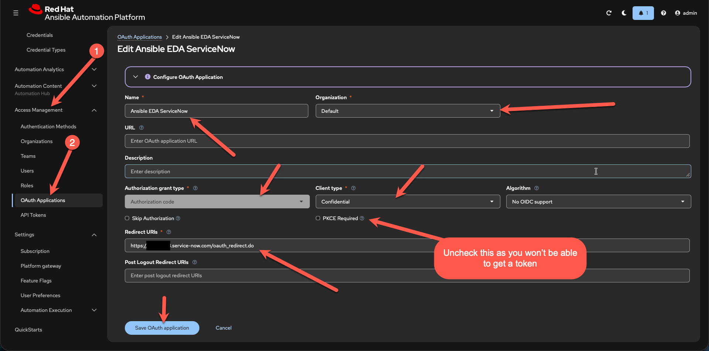
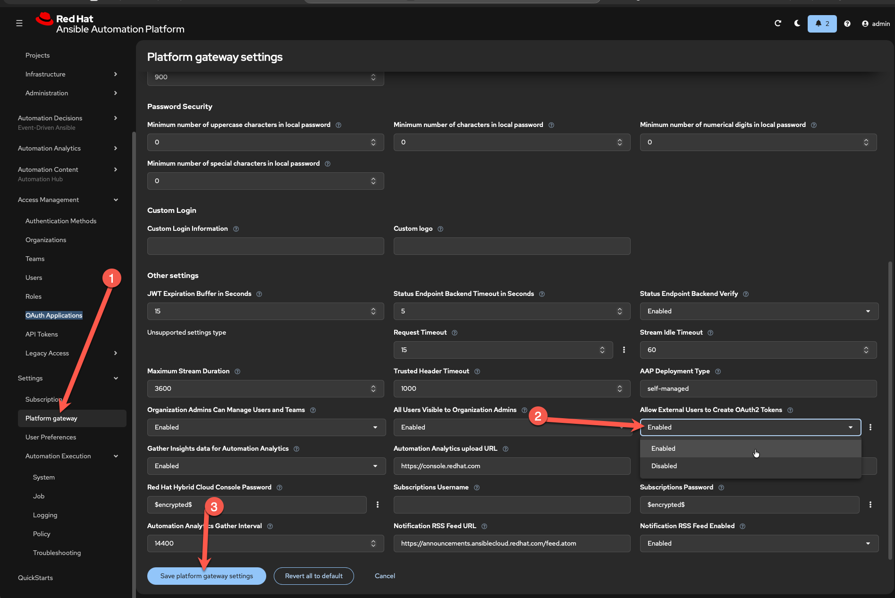
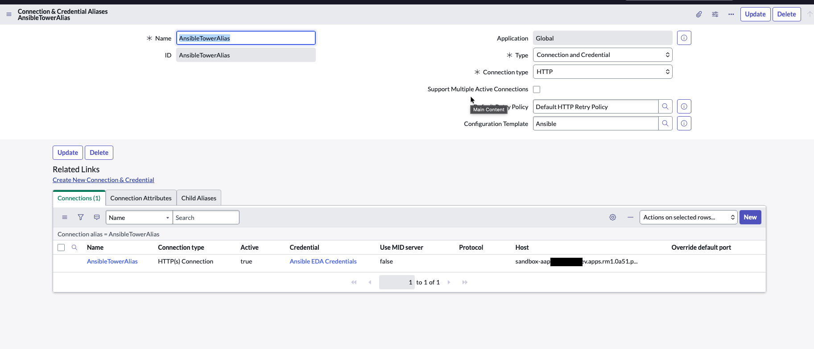
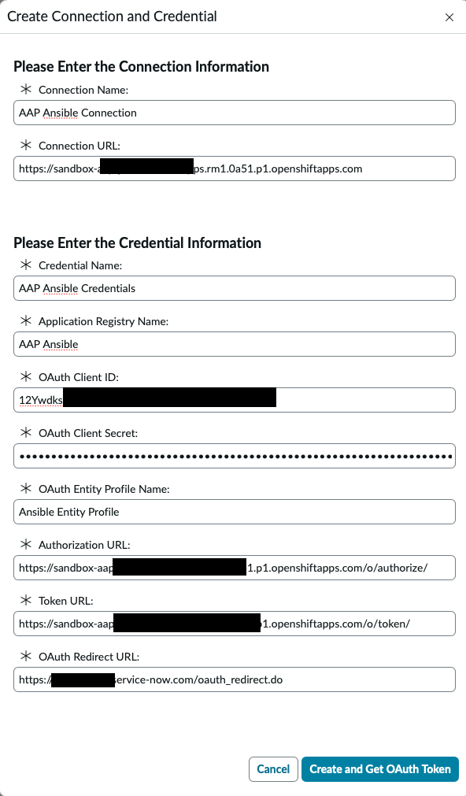

# Appendix — OAuth 2.0 direct job launch

**This document covers an alternative integration in which ServiceNow calls an AAP job template
directly over REST, with no Event-Driven Ansible involved.**

> 🔴 **Reference only — do not build from this.** This is **not** part of the EDA setup and is not a
> supported path in this repository. If you are following the build guides to make something work,
> you are in the wrong document: start at [01 — Provision AAP](01-provision-aap.md).
>
> **Why it is kept:** the OAuth application and REST Message groundwork in §A.1–A.2 is the same
> setup the **ServiceNow Ansible Spoke plugin** requires, which makes it a useful reference if you
> ever configure the Spoke.
>
> **The objects it describes no longer exist.** Job template `ServiceNow Incident Handler` and
> project `EDA ServiceNow` were deleted on 2026-09-29, once both teams were running on the
> event-stream architecture. Following these steps end to end would mean rebuilding both first.

> ⚠️ **The payload shape here is the opposite of the EDA one.** Direct job launches **must** wrap the
> body in `extra_vars`. Event streams **must not** — see
> [05 §7.1](05-servicenow-action.md). Carrying the habit from this document into an event stream
> gives you a `200`, a moving counter, and no automation.

> **Any unfamiliar word?** Every term and acronym used in these guides is defined in the
> [Glossary](glossary.md).

---

Use this if you want ServiceNow to call a job template **directly**, with no EDA. Payloads
here **must** be wrapped in `extra_vars`.

## A.1 Create the OAuth application in AAP

**Access Management → OAuth Applications → Create**

| Field | Value |
|---|---|
| Name | `ServiceNow` |
| Organization | `<your-org>` |
| Authorization grant type | Authorization code |
| Client type | Confidential |
| Redirect URIs | `https://<your-pdi>.service-now.com/oauth_redirect.do` |

Save the **Client ID** and **Client Secret** immediately — the secret is shown only once.

Then enable **Settings → Platform Gateway → Allow External Users to Create OAuth2 Tokens**.



_OAuth application — authorization code, confidential_



_Settings → Platform Gateway → Allow External Users to Create OAuth2 Tokens_


## A.2 Create the ServiceNow Configuration Template

All → Integration Hub → Configuration Templates → New → *HTTP Connection with OAuth
Authorization Code grant type*

- **Name:** `Ansible`

**Default Data Template:**

```json
{
  "credential": {
    "oauth_entity": {
      "oauth_entity_profile": [
        {
          "grant_type": "authorization_code",
          "name": "<provider-name> Profile",
          "default": true,
          "oauth_entity_profile_scope": ["write"]
        }
      ],
      "code_challenge_method": "S256",
      "type": "consumer",
      "oauth_entity_scope": [
        { "oauth_entity_scope": "write", "name": "Ansible write" }
      ],
      "client_id": "",
      "use_mutual_auth": false,
      "revoke_token_url": "",
      "default_grant_type": "authorization_code",
      "public_client": false,
      "oauth_api_script": "3e3a3a11c333210016194ffe5bba8f70",
      "name": "<provider-name> Spoke OAuth",
      "client_secret": "",
      "auth_url": "https://<provider-domain-name>/o/authorize/",
      "token_url": "https://<provider-domain-name>/o/token/",
      "redirect_url": "https://<instance-name>.service-now.com/oauth_redirect",
      "send_client_credentials_as": "basic_authorization_header"
    },
    "name": "<provider-name> Spoke Credential",
    "table": "oauth_2_0_credentials"
  },
  "connection": {
    "use_mid": false,
    "connection_url": "https://<provider-domain-name>",
    "name": "",
    "table": "http_connection"
  }
}
```

**Dynamic Data Schema:**

```json
{
  "connection_fields": [
    {
      "name": "connection.name",
      "label": "Connection Name",
      "type": "text",
      "defaultValue": "<provider-name> Ansible Connection",
      "hint": "Display name for the Connection",
      "mandatory": true
    },
    {
      "name": "connection.connection_url",
      "label": "Connection URL",
      "type": "text",
      "defaultValue": "https://<provider-domain-name>",
      "hint": "Connection URL for provider",
      "mandatory": true
    }
  ],
  "credential_fields": [
    {
      "name": "credential.name",
      "label": "Credential Name",
      "type": "text",
      "defaultValue": "<provider-name> Ansible Credentials",
      "hint": "Display name for the Credential",
      "mandatory": true
    },
    {
      "name": "credential.oauth_entity.name",
      "label": "Application Registry Name",
      "type": "text",
      "defaultValue": "<provider-name>",
      "hint": "Name of the application registry",
      "mandatory": true
    },
    {
      "name": "credential.oauth_entity.client_id",
      "label": "OAuth Client ID",
      "type": "text",
      "hint": "Client ID for provider",
      "mandatory": true
    },
    {
      "name": "credential.oauth_entity.client_secret",
      "label": "OAuth Client Secret",
      "type": "password",
      "hint": "Client Secret for provider",
      "mandatory": true
    },
    {
      "name": "credential.oauth_entity.oauth_entity_profile[0].name",
      "label": "Oauth Entity Profile Name",
      "defaultValue": "Ansible Entity Profile",
      "type": "text",
      "hint": "Name of the Oauth Entity Profile",
      "mandatory": true
    },
    {
      "name": "credential.oauth_entity.auth_url",
      "label": "Authorization URL",
      "type": "text",
      "defaultValue": "https://<provider-domain-name>/o/authorize/",
      "hint": "Authorization URL",
      "mandatory": true
    },
    {
      "name": "credential.oauth_entity.token_url",
      "label": "Token URL",
      "type": "text",
      "defaultValue": "https://<provider-domain-name>/o/token/",
      "hint": "Token URL",
      "mandatory": true
    },
    {
      "name": "credential.oauth_entity.redirect_url",
      "label": "OAuth Redirect URL",
      "type": "text",
      "defaultValue": "https://<instance-name>.service-now.com/oauth_redirect",
      "hint": "Callback URL for provider",
      "mandatory": true
    }
  ]
}
```

Then create a Connection & Credential Alias, choose **Create New Connection & Credential**
from it, fill in the prompts, and click **Create and Get OAuth Token**.



_Connection & Credential Alias for Ansible_



_Create New Connection & Credential → Create and Get OAuth Token_


## A.3 Create the REST Message

> **Superseded.** The EDA flow does not use a REST Message at all — the Action's REST *step*
> posts to the event stream using the Connection & Credential Alias from Part 3.1. This
> section applies only to the direct-launch pattern.

All → System Web Services → Outbound → REST Message → New

| Field | Value |
|---|---|
| Name | `Ansible AAP Job Template Webhook` |
| Endpoint | `https://<your-aap-host>/api/controller/v2/job_templates/${job_template_id}/launch/` |
| Authentication type | OAuth 2.0 |
| OAuth profile | the profile created in A.2 |

HTTP method **POST**, endpoint copied from parent, header
`Content-Type: application/json`.


## A.4 Action script (Pattern B)

<details>
<summary>Single job template</summary>

```javascript
(function execute(inputs, outputs) {

    var incidentSysId = inputs.incident_record;

    outputs.success = false;
    outputs.job_id = '';
    outputs.http_status = '';
    outputs.error_message = '';

    if (!incidentSysId) {
        outputs.error_message = 'Invalid or missing incident record';
        gs.error('AAP Action: Invalid incident record provided');
        return;
    }

    var incident = new GlideRecord('incident');
    if (!incident.get(incidentSysId)) {
        outputs.error_message = 'Could not find incident with sys_id: ' + incidentSysId;
        gs.error('AAP Action: Incident not found: ' + incidentSysId);
        return;
    }

    try {
        var request = new sn_ws.RESTMessageV2('Ansible AAP Job Template Webhook', 'Default POST');

        // NOTE: Pattern B REQUIRES the extra_vars wrapper
        var payload = {
            extra_vars: {
                incident_number:   incident.number.toString(),
                short_description: incident.short_description.toString(),
                priority:          incident.priority.getDisplayValue(),
                cmdb_ci:           incident.cmdb_ci.getDisplayValue(),
                sys_id:            incident.sys_id.toString(),
                state:             incident.state.getDisplayValue(),
                assigned_to:       incident.assigned_to.getDisplayValue(),
                category:          incident.category.toString(),
                urgency:           incident.urgency.getDisplayValue(),
                impact:            incident.impact.getDisplayValue()
            }
        };

        request.setRequestBody(JSON.stringify(payload));

        var response     = request.execute();
        var httpStatus   = response.getStatusCode();
        var responseBody = response.getBody();

        outputs.http_status = httpStatus.toString();

        if (httpStatus == 201 || httpStatus == 200) {
            try {
                var jobData = JSON.parse(responseBody);
                outputs.success = true;
                outputs.job_id = jobData.id ? jobData.id.toString() : 'N/A';
            } catch (parseEx) {
                outputs.success = true;
                outputs.job_id = 'N/A';
            }
        } else {
            outputs.error_message = 'HTTP ' + httpStatus + ': ' + responseBody.substring(0, 200);
            gs.error('FAILED: AAP job launch failed for ' + incident.number + ', status ' + httpStatus);
        }

    } catch (ex) {
        outputs.error_message = ex.getMessage();
        outputs.http_status = 'Error';
        gs.error('ERROR: AAP Action exception for ' + incident.number + ': ' + ex.getMessage());
    }

})(inputs, outputs);
```

</details>

<details>
<summary>Multiple job templates, chosen by assignment group (preferred at scale)</summary>

Requires a custom mapping table with columns for assignment group, AAP job template ID, and
an active flag. Replace `<your-scope>` with your real scope prefix.

```javascript
(function execute(inputs, outputs) {

    var incidentSysId = inputs.incident_record;

    outputs.success = false;
    outputs.job_id = '';
    outputs.http_status = '';
    outputs.error_message = '';

    if (!incidentSysId) {
        outputs.error_message = 'Invalid or missing incident record';
        return;
    }

    var incident = new GlideRecord('incident');
    if (!incident.get(incidentSysId)) {
        outputs.error_message = 'Could not find incident with sys_id: ' + incidentSysId;
        return;
    }

    var assignmentGroup = incident.assignment_group.toString();
    if (!assignmentGroup) {
        outputs.error_message = 'No assignment group set for incident ' + incident.number;
        return;
    }

    var mappingGR = new GlideRecord('<your-scope>_u_aap_assignment_group_mapping');
    mappingGR.addQuery('<your-scope>_u_assignment_group', assignmentGroup);
    mappingGR.addQuery('<your-scope>_u_active', true);
    mappingGR.query();

    if (!mappingGR.next()) {
        outputs.error_message = 'No active AAP job template mapping for assignment group "' +
                                incident.assignment_group.getDisplayValue() + '"';
        return;
    }

    var jobTemplateId = mappingGR.getValue('<your-scope>_u_aap_job_template_id');
    if (!jobTemplateId) {
        outputs.error_message = 'Job template ID is empty in the mapping record';
        return;
    }

    try {
        var request = new sn_ws.RESTMessageV2('Ansible AAP Job Template Webhook', 'Default POST');
        request.setStringParameterNoEscape('job_template_id', jobTemplateId);

        var payload = {
            extra_vars: {
                incident_number:   incident.number.toString(),
                short_description: incident.short_description.toString(),
                priority:          incident.priority.getDisplayValue(),
                cmdb_ci:           incident.cmdb_ci.getDisplayValue(),
                sys_id:            incident.sys_id.toString(),
                state:             incident.state.getDisplayValue(),
                assigned_to:       incident.assigned_to.getDisplayValue(),
                assignment_group:  incident.assignment_group.getDisplayValue(),
                category:          incident.category.toString(),
                urgency:           incident.urgency.getDisplayValue(),
                impact:            incident.impact.getDisplayValue(),
                job_template_id:   jobTemplateId
            }
        };

        request.setRequestBody(JSON.stringify(payload));

        var response     = request.execute();
        var httpStatus   = response.getStatusCode();
        var responseBody = response.getBody();

        outputs.http_status = httpStatus.toString();

        if (httpStatus == 201 || httpStatus == 200) {
            try {
                var jobData = JSON.parse(responseBody);
                outputs.success = true;
                outputs.job_id = jobData.id ? jobData.id.toString() : 'N/A';
            } catch (parseEx) {
                outputs.success = true;
                outputs.job_id = 'N/A';
            }
        } else {
            outputs.error_message = 'HTTP ' + httpStatus + ': ' + responseBody.substring(0, 200);
        }

    } catch (ex) {
        outputs.error_message = ex.getMessage();
        outputs.http_status = 'Error';
    }

})(inputs, outputs);
```

</details>

**Action output variables:** `success` (True/False), `job_id` (String),
`http_status` (String), `error_message` (String). Save and **Publish**.

---

