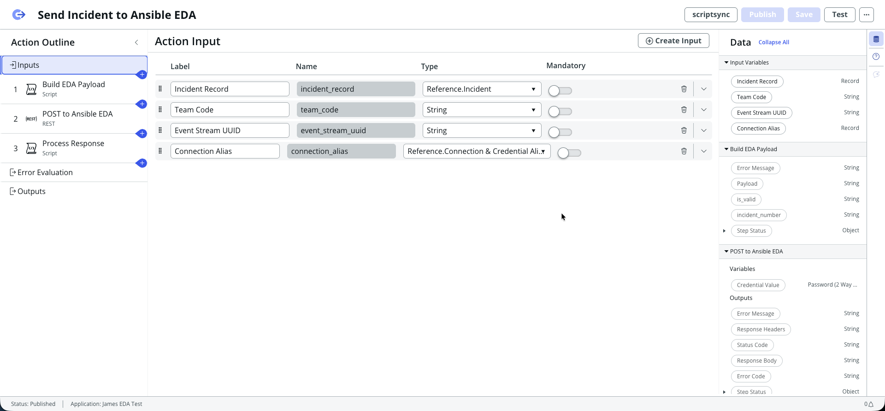
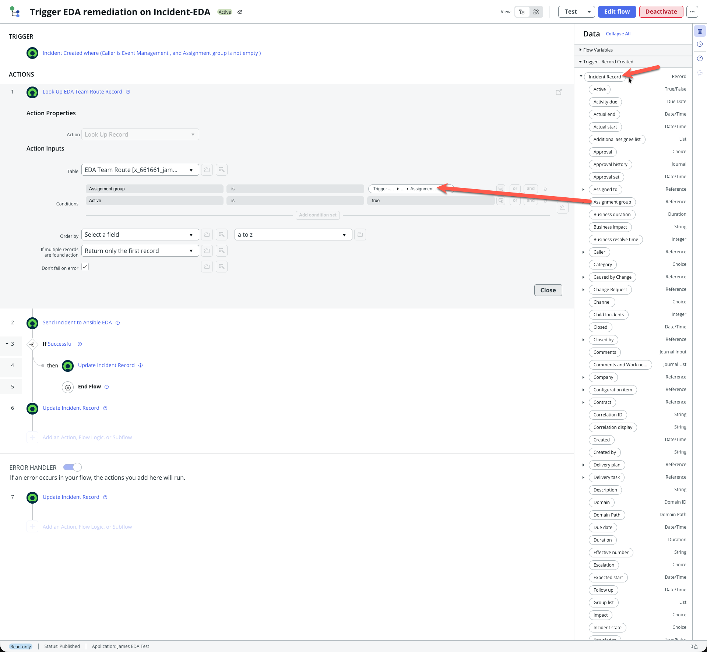
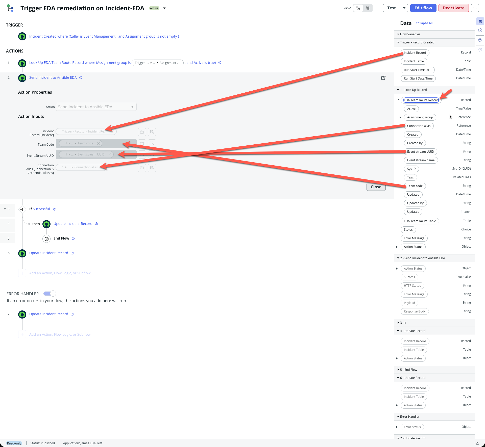
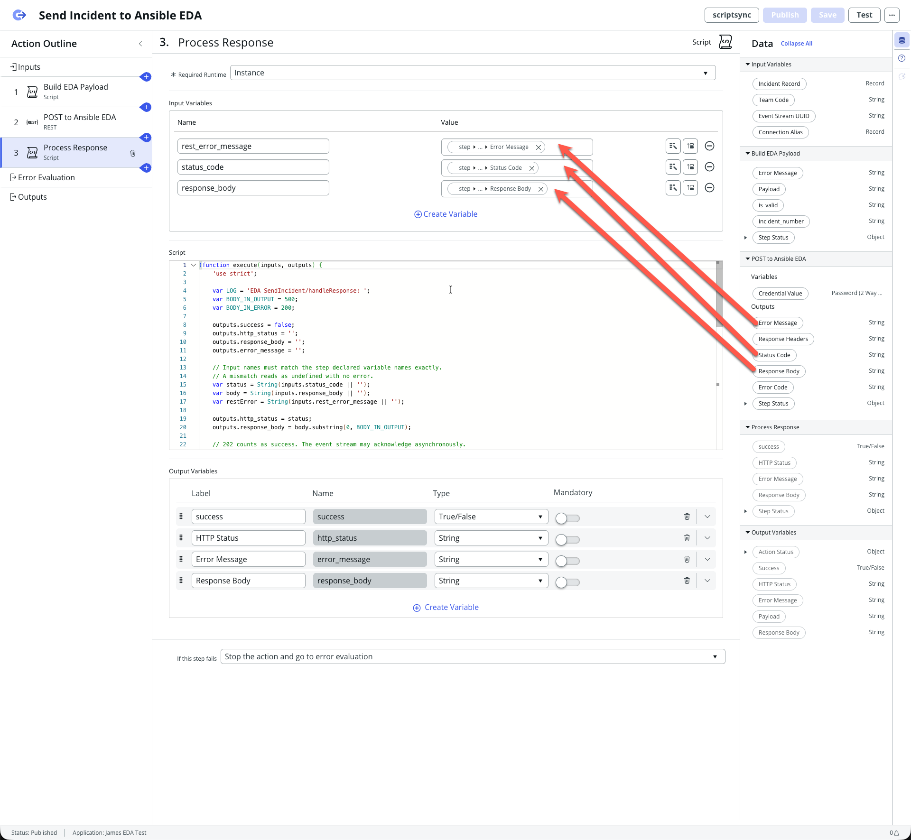
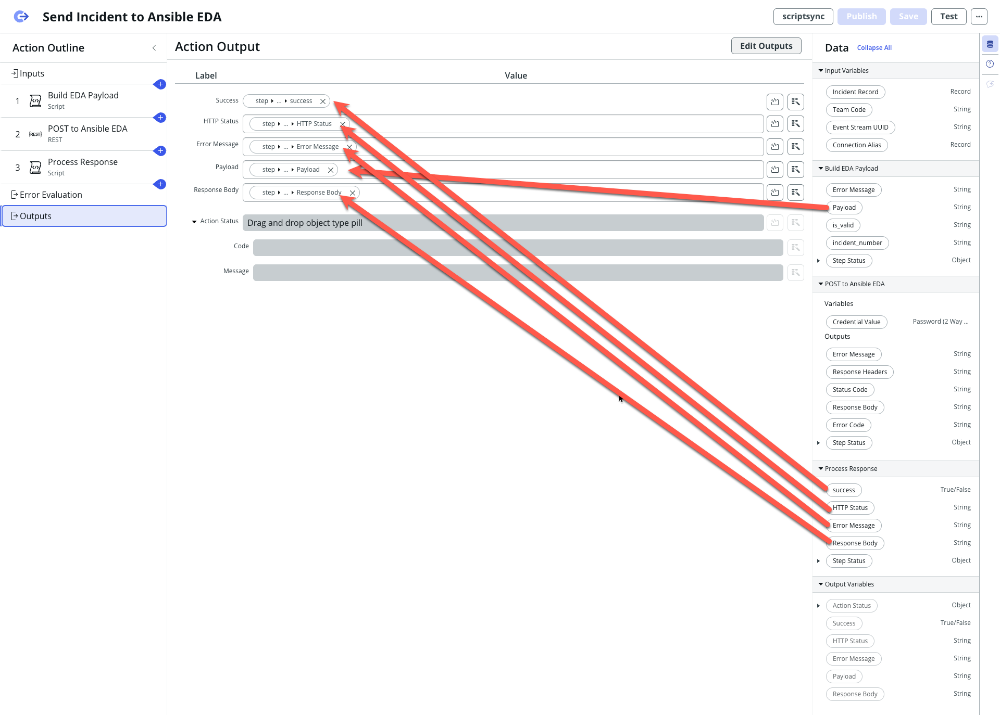
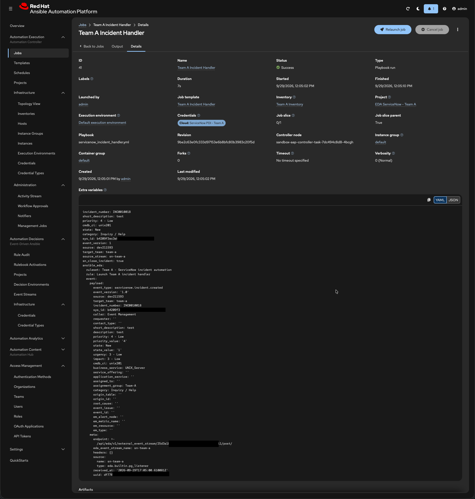

# ServiceNow → EDA Dynamic Team Routing

One flow, one action, one REST step. Routing comes from a config table, so adding a team is a
row — no flow or action edits.

- **Instance:** `dev211593.service-now.com` (PDI)
- **Scoped app:** `James EDA Test` / `x_661661_james_tes`
- **AAP:** sandbox 2.7, gateway `sandbox-aap-jdrebel2-dev.apps.rm1.0a51.p1.openshiftapps.com`
- **Language mode:** ES5 (`var` only — no `const`, `let`, or arrow functions)

---

## 0. Before you start

### What you are building, in one sentence

When an incident is created, a flow looks up which team owns it, reads that team's event stream
address and credential from a config table, and POSTs the incident to that stream — so Ansible
Event-Driven Automation can react.

### Vocabulary

| Term | What it actually is |
|---|---|
| **Flow** | The automation that runs when something happens. Yours starts when an incident is created. |
| **Action** | A reusable bundle of steps a flow calls. Think of it as a function. |
| **Step** | One thing inside an action — run a script, make a REST call. |
| **Pill** | A little draggable token representing a value from an earlier step. Wherever you see a pill picker, you can feed in live data instead of typing a fixed value. **This is the whole trick behind this design.** |
| **Connection & Credential Alias** | A named pointer to *where* to call (base URL) and *how* to authenticate (the secret). The secret lives here so it never appears in your flow. |
| **Scoped app** | A container that keeps your work separate from the rest of the instance. Yours is `James EDA Test`. |
| **Event stream** | The AAP endpoint that accepts your POST. Each team has its own, identified by a UUID in the URL. |

### The one idea that makes this scale

A REST step normally has a fixed address and a fixed credential. **Yours can take pills for both.**
So instead of one REST step per team, you have *one* REST step whose address and credential are
looked up per incident. Adding a team becomes adding a table row.

### Order of work

Build bottom-up so nothing references something that does not exist yet:

```
groups  →  credentials/aliases  →  tables  →  table rows  →  action  →  flow  →  test
  5.1          5.2                5.3/5.4       5.3          5.5-5.8     5.9     8
```

Budget roughly 2–3 hours for a first pass. Steps 5.2 and 5.7 are where mistakes happen.

---

## 1. Why this works: both REST step fields accept pills

Verified in the PDI 2026-09-28. The REST step stores these as separate fields — which is what makes
one step serve every team.

The "Before" column records the **single-stream state this change replaced**, for contrast. **Neither
value exists any more** — both the alias and the stream were deleted 2026-09-30, along with the rest of
the single-team objects. Both fields now carry pills fed from the route table.

| Field | Before (single shared stream) | Pill? |
|---|---|---|
| `connection_alias` | `14a6516a…` (`Ansible EDA Token Alias` — **deleted**) | **yes** |
| `resource_path` | `eda-event-streams/api/eda/v1/external_event_stream/25c68345…/post/` (stream **deleted**) | **yes** |
| `base_url` | gateway host | static is fine — one gateway for all teams |
| `headers` | `User-Agent`, `Content-Type` — **no `Authorization`** | — |

Two consequences:

1. **The credential stays out of script and out of flow data.** The connection alias injects it at
   call time, so no token appears in a step output, a pill, or the flow execution log. This is the
   preferred pattern in `references/integration-and-secrets.md` and the step already does it — do
   **not** replace it with a scripted `RESTMessageV2` and a hand-built `Authorization` header,
   which that reference lists as *not permitted*.
2. **Because both fields take pills, one REST step serves every team with that team's own
   credential.** No shared token, no If/Else per team, no `sn_cc`.

> `resource_path` currently hardcodes stream 1's UUID (`25c68345…`), which is why real incidents
> have only ever reached `ServiceNow Event Stream`. Replacing it with a pill is the core change.

---

## 2. Architecture

```
Incident created  (trigger condition: Assignment group is not empty)
  │
  ├─ 1. Look Up Record ── EDA Team Route        ← singular action, returns one Record
  │        Assignment group = Trigger→Incident→Assignment group
  │        Active = true
  │        If multiple records are found = Return only the first record
  │        Don't fail on error = checked
  │
  ├─ 2. If  1 → EDA Team Route Record → Sys ID  is not empty
  │     │      (the no-route gate — see §5.9 for why it is on Sys ID
  │     │       and not on the Record pill itself)
  │     │
  │     ├─ 3. Action: Send Incident to Ansible EDA
  │     │       inputs — route pills come straight off step 1's record:
  │     │         Incident Record    = Trigger → Incident Record
  │     │         Team Code          = 1 → EDA Team Route Record → Team code
  │     │         Event Stream UUID  = 1 → EDA Team Route Record → Event stream UUID
  │     │         Connection Alias   = 1 → EDA Team Route Record → Connection alias
  │     │       ├─ step 1  Script    build sanitised payload
  │     │       ├─ step 2  REST      connection_alias + resource_path = pills
  │     │       └─ step 3  Script    normalise status → outputs
  │     │
  │     └─ 4. If  Action → Success  is false
  │              └─ 5. Update Record ── work note carrying the action's Error Message
  │
  └─ Else
        └─ (nothing — the flow ends)
```

> 🔴 **Steps 5 and 6 were planned as `Create Record ── EDA Publish Log` and were never built.**
> Corrected 2026-10-02 after reconciling this guide against the live instance. The
> `x_661661_james_tes_eda_publish_log` table **does exist** — 13 columns, ACLs, UI list, licensing
> config, all created — but **no flow references it and it holds zero rows** after 21 events across
> the three streams. All three flows report failure by writing a **work note on the record itself**,
> which is where you should look.
>
> Two consequences if you decide to build it after all:
> 1. Its `incident` column is a reference to `incident`, so it serves the incident era only. SCTASK
>    and Problem would need either a polymorphic `task` reference or their own columns.
> 2. The troubleshooting table in §8 used to tell you to diagnose by reading publish-log rows. Those
>    rows do not exist; that table now points at the work note and the flow's Executions tab instead.
>
> Leaving the table in place is deliberate — it costs nothing and it is the schema you would want if
> a central log ever becomes worth having. Just do not document it as if it were wired up.

One route row per assignment group, so one record, so no loop. If you ever need one incident to
fan out to **several** EDA endpoints, switch to the plural `Look Up Records` action and a
`For Each Item` loop — that variant is in §5.9a, and it is the only case that needs a loop.

Only **one** script step contains logic, and it touches no credentials.

### Why there is still one script step

Building ~25 sanitised fields into JSON cannot be done safely with pills. You *can* type a JSON
body with pills inline, but one apostrophe or newline in `short_description` produces invalid JSON
and the POST fails with a confusing 400. `cleanFieldValue` exists to prevent exactly that.

The standard prohibits **credentials** in script, not scripting. This step handles no credentials.

---

## 3. Design decision: key the table on `team_code`

Two different questions hide inside "which stream?":

| Question | Changes over time? | Owner |
|---|---|---|
| Which team owns this incident? | **yes** — later priority, category, CI class | process |
| What are Team A's stream coordinates? | no | platform |

Keying the table on **assignment group** would mean re-keying it when a Decision Table takes over
the first question. Keying on **`team_code`**, with assignment-group matching isolated in the Look
Up Records step, means a Decision Table later replaces **only step 1** of the flow. Steps 2–6 and
the whole action stay untouched.

So the table carries both: `team_code` (stable key) and `assignment_group` (swappable input).

---

## 4. AAP prerequisites

| # | Item | Why |
|---|---|---|
| 1 | Move stream 3 `sn-team-b` from org `Default` to **Team B** | Everything else Team B is in Team B. Experiments 1–3 measure org isolation, so a Default-org stream measures the wrong thing. **PATCH the org — do not recreate**, or the UUID changes and the table row goes stale. |
| 2 | Keep `additional_data_headers` **empty** on streams 2 and 3 | Forwarding `Authorization` copies the stream token into `meta.headers`, job `extra_vars`, and the AAP database in cleartext. |
| 3 | Confirm activations 3 and 4 `running`, mappings intact | A stale `source_mappings` name silently stops the rule firing. |

| Team | Stream | UUID |
|---|---|---|
| Team A | `sn-team-a` | `<team-a-stream-uuid>` |
| Team B | `sn-team-b` | `<team-b-stream-uuid>` |

> **UUIDs are deliberately not committed.** This repo is public, and a stream UUID plus the gateway
> hostname is the complete POST endpoint — the only remaining control is the stream token. Read the
> real values from AAP when you need them:
>
> ```bash
> tok=$(security find-generic-password -a "$USER" -s sandbox-aap -w)
> gw="<your-aap-gateway>"
> curl -sS -H "Authorization: Bearer $tok" "$gw/api/eda/v1/event-streams/?page_size=50" \
>   | python3 -c "import sys,json;[print(s['name'], s['uuid']) for s in json.load(sys.stdin)['results']]"
> ```

---

## Screenshots — all captured

**All 11 are captured and displayed.** This section is now an index of which image belongs to which
step, not a to-do list. Naming convention for any future addition: `7N-sn-routing-<what>.png` for
ServiceNow, `9N-aap-<what>.png` for AAP. The full inventory, including four images kept on disk but
deliberately not displayed, is in [`docs/images/README.md`](images/README.md).

| # | Filename | Shows | Section |
|---|---|---|---|
| 1 | `70-sn-route-table-columns.png` | `EDA Team Route` table — the six columns and their types | §5.3 |
| 2 | `71-sn-route-table-rows.png` | The two route rows. **Blur or crop the Event stream UUID column.** | §5.3 |
| 3 | `72-sn-action-inputs-four.png` | All four action inputs with types — replaces the stale `50-sn-action-inputs.png` | §5.5 |
| 4 | `73-sn-step1-input-vars.png` | Step 1's two input variables, `Incident_record` and `team_code`, with their pills mapped | §5.6 |
| 5 | `74-sn-step3-input-vars.png` | Step 3's three lowercase input variables and four outputs | §6.2 |
| 6 | `75-sn-lookup-record-step.png` | The **Look Up Record** step — singular action, conditions, "Return only the first record" | §5.9 |
| 7 | `76-sn-flow-action-pills.png` | The flow's four action-input pills, incl. the **bare** Connection alias pill | §5.9 |
| 8 | `77-sn-action-outputs.png` | Action outputs, showing `payload` wired to **step 1** not step 3 | §6.2 |
| 9 | `91-aap-two-event-streams.png` | Both event streams with per-team orgs. **Crop the UUID column.** | §4 |
| 10 | `92-aap-two-activations.png` | Both activations running, each mapped to its own stream | §4 |
| 11 | `95-aap-job-extra-vars.png` | A job's `extra_vars` showing `target_team` populated and `sn_close_incident: true` | §8 |

> ⚠️ **Two of these show secrets-adjacent data.** Crop or blur the **Event stream UUID** in #2 and
> #9 — this repo is public, and a stream UUID plus the gateway hostname is the complete POST
> endpoint. The UUIDs are deliberately redacted from the text for the same reason (§4).

Placeholder syntax used below, so a missing image is obvious rather than silently absent:

```markdown


_Step 1's two input variables, `Incident_record` and `team_code`, with the action's pills mapped into them._
```

---

## 5. Build steps

### 5.1 Two groups

**User Administration → Groups → New**: `Team-A`, `Team-B`. The name is what the route rows
reference, so spelling matters.

### 5.2 One alias + connection + credential per team

Do this twice, inside the `James EDA Test` scope. This is what lets each team keep its own token.

**Credential** — *Connections & Credentials → Credentials → New → API Key Credentials*

| Field | Team A | Team B |
|---|---|---|
| Name | `Ansible EDA Team A Token` | `Ansible EDA Team B Token` |
| API Key Header | `Authorization` | `Authorization` |
| API Key | Team A stream token | Team B stream token |

Tokens are in the macOS keychain:

```bash
security find-generic-password -a "$USER" -s sandbox-eda-team-a -w
security find-generic-password -a "$USER" -s sandbox-eda-team-b -w
```

> **Resolved 2026-09-29: store the token bare, with no `Bearer ` prefix.** The AAP event stream uses
> the `ServiceNow Event Stream` credential type (`auth_type: token`, `http_header_key: Authorization`),
> which compares the incoming header value against the stored token verbatim. ServiceNow's API Key
> credential sends the field exactly as entered, so `Bearer <token>` would not match and returns 401.
> Verified against the live Team A and Team B streams, which are configured bare and working.

**Alias** — *Connection & Credential Aliases → New*: `Ansible EDA Team A Alias` /
`Ansible EDA Team B Alias`, type **Connection and Credential**, connection type **HTTP**.

**Connection** — from the alias, *HTTP Connections* related list → New

| Field | Value |
|---|---|
| Name | `Ansible EDA Team A Connection` / `…Team B…` |
| Connection alias | the alias above |
| Credential | the credential above |
| Connection URL | `https://sandbox-aap-jdrebel2-dev.apps.rm1.0a51.p1.openshiftapps.com` |

> Base URL only. The resource path is supplied by the REST step.

### 5.3 Route table

*System Definition → Tables → New*, `James EDA Test` scope selected.
Label **`EDA Team Route`** → `x_661661_james_tes_eda_team_route`

| Column label | Type | Len | Notes |
|---|---|---|---|
| Team code | String | 40 | lookup key — `team-a`, `team-b` |
| Assignment group | Reference → `sys_user_group` | | swappable mapping input |
| Event stream name | String | 100 | must equal the rulebook's expected name |
| Event stream UUID | String | 36 | becomes the `resource_path` pill |
| Connection alias | Reference → `sys_alias` | | becomes the `connection_alias` pill |
| Active | True/False | | switch a team off without deleting |

Optional: add **Base URL** (String, 255) if a team ever lives on a different gateway, and pill it
into the REST step's `base_url`. Not needed today — one gateway.

> **Creating a table in a scoped app auto-creates a role and nobody holds it.**
> `EDA Team Route` got `user_role = x_661661_james_tes.eda_team_route_user`, granted to zero users.
> Its ACLs have `admin_overrides = true`, so **an admin sees the rows and a non-admin sees nothing**.
>
> That matters twice:
>
> 1. **Flow Designer's table picker only lists tables the current user can read.** If the table does
>    not appear when adding a Look Up Record step, check the Workflow Studio **application scope**
>    first — a scoped table is filtered out of pickers when the session context is Global — then
>    search by the **label** (`EDA Team Route`), not the internal name.
> 2. **At run time the flow must be able to read it.** With the flow set to `run_as: user` and
>    nobody holding the role, the lookup returns **zero records silently** — no error, just no
>    routing. §5.10's "Run as System user" is what prevents this. Granting the role to a group is
>    the alternative.
>
> This is a trap because it fails *differently* for you than for everyone else: it works while you
> build and test as admin, then returns nothing in normal use.

Rows:

| Team code | Assignment group | Event stream name | Event stream UUID | Connection alias | Active |
|---|---|---|---|---|---|
| `team-a` | Team-A | `sn-team-a` | `<team-a-stream-uuid>` | Ansible EDA Team A Alias | true |
| `team-b` | Team-B | `sn-team-b` | `<team-b-stream-uuid>` | Ansible EDA Team B Alias | true |

Substitute the real UUIDs from AAP (see §4) — they are not committed.


_The `EDA Team Route` table — six columns and their types._


_The two route rows. Team code, assignment group, stream name and connection alias are visible; the Event stream UUID column is redacted because this repo is public._

### 5.4 Failure log table — OPTIONAL, and not currently wired up

> ⚠️ **Skip this section on a first build.** The table below exists on the instance exactly as
> specified, but **no flow writes to it** and it holds **zero rows**. Verified 2026-10-02. The flows
> report failure with a work note on the record instead, which is simpler and puts the error where
> whoever is looking at the ticket will see it. Build this only if you later want a central,
> queryable failure history across teams.

Label **`EDA Publish Log`** → `x_661661_james_tes_eda_publish_log`

| Column label | Type | Len |
|---|---|---|
| Incident | Reference → `incident` | |
| Team code | String | 40 |
| Event stream name | String | 100 |
| HTTP status | String | 10 |
| Success | True/False | |
| Error message | String | 4000 |
| Payload | String | 8000 |

Intended to be populated entirely with pills by a **Create Record** step — no script.

> 🔴 **The `Incident` column makes this incident-only.** It is a reference to `incident`, so it
> cannot log an SCTASK or a Problem failure as built. If you wire it up now that three record types
> exist, change that column to a reference to **`task`** (the common parent) or add one column per
> record type. A central log that silently drops two thirds of your failures is worse than no log.

### 5.5 Action inputs

Open **`Send Incident to Ansible EDA`** and declare four inputs:

| Input | Type |
|---|---|
| `incident_record` | Reference → Incident |
| `team_code` | String |
| `event_stream_uuid` | String |
| `connection_alias` | **Connection & Credential Aliases** (not a plain `sys_alias` reference) |

The `connection_alias` type matters: the REST step's Connection Alias field expects this type and
must be fed the **bare pill**. See §5.7.



_All four action inputs. This replaces the older `50-sn-action-inputs.png`, which showed only Incident Record._

### 5.6 Action step 1 — build payload (script)

1. Add a **Script** step named `Build EDA Payload`.
2. Declare **two input variables**. The **Name** must match exactly — ServiceNow auto-fills it from
   the Label, so check it before saving:

   | Name | Type | Drag this pill into it |
   |---|---|---|
   | `Incident_record` | Reference → Incident | action input **Incident Record** |
   | `team_code` | String | action input **Team Code** |

3. Declare four **output variables**: `payload`, `is_valid`, `incident_number`, `error_message`.
4. Paste the script from §6.1.
5. Publish the action, then confirm `target_team` is populated in AAP's job `extra_vars`.

> **Declaring a variable and mapping a pill into it are two separate actions.** Miss the mapping and
> the input is empty at run time with no warning. Miss the name and the script reads `undefined`.
> Neither produces an error, and `'use strict'` does not catch either. §6.1 has the full account of
> how this shipped an empty `target_team` for days.


_Step 1's two input variables, `Incident_record` and `team_code`, with the action's pills mapped into them._

### 5.7 Action step 2 — REST step

Keep the existing step. Change three things:

| Field | Set to |
|---|---|
| Connection Alias | pill → **Action input → Connection alias** |
| Resource Path | `eda-event-streams/api/eda/v1/external_event_stream/` + pill **Event stream UUID** + `/post/` |
| Request Body | pill → **Step 1 → Payload** |

Leave `headers` alone — `User-Agent` and `Content-Type` only. **Never add an `Authorization`
header**; the alias supplies it.

Keep the existing `retry_policy`.

### 5.8 Action step 3 — normalise the response (script)

See §6.2. Outputs: `success`, `http_status`, `response_body`, `error_message`.

### 5.9 Flow

Rebuild **`Trigger EDA remediation on Incident-EDA`** (or create a new flow and deactivate this
one) per the §2 diagram.

**Trigger:** Incident → Created, with condition **Assignment group is not empty**. Filtering at
the trigger keeps the flow from starting for incidents that can never route.

**Step 1 — Look Up Record** on `x_661661_james_tes_eda_team_route`:

| Setting | Value |
|---|---|
| Action | **Look Up Record** — the singular one |
| Table | `EDA Team Route` |
| Conditions | `Assignment group` is `Trigger → Incident → Assignment group` **AND** `Active` is `true` |
| If multiple records are found action | `Return only the first record` |
| Don't fail on error | checked |

> **Pick the singular action deliberately.** Flow Designer ships both `Look Up Record` and
> `Look Up Records`, and which one you choose decides the whole shape of the flow:
>
> | Action | Output pill | Type | Loop needed? |
> |---|---|---|---|
> | `Look Up Record` | `EDA Team Route Record` | **Record** | No — pill its fields directly |
> | `Look Up Records` | `Records` | **Array** | Yes — `For Each Item` |
>
> Use the singular action here. One assignment group maps to one active route row, so there is
> nothing to iterate.

**Step 2 — If**, gating on `1 → EDA Team Route Record → Sys ID` **is not empty**.

Because **Don't fail on error** is checked, a group with no route row does not fail the step — it
returns an empty record and the flow carries on. Without this gate you would hand an empty
connection alias to the REST step and get:

```
Unable to load connection with alias ID:   <a href="/sys_alias.do?sys_id=">…
```

The blank after `sys_id=` is the signature of an unresolved alias pill.

> **Gate on a scalar field, never on the Record pill itself.** `EDA Team Route Record is empty`
> compiles to a string comparison that is always false, so the branch silently never fires. `Sys ID`
> is a String, so it compares correctly. The same trap applies to `Records is empty` on the plural
> action — there you branch on `Count`.
>
> If you would rather let a missing route row hard-fail, leave **Don't fail on error** unchecked and
> drop this If — the step errors and your flow's **Error Handler** picks it up. That is a valid
> design; it just gives you a flow error instead of a clean log row, and it cannot distinguish
> "no route configured" from "the lookup itself broke".

**Step 3 — the action**, with every route pill taken off step 1's record:

| Action input | Pill |
|---|---|
| Incident Record `[Incident]` | `Trigger → Record Created → Incident Record` |
| Team Code | `1 → EDA Team Route Record → Team code` |
| Event Stream UUID | `1 → EDA Team Route Record → Event stream UUID` |
| Connection Alias `[Connection & Credential Aliases]` | `1 → EDA Team Route Record → Connection alias` |

**Steps 4–5 — failure logging**, as in §2.

### 5.9a Variant — fanning out to several endpoints

Only if one incident must reach **more than one** EDA endpoint. Then:

1. Change step 1's Action to **Look Up Records** (plural). Its output becomes a `Records` pill of
   type Array. Leave **Maximum records** empty, or set it to the fan-out ceiling you want.
2. Replace the §5.9 step 2 If with a **For Each Item** loop, `Items` = `1 → Look Up Records → Records`.
3. Move the action inside the loop and rewire all three route pills to **Current Item → …**.

No count gate is needed in this shape: zero matching rows means the loop body never runs, which is
already the "no route" behaviour. Add an `If Count is 0` branch only if you want a log row for it.

> **Why the Items field looks broken when you get this wrong.** `Items` is typed **Array**, and the
> pill picker disables every pill whose type is not an Array. If step 1 is the singular
> `Look Up Record`, its outputs are Record / Table / Choice / String — so the entire picker tree
> greys out and nothing is clickable. That grey-out is not a permissions problem or a UI bug; it is
> a type mismatch telling you the loop does not belong in this flow.



_The **Look Up Record** step — the singular action, with the assignment-group and Active conditions._



_The flow's four action inputs. Team Code, Event Stream UUID and Connection alias all come from step 1's record, and **Connection alias is the bare reference pill** — not dot-walked to Sys ID. Note there is no `For Each` loop._

### 5.10 Flow properties

**⋮ → Flow properties → Run as: System user.**

Currently `run_as: user`, so it runs with the incident creator's rights. A non-admin caller may be
unable to resolve the credential, which surfaces as a confusing auth failure rather than a
permission error.

Record-triggered flows run in their own transaction, so incident creation is not waiting on AAP.
Confirm the trigger is not set to run in the foreground.

### 5.11 The old single-stream path — already removed

✅ **Nothing to do here.** Done 2026-09-29/30. Recorded because the deletion *order* is the
non-obvious part and would matter again in a rebuild.

The original design had one shared event stream (`ServiceNow Event Stream`, organization `Default`)
feeding one activation on `my_eda_rulebook.yml`. All of it is gone: activation 1, stream 1, and the
orphaned credential 4.

**If you ever tear down a stream again, the order is forced:** activation → stream → credential. The
activation holds the source mapping to the stream, so the stream cannot go first; AAP answers with
`409 "... is being referenced by 1 activation(s)"`. And because activation deletion is
**asynchronous**, the stream and credentials stay blocked for roughly 15 seconds after the activation
delete reports success — so retry rather than concluding the order was wrong.
[`scripts/provision_team.py --destroy`](../scripts/provision_team.py) implements exactly this.

`my_eda_rulebook.yml` is still in the repo. It is **not** wired to anything: it conditions on the old
flat `incident_created` value, which no current payload produces, so it cannot match. It survives only
as the worked example behind [README Part 4](../README.md#part-4--the-payload-contract-read-this).

---

## 6. Scripts

Both are ES5, IIFE-wrapped, `'use strict'`, every output initialised before the first branch, and
every failure logged with a prefix and thrown so the action's error path fires.

### 6.1 Step 1 — build payload

Declare **two** input variables on this step, with these exact names:

| Declared variable name | Type | Mapped from |
|---|---|---|
| `Incident_record` | Reference → Incident | action input **Incident Record** |
| `team_code` | String | action input **Team Code** |

> **An action input is not visible to a step's script.** Each step is its own scope: `inputs.*`
> resolves only against variables declared *on that step*. Forwarding an action input takes two
> separate actions — declare the step variable, then map the action's pill into it. Miss either and
> the value is silently `undefined`.
>
> `team_code` was missing here until 2026-09-29. The action received `team-b` correctly — it was
> visible in the execution details — but it was never handed down to this script, so
> `inputs.team_code` was `undefined`, `cleanFieldValue` returned `''`, and **every payload shipped
> with `target_team` empty**. Nothing errored. Routing still worked, because routing is carried by
> the event stream UUID, not by `target_team` — so the only symptom was a blank field arriving in
> AAP's `extra_vars`, which all three rulebooks read
> (`target_team: "{{ event.payload.target_team | default('') }}"`).
>
> Fixed and verified on INC0010017 (AAP job 38): `target_team = team-b`.
>
> `Incident_record` keeps its capital `I` because that is how it was originally created; the script
> reads `inputs.incident_record || inputs.Incident_record` to tolerate either. Do not rely on that
> tolerance for new inputs — match the name exactly.

```javascript
(function execute(inputs, outputs) {
    'use strict';

    var LOG = 'EDA SendIncident/buildPayload: ';

    // event_type is a contract with the rulebooks. Both team rulebooks test
    // payload.event_type == 'servicenow.incident.created'. Changing this string
    // silently stops every rule from firing.
    var EVENT_TYPE = 'servicenow.incident.created';
    var EVENT_VERSION = '1.0';

    outputs.payload = '';
    outputs.is_valid = false;
    outputs.incident_number = '';
    outputs.error_message = '';

    // Step input names are CASE-SENSITIVE and need not match the action input.
    // This step declares 'Incident_record' (capital I) while the action input is
    // 'incident_record'. Accept either rather than depending on which one you are in.
    var record = inputs.incident_record || inputs.Incident_record;

    var incidentSysId = (record && typeof record === 'object' && record.getUniqueValue)
        ? record.getUniqueValue()
        : String(record || '');

    if (!incidentSysId) {
        // Name the inputs that actually arrived - this turns a name mismatch or an
        // unmapped pill from a guessing game into a one-line diagnosis.
        var present = [];
        for (var key in inputs) {
            if (inputs.hasOwnProperty(key)) {
                present.push(key + '=' + (inputs[key] ? 'set' : 'empty'));
            }
        }
        outputs.error_message = 'No incident record supplied. Step inputs present: ' +
            (present.length ? present.join(', ') : '(none)');
        gs.error(LOG + outputs.error_message);
        throw new Error(outputs.error_message);
    }

    var incident = new GlideRecord('incident');
    if (!incident.get(incidentSysId)) {
        outputs.error_message = 'Incident not found: ' + incidentSysId;
        gs.error(LOG + outputs.error_message);
        throw new Error(outputs.error_message);
    }

    outputs.incident_number = incident.getValue('number');

    function cleanFieldValue(value) {
        if (!value) {
            return '';
        }
        return String(value)
            .replace(/<[^>]*>/g, ' ')        // HTML tags
            .replace(/\r\n/g, ' ')
            .replace(/[\n\r\t]/g, ' ')
            .replace(/[\x00-\x1F\x7F]/g, '') // control characters
            .replace(/\\/g, '/')
            .replace(/\s+/g, ' ')
            .trim();
    }

    function displayValue(field) {
        return cleanFieldValue(field ? field.getDisplayValue() : '');
    }

    function rawValue(field) {
        return cleanFieldValue(field ? field.getValue() : '');
    }

    // Instance identity is configuration, not a literal.
    var sourceId = gs.getProperty('x_661661_james_tes.eda.source_id', '');
    if (!sourceId) {
        sourceId = gs.getProperty('instance_name', 'unknown');
    }

    var emAlert = null;
    var originTable = rawValue(incident.origin_table);
    var originId = rawValue(incident.origin_id);

    if (originTable === 'em_alert' && originId) {
        var alertRecord = new GlideRecord('em_alert');
        if (alertRecord.get(originId)) {
            emAlert = alertRecord;
        } else {
            gs.warn(LOG + 'origin is em_alert but alert not found: ' + originId);
        }
    }

    var payload = {
        event_type: EVENT_TYPE,
        event_version: EVENT_VERSION,
        source: sourceId,
        target_team: cleanFieldValue(inputs.team_code),

        incident_number: displayValue(incident.number),
        sys_id: rawValue(incident.sys_id),
        caller: displayValue(incident.caller_id),
        requester: displayValue(incident.u_requester),
        contact_type: displayValue(incident.contact_type),
        short_description: displayValue(incident.short_description),
        description: displayValue(incident.description),

        // Display values keep the original behaviour ("3 - Moderate", "In Progress").
        // The *_value pairs carry raw codes ("3", "2") for numeric comparison.
        priority: displayValue(incident.priority),
        priority_value: rawValue(incident.priority),
        state: displayValue(incident.state),
        state_value: rawValue(incident.state),
        urgency: displayValue(incident.urgency),
        impact: displayValue(incident.impact),

        cmdb_ci: displayValue(incident.cmdb_ci),
        business_service: displayValue(incident.business_service),
        service_offering: displayValue(incident.service_offering),
        application_service: displayValue(incident.u_application_service),
        assigned_to: displayValue(incident.assigned_to),
        assignment_group: displayValue(incident.assignment_group),
        category: displayValue(incident.category),
        origin_table: originTable,
        origin_id: originId,
        root_cause: displayValue(incident.u_root_cause),
        event_issue: displayValue(incident.u_event_issue),
        event_id: displayValue(incident.u_event_id),

        em_alert_node: emAlert ? displayValue(emAlert.node) : '',
        em_metric_name: emAlert ? displayValue(emAlert.metric_name) : '',
        em_resource: emAlert ? displayValue(emAlert.resource) : '',
        em_type: emAlert ? displayValue(emAlert.type) : ''
    };

    outputs.payload = JSON.stringify(payload);
    outputs.is_valid = true;

})(inputs, outputs);
```

### 6.2 Step 3 — normalise the response

> **Paste from the file, not from here:** [`docs/scripts/incident_step3_process_response.js`](scripts/incident_step3_process_response.js). All six step scripts are indexed in [`docs/scripts/README.md`](scripts/README.md).
> It is the canonical copy, pure ASCII, and verified with `node --check`. Copying out of a
> rendered document can convert straight quotes to curly ones, which breaks the script
> silently. This block is a mirror of that file - if they ever disagree, the file wins.

```javascript
(function execute(inputs, outputs) {
    'use strict';

    var LOG = 'EDA SendIncident/handleResponse: ';
    var BODY_IN_OUTPUT = 500;
    var BODY_IN_ERROR = 200;

    outputs.success = false;
    outputs.http_status = '';
    outputs.response_body = '';
    outputs.error_message = '';

    // Input names must match the step declared variable names exactly.
    // A mismatch reads as undefined with no error.
    var status = String(inputs.status_code || '');
    var body = String(inputs.response_body || '');
    var restError = String(inputs.rest_error_message || '');

    outputs.http_status = status;
    outputs.response_body = body.substring(0, BODY_IN_OUTPUT);

    // 202 counts as success. The event stream may acknowledge asynchronously.
    if (status === '200' || status === '201' || status === '202') {
        outputs.success = true;
        return;
    }

    // An empty status means the request never left the instance: a connection,
    // alias, or credential problem rather than an endpoint rejection.
    if (status === '') {
        if (restError) {
            outputs.error_message = 'Request not sent: ' + restError.substring(0, BODY_IN_ERROR);
        } else {
            outputs.error_message = 'Request not sent and the REST step reported no error.';
        }
    } else {
        outputs.error_message = 'HTTP ' + status + ': ' + body.substring(0, BODY_IN_ERROR);
    }

    gs.error(LOG + outputs.error_message);

})(inputs, outputs);
```

Declare this step's input variables with these **exact names**, then map step 2's outputs into them:

| Declared variable name | Mapped from |
|---|---|
| `status_code` | step 2 → Status Code |
| `response_body` | step 2 → Response Body |
| `rest_error_message` | step 2 → Error Message |



_Step 3's input variables and outputs. The inputs are lowercase — `status_code`,
`response_body`, `rest_error_message` — matching what the script reads._

Declare exactly four outputs — `success`, `http_status`, `response_body`, `error_message` — and no
`payload` output. `rest_error_message` is deliberately *not* called `error_message`: that name is
already taken by this step's **output**, and an input and output sharing a name in one step is how
these mismatches start.

> **The names must match the script character for character, casing included.** Flow Designer's
> script-step input variables are case-sensitive properties on `inputs`. Declaring `StatusCode`
> while the script reads `inputs.status_code` yields `undefined` — **silently**, and `'use strict'`
> does not catch it, because strict mode only errors on *writing* an undeclared variable, never on
> *reading* a property that isn't there.
>
> This failed on 2026-09-29 with a 200 from AAP. `StatusCode` held `200`, the pill was mapped
> correctly, and the script still produced `http_status = ''`, `success = false`, and the error
> message `HTTP :` — the concatenation on the last line with both holes empty. The step reported
> **Completed**, `If Successful` took the false branch, and nothing anywhere said "name mismatch".
>
> Two signatures worth memorising: **an error message with empty interpolation holes** (`HTTP :`),
> and **an output that stays blank while its source input is visibly populated** in execution
> details. Both mean a name mismatch, not an endpoint problem. The *Variable Name* column in
> execution details shows the real declared name — read it there, not off the label.



_Action outputs. `Payload` is wired to **Build EDA Payload** (step 1) — the only step that
assigns it — while Success, HTTP Status, Error Message and Response Body come from Process
Response._

Also check the **action's own output wiring**: `payload` must come from **step 1's** Payload output.
This script never assigns `outputs.payload`, so pointing the action's `payload` output at step 3
leaves it permanently blank and the log table never records what was sent.

> This step deliberately does **not** throw. A non-2xx is a routing/endpoint problem to be recorded
> in the log table and reviewed, not a reason to abort the flow. Bad *input* throws (§6.1);
> a bad *response* is logged.

---

## 7. Cross-scope privileges

A scoped script touching a global table needs a `sys_scope_privilege` record with status
**Allowed**, or it fails at runtime with an error that reads like a bug.

| Touched | Privilege | Needed by |
|---|---|---|
| `incident` | Table, **read** | §6.1 `GlideRecord('incident')` |
| `em_alert` | Table, **read** | §6.1 alert enrichment |
| `sys_user_group` | Table, **read** | route table reference field |

Because the HTTP call is a REST step rather than scripted, **no `sn_ws.RESTMessageV2` privilege is
required** — one of several reasons to keep it that way.

Record this list in the app README so promotion can verify it per instance.

---

## 8. Verification

Before each test, confirm the target activation is `running`. Event streams use Postgres
`LISTEN`/`NOTIFY`, which is broadcast and **non-durable** — an event posted while an activation is
down is dropped silently, with no queue and no retry.

1. Create an incident with **Assignment group = Team-A**.
2. Check the counters:

```bash
tok=$(security find-generic-password -a "$USER" -s sandbox-aap -w)
gw="https://sandbox-aap-jdrebel2-dev.apps.rm1.0a51.p1.openshiftapps.com"
curl -sS -H "Authorization: Bearer $tok" "$gw/api/eda/v1/event-streams/?page_size=50" \
  | python3 -m json.tool | grep -E '"name"|events_received'
```



_A successful Team A job. `target_team: team-a`, `source_stream: sn-team-a` and
`sn_close_incident: true` are populated, and the per-team credential, project and inventory
are visible. A blank `target_team` here means step 1 is missing its `team_code` input (§6.1)._

Expect `sn-team-a` to increment and `sn-team-b` to stay flat. Then repeat with **Team-B** and
expect the mirror image — that is Experiment 1 (isolation).

**Where to look when something fails.** There is no central log table — see the callout in §4. Your
two diagnostic surfaces are the **work note on the record** (written by the flow's failure branch,
carrying the action's `Error Message`) and the flow's **Executions** tab in Workflow Studio, which
shows every step with its inputs and outputs.

| Symptom | Most likely cause |
|---|---|
| No stream counter moves | Flow did not run — check the trigger condition and the Sys ID gate (§5.9) |
| Work note shows **401** | Token mismatch. Compare lengths on both sides — 64 chars — and confirm the value is bare with no prefix (§5.2) |
| Work note shows **404** | `resource_path` pill resolved empty, or a stale UUID in the route row |
| Work note shows `Unable to load connection with alias ID:` with **nothing after `sys_id=`** | The Connection alias pill is unresolved, or was dot-walked to Sys ID instead of fed bare |
| Work note shows `Request not sent and the REST step reported no error.` | The request never left the instance — an empty connection alias. On a record type with no enrollment gate, this means an unrouted record reached the action and the Sys ID gate is missing |
| Counter moves, no job launches | Rulebook mismatch — compare `event_type` and `eda_event_stream_name` |
| Counter moves, no job, **and nothing in ServiceNow at all** | The job template named by the rule does not exist. Silent from this side; the only evidence is the activation log |
| Both teams' rules fire on one event | Both activations mapped to the same stream — fan-out, not a queue |
| No work note at all on a failure | Either the `Success` pill is wired to the wrong step output, or the flow exited at the route gate — which is correct behaviour for a record whose assignment group has no route row. Check Executions to tell these apart |

---

## 9. Adding a team (worked example: Team C)

### Two ways to do this

| | Do this if | Start at |
|---|---|---|
| **Manual — recommended the first time** | You have not built a team before, or you do not have shell access to the AAP and PDI APIs | [At a glance](#at-a-glance), then **Phases 0–5 in full** |
| **Scripted** — `provision_team.py` | You have already done it manually and just want the team to exist | [Provisioning a team with a script](#provisioning-a-team-with-a-script) |

**Build your first team by hand.** Not as a hazing ritual — because of what the manual path teaches
that a successful script run cannot. Four of the failure modes here are **silent**: a rulebook that was
not pushed before the project sync, the job template's `Playbook` field pointing at a rulebook,
*Prompt on launch* left off, and a `Bearer ` prefix on the token. The script removes all four by
construction, which is exactly why it teaches you nothing about them. The first time something breaks
in a way the script does not cover, you want to already know which object talks to which.

Doing it manually also shows you what the architecture is claiming: you will notice that you never
open Workflow Studio, and that the only thing tying a team together is one row in a table.

**Both paths produce the same result and neither touches the flow or the action.** The manual phases
are the source of truth for *what* gets built and why; the script automates exactly those steps and
nothing more. If the two ever disagree, the manual path is right and the script has a bug.

### At a glance

**You never open Workflow Studio.** Adding a team only *creates* things. It modifies nothing that
already exists.

| | Count | What |
|---|---|---|
| **Modify** | **0** | The flow, the action, both script steps, and the route table's columns — all untouched |
| Create in Git | 1 | The team's rulebook |
| Create in AAP | 11 | Org · inventory · ServiceNow credential · controller project · job template · AAP Controller credential · decision environment · EDA project · stream token credential · event stream · activation |
| Create in ServiceNow | 4 | Assignment group · API Key credential · Connection & Credential Alias · HTTP connection |
| Add as **data** | 1 row | `EDA Team Route` — the row that ties those four together |

**That one row is the entire design: routing is data, not logic.** The flow asks the table "where does
this group go?" and the table answers with a stream UUID and a credential alias. A new team is a new
answer, not new branching — which is why there is no If/Else in the flow and why team count never
changes its shape.

> ✅ **Verified on the real Team C build, 2026-09-30.** The flow was last modified 2026-09-29 14:27 and
> the action 2026-09-29 16:40 — both *before* Team C existed. The only scoped-app records touched that
> day were the Team C alias and its connection mapping. The claim above is measured, not intended.

### The short version

If you have done this before, this is the whole job. Each line links to the detail below.

```
[ ] 0  Rulebook: copy team_b_rulebook.yml -> team_c_rulebook.yml, change 5 values, PUSH
[ ] 1  Token:    openssl rand -hex 32                        (64 chars, vault it)
[ ] 2  AAP exec: org -> inventory -> credentials -> project -> job template
          ^ Playbook = servicenow_incident_handler.yml   NOT the rulebook
          ^ Prompt on launch = ON
[ ] 3  AAP dec:  EDA creds -> DE -> EDA project -> stream credential (token BARE)
                 -> event stream sn-team-c -> activation      (copy the stream UUID)
[ ] 4  SN:       group Team-C (Global) -> API Key cred -> alias -> HTTP connection
                 -> ONE row in EDA Team Route
[ ] 4b CHECK:    python3 scripts/verify_team.py --team team-c    <- do this before testing
[ ] 5  Test:     new incident, group Team-C, caller Event Management
          ^ sn-team-c increments AND sn-team-a / sn-team-b stay flat
```

**Four things fail silently; everything else throws.** Push before Phase 3 (the source mapping pins to
the rulebook's SHA), the job template's *Playbook* field, *Prompt on launch*, and storing the token
with a `Bearer ` prefix. If something is wrong and nothing is complaining, it is one of those four.

**Step 4b catches all four mechanically** — run it instead of trusting yourself to have clicked
correctly. See [Verifying the build with a script](#verifying-the-build-with-a-script) below.

### Provisioning a team with a script

`scripts/provision_team.py` builds all 16 objects. It removes four failure modes by construction
rather than warning about them: the token is generated once and written to both sides so there is
nothing to mistype; the event stream is created here so its UUID is known rather than copied; and the
`Playbook` field and *Prompt on launch* are constants.

```bash
# 1. render this team's rulebook from an existing one
python3 scripts/provision_team.py --team team-d --render-rulebook --apply

# 2. commit and push it -- the EDA project can only offer a rulebook the remote has
git add rulebooks/team_d_rulebook.yml && git commit -m "add team_d_rulebook.yml" && git push

# 3. preview everything. writes nothing
python3 scripts/provision_team.py --team team-d --servicenow-apply

# 4. build it
python3 scripts/provision_team.py --team team-d --servicenow-apply --apply

# 5. check it
python3 scripts/verify_team.py --team team-d
```

**Dry run is the default — `--apply` is required before anything is written.** Step 2 is a real gate:
the script refuses to continue until the rulebook is on the remote branch, rather than letting you
discover it later as an empty rulebook list.

| Flag | Use |
|---|---|
| `--branch <name>` | Branch the projects sync from. Defaults to `main` |
| `--servicenow-apply` | Create the ServiceNow objects too. Without it you get a checklist with every value resolved, to enter by hand |
| `--aap-only` | Skip ServiceNow entirely |
| `--no-activate` | Skip the activation. Use it when the cluster has no room for another pod |
| `--destroy --apply` | Remove everything the run created, from its manifest |
| `--force-render` | Overwrite an existing rulebook. Off by default so a re-run cannot discard per-team rules |

Every step is check-then-create, so re-running after a failure resumes instead of duplicating.
Everything created is recorded in `.provision/<team>.json`, which is what makes `--destroy` exact —
it deletes only what this script made.

> ✅ **Verified end to end 2026-09-30.** A team was provisioned entirely by script, routed a real
> incident to its own stream — the other teams' counters did not move — ran its job, closed the
> incident, and was then destroyed leaving nothing behind. **The flow and the action were not
> modified**, confirmed by their `sys_updated_on` before and after.

Two things it cannot do:

- **`sys_scope` cannot be set through the Table API**, so the alias is created in *global* rather than
  inside the scoped application, and its `id` lacks the `x_<scope>.` prefix. Routing is unaffected —
  the flow resolves the alias by sys_id — so this is cosmetic. Create the alias by hand if you want it
  in-scope.
- **A resumed run cannot set the ServiceNow credential.** AAP will not reveal an existing stream's
  token, so if the stream already exists the script has no token to store. Either create that one
  credential by hand, or `--destroy` and provision in a single pass.

---

Everything below is the click-by-click version for someone who has not done it before. Do the phases
in order — each needs something the previous one made.

### The names you will use

Decide these once and copy them exactly. A typo in any of the three **bold** ones fails silently.

| Where | Object | Name for Team C |
|---|---|---|
| Git | Rulebook file | `rulebooks/team_c_rulebook.yml` |
| AAP | Organization | `Team C` |
| AAP | Inventory | `Team C Inventory` |
| AAP | ServiceNow credential | `ServiceNow PDI - Team C` |
| AAP | Controller project | `EDA ServiceNow - Team C` |
| AAP | Job template | **`Team C Incident Handler`** |
| AAP | AAP Controller credential | `Team C AAP Controller` |
| AAP | Decision environment | `DE Supported RHEL9 - Team C` |
| AAP | EDA project | `Ansible EDA Test - Team C` |
| AAP | Event stream credential | `team-c-stream-token` |
| AAP | Event stream | **`sn-team-c`** |
| AAP | Rulebook activation | `team-c-incidents` |
| ServiceNow | Assignment group | **`Team-C`** |
| ServiceNow | API Key credential | `Ansible EDA Team C Token` |
| ServiceNow | Alias | `Ansible EDA Team C Alias` |
| ServiceNow | HTTP connection | `Ansible EDA Team C Connection` |
| ServiceNow | Route table row | `team-c` |

The three bold ones are matched **by name** at run time: the rulebook finds the job template by name,
the rulebook's condition tests the stream name, and the route row references the group by name.

### Phase 0 — the rulebook, first

The EDA project can only offer you a rulebook that is already in Git, so this comes before anything
in AAP.

1. Copy `rulebooks/team_b_rulebook.yml` to `rulebooks/team_c_rulebook.yml`.
2. Change all **five** values — they sit on four lines, which is exactly how one gets missed:
   - `name:` at the top → `Team C - ServiceNow incident automation`
   - the rule `name:` → `Launch Team C incident handler`
   - the condition's stream name → `"sn-team-c"`
   - `run_job_template.name` → `"Team C Incident Handler"` **and** `organization` → `"Team C"`
3. Leave the `extra_vars` block alone, including `sn_close_incident: true`.
4. Commit and push.

> ✅ **Verify — both checks, not just the first:**
>
> ```bash
> python3 -c "import yaml;yaml.safe_load(open('rulebooks/team_c_rulebook.yml'))"   # parses
> grep -n 'Team B\|team-b\|team_b' rulebooks/team_c_rulebook.yml                   # no output
> ```
>
> The parse catches YAML damage, which would otherwise surface later as a confusing project-sync
> failure. The `grep` catches the copy-paste leftover, which the parse cannot — **a rulebook with
> Team B's rule name is still valid YAML and still fires.** It was missed on the real Team C build:
> the rule `name:` stayed `Launch Team B incident handler`. Nothing breaks at run time, because rule
> names are never matched on — but `Last rule fired` on the activation, and the rule name in the job's
> event payload, then both name the wrong team. That is the signal Phase 5's isolation row depends on,
> so a wrong name here makes a *passing* test unreadable rather than making it fail.

### Phase 1 — the token

```bash
openssl rand -hex 32
```

Put it in your password vault now. You will paste this same value into **two** places: AAP in Phase 3,
ServiceNow in Phase 4.

On macOS, store it in the Keychain — one item per team, named for the stream:

```bash
security add-generic-password -a "$USER" -s sandbox-eda-team-c -w -U
```

> 🔑 **Leave `-w` with no value** so it prompts instead of taking the token as an argument, which
> would record it in your shell history. Full rationale, the read-back command, and the `~/.zshrc`
> export are in [README 2.9](../README.md#on-macos-store-it-in-the-keychain). Optional — it is only
> needed if you want to POST at the stream directly in Phase 5.

> ✅ **Verify:** it is exactly **64 characters**.

### Phase 2 — AAP, Automation Execution side

Follow [Part 2](../README.md#part-2--per-team-setup) steps 2.1–2.5 with the Team C names above:
organization → inventory → credentials → project → job template.

> ⚠️ **Do not forget *Prompt on launch* on the job template.** Without it the controller discards the
> variables the rulebook sends and the job fails on undefined variables with nothing explaining why.

> ⚠️ **`Playbook` = `servicenow_incident_handler.yml`, not `rulebooks/team_c_rulebook.yml`.** The
> dropdown lists both, because the controller project is this same repo. **Every team runs the same
> playbook** — the per-team file is the *rulebook*, chosen on the activation in Phase 3. Picking the
> rulebook here fails at event time with `ERROR! 'sources' is not a valid attribute for a Play`, which
> sends you debugging the rulebook instead of this field. See [README 2.5](../README.md#25-create-the-job-template).

> ✅ **Verify:** the project shows **Successful** with a revision hash; the job template's name is
> character-identical to `run_job_template.name` in your new rulebook; and its **Playbook** field is
> `servicenow_incident_handler.yml` with no `rulebooks/` prefix.

### Phase 3 — AAP, Automation Decisions side

Follow [Part 2](../README.md#part-2--per-team-setup) steps 2.6–2.12: EDA credentials → decision
environment → EDA project → event stream credential (the Phase 1 token, **bare**) → event stream →
activation.

Two Team-C-specific points:

- When you sync the EDA project, it lists **every** rulebook in the repo. Pick
  `team_c_rulebook.yml` — nothing filters the list for you.
- After creating the event stream **`sn-team-c`**, copy its generated URL. The UUID inside it goes
  into the route row in Phase 4.

> ✅ **Verify:** the activation reaches **Running**, and its log shows
> `load source eda.builtin.pg_listener` followed by `Waiting for events` naming the Team C ruleset.
> If it says `ansible.eda.webhook`, the stream mapping on Page 2 did not save.

### Phase 4 — ServiceNow

Set the application picker to your scoped app first, except where noted.

1. **Assignment group `Team-C`** — *User Administration → Groups → New*. **In Global**, not the scoped
   app; `sys_user_group` is a platform table. Add at least one member.
2. **API Key credential** `Ansible EDA Team C Token` — header `Authorization`, value is the Phase 1
   token **bare**, with the **API Key Prefix field left empty** (§5.2).
3. **Alias** `Ansible EDA Team C Alias` — type Connection and Credential, connection type HTTP.
4. **HTTP connection** — create it from the **alias's HTTP Connections related list**, not from the
   Connections table. Connection URL is the AAP host, **base URL only**.
5. **One row in `EDA Team Route`**: `team_code` = `team-c`, `assignment_group` = `Team-C`,
   `event_stream_name` = `sn-team-c`, `event_stream_uuid` = the UUID from Phase 3,
   `connection_alias` = the alias above, `active` = true.

> ✅ **Verify:** open the alias — its HTTP Connections list has one row, and that connection has a
> Credential attached. An alias with no child connection produces
> `Unable to load connection with alias ID:` at run time.

### Verifying the build with a script

Before you create a test incident, check the wiring mechanically:

```bash
export AAP_GATEWAY="https://<your-aap-host>"
python3 scripts/verify_team.py --team team-c
```

It is **read-only** — GETs only, no writes to AAP, ServiceNow, or Git — and exits non-zero if any
check fails. 27 checks across three layers, derived from the team code by the naming convention in
the table above:

| Layer | Checks |
|---|---|
| Repo | Rulebook exists and parses; **no other team's name left in it**; condition tests `sn-team-c`; `run_job_template.name` and `organization` correct |
| AAP | Org, controller project (and that it synced), job template; **Playbook is `servicenow_incident_handler.yml`**; **Prompt on launch on**; stream exists, does **not** forward `Authorization`, forwarding on; activation running on the right rulebook |
| ServiceNow | Assignment group exists and is active; route row exists, active, names the right group and stream; has a connection alias; the alias has a child connection |

> 🎯 **The check nothing else can do:** it compares the `event_stream_uuid` in the ServiceNow route
> row against the real UUID of the AAP stream. Both sides look correct on their own screen and only
> disagree when compared — and a wrong UUID posts your incidents at another team's stream, or at
> nothing, while ServiceNow still reports a cheerful `2xx`. No amount of careful clicking finds that.

Environment it needs: `SANDBOX_AAP_PAT_TOKEN`, `SN_PDI_HOST`, `SN_PDI_USERNAME`, `SN_PDI_PASSWORD`
(see [README 2.9](../README.md#on-macos-store-it-in-the-keychain)), plus `AAP_GATEWAY` or `--gateway`.
Override the route table with `--route-table` if your scope prefix differs. `--json` emits
machine-readable output for CI.

A clean run does **not** mean the team works — it means nothing is misconfigured in a way a machine
can see. Phase 5 is still required.

### Phase 5 — test

Create an incident with **Caller** = `Event Management` and **Assignment group** = `Team-C`.

| Check | Where | Expect |
|---|---|---|
| Flow ran | ServiceNow → the flow's executions | Step 3 `If Successful` = **true** |
| Step 3 outputs | same, expand the action | `http_status = 200`, `success = true` |
| Event arrived | AAP → Event Streams | `sn-team-c` **Events received** incremented; `sn-team-a` and `sn-team-b` unchanged |
| Job ran | AAP → Jobs | `Team C Incident Handler`, status **Successful** |
| Routing correct | that job → Details → Extra variables | `target_team: team-c`, `source_stream: sn-team-c` |
| Write-back | the incident | Work note added, and state **Closed** |

That "unchanged" row is the one worth pausing on — it is the proof that per-team streams isolate, not
just that Team C works.

### If it does not work

| Symptom | Cause |
|---|---|
| Nothing happens at all | Trigger condition — is the group empty, or the caller not Event Management? |
| Flow errors on step 1 | No matching route row. Check `assignment_group` and `active` on the row |
| `Unable to load connection with alias ID:` | Alias has no child connection (Phase 4 step 4), or the pill was dot-walked to Sys ID |
| Event stream 401/403 | Token mismatch. Compare lengths — 64 chars — and confirm no prefix on either side |
| Stream counter moves, no job | Rulebook mismatch. Compare the condition's stream name and `run_job_template.name` |
| Job fails on undefined variables | *Prompt on launch* is off on the job template |
| `ERROR! 'sources' is not a valid attribute for a Play` | The job template's **Playbook** is a rulebook. Set it to `servicenow_incident_handler.yml` (Phase 2) |
| `target_team` blank | Step 1 of the action is missing its `team_code` input (§6.1) — affects all teams, not just C |

## 10. Making routing smarter later

**Decide where the logic belongs before adding any.** There are two layers and they answer different
questions:

| Layer | Question it answers | How you extend it |
|---|---|---|
| **ServiceNow route table** | *Which team's stream does this incident go to?* | One row per team. That's it |
| **The team's rulebook** | *What automation runs for this incident?* | Add rules with conditions |

**A team needing different automation for different incidents is a rulebook change, not a routing
change.** The payload already carries everything you would branch on — `priority`, `priority_value`,
`state`, `urgency`, `impact`, `category`, `cmdb_ci`, `business_service`, `short_description` — so the
rulebook can dispatch without ServiceNow knowing anything about it:

```yaml
  rules:
    - name: Launch Team A critical handler
      condition: >-
        event.meta.eda_event_stream_name == "sn-team-a" and
        event.payload.event_type == "servicenow.incident.created" and
        event.payload.priority_value == "1"
      action:
        run_job_template:
          name: "Team A Critical Incident Handler"
          organization: "Team A"

    - name: Launch Team A incident handler
      condition: >-
        event.meta.eda_event_stream_name == "sn-team-a" and
        event.payload.event_type == "servicenow.incident.created" and
        event.payload.priority_value != "1"
      action:
        run_job_template:
          name: "Team A Incident Handler"
          organization: "Team A"
```

That keeps ServiceNow at one row per team, puts the branching in a purpose-built rule engine, and
means changes ship through Git and the normal
[change cycle](../README.md#213-the-change-cycle-for-any-rulebook-edit) rather than through Flow Designer.

**So keep the route table at one row per team.** The options below only apply to the genuinely rare
case where **the team itself changes based on incident content** — "P1 database incidents go to Team B
even though the group says Team A". If the destination team is stable and only the *work* differs, use
rulebook rules and skip the rest of this section.

Everything below replaces **flow step 1 only**. The action, the REST step, both scripts, and the
log table never change.

### What I verified in your PDI first

| Finding | Consequence |
|---|---|
| All **27** decision tables on the instance use `answer_type: reference` with an `answer_table` (17 of them actually populated; re-counted 2026-10-05) | A decision table can return **a record**, so it can hand you back an `EDA Team Route` row directly |
| **No out-of-box Flow Designer action for decision tables exists in this instance** (searched `sys_hub_action_type_base` for anything named/interned "decision" — zero rows) | A flow cannot call a decision table by drag-and-drop here. It needs a script step. |
| The scriptable API is **`sn_dt.CachedDecisionTableAPI`**, and `executeDecisions(dt, input)` is the method that returns answers — **verified by execution from scope 2026-10-05**, not inferred | That is what §3d calls. Every `sn_decision_table.*` Script Include is `package_private` and unusable from a scoped app |
| Calling it creates a `sys_scope_privilege` row **per method**, not per class | `isEmptyDecisionTable` and `executeDecisions` are two separate grants. A background script auto-grants; a flow running in the background **fails** instead. Pre-grant both — see §3d |
| `api_user` holds `decision_table_admin` | You can read and build them |

That second row is the important one: a Decision Table **costs you a script step**, which is
exactly what you said you wanted to avoid. So it is not automatically the right answer.

---

### Option 1 — More columns, wider lookup condition

**Simplest of the three if you need it. No script, no new concepts.**

> **You probably do not need this.** It only helps when **one assignment group must route to more
> than one destination** — say critical Team-A incidents going to a different stream than low-priority
> ones. In the build described by this guide, the trigger filters on `Caller = Event Management` and
> the lookup matches on assignment group alone, so one group maps to exactly one row and there is
> nothing to widen. Adding Priority and Category columns then gives you fields that never change the
> outcome. Skip to §9 unless multi-destination routing is an actual requirement.

If it is a requirement:

1. Add the columns you want to match on to `EDA Team Route` — for example **Priority** (String, 40)
   and **Category** (String, 40). **Leave a column empty on a row to mean "any value"**.
2. Add an **Order** column (Integer). This is **not optional** — see the warning below.
3. In the flow's **Look Up Record** step, express each optional field as **two OR'd condition rows**,
   not as a single "is one of":

   ```
   Assignment group  is          Trigger → Incident Record → Assignment group
   AND  Active       is          true
   AND ( Priority    is empty
         OR Priority is          Trigger → Incident Record → Priority )
   ```

   Use the condition builder's **or** button to create the second row of the pair, and a condition
   set to group it. The `is empty` row is what makes a blank column behave as a wildcard.

4. Set **Order by** = `Order`, direction **a to z** (ascending), and keep *If multiple records are
   found* on **Return only the first record**.

> ⚠️ **With wildcards, more than one row matches — and `Order by` is the only tiebreaker.** A specific
> row (`Priority = 1 - Critical`) and a catch-all row (`Priority` empty) both satisfy the condition for
> a critical incident. *Return only the first record* then picks whichever the sort puts first, so
> without an explicit `Order by` the winner is effectively arbitrary and will appear to change for no
> reason. Give specific rows a **lower** Order number than general ones.

Covers the large majority of genuine "route on more than one thing" needs. Reach past it only when the
logic needs OR-of-ANDs across many fields.

---

### Option 2 — A Conditions column on each row

**One short script step. Very flexible. Still one row per rule.**

ServiceNow has a field type called **Conditions** that renders a full condition builder *inside a
record*. Each route row then carries its own rule, editable in the UI by anyone.

1. Add a column to `EDA Team Route`: label **Match condition**, type **Conditions**, and set its
   dependent table to `incident`. The row now shows a condition builder.
2. Add an **Order** column (Integer) so rules evaluate most-specific first.
3. Replace flow step 1 with a script step that walks the rows in order and returns the first whose
   condition matches:

```javascript
(function execute(inputs, outputs) {
    'use strict';

    var LOG = 'EDA RouteMatch: ';
    var TABLE = 'x_661661_james_tes_eda_team_route';

    outputs.route_sys_id = '';
    outputs.team_code = '';
    outputs.event_stream_uuid = '';
    outputs.connection_alias = '';
    outputs.found = false;

    var record = inputs.incident_record;
    var incidentSysId = (record && typeof record === 'object' && record.getUniqueValue)
        ? record.getUniqueValue()
        : String(record || '');

    if (!incidentSysId) {
        gs.error(LOG + 'no incident record supplied');
        throw new Error('No incident record supplied');
    }

    var incident = new GlideRecord('incident');
    if (!incident.get(incidentSysId)) {
        gs.error(LOG + 'incident not found: ' + incidentSysId);
        throw new Error('Incident not found: ' + incidentSysId);
    }

    var route = new GlideRecord(TABLE);
    route.addQuery('active', true);
    route.orderBy('order');
    route.query();

    while (route.next()) {
        var condition = route.getValue('match_condition') || '';

        // An empty condition is a catch-all, which is why order matters.
        if (condition && !GlideFilter.checkRecord(incident, condition)) {
            continue;
        }

        outputs.route_sys_id = route.getUniqueValue();
        outputs.team_code = route.getValue('team_code');
        outputs.event_stream_uuid = route.getValue('event_stream_uuid');
        outputs.connection_alias = route.getValue('connection_alias');
        outputs.found = true;
        return;
    }

    gs.info(LOG + 'no matching route for ' + incident.getValue('number'));

})(inputs, outputs);
```

`GlideFilter.checkRecord(record, encodedQuery)` returns true when the record satisfies the query.
That one line is what turns a stored condition into a live decision.

Then gate the flow on this step's **Found** output instead of a record count, and pill the other
three outputs into the action.

> Requires a cross-scope privilege for `GlideFilter` (Scriptable API, execute) on top of those in §7.

---

### Option 3 — A real Decision Table

**Choose this when non-technical process owners must own the routing logic**, or you want Decision
Builder's versioning and test harness. It costs a script step, because this instance has no flow
action for it.

#### 3a. Create the decision table

1. Navigate to **Decision Tables** (or **Decision Builder**) in the Application Navigator.
   Make sure the application picker shows **James EDA Test**.
2. **New**, and name it. Everything else can stay at its default.

A new table arrives as:

```
answer_type       = reference
answer_table      = sys_decision_multi_result     <- the default
status            = draft
active            = false
enable_publishing = true
```

`answer_table = sys_decision_multi_result` is the **multiple-results** mode, and it is the right one
to keep. Rather than returning one record from one fixed table, you define **named answer
elements** — output fields you invent — and each decision row fills them in. Same idea as declaring
a function's return values.

> A decision table has **three** parts, and a new one has none of them. That is why it looks blank:
> **inputs** (facts in) → **answer elements** (values out) → **decisions** (rows mapping one to the
> other).

> **This app already contains one**, named `Event-Driven Ansible decision table`, created
> 2026-09-28 and left untouched (`sys_mod_count = 0`, no inputs, no elements, no decisions). Finish
> that record rather than making a second one. Its `answer_type = reference` and
> `answer_table = sys_decision_multi_result` are already the right defaults — nothing to undo.

> **Verifying your work by query: the child tables link on `model_id`, not `parent`.** Inputs and
> answer elements are *variable-model* records, the same family as a Flow Designer step's declared
> variables. `parent` exists as a column and silently returns **0 rows** even for a published,
> populated table — confirmed against stock `Deployment Migration to ReleaseOps`.
>
> | Part | Table | Filter |
> |---|---|---|
> | Inputs | `sys_decision_input` | `model_id=<decision table sys_id>` |
> | Answer elements | `sys_decision_multi_result_element` | `model_id=<decision table sys_id>` |
> | Decisions | `sys_decision_question` | `decision_table=<decision table sys_id>` |
>
> Build them in **Decision Builder**, not over the Table API — they carry generated `name` values
> (`var__m_sys_decision_input_<model_id>`) and an `element_mapping_provider` attribute that
> hand-created records will not reproduce correctly.

> **`status: draft` and `active: false` mean it will not evaluate.** There is a publish step.
> An unpublished table returning nothing looks exactly like a table whose conditions do not match —
> check `status` first when debugging.

#### 3b. Add inputs

Inputs are the facts the table reasons about. Add three:

| Label | Type | Reference | Mandatory |
|---|---|---|---|
| `Assignment group` | Reference | `sys_user_group` | yes |
| `Record type` | Choice | `incident` / `sctask` / `problem` | no |
| `Priority` | Choice | — | no |

**Reference `sys_user_group`, not `incident`.** This is the decision that makes one table serve all
three record types. All of `incident`, `sc_task` and `problem` carry an `assignment_group` pointing
at `sys_user_group`, so a single input accepts a group from any of them. A Reference input typed to
`incident` accepts only incidents, and you would need three decision tables.

Typing it as a **Reference** rather than a String also matters: the condition builder then displays
group **names** while storing the sys_id, and that stored sys_id matches `EDA Team Route`, whose own
`assignment_group` column is a reference holding sys_ids. A String input leaves you comparing raw
sys_ids like `77b8a622c3ef4bd0b08b9b377d0131fe` in the builder — correct, and unreadable in six
months.

`Record type` is not used by any rule in the table below. Add it now anyway, non-mandatory: it costs
nothing, and it means branching by record type later is a new row rather than a restructure.

> **Why not a Reference to the record, and dot-walk?** Because dot-walking is what ties a table to
> one record type. The trade you are making is real: a new routing fact (say `Category`) now needs a
> new **input** *and* a change to the calling script to pass it, instead of just a new condition.
> That is the cost of one table instead of three.
>
> The evidence for this split is on your own instance. Of 17 populated decision tables:
> **Reference-to-the-record ⇒ one table per type** — `Contract Approval Flow Handler`
> (→`ast_contract`), `Transfer Order Flow Handler`, `Transfer Order Line Flow Handler`. ServiceNow
> built three rather than one generic table, because their logic genuinely differs per type.
> **Scalar / lookup-reference inputs ⇒ one table called from code** — `Deployment Migration to
> ReleaseOps` (nine scalar inputs, and the only `published` table on the instance),
> `Callback Topic Policy`, `Deployment Environment Type Flow` (a `choice` input). A few are
> **mixed** — record reference plus scalars for facts not reachable by dot-walk
> (`Normal Change Policy`, `SRM: Service management approval policy`).
>
> The deciding question is **not how many record types you have** — it is whether the routing logic
> differs between them. Here it does not: all three route by assignment group to the same three
> teams. So: one table.

> Name inputs explicitly. Several stock tables on your instance have auto-generated element names
> like `global_4060c5fe7f330210674d91fadc86650a`, which are unreadable six months later.

#### 3b-2. Add the answer element

Define one output:

| Label | Type | Reference |
|---|---|---|
| `Route` | Reference | `x_661661_james_tes_eda_team_route` |

One element of type Reference pointing at the route table gives you the UUID, alias, stream name,
and team code in a single answer — and keeps that configuration in the route table where the
platform team owns it, rather than duplicating it into the decision logic.

> Build the route table (§5.3) **before** this step, or there will be nothing to reference.
> To explore the feature first with no dependencies, make the element a plain **String** called
> `Team code` and have decisions return `team-a` / `team-b`. Swap it to the reference later.

Stock examples of both shapes exist on your instance: `Deployment Migration to ReleaseOps` uses a
`reference → sys_hub_flow` element alongside a `boolean` element.

#### 3c. Add decisions (the rows)

Each decision is **condition → answer**. They evaluate in `order`, and **the first match wins**.

| Order | Label | Condition | Answer |
|---|---|---|---|
| 100 | P1 → Team B | `Priority` is `1` AND `Assignment group` is `Team-A` | the `team-b` route row |
| 200 | Group Team-A | `Assignment group` is `Team-A` | the `team-a` route row |
| 300 | Group Team-B | `Assignment group` is `Team-B` | the `team-b` route row |
| 400 | Group Team-C | `Assignment group` is `Team-C` | the `team-c` route row |
| 999 | Default — no routing | *(leave empty)* | *(leave empty)* |

Conditions read off the inputs directly (`Assignment group`, `Priority`) rather than dot-walking
through a record, which is what §3b bought you. Row 100 is an escalation example only — delete it if
you do not want priority to override the group, and note it must sit **above** row 200 or the plain
group rule wins and it never fires.

Two conventions worth copying from the tables already on your instance:

- **Leave gaps in `order`** (100, 200, 300) so you can insert a rule later without renumbering.
- **Finish with an empty-condition, empty-answer row at the highest order.** An empty condition
  matches everything, so it is your explicit "nothing matched" case. `SRM: Service management
  approval policy` does exactly this at order 100.

Most specific rules go first. Put the P1-database rule *above* the plain group rules, or the group
rule will win and the special case will never fire.

#### 3d. Call it from the flow

Replace flow step 1 with a script step:

Declare two step inputs, `record_sys_id` and `record_table` (both String), and two outputs,
`route_sys_id` (String) and `found` (True/False). Letting the script read the record keeps the flow
wiring identical for all three record types — you pill the record's **Sys ID**, not the record.

```javascript
(function execute(inputs, outputs) {
    'use strict';

    var LOG = 'EDA RoutingPolicy: ';

    outputs.route_sys_id = '';
    outputs.found = false;

    // The decision table's sys_id is configuration, not a literal - §7's no-hardcoded-sys_ids rule.
    var policyId = gs.getProperty('x_661661_james_tes.eda.routing_policy_id', '');
    if (!policyId) {
        gs.error(LOG + 'property x_661661_james_tes.eda.routing_policy_id is not set');
        throw new Error('Routing policy not configured');
    }

    // Maps the table to the Record type input. Keep these strings in step with the
    // event_type contract in the three Build EDA Payload scripts - docs/scripts/.
    var TYPE_BY_TABLE = { incident: 'incident', sc_task: 'sctask', problem: 'problem' };

    var table = String(inputs.record_table || '');
    var recordType = TYPE_BY_TABLE[table];
    if (!recordType) {
        outputs.error_message = 'Unrouted table: ' + table;
        gs.error(LOG + outputs.error_message);
        return;
    }

    var record = new GlideRecord(table);
    if (!record.get(String(inputs.record_sys_id || ''))) {
        gs.error(LOG + 'record not found: ' + table + '/' + inputs.record_sys_id);
        return;
    }

    // Input keys MUST match the decision table's input element names exactly.
    // An unrecognised key is ignored silently, so a typo reads as "no rule matched".
    var dtInput = {
        assignment_group: record.getValue('assignment_group') || '',
        record_type: recordType,
        priority: record.getValue('priority') || ''
    };

    // executeDecisions returns the answers keyed by answer-element name.
    var answers = new sn_dt.CachedDecisionTableAPI().executeDecisions(policyId, dtInput);

    // An empty object is the normal "nothing matched" result - and is also what an
    // unpublished (status=draft) table returns. Check status before chasing conditions.
    if (answers && answers.route) {
        outputs.route_sys_id = String(answers.route);
        outputs.found = true;
        return;
    }

    gs.info(LOG + 'no routing decision matched for ' + record.getValue('number') +
        ' (group=' + dtInput.assignment_group + ', type=' + recordType + ')');

})(inputs, outputs);
```

Then add a **Look Up Record** on `EDA Team Route` by that sys_id, and pill its fields into the
action exactly as before.

Store the decision table's sys_id in the scoped property
`x_661661_james_tes.eda.routing_policy_id` rather than pasting it into the script — §7's
"no hardcoded sys_ids" rule.

#### 3e. Cut over without breaking routing

The decision table replaces a `Look Up Record` step that already works for three teams and three
record types. Do not swap them in one move — an unpublished table or one wrong condition stops
routing for everything at once, and the symptom (`found = false`) is identical either way.

1. **Publish the table and `active = true`.** Until then it returns `{}` and every lookup "misses".
2. Add the script step **after** the existing `Look Up Record`, leaving the action's pills where
   they are. Have it log its answer only. Nothing downstream changes.
3. Fire one **Incident**, one **SCTASK** and one **Problem**, and compare the logged
   `route_sys_id` against the route row the `Look Up Record` actually used. All three must agree —
   this is what catches an input-name typo, which otherwise reads as "no rule matched".
4. Only then repoint the action's pills at the script step's outputs, and delete the
   `Look Up Record`.

Keep the `Look Up Record` in a deactivated state for one cycle rather than deleting it immediately,
so rollback is a toggle rather than a rebuild.

> ✅ **API verified on this instance, 2026-10-05.** Earlier revisions of this page carried a caveat
> that the evaluation method was unconfirmed. It is now confirmed by execution:
> `new sn_dt.CachedDecisionTableAPI().executeDecisions(<dt sys_id>, {})` returned `{}` from scope
> `x_661661_james_tes` against an empty table. The other usable methods on that class are
> `isEmptyDecisionTable(dt)`, `evaluateDecisionQuestions(dt, input, bool)` and
> `executeCondition(dt, input, condition)`.
>
> **Do not reach for the `sn_decision_table.*` Script Includes** — every one of them is
> `package_private` and therefore unreachable from a scoped application.
> `global.AuthPolicyDecisionTableAPI` *is* public and, despite its name, a generic pass-through
> wrapper — but its own source carries `DEF0517589: changing the Decision table API from
> getDecisions to evaluateDecisionQuestions`, so ServiceNow has already altered its internals once.
> Do not build routing on it. (Also note its `executeDecisionTable()` returns a bare **boolean**,
> not the answer.)

> 🔴 **Pre-grant the cross-scope privilege, or the first flow run fails.** Each call creates a
> `sys_scope_privilege` row — and for a Java scriptable API the grant is **per method**, not per
> class. `isEmptyDecisionTable` and `executeDecisions` are two separate grants. The trap: running
> this from **Scripts - Background** *prompts and auto-grants*, but the same ungranted call inside a
> Flow Designer action running in the background simply **fails**. So exercise every method you will
> call from a background script first, then wire the flow:
>
> ```javascript
> var DT = gs.getProperty('x_661661_james_tes.eda.routing_policy_id', '');
> var dt = new sn_dt.CachedDecisionTableAPI();
> gs.info('isEmpty: ' + dt.isEmptyDecisionTable(DT));
> gs.info('execute: ' + JSON.stringify(dt.executeDecisions(DT, {})));
> ```
>
> Audit what the app has accumulated with
> `sys_scope_privilege?sysparm_query=source_scope=<your scope sys_id>` — these are part of the
> application and must exist on any instance you promote it to.

---

### Choosing

| | Script? | Who edits rules | Best when |
|---|---|---|---|
| **0. Rulebook rules** | none in ServiceNow | the team, in Git | **the destination team is stable and only the automation differs — this is the right answer almost always** |
| **1. Wider lookup condition** | none | you, in the flow | the **team** must change based on a handful of incident fields |
| **2. Conditions column** | one small step | anyone, per table row | many rules, each independently editable |
| **3. Decision Table** | one step + a per-method cross-scope grant | process owners, in Decision Builder | logic is governed, audited, or owned outside the platform team — or you want Decision Builder's versioning and test harness |

Whichever you pick, the route table stays keyed on `team_code`, the action is untouched, and adding
a team is still a row plus its AAP objects (§9).
